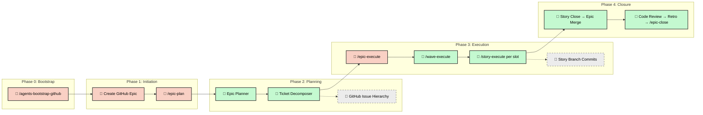

# Software Development Life Cycle (SDLC) Workflow

Version 5 uses **Epic-Centric GitHub Orchestration** — GitHub Issues, Labels,
and Projects V2 are the Single Source of Truth. No local playbooks, no
per-iteration directories, no JSON state files.

---

## The simple flow

From zero to shipped:

1. **Define the Epic.** Open a GitHub Issue, label it `type::epic`, and write a
   plain-English goal and scope.
2. **Plan the work.** Run `/epic-plan <epicId>` in your agentic IDE. The
   framework generates a PRD, a Tech Spec, and the full Feature → Story → Task
   hierarchy under the Epic.
3. **Execute the Epic.** Run `/epic-execute <epicId>` in your IDE. The skill
   owns the wave loop, fans out each wave through `/wave-execute`, and each
   wave fans out one `/story-execute` Agent-tool sub-agent per Story (capped
   at `concurrencyCap`). Everything runs in your Claude session against your
   Max subscription quota; no subprocess spawn, no GitHub Actions minutes.

   For a single Story off the dispatch table, run `/story-execute <storyId>`
   directly. The four-skill split (`/epic-execute`, `/wave-execute`,
   `/story-execute`, plus the inline `task-execute.md` helper) lets the
   operator stop or resume at any level of the hierarchy.

4. **Close the Epic.** When the final wave lands, the Epic flips to
   `agent::review`. Run **`/epic-close <epicId>`** — that one workflow
   internally auto-invokes the code-review helper
   (`workflows/helpers/epic-code-review.md`) and the retro helper
   (`workflows/helpers/epic-retro.md`) before merging to `main`. The
   helpers are not slash commands; you never run the review or retro by
   hand.

   If you'd rather have close run autonomously when the final wave completes (no
   manual invocation at all), add `epic::auto-close` to the Epic **before Step
   3**. The runner detects the snapshot label at startup and chains
   `/epic-close` automatically once the Epic reaches `agent::review`.

That is the whole happy path. Everything below is **detail** — branching
conventions, HITL escalation, audit gates — that you only need when the
default flow requires adjustment.

---

## Core Principles

- **GitHub as SSOT.** Project logic, work breakdown, and task status all live in
  GitHub Issues and Labels. No local state files.
- **Provider Abstraction.** Orchestration flows through `ITicketingProvider`, an
  abstract interface with a shipped GitHub implementation.
- **Story-Level Branching.** All Tasks within a Story execute sequentially on a
  shared `story-<id>` branch. Stories merge into `epic/<epicId>`; the Epic
  branch merges into `main` only at close.
- **Hierarchy-aligned skills.** Execution is split along the ticket hierarchy:
  `/epic-execute` owns the wave loop, `/wave-execute` fans out one wave,
  `/story-execute` runs init → task loop → close for one Story, and the
  inline `task-execute.md` helper documents per-Task discipline. All four
  share the same primitives (`Graph.computeWaves`, `cascadeCompletion`,
  `ticketing.js`, `WorktreeManager`).
- **Single-session fan-out.** `/wave-execute` launches Story sub-agents via the
  Agent tool — every Story runs inside the operator's Claude session, with no
  subprocess boundary. Worktree filesystem isolation is preserved; only the
  process boundary is gone.
- **HITL-minimal by default.** Exactly two operator touchpoints on the happy
  path — blocker resolution and review hand-off. Everything else is
  autonomous.

---

## End-to-End Process



---

## Phase 0: Bootstrap (One-Time Setup)

Before any Epic workflow, bootstrap your GitHub repository to create the
labels and project fields the orchestration engine depends on.

1. **Configure.** Copy `.agents/default-agentrc.json` to `.agentrc.json` at your
   project root and fill in the `orchestration` block (owner, repo, etc.).
2. **Authenticate.** Ensure a valid GitHub token is available (see
   Authentication in [README.md](README.md)).
3. **Run bootstrap.** Execute `/agents-bootstrap-github` (or
   `node .agents/scripts/agents-bootstrap-github.js`). Idempotently creates
   the label taxonomy (including `epic::auto-close`) and optional GitHub
   Project V2 fields.

> [!NOTE] Bootstrap runs once per repository. It is safe to re-run — existing
> labels and fields are skipped.

---

## Phase 1: Initiation (Human)

The product lead defines the objective by creating a GitHub Issue labelled
`type::epic`.

1. **Write the Epic.** Clear, plain-English description of the goal and scope.
2. **Trigger planning.** Run `/epic-plan <epicId>` in the agentic IDE.

---

## Phase 2: Planning (Autonomous)

The framework reads the Epic and autonomously builds the entire work breakdown.

1. **Epic Planner** (`epic-planner.js`):
   - Synthesizes the Epic body with project documentation.
   - Generates a **PRD** (`context::prd`) and **Tech Spec**
     (`context::tech-spec`) as linked GitHub Issues.

> [!TIP] **PRD authoring — acceptance criteria phrasing.** Write acceptance
> criteria in Gherkin-compatible `Given / When / Then` form so the QA
> acceptance suite can lift them directly into executable `.feature` files. See
> [`rules/gherkin-standards.md`](rules/gherkin-standards.md) for the canonical
> clause grammar, tag taxonomy, and forbidden patterns.

1. **Ticket Decomposer** (`ticket-decomposer.js`):
   - Recursively decomposes specs into a 4-tier hierarchy:

     ```text
     Epic (type::epic)
     ├── PRD (context::prd)
     ├── Tech Spec (context::tech-spec)
     ├── Feature (type::feature)
     │   ├── Story (type::story)
     │   │   ├── Task (type::task)     ← atomic agent work unit
     │   │   │   ├── - [ ] subtask 1
     │   │   │   └── - [ ] subtask 2
     │   │   └── Task (type::task)
     │   └── Story (type::story)
     └── Feature (type::feature)
     ```

   - **Wiring.** Each ticket is linked using `blocked by #NNN` syntax and
     GitHub's native sub-issues API.
   - **Metadata.** Each Task is stamped with persona, model recommendations,
     estimated files, and agent prompts.

---

## Phase 3: Execution (Agentic)

Execution is driven by the **Epic Runner** for whole-Epic flows and the **Story
Init/Close** scripts for individual Stories. All entry points share the same
primitives — DAG computation, context hydration, worktree isolation, and cascade
closure.

### Invocation modes

| Mode             | Entry point                          | When to use                                                                            |
| ---------------- | ------------------------------------ | -------------------------------------------------------------------------------------- |
| **Whole Epic**   | `/epic-execute <epicId>`             | Drive an Epic end-to-end. Owns the wave loop; fans out via `/wave-execute`.            |
| **Single wave**  | `/wave-execute <epicId> <waveN>`     | Run one wave only. Fans out Stories via the Agent tool, capped at `concurrencyCap`.    |
| **Single Story** | `/story-execute <storyId>`           | Init → task loop → close for one Story. Uses `task-execute.md` inline per Task.        |

The four-skill split mirrors how the engine already decomposes work
(wave-scheduler, story-launcher, wave-observer); promoting them to slash
commands lets the operator stop or resume at any level. There is no
single-entry-point router — each level has its own skill.

### Story-centric branching

- **Format**: `story-<storyId>` (merges into `epic/<epicId>`).
- **Goal**: minimize merge conflicts and consolidation waves by grouping related
  tasks on one context slice.
- **Model tiering**: Stories labelled `complexity::high` resolve to
  `model_tier: high`; all others resolve to `model_tier: low`. The tier is a
  hint to the operator/router; concrete model selection is intentionally left
  outside the protocol.

### Story execution lifecycle

Whether the Story is launched directly by the operator or fanned out by
`/wave-execute`, the same three phases run:

1. **Initialization** (`story-init.js`):
   - Verifies all upstream dependencies are satisfied.
   - Syncs the Epic base branch with `main`.
   - Creates or seeds the Story branch (in a worktree when
     `orchestration.worktreeIsolation.enabled: true`).
   - Transitions child Tasks to `agent::executing`.
2. **Task implementation.** The agent executes each Task sequentially on the
   shared Story branch, committing after each Task completion.
3. **Closure** (`story-close.js`):
   - Runs shift-left validation (lint, format, test).
   - Merges the Story branch into `epic/<epicId>`.
   - Transitions Tasks → `agent::done`; cascades up Task → Story → Feature
     (Epics and context tickets are excluded from auto-cascade).
   - Reaps the Story worktree and cleans up the merged Story branch.

### Context hydration

When a sub-agent runs `/story-execute <storyId>`, the Context Hydrator
assembles a self-contained prompt:

1. `agent-protocol.md` (universal rules).
2. Persona and skill directives (from Task labels).
3. Hierarchy context (Story → Feature → Epic → PRD → Tech Spec).
4. **Story branch context.** Automatic checkouts to the Story branch. Under
   worktree isolation, each Story runs in its own `.worktrees/story-<id>/` so
   branch swaps, staging, and reflog activity are isolated per-story. See
   [`workflows/worktree-lifecycle.md`](workflows/worktree-lifecycle.md).
5. Task-specific instructions and subtask checklist.

### State sync

Agents update their state in real-time on GitHub:

- **Labels**: `agent::ready` → `agent::executing` → `agent::review` →
  `agent::done`. The `WaveObserver` submodule additionally syncs a GitHub
  Projects v2 Status column on each transition when a `projectNumber` is
  configured.
- **Tasklists**: subtasks are checked off in the ticket body (`- [ ]` →
  `- [x]`).
- **Friction**: friction logs are posted as structured comments on the Task.
- **Wave transitions**: the Epic Runner emits `wave-N-start` and `wave-N-end`
  structured comments on the Epic, each carrying the wave manifest, story
  outcomes, and timing.

### Dependency unblocking

When a Task reaches `agent::done`, the runner re-evaluates the DAG and
dispatches any newly-unblocked Tasks. This continues until all waves complete.

### Story assignment (deterministic)

`/story-execute` requires an explicit Story id. The parent `/wave-execute`
picks Story ids off the frozen dispatch manifest deterministically and
launches one Agent-tool sub-agent per id; sibling sub-agents never race on
the same Story. Operators driving Stories by hand pick ids off the same
dispatch table.

`runtime.sessionId` survives as a stable per-process identity surfaced in
the startup `[ENV]` log line for operator correlation. It is a 12-char
short-id derived from hostname+pid+random.

### Launch-time dependency guard

Before any branch operation, `story-init.js` reads the Epic's
dispatch manifest and verifies the target story's blockers are all merged.
Unmerged blockers print each blocker's id, state, and URL; the session exits
0 (operator-error, not a system error) without touching any branches. A
missing or stale-format manifest emits a warning and proceeds — the guard is
a footgun-prevention layer, not a strict gate.

The guard runs identically on web and local.

### Concurrent close — push retry

`story-close.js` merges the Story branch into `epic/<epicId>` locally
and pushes. With multiple sessions closing into the same Epic branch from
separate clones, a non-fast-forward rejection is expected. The push step is
wrapped in a bounded retry: on rejection the script fetches
`origin/epic/<id>`, replays the Story merge on top of the new remote tip,
and pushes again. Bounds:

- `orchestration.closeRetry.maxAttempts` — default 3.
- `orchestration.closeRetry.backoffMs` — default `[250, 500, 1000]`.

A real content conflict (both stories touched the same lines) aborts the
loop with a clear error, leaves the local tree clean, and exits non-zero for
manual resolution. The retry path is a wrapper around the existing happy path.

---

## HITL (Human-in-the-Loop) model

Exactly **two** operator touchpoints during an Epic run after `/epic-execute`
fires. This is the entirety of the operator interface mid-run.

1. **Blocker resolution.** If the orchestrator hits an unresolvable condition,
   `BlockerHandler` flips the Epic to `agent::blocked`, posts a structured
   friction comment, fires the notification webhook (fire-and-forget), and halts
   wave N+1 (letting wave N's in-flight stories finish naturally). The operator
   resolves the underlying issue (e.g. a hand-fix commit on the Story branch
   or a scope edit on the blocking ticket), then flips the Epic back to
   `agent::executing` to resume.
2. **Close hand-off.** At `agent::review`, the run stops by default — you run
   `/epic-close <epicId>`, which internally auto-invokes the code-review
   helper (`workflows/helpers/epic-code-review.md`) and the retro helper
   (`workflows/helpers/epic-retro.md`) before merging to main. If
   `epic::auto-close` was present at startup, the `BookendChainer` invokes
   `/epic-close` automatically with no further prompts.

### Snapshot labels (read once, ignored mid-run)

- `epic::auto-close` is a **snapshot** captured at `/epic-execute` startup and
  written into the `epic-run-state` checkpoint comment. Applying or removing
  the label mid-run has no effect. This prevents post-hoc authorization of an
  autonomous merge-to-main.

### What triggers `agent::blocked`

- Unresolvable merge conflict that automated strategies cannot reconcile.
- Test failures that persist after one automated remediation attempt.
- Ambiguity in a ticket requiring a product/scope decision the orchestrator
  cannot make from ticket context alone.
- A destructive action not pre-authorized by the ticket body (e.g. dropping a
  table, deleting user data, force-pushing to a protected branch).
- External service failure preventing progress (GitHub API 5xx loop, npm
  registry down).
- Wave concurrency exhausted for an unbounded time (possible deadlock).

### What is _not_ gated at runtime

- `risk::high` tasks **run without pause.** The label remains as planning
  metadata and retro telemetry, but as of v5.14.0 it does **not** halt the
  dispatcher, `/epic-execute`, or `/epic-close`. Branch protection on `main`
  and `BlockerHandler`-driven escalation are the new defenses for destructive
  actions.
- Wave boundaries — the runner advances as soon as wave N completes.
- Individual story completion — no per-story approval prompt.

> [!NOTE] Legacy `risk::high` runtime gating has been retired. `risk::high`
> remains planning/audit metadata only; the sole runtime pause point is
> `agent::blocked`.

---

## Epic runner internals

`/epic-execute` drives the long-running coordinator inside the operator's
Claude session. The Epic Runner
(`.agents/scripts/lib/orchestration/epic-runner.js`) composes the submodules
listed below; `/wave-execute` and `/story-execute` are launched as Agent-tool
sub-agents — no `child_process.spawn`, no GitHub Actions runner.

| Submodule           | Role                                                                                                                    |
| ------------------- | ----------------------------------------------------------------------------------------------------------------------- |
| `wave-scheduler`    | Iterates waves from `Graph.computeWaves()`.                                                                             |
| `story-launcher`    | Fans out up to `concurrencyCap` Agent-tool Story sub-agents per wave.                                                   |
| `checkpointer`      | Upserts the `epic-run-state` structured comment; handles resume.                                                        |
| `blocker-handler`   | The sole runtime pause point — halts on `agent::blocked`.                                                               |
| `notification-hook` | Fire-and-forget webhook for blocker / wave-transition events.                                                           |
| `bookend-chainer`   | Auto-invokes `/epic-close` when `epic::auto-close` was set at startup.                                                  |
| `wave-observer`     | Emits `wave-N-start` / `wave-N-end` comments and reads each Story's `story-run-progress` snapshot.                      |
| `column-sync`       | Syncs the Projects v2 Status column from `agent::` labels.                                                              |

### Claude Max quota

`/epic-execute` consumes Max subscription quota (5-hour rolling window with
overage disabled at the org level by default). If a long Epic exceeds the
5-hour window, `BlockerHandler` surfaces the rate-limit error as
`agent::blocked` so you can resume after the quota rolls.

### Skipping CI/CD on orchestrator commits

The orchestrator pushes many commits during a run, each potentially triggering
the project's `CI / CD` workflow. Two mitigations:

- Add `[skip ci]` to orchestrator commit messages (requires a small tweak in
  `story-close.js`), OR
- Add a `paths-ignore` or branch filter to `ci.yml` that excludes `epic/*` and
  `story-*` branches. Only `main` pushes trigger CI.

---

## Phase 4: Integration & Closure

Once Story waves complete, the bookend lifecycle begins.

1. **Story branch merging.** Stories merge into `epic/<epicId>` automatically
   during Story closure (`story-close.js`).
2. **Completion cascade.** When the last Task in a Story reaches `agent::done`,
   status cascades upward:

   ```text
   Task Done → Story Done → Feature Done
   ```

   Epics, PRDs, and Tech Specs are explicitly excluded from auto-cascade to
   ensure final verification happens during formal closure.

3. **Single operator command: `/epic-close <epicId>`.** Close is the only
   bookend workflow an operator runs by hand. It internally auto-invokes, in
   order:
   - **Code review gate** (`workflows/helpers/epic-code-review.md`) — inline
     audit; halts close on 🔴 Critical Blockers, otherwise continues.
   - **Retro gate** (`workflows/helpers/epic-retro.md`) — summarises wins and
     friction from the ticket graph and posts the retro as a structured
     comment on the Epic (no local files). Skippable via
     `agentSettings.epicClose.runRetro: false` or `--skip-retro`. The legacy
     `agentSettings.sprintClose.runRetro` is honoured as a deprecated
     fallback (removed in 5.32.0).
   - **Merge + release.** Merges `epic/<epicId>` into `main`, validates
     documentation freshness, bumps the version, tags the release, and closes
     the Epic (including PRD / Tech Spec context tickets).
4. **Optional autonomous close.** With `epic::auto-close` set at startup,
   `BookendChainer` invokes `/epic-close` automatically once the final wave
   completes, so no operator input is needed between `agent::review` and
   `agent::done`.

---

## Testing strategy

Tests are **pyramid-aware**. Every test written during `/story-execute`
belongs to exactly one tier — **unit**, **contract**, or **e2e / acceptance** —
and each tier has distinct scope, dependency, and assertion rules. The canonical
tier definitions, assertion-placement rules, and coverage thresholds live in
[`rules/testing-standards.md`](rules/testing-standards.md); Gherkin authoring
for the acceptance tier is governed by
[`rules/gherkin-standards.md`](rules/gherkin-standards.md).

The acceptance tier is executed and reported via
[`workflows/run-bdd-suite.md`](workflows/run-bdd-suite.md) and consumed as
epic evidence by
[`workflows/helpers/epic-testing.md`](workflows/helpers/epic-testing.md).

---

## Static analysis & audit orchestration

An automated, gate-based static-analysis and audit orchestration pipeline
replaces manual auditing with a CLI-driven system.

### Audit triggering

Audits are selectively invoked by the orchestrator at four Epic lifecycle
gates (`gate1` through `gate4`). The `audit-orchestrator.js` evaluates rules
defined in `.agents/schemas/audit-rules.schema.json` based on:

1. **Gate configuration** — which gate is currently firing.
2. **Contextual keywords** — the Epic or Task body contents (e.g., `auth` or
   `encrypt` triggers security audits).
3. **File patterns** — which files changed compared to the base branch (e.g.,
   `user-profile` files trigger privacy audits).

### Epic lifecycle gates

| Gate   | When                            | What Runs                                  |
| ------ | ------------------------------- | ------------------------------------------ |
| Gate 1 | After Story completion          | Content-triggered audits (clean-code, etc) |
| Gate 2 | Pre-integration                 | Dependency + DevOps audits                 |
| Gate 3 | Code review phase               | Full automated audit pass                  |
| Gate 4 | Epic close (before Epic→main)   | `audit-sre` production readiness gate      |

### Review & feedback loop

When audits produce findings, the orchestrator compiles a structured Markdown
report and posts it as a ticket comment via the `ITicketingProvider`.

- **Maintainability ratchet.** The orchestrator enforces code quality by relying
  on maintainability checks (`check-maintainability.js`), which fail if the
  composite score drops below the established baseline.
- **CRAP gate (v5.22.0+).** Sibling per-method gate (`check-crap.js`) wired
  into `close-validation` after `check-maintainability`, the `ci.yml` step
  after `test:coverage`, and `.husky/pre-push`. Tracks complexity × coverage
  risk per method against `baselines/crap.json`. Self-skips when
  `agentSettings.quality.crap.enabled` is `false`. A separate
  `baseline-refresh-guardrail.yml` workflow enforces base-branch thresholds
  on PRs and requires a `baseline-refresh:`-tagged commit (with a non-empty
  body) on any PR that edits a committed baseline.
- **Auto-fixing.** If High or Critical findings are detected, the system halts
  for human review. A human can reply to the ticket with `/approve` or
  `/approve-audit-fixes` (processed by `handle-approval.js`).
- **Implementation.** Approved fixes automatically transition the ticket to
  `agent::executing`, dispatching an agent to implement and verify the fixes.

---

## Notification system

Two independent notification surfaces, both living in `.agents/` so they ship to
consuming projects:

### 1. Unified `notify()` dispatcher

Every notification — whether a manual orchestration milestone (story merged,
HITL gate triggered) or an auto-fired ticket-state transition — routes through
[`notify.js`](scripts/notify.js). Two delivery channels:

| Channel           | What it does                                                              |
| ----------------- | ------------------------------------------------------------------------- |
| GitHub comment    | Posts to the targeted ticket; @mentions operator for `medium`/`high`.     |
| Webhook           | Fire-and-forget POST to the configured URL (Make.com / Slack / Discord).  |

Severity vocabulary (assigned by callers; `eventSeverity()` in
`lib/notifications/notifier.js` derives it for state transitions):

| Severity | Used for                                                                                                              | Webhook prefix       |
| -------- | --------------------------------------------------------------------------------------------------------------------- | -------------------- |
| `low`    | Routine pipeline progress, intermediate state transitions, audit reports.                                             | `[low]`              |
| `medium` | Operator-visible milestones (story merged, epic complete, Story/Epic transitions reaching `agent::done`).             | `[medium]`           |
| `high`   | Operator must act (HITL gates, autonomous-chain failures). Message body should also lead with `🚨 Action Required:`.  | `[Action Required]`  |

Filter knob (`orchestration.notifications.minLevel` in `.agentrc.json`,
default: `medium`): events below this severity are dropped from every channel.
Setting `minLevel: low` surfaces task-level state churn; `minLevel: high`
limits delivery to action-required events only.

Webhook URL resolution:

- `NOTIFICATION_WEBHOOK_URL` process env var only — loaded from `.env` at the
  project root. The webhook URL is **not** sourced from `.agentrc.json`, and
  (as of Epic #702) is no longer sourced from `.mcp.json`.

Because `notify()` is called in-band from the orchestration SDK, it captures
changes from:

- The Epic runner (coordinator-driven state flips).
- Per-story scripts (`story-init.js`, `story-close.js`).
- Any script that routes state changes through `transitionTicketState`.

It does **not** capture manual label clicks in the GitHub UI (no webhook
receiver). For programmatic orchestration workflows this covers >95% of
lifecycle transitions.

### 2. Epic-runner blocker / HITL notifications

The `NotificationHook` inside the Epic runner fires on blocker-escalation events
(`agent::blocked`) and operator-attention events (`agent::review` hand-off, run
cancellation). Fire-and-forget by design; webhook failures never block
execution.

| Event              | Type       | Channel            | Operator Action        |
| ------------------ | ---------- | ------------------ | ---------------------- |
| `task-complete`    | **INFO**   | @mention           | Review when convenient |
| `feature-complete` | **INFO**   | @mention           | Informational only     |
| `epic-complete`    | **INFO**   | @mention + webhook | Final review           |
| `review-needed`    | **ACTION** | @mention + webhook | Review and approve PR  |
| `epic-blocked`     | **ACTION** | webhook            | Resolve and re-flip    |
| `wave-transition`  | **INFO**   | webhook            | Informational only     |

---

## Quick reference

| Command                                          | Purpose                                                                                                                                                                      |
| ------------------------------------------------ | ---------------------------------------------------------------------------------------------------------------------------------------------------------------------------- |
| `/agents-bootstrap-github`                       | Initialize repo labels and project fields                                                                                                                                    |
| `/epic-plan <epicId>`                            | Generate PRD, Tech Spec, and full task hierarchy                                                                                                                             |
| `/epic-execute <epicId>`                         | Drive a whole Epic end-to-end. Owns the wave loop; fans out via `/wave-execute`.                                                                                             |
| `/wave-execute <epicId> <waveN>`                 | Run one wave only. Fans out Stories via Agent-tool sub-agents (one per slot).                                                                                                |
| `/story-execute <storyId>`                       | Init → task loop → close for a single Story.                                                                                                                                 |
| Label Epic `epic::auto-close`                    | Authorize autonomous bookend chain at startup.                                                                                                                               |
| `/epic-close <epicId>`                           | Close the Epic — auto-invokes code-review + retro, then merges to `main` and closes Epic + context issues. **The only bookend command an operator runs by hand.**            |
| _helper_ `workflows/helpers/task-execute.md`     | Read inline by `/story-execute` per Task; not a slash command.                                                                                                               |
| _helper_ `workflows/helpers/epic-code-review.md` | Auto-invoked by `/epic-close` Phase 3 and by `/epic-execute` bookends; not a slash command.                                                                                  |
| _helper_ `workflows/helpers/epic-retro.md`       | Auto-invoked by `/epic-close` Phase 6; not a slash command.                                                                                                                  |
| `/git-commit-all`                                | Stage and commit all changes                                                                                                                                                 |
| `/git-push`                                      | Stage, commit, and push to remote                                                                                                                                            |
| `/delete-epic-branches <epicId>`                 | Hard reset — delete all Epic-scoped branches                                                                                                                                 |
| `/delete-epic-tickets <epicId>`                  | Hard reset — delete all Epic-scoped issues                                                                                                                                   |
