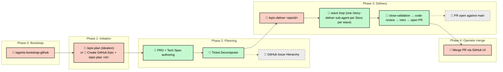

# Software Development Life Cycle (SDLC) Workflow

Mandrel uses **Epic-Centric GitHub Orchestration** — GitHub Issues,
Labels, and Projects V2 are the Single Source of Truth, fronted by a
declarative `epic.yaml` artifact that makes plans diff-able and
reconcilable. No per-iteration directories, no JSON state files for
ticket data.

The framework is **Claude Code-first**: `.claude/`, hooks, skills, and
the slash-command surface lean in on Claude Code as the reference
runtime, while the dispatcher (`.agents/scripts/`) stays runtime-neutral
behind the `IExecutionAdapter` boundary. See ADR 20260512-coupling-stance
in [`../docs/decisions.md`](../docs/decisions.md).

---

## The simple flow

From zero to shipped:

1. **Plan the work.** Run `/epic-plan` in your agentic IDE.
   - With **no arguments** (or `--idea "<seed>"`), the workflow runs
     ideation: it sharpens the seed into a one-pager, searches for
     duplicate open Epics, opens a fresh `type::epic` Issue from the
     confirmed body, then proceeds to PRD + Tech Spec authoring.
   - With **`<epicId>`**, the workflow skips ideation and runs PRD +
     Tech Spec + decomposition for an Epic Issue you have already
     opened.

   The framework generates a PRD, a Tech Spec, and the full Feature →
   Story → Task hierarchy under the Epic, then transitions the Epic to
   `agent::ready`.

2. **Deliver the Epic.** Run `/epic-deliver <epicId>` in your IDE. The
   skill drives the merged execute + close flow end-to-end:

   1. **Phase 1 — prepare** — snapshot the Epic, build the wave DAG,
      initialise the `epic-run-state` checkpoint.
   2. **Phase 2 — wave loop** — fan one `/story-deliver` Agent-tool
      sub-agent out per Story per wave (capped at `concurrencyCap`).
      Stories run in parallel inside the operator's Claude session
      against your Max subscription quota; no subprocess spawn, no
      GitHub Actions minutes.
   3. **Phase 3 — close-validation** — lint, test, and the project's
      ratcheted baselines run against the Epic branch. Evidence is
      cached by HEAD SHA so re-runs short-circuit.
   4. **Phase 4 — code-review** — auto-invokes
      `helpers/epic-code-review.md`; findings persist as a
      `code-review` structured comment on the Epic. Critical findings
      halt the run.
   5. **Phase 5 — retro** — auto-invokes the in-process
      `lib/orchestration/retro-runner.js` (extracted from the old
      retro helper) and posts the structured retro comment on the
      Epic. The retro fires **before** the PR is opened so it has
      full env access in the operator's local session.
   6. **Phase 6 — finalize** — pushes `epic/<epicId>` to `origin`,
      opens a pull request to `main`, sets the required-checks
      expectation from `agentSettings.quality.prGate.checks`, posts
      the hand-off comment naming the PR URL, and **stops**. The
      Epic stays at `agent::executing` until the operator merges the
      PR through the GitHub UI; the merge fires the standard
      transition that flips the Epic to `agent::done`.

   For a single Story off the dispatch table (re-driving a hotfix,
   resuming after a halt), run `/story-deliver <storyId>` directly. The
   two-skill split (`/epic-deliver` and `/story-deliver`, plus the
   inline `task-execute.md` helper) lets the operator stop or resume at
   any level of the hierarchy.

That is the whole happy path. Everything below is **detail** — branching
conventions, HITL escalation, audit gates — that you only need when the
default flow requires adjustment.

---

## Core Principles

- **GitHub as SSOT.** Project logic, work breakdown, and task status all live in
  GitHub Issues and Labels. No local state files.
- **Provider Abstraction.** Orchestration flows through `ITicketingProvider`, an
  abstract interface with a shipped GitHub implementation.
- **Story-Level Branching.** All Tasks within a Story execute sequentially on a
  shared `story-<id>` branch. Stories merge into `epic/<epicId>`; the Epic
  branch reaches `main` only via a pull request the operator merges through
  the GitHub UI.
- **Hierarchy-aligned skills.** Execution is split along the ticket hierarchy:
  `/epic-plan` builds the backlog (with optional ideation entry),
  `/epic-deliver` owns the merged wave-loop + close-tail, `/story-deliver`
  runs init → task loop → close for one Story, and the inline
  `task-execute.md` helper documents per-Task discipline. All four share the
  same primitives (`Graph.computeWaves`, `cascadeCompletion`, `ticketing.js`,
  `WorktreeManager`).
- **Single-session fan-out.** `/epic-deliver` launches Story sub-agents via
  the Agent tool — every Story runs inside the operator's Claude session,
  with no subprocess boundary. Worktree filesystem isolation is preserved;
  only the process boundary is gone.
- **Operator-merges-PR exit.** `/epic-deliver` ends with a PR open against
  `main`. The workflow never executes `git merge` against `main`. The PR is
  the explicit human gate that authorises promotion of an Epic into the
  release branch — branch protection on `main` enforces required-checks
  before the merge button is reachable.
- **HITL-minimal by default.** Exactly two operator touchpoints on the happy
  path — blocker resolution mid-run, and the PR merge at the end. Everything
  else is autonomous.

---

## End-to-End Process



---

## Phase 0: Bootstrap (One-Time Setup)

Before any Epic workflow, bootstrap your GitHub repository to create the
labels, project fields, and (when enabled) main-branch protection the
orchestration engine depends on.

1. **Configure.** Copy `.agents/starter-agentrc.json` to `.agentrc.json` at
   your project root and fill in the `orchestration` block (owner, repo,
   etc.). See `.agents/full-agentrc.json` for the exhaustive reference of
   every available key.
2. **Authenticate.** Ensure a valid GitHub token is available (see
   Authentication in [README.md](README.md)).
3. **Run bootstrap.** Execute `/agents-bootstrap-github` (or
   `node .agents/scripts/agents-bootstrap-github.js`). Idempotently creates
   the label taxonomy and optional GitHub Project V2 fields, and — when
   `agentSettings.quality.prGate.enforceBranchProtection` is `true`
   (default) — creates or merges branch protection on `main` with the
   project's `prGate.checks` as required status checks. This step is
   load-bearing for the SDL because PR merges to `main` are the sole
   promotion gate.

> [!NOTE] Bootstrap runs once per repository. It is safe to re-run — existing
> labels, fields, and branch-protection entries are preserved; missing ones
> are added.

---

## Phase 1: Initiation

The product lead defines the objective and triggers planning.

### 1a. Ideation entry (optional)

Run `/epic-plan` with no arguments (or `--idea "<seed>"`) to enter ideation
mode:

1. **Sharpen the idea.** The `idea-refinement` skill drives a divergent →
   convergent → sharpen loop and emits a markdown one-pager with the
   five canonical Epic sections (Context, Goal, Non-Goals, Scope,
   Acceptance Criteria).
2. **Cross-Epic duplicate search.** `lib/duplicate-search.js` queries the
   open Epics in the repo, scores by title + body keyword overlap, and
   surfaces matches above a threshold. The operator either confirms the
   new idea is genuinely distinct or folds it into an existing Epic
   (`/epic-plan` exits and the operator resumes work on the existing
   id).
3. **Render and confirm the Epic body.** The one-pager is rendered into
   the canonical Epic-from-idea template; the operator confirms before
   the GitHub Issue is opened.
4. **Open the Epic.** The Issue is opened with **only** the `type::epic`
   label — no `state::*` label is applied at creation. PRD authoring in
   Phase 1b advances it to `agent::review-spec`.

### 1b. Existing-Epic entry

Run `/epic-plan <epicId>` directly when the Epic Issue already exists. The
ideation phases (1a) are skipped.

In both modes the planning flow continues into Phase 2 with the captured
Epic id.

---

## Phase 2: Planning (Autonomous)

The framework reads the Epic and autonomously builds the entire work breakdown.

> **Epic Clarity Gate (`/epic-plan` Phase 6).** Before PRD / Tech Spec /
> Acceptance Spec authoring kicks off, `/epic-plan` scores the Epic body
> against the five canonical sections from
> [`templates/epic-from-idea.md`](templates/epic-from-idea.md) (Context,
> Goal, Non-Goals, Scope, Acceptance Criteria). Common legacy heading
> variants (`Problem`, `Direction`, `MVP Scope`, `Not Doing`,
> `Out of Scope`) are accepted by the scorer's regex for back-compat.
> The rubric is deterministic (section-presence; threshold ≥ 4 of 5). A
> `clear` verdict
> skips fast with no prompt; a `needs-refinement` verdict drops into the
> `idea-refinement` skill seeded from the current Epic body, surfaces a
> HITL diff, and on approval persists the sharpened body via
> `gh issue edit` before Phase 7 authoring begins. The gate honours the
> "do not modify existing issues without permission" Constraint — every
> body rewrite is operator-confirmed.

1. **Epic Planner** (`epic-plan-spec.js`):
   - Synthesizes the Epic body with project documentation.
   - Generates a **PRD** (`context::prd`), **Tech Spec**
     (`context::tech-spec`), and **Acceptance Spec**
     (`context::acceptance-spec`) as linked GitHub Issues.

> [!TIP] **PRD authoring — acceptance criteria phrasing.** Write acceptance
> criteria in Gherkin-compatible `Given / When / Then` form so the QA
> acceptance suite can lift them directly into executable `.feature` files. See
> [`rules/gherkin-standards.md`](rules/gherkin-standards.md) for the canonical
> clause grammar, tag taxonomy, and forbidden patterns.

### Acceptance Spec — the third planning context ticket

Every Epic carries **three** planning context tickets, not two:

| Label                       | Artifact         | Authored by                                         | Drives                                                   |
| --------------------------- | ---------------- | --------------------------------------------------- | -------------------------------------------------------- |
| `context::prd`              | PRD              | `epic-plan-spec-author` skill (PRD persona)         | What we're shipping and why.                             |
| `context::tech-spec`        | Tech Spec        | `epic-plan-spec-author` skill (Architect persona)   | How we're shipping it.                                   |
| `context::acceptance-spec`  | Acceptance Spec  | `epic-plan-spec-author` skill (Acceptance Engineer) | The AC ID table that gates close-time reconciliation.    |

The Acceptance Spec body is a single Markdown table —
`| AC ID | Outcome | Feature File | Scenario | Disposition |` — with
stable `AC-<n>` IDs assigned in document order. IDs are reused across
re-plans when an Outcome is materially unchanged so scenario tags
(`@ac-N`) stay aligned with the spec. Each row's `Disposition` is one
of `new | updated | unchanged`. The skill also renders a **Runner
Verification** line directly under the table that records the verified
BDD runner + pending-tag (e.g. `playwright-bdd supports @skip`) for the
features-first Story to consume.

The spec is persisted by
`epic-plan-spec.js --epic [Epic_ID] --prd ... --techspec ... --acceptance-spec ...`
— the persist half writes all three artifacts in one atomic step and
fails loudly if any is missing or empty.

#### Opting out — the `acceptance::n-a` waiver

Not every Epic warrants a formal Acceptance Spec (pure refactors,
framework maintenance, docs-only churn). For those, the operator applies
the **`acceptance::n-a`** label to the Epic ticket. The waiver is
respected by both runtime gates:

- The `/epic-deliver` **start gate** (Phase 1 snapshot) skips the
  acceptance-spec presence check when the label is set.
- The finalize-time **acceptance-spec reconciler** returns
  `status: 'waived'` without scanning `tests/features/**` and the
  finalize step proceeds.

The waiver is binary — there is no partial opt-out. If an Epic later
warrants spec coverage, remove the label and run `/epic-plan` Phase 7
to author the spec.

1. **Ticket Decomposer** (`epic-plan-decompose.js`):
   - Recursively decomposes specs into a 4-tier hierarchy:

     ```text
     Epic (type::epic)
     ├── PRD (context::prd)
     ├── Tech Spec (context::tech-spec)
     ├── Feature (type::feature)
     │   ├── Story (type::story)
     │   │   ├── Task (type::task)     ← atomic agent work unit
     │   │   │   ├── - [ ] subtask 1
     │   │   │   └── - [ ] subtask 2
     │   │   └── Task (type::task)
     │   └── Story (type::story)
     └── Feature (type::feature)
     ```

   - **Wiring.** Each ticket is linked using `blocked by #NNN` syntax and
     GitHub's native sub-issues API.
   - **Metadata.** Each Task is stamped with persona, estimated files, and
     agent prompts.

When decomposition completes the Epic flips to `agent::ready` and the
dispatch manifest is posted as a structured comment on the Epic. That
manifest is the source of truth for the wave layout `/epic-deliver`
consumes in Phase 1.

---

## Phase 3: Delivery (Agentic)

Delivery is driven by the **`/epic-deliver`** slash command for whole-Epic
flows and the **Story Init/Close** scripts for individual Stories. All entry
points share the same primitives — DAG computation, context hydration,
worktree isolation, and cascade closure. The lifecycle bus listener
chain inside the session is the single runtime; it owns wave fan-out,
finalize, automerge, and cleanup. Phase 6, 7.5, and 8 each fire one
typed event via `lifecycle-emit.js` (`epic.close.end`,
`epic.automerge.start`, `epic.merge.armed`); the matching listeners run
the side effects. See
[`docs/LIFECYCLE.md`](../docs/LIFECYCLE.md) for the bus contract,
event taxonomy, ledger format, and listener model — every phase
transition, ticket-state flip, and webhook fan-out now flows through
that bus, and the on-disk ledger at `temp/epic-<id>/lifecycle.ndjson`
is the canonical resume target. Safety gates (auto-merge arming,
acceptance-spec reconciliation, blocker handling) are listener
side-effects rather than inline calls at phase boundaries; the
"merge-lockout" lint rule keeps `gh pr merge` confined to the
`AutomergeArmer` listener.

> **Acceptance-spec start gate.** Before a single wave fans out,
> `/epic-deliver`'s snapshot phase
> ([`lib/orchestration/epic-runner/phases/snapshot.js`](../scripts/lib/orchestration/epic-runner/phases/snapshot.js))
> asserts that the Epic either (a) carries the `acceptance::n-a`
> waiver label, or (b) has a linked `context::acceptance-spec`
> ticket. The ticket's GitHub state (open / closed) is not checked
> — presence is sufficient, matching the PRD and Tech Spec contract.
> The reviewer's OK during `/epic-plan` Phase 7 is the approval
> signal, not a manual ticket-close action; the three planning
> context tickets are closed automatically by the
> `Finalizer` listener subscribed to `epic.close.end` once the
> Epic PR opens. Neither
> condition met → the snapshot throws a clear error naming the
> missing precondition and `runAsCli` maps it to `process.exit(1)`.
> This refuses to launch Epics that skipped acceptance-spec
> authoring, surfacing the gap at delivery time rather than letting
> Story dispatch race ahead.

### Invocation modes

| Mode             | Entry point                     | When to use                                                                                  |
| ---------------- | ------------------------------- | -------------------------------------------------------------------------------------------- |
| **Whole Epic**   | `/epic-deliver <epicId>`        | Drive an Epic end-to-end. Owns the wave loop and the close-tail; ends with a PR open to main. |
| **Single Story** | `/story-deliver <storyId>`      | Init → task loop → close for one Story. Uses `task-execute.md` inline per Task.              |

The two-skill split (plus the inline `task-execute.md` helper) mirrors how
the engine already decomposes work; promoting them to slash commands lets
the operator stop or resume at any level. There is no single-entry-point
router — each level has its own skill.

### Story-centric branching

- **Format**: `story-<storyId>` (merges into `epic/<epicId>`).
- **Goal**: minimize merge conflicts and consolidation waves by grouping related
  tasks on one context slice.

### Story execution lifecycle

Whether the Story is launched directly by the operator or fanned out by
`/epic-deliver`'s wave loop, the same three phases run:

1. **Initialization** (`story-init.js`):
   - Verifies all upstream dependencies are satisfied.
   - Syncs the Epic base branch with `main`.
   - Creates or seeds the Story branch (in a worktree when
     `orchestration.worktreeIsolation.enabled: true`).
   - Transitions child Tasks to `agent::executing`.
2. **Task implementation.** The agent executes each Task sequentially on the
   shared Story branch, committing after each Task completion.
3. **Closure** (`story-close.js`):
   - Runs shift-left validation (lint, format, test).
   - Merges the Story branch into `epic/<epicId>`.
   - Transitions Tasks → `agent::done`; cascades up Task → Story → Feature
     (Epics and context tickets are excluded from auto-cascade).
   - Reaps the Story worktree and cleans up the merged Story branch.

### Context hydration

When a sub-agent runs `/story-deliver <storyId>`, the Context Hydrator
assembles a self-contained prompt:

1. `agent-protocol.md` (universal rules).
2. Persona and skill directives (from Task labels).
3. Hierarchy context (Story → Feature → Epic → PRD → Tech Spec).
4. **Story branch context.** Automatic checkouts to the Story branch. Under
   worktree isolation, each Story runs in its own `.worktrees/story-<id>/` so
   branch swaps, staging, and reflog activity are isolated per-story. See
   [`workflows/helpers/worktree-lifecycle.md`](workflows/helpers/worktree-lifecycle.md).
5. Task-specific instructions and subtask checklist.

### State sync

Agents update their state in real-time on GitHub:

- **Labels**: `agent::ready` → `agent::executing` → `agent::done`. The
  intermediate review label is not part of the label taxonomy; the
  PR opened by `/epic-deliver` Phase 6 is the equivalent "ready to merge"
  signal at the Epic level. The `WaveObserver` submodule additionally
  syncs a GitHub Projects v2 Status column on each transition when a
  `projectNumber` is configured.
- **Tasklists**: subtasks are checked off in the ticket body (`- [ ]` →
  `- [x]`).
- **Friction**: friction logs are posted as structured comments on the Task.
- **Wave transitions**: the Epic Deliver Runner emits `wave-N-start` and
  `wave-N-end` structured comments on the Epic, each carrying the wave
  manifest, story outcomes, and timing.

### Dependency unblocking

When a Task reaches `agent::done`, the runner re-evaluates the DAG and
dispatches any newly-unblocked Tasks. This continues until all waves complete.

### Story assignment (deterministic)

`/story-deliver` requires an explicit Story id. The parent `/epic-deliver`
wave loop picks Story ids off the frozen dispatch manifest deterministically
and launches one Agent-tool sub-agent per id per wave; sibling sub-agents
never race on the same Story. Operators driving Stories by hand pick ids
off the same dispatch table.

`runtime.sessionId` survives as a stable per-process identity surfaced in
the startup `[ENV]` log line for operator correlation. It is a 12-char
short-id derived from hostname+pid+random.

### Launch-time dependency guard

Before any branch operation, `story-init.js` reads the Epic's
dispatch manifest and verifies the target story's blockers are all merged.
Unmerged blockers print each blocker's id, state, and URL; the session exits
0 (operator-error, not a system error) without touching any branches. A
missing or stale-format manifest emits a warning and proceeds — the guard is
a footgun-prevention layer, not a strict gate.

The guard runs identically on web and local.

### Concurrent close — push retry

`story-close.js` merges the Story branch into `epic/<epicId>` locally
and pushes. With multiple sessions closing into the same Epic branch from
separate clones, a non-fast-forward rejection is expected. The push step is
wrapped in a bounded retry: on rejection the script fetches
`origin/epic/<id>`, replays the Story merge on top of the new remote tip,
and pushes again. Bounds:

- `orchestration.runners.storyMergeRetry.maxAttempts` — default 3.
- `orchestration.runners.storyMergeRetry.backoffMs` — default `[250, 500, 1000]`.

A real content conflict (both stories touched the same lines) aborts the
loop with a clear error, leaves the local tree clean, and exits non-zero for
manual resolution. The retry path is a wrapper around the existing happy path.

### Close-tail (Phases 3–6 of `/epic-deliver`)

After the wave loop returns `complete`, `/epic-deliver` runs four sequential
phases against the Epic branch before opening the PR:

1. **Close-validation.** Lint + test + project-extended ratchets
   (maintainability, CRAP, lint baseline) run via `evidence-gate.js` keyed
   on `git rev-parse HEAD`. A clean tree on a re-run short-circuits in
   milliseconds. A failing gate halts the workflow until the regression is
   fixed on a hotfix branch and re-merged into the Epic.
2. **Code-review.** `lib/orchestration/code-review.js` (extracted from the
   `epic-code-review.md` helper) audits the diff and posts the findings as
   a `code-review` structured comment on the Epic. 🔴 Critical findings
   halt the run; 🟠/🟡/🟢 findings flow through as non-blocking.
3. **Retro.** `lib/orchestration/retro-runner.js` (extracted from the old
   retro helper) aggregates perf signals, friction counts, hotfix counts,
   recut counts, parked counts, and HITL count using
   `retro-heuristics.js`. The structured retro comment is posted on the
   Epic. The retro fires **before** the PR opens — this keeps it inside
   the operator's local session with full env access (env vars,
   credentials, MCP servers); pushing it after PR-open would deny it
   that access. After the GitHub upsert succeeds, the retro body is
   also **mirrored locally** to the per-Epic temp tree at
   `temp/epic-<id>/retro.md` (path resolved via
   [`lib/config/temp-paths.js`](../scripts/lib/config/temp-paths.js)'s
   `epicRetroMirrorPath`) so operators can read the retro without
   re-fetching from GitHub. GitHub remains the source of truth; the
   mirror write is best-effort and a failure only logs a warn.
4. **Finalize.** `/epic-deliver` fires `epic.close.end` via
   `lifecycle-emit.js`; the `Finalizer` + `AcceptanceReconciler`
   listener chain runs three close-time responsibilities in order:
   1. **Acceptance-spec reconciliation.** Invokes
      `acceptance-spec-reconciler.js` to diff the AC IDs declared in
      the linked `context::acceptance-spec` body against `@ac-*` /
      `@pending` tags in `tests/features/**`. A non-OK reconciliation
      throws (per `.agents/rules/orchestration-error-handling.md`),
      aborting finalize **before** the planning artifacts are closed —
      so the PRD / Tech Spec / Acceptance Spec stay open until the AC
      coverage gap is fixed. Skipped (`status: 'waived'`) when the Epic
      carries `acceptance::n-a`.
   2. **PR open and auto-merge arm.** Verifies `epic/<id>`
      fast-forward-merges the current `main`, pushes the Epic branch to
      `origin`, runs `gh pr create --base main --head epic/<id>` with a
      title and body sourced from the Epic's PRD summary, and arms
      GitHub native auto-merge via `gh pr merge --auto --squash
      --delete-branch`. The PR's required-checks expectation is set
      from `github.branchProtection.checks` so the
      branch-protection gate matches the Epic-level validation that
      just ran.
   3. **Planning-artifact close + hand-off.** Closes the three
      planning context tickets (`context::prd`, `context::tech-spec`,
      `context::acceptance-spec`) so the Epic's `Closes #<id>`
      auto-close path is not blocked by open sub-issues, then posts a
      hand-off structured comment naming the PR URL. The Epic stays
      at `agent::executing` until the PR merges.

`/epic-deliver` exits cleanly without merging. The operator merges through
the GitHub UI.

---

## HITL (Human-in-the-Loop) model

Exactly **two** operator touchpoints during an Epic run after `/epic-deliver`
fires. This is the entirety of the operator interface mid-run.

1. **Blocker resolution.** If the orchestrator hits an unresolvable condition,
   `BlockerHandler` flips the Epic to `agent::blocked`, posts a structured
   friction comment, fires the notification webhook (fire-and-forget), and halts
   wave N+1 (letting wave N's in-flight stories finish naturally). The operator
   resolves the underlying issue (e.g. a hand-fix commit on the Story branch
   or a scope edit on the blocking ticket), then flips the Epic back to
   `agent::executing` to resume.
2. **PR merge.** At the end of `/epic-deliver`, the workflow opens a PR to
   `main` and stops. The operator inspects the required-checks summary, the
   `code-review` structured comment, and the retro comment; when satisfied
   they merge the PR through the GitHub UI. The merge fires the standard
   transition that flips the Epic to `agent::done`. There is no separate
   close command.

### What triggers `agent::blocked`

- Unresolvable merge conflict that automated strategies cannot reconcile.
- Test failures that persist after one automated remediation attempt.
- Ambiguity in a ticket requiring a product/scope decision the orchestrator
  cannot make from ticket context alone.
- A destructive action not pre-authorized by the ticket body (e.g. dropping a
  table, deleting user data, force-pushing to a protected branch).
- External service failure preventing progress (GitHub API 5xx loop, npm
  registry down).
- Wave concurrency exhausted for an unbounded time (possible deadlock).

### What is _not_ gated at runtime

- `risk::high` tasks **run without pause.** The label remains as planning
  metadata and retro telemetry, but as of v5.14.0 it does **not** halt the
  dispatcher or `/epic-deliver`. Branch protection on `main` and
  `BlockerHandler`-driven escalation are the runtime defenses for
  destructive actions.
- Wave boundaries — the runner advances as soon as wave N completes.
- Individual story completion — no per-story approval prompt.

> [!NOTE] Legacy `risk::high` runtime gating has been retired. `risk::high`
> remains planning/audit metadata only; the sole runtime pause point is
> `agent::blocked`.

---

## Epic Deliver Runner internals

`/epic-deliver` drives the long-running coordinator inside the operator's
Claude session. The slash command composes the submodules listed below;
`/story-deliver` is launched as an Agent-tool sub-agent of
`/epic-deliver`'s wave loop — no `child_process.spawn`, no GitHub Actions
runner.

| Submodule           | Role                                                                                                                    |
| ------------------- | ----------------------------------------------------------------------------------------------------------------------- |
| `wave-scheduler`    | Iterates waves from `Graph.computeWaves()`.                                                                             |
| `story-launcher`    | Fans out up to `concurrencyCap` Agent-tool Story sub-agents per wave.                                                   |
| `checkpointer`      | Upserts the `epic-run-state` structured comment; handles phase-granular resume across all six phases.                   |
| `blocker-handler`   | The sole runtime pause point — halts on `agent::blocked`.                                                               |
| `notification-hook` | Fire-and-forget webhook for blocker / wave-transition events.                                                           |
| `wave-observer`     | Emits `wave-N-start` / `wave-N-end` comments and reads each Story's `story-run-progress` snapshot.                      |
| `column-sync`       | Syncs the Projects v2 Status column from `agent::` labels.                                                              |
| `code-review`       | `lib/orchestration/code-review.js` — Phase 4 inline audit; halts on critical findings.                                  |
| `retro-runner`      | `lib/orchestration/retro-runner.js` — Phase 5 retro authoring; posts structured retro comment.                          |

### Claude Max quota

`/epic-deliver` consumes Max subscription quota (5-hour rolling window with
overage disabled at the org level by default). If a long Epic exceeds the
5-hour window, `BlockerHandler` surfaces the rate-limit error as
`agent::blocked` so you can resume after the quota rolls.

### Skipping CI/CD on orchestrator commits

The orchestrator pushes many commits during a run, each potentially triggering
the project's `CI / CD` workflow. Two mitigations:

- Add `[skip ci]` to orchestrator commit messages (requires a small tweak in
  `story-close.js`), OR
- Add a `paths-ignore` or branch filter to `ci.yml` that excludes `epic/*` and
  `story-*` branches. Only `main` pushes trigger CI.

---

## Phase 4: Operator merge

Once the wave loop, close-validation, code-review, and retro have all
completed, `/epic-deliver` opens a pull request from `epic/<epicId>` to
`main` and stops. The operator's remaining responsibility is to merge the
PR through the GitHub UI.

1. **Story merging.** Stories merge into `epic/<epicId>` automatically
   during Story closure (`story-close.js`). The Epic branch is the rolling
   integration target.
2. **Completion cascade.** When the last Task in a Story reaches
   `agent::done`, status cascades upward:

   ```text
   Task Done → Story Done → Feature Done
   ```

   Epics, PRDs, and Tech Specs are explicitly excluded from auto-cascade —
   the Epic only flips to `agent::done` when the operator merges the PR
   to `main`.

3. **PR merge — the sole promotion gate.** When the operator merges the PR
   via the GitHub UI:
   - the Epic-to-`main` merge lands as a real PR merge with a real
     reviewer-trail and required-checks history;
   - the standard label-transition pathway flips the Epic to
     `agent::done`;
   - branch cleanup runs out-of-band: Phase 8 of `/epic-deliver` reaps
     local refs after the merge; the rare "scrap and reset" case for an
     unmerged Epic is handled manually.

If the operator chooses not to merge (rolling back, deferring, re-scoping),
`/epic-deliver` has not poisoned `main`. The Epic branch can be amended
in place; re-running `/epic-deliver <epicId>` re-runs Phase 3 / 4 / 5
against the new HEAD (the evidence wrapper picks up the new SHA) and
updates the same PR — no duplicate PRs are opened against the same Epic
branch.

---

## Testing strategy

Tests are **pyramid-aware**. Every test written during `/story-deliver`
belongs to exactly one tier — **unit**, **contract**, or **e2e / acceptance** —
and each tier has distinct scope, dependency, and assertion rules. The canonical
tier definitions, assertion-placement rules, and coverage thresholds live in
[`rules/testing-standards.md`](rules/testing-standards.md); Gherkin authoring
for the acceptance tier is governed by
[`rules/gherkin-standards.md`](rules/gherkin-standards.md).

The acceptance tier is executed and reported via
[`workflows/run-bdd-suite.md`](workflows/run-bdd-suite.md) and consumed as
epic evidence by
[`workflows/helpers/epic-testing.md`](workflows/helpers/epic-testing.md).

---

## Static analysis & audit orchestration

An automated, gate-based static-analysis and audit orchestration pipeline
replaces manual auditing with a CLI-driven system.

### Audit triggering

Audits are selectively invoked by the orchestrator at four Epic lifecycle
gates (`gate1` through `gate4`). The `audit-orchestrator.js` evaluates rules
defined in `.agents/schemas/audit-rules.json` (schema:
`.agents/schemas/audit-rules.schema.json`) based on:

1. **Gate configuration** — which gate is currently firing.
2. **Contextual keywords** — the Epic or Task body contents (e.g., `auth` or
   `encrypt` triggers security audits).
3. **File patterns** — which files changed compared to the base branch (e.g.,
   `user-profile` files trigger privacy audits).

### Epic lifecycle gates

| Gate   | When                                       | What Runs                                  |
| ------ | ------------------------------------------ | ------------------------------------------ |
| Gate 1 | After Story completion                     | Content-triggered audits (clean-code, etc) |
| Gate 2 | Pre-integration                            | Dependency + DevOps audits                 |
| Gate 3 | `/epic-deliver` Phase 4 (code-review)      | Full automated audit pass                  |
| Gate 4 | `/epic-deliver` Phase 6 (pre-PR-open)      | `audit-sre` production readiness gate      |

### Review & feedback loop

When audits produce findings, the orchestrator compiles a structured Markdown
report and posts it as a ticket comment via the `ITicketingProvider`.

- **Maintainability ratchet.** The orchestrator enforces code quality by relying
  on maintainability checks (`check-maintainability.js`), which fail if the
  composite score drops below the established baseline.
- **CRAP gate (v5.22.0+).** Sibling per-method gate (`check-crap.js`) wired
  into `close-validation` after `check-maintainability`, the `ci.yml` step
  after `test:coverage`, and `.husky/pre-push`. Tracks complexity × coverage
  risk per method against `baselines/crap.json`. Self-skips when
  `agentSettings.quality.crap.enabled` is `false`. The
  `baseline-refresh:`-tagged commit convention for baseline edits is still
  the project standard, but the CI guardrail that enforced it was removed
  in 5.42 — the operator is the gate now during `/epic-deliver` Phase 7.
- **Human review on High/Critical.** If High or Critical findings are detected,
  the workflow halts for human review at the corresponding `/epic-deliver`
  phase. Approval is given by the operator advancing the phase (the
  auto-approve webhook listener was never wired into CI and was removed during the rebrand).
- **Implementation.** Once the operator approves the fixes, the ticket
  transitions to `agent::executing` and `/epic-deliver` dispatches an agent to
  implement and verify them.

---

## Notification system

Two independent notification surfaces, both living in `.agents/` so they ship to
consuming projects:

### 1. Unified `notify()` dispatcher

Every notification — whether a manual orchestration milestone (story merged,
HITL gate triggered) or an auto-fired ticket-state transition — routes through
[`notify.js`](scripts/notify.js). Two delivery channels:

| Channel           | What it does                                                              |
| ----------------- | ------------------------------------------------------------------------- |
| GitHub comment    | Posts to the targeted ticket; @mentions operator for `medium`/`high`.     |
| Webhook           | Fire-and-forget POST to the configured URL (Make.com / Slack / Discord).  |

Severity vocabulary (assigned by callers; `eventSeverity()` in
`lib/notifications/notifier.js` derives it for state transitions):

| Severity | Used for                                                                                                              | Webhook prefix       |
| -------- | --------------------------------------------------------------------------------------------------------------------- | -------------------- |
| `low`    | Task transitions, `story-run-progress` upserts, intermediate state transitions, audit reports.                       | `[low]`              |
| `medium` | Operator-visible milestones: Story state transitions, `wave-run-progress`, `epic-run-progress`, story merged, epic complete. | `[medium]`           |
| `high`   | Operator must act (HITL gates, epic blockers, autonomous-chain failures). Message body should also lead with `🚨 Action Required:`. | `[Action Required]`  |

Two independent event-allowlist knobs in `orchestration.notifications`
(both mandatory):

- `commentEvents` — event-name allowlist for GitHub-ticket comment
  posting. Default:
  `["state-transition", "story-merged", "operator-message"]`.
- `webhookEvents` — event-name allowlist for `NOTIFICATION_WEBHOOK_URL`
  deliveries. Default:
  `["epic-started", "epic-progress", "epic-blocked", "epic-unblocked", "epic-complete"]`.

Each channel filters independently; there is no fallback chain.
Severity is carried as envelope metadata (and still drives `@mention`
behavior on the comment channel — high always @mentions, medium
@mentions when `mentionOperator: true`) but is no longer a routing
factor for either channel. `transitionTicketState` suppresses the
`notify()` dispatch entirely for low-severity transitions (task-level,
non-terminal story / epic flips) so the comment channel sees only the
medium-severity story-level events operators expect on the ticket
timeline. To suppress either channel entirely, set its array to `[]`.
The schema enums pin closed vocabularies — adding custom event names
requires loosening the enum in `.agents/scripts/lib/config-schema.js`.

Webhook URL resolution:

- `NOTIFICATION_WEBHOOK_URL` process env var only — loaded from `.env` at the
  project root. The webhook URL is **not** sourced from `.agentrc.json`, and
  (as of Epic #702) is no longer sourced from `.mcp.json`.

Because `notify()` is called in-band from the orchestration SDK, it captures
changes from:

- The Epic Deliver Runner (coordinator-driven state flips).
- Per-story scripts (`story-init.js`, `story-close.js`).
- Any script that routes state changes through `transitionTicketState`.

It does **not** capture manual label clicks in the GitHub UI (no webhook
receiver). For programmatic orchestration workflows this covers >95% of
lifecycle transitions.

### 2. Deliver-runner blocker / HITL notifications

The `NotificationHook` inside the Epic Deliver Runner fires on
blocker-escalation events (`agent::blocked`) and operator-attention events
(PR-open hand-off, run cancellation). Fire-and-forget by design; webhook
failures never block execution.

| Event              | Type       | Channel            | Operator Action        |
| ------------------ | ---------- | ------------------ | ---------------------- |
| `task-complete`    | **INFO**   | @mention           | Review when convenient |
| `feature-complete` | **INFO**   | @mention           | Informational only     |
| `epic-complete`    | **INFO**   | @mention + webhook | Final review           |
| `pr-opened`        | **ACTION** | @mention + webhook | Inspect checks + merge |
| `epic-blocked`     | **ACTION** | webhook            | Resolve and re-flip    |
| `wave-transition`  | **INFO**   | webhook            | Informational only     |

---

## Quick reference

| Command                                          | Purpose                                                                                                                                                                      |
| ------------------------------------------------ | ---------------------------------------------------------------------------------------------------------------------------------------------------------------------------- |
| `/agents-bootstrap-github`                       | Initialize repo labels, project fields, and (when enabled) main-branch protection.                                                                                            |
| `/epic-plan`                                     | Ideation entry — sharpen idea, search duplicates, open Epic, then PRD + Tech Spec + decomposition.                                                                            |
| `/epic-plan --idea "<seed>"`                     | Same ideation entry with pre-supplied seed.                                                                                                                                   |
| `/epic-plan <epicId>`                            | Existing-Epic mode — PRD + Tech Spec + decomposition for an Epic Issue already opened.                                                                                       |
| `/epic-deliver <epicId>`                         | Drive an Epic end-to-end. Wave loop → close-validation → code-review → retro → opens PR to `main`. Operator merges via the GitHub UI.                                         |
| `/story-deliver <storyId>`                       | Init → task loop → close for a single Story.                                                                                                                                  |
| _helper_ `workflows/helpers/task-execute.md`     | Read inline by `/story-deliver` per Task; not a slash command.                                                                                                                |
| _helper_ `workflows/helpers/epic-code-review.md` | Auto-invoked by `/epic-deliver` Phase 4; not a slash command.                                                                                                                 |
| `/git-commit-all`                                | Stage and commit all changes                                                                                                                                                 |
| `/git-push`                                      | Stage, commit, and push to remote                                                                                                                                            |
| `epic-reconcile.js --explicit-delete`            | Hard reset — close orphaned Epic-scoped issues per `.agents/epics/<id>.yaml`                                                                                                 |
