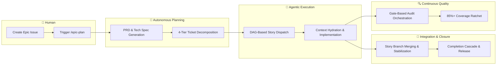

# Agent Protocols 🤖

A structured framework of instructions, personas, skills, and SDLC workflows
that govern AI coding assistants built on **Epic-Centric GitHub Orchestration**
— all planning, execution, and state management lives natively in GitHub Issues,
Labels, and Projects V2.

**Current version:** see [`.agents/VERSION`](.agents/VERSION). Release notes
live in [`docs/CHANGELOG.md`](docs/CHANGELOG.md); v1.0.0 – v4.7.2 history is in
[`docs/archive/CHANGELOG-v4.md`](docs/archive/CHANGELOG-v4.md).

## Architecture Overview



- **GitHub as SSOT** — Issues, Labels, and Projects V2 are the single source
  of truth. No local playbooks or per-iteration files.
- **Provider abstraction** — All ticketing operations flow through
  `ITicketingProvider`, with a shipped GitHub implementation using native
  `fetch()` (Node 20+). No `@octokit/*`, no Axios.
- **Hierarchy-aligned slash commands** — `/epic-plan` generates PRDs, Tech
  Specs, and the full 4-tier task hierarchy. Execution is split by
  hierarchy level: `/epic-execute` owns the wave loop, `/wave-execute` fans
  out one wave via Agent-tool sub-agents, `/story-execute` runs init →
  task loop → close for one Story. `/epic-close` bookends with code
  review, retro, and merge to `main`. The four-skill split, `sprint-*` →
  `epic-*` rename, and removal of the GitHub remote-trigger surface landed
  in Epic #900 (v5.31.0) — see [`docs/CHANGELOG.md`](docs/CHANGELOG.md) for
  the breaking-change migration block.
- **Single-session fan-out** — `/wave-execute` launches Story sub-agents
  through the Agent tool inside the operator's Claude session (Epic #900,
  v5.31.0). Worktree filesystem isolation is preserved; no subprocess
  spawn, no GitHub Actions runner. Internal orchestration was further
  refactored in Epic #946 (v5.31.1) — `story-close.js` was split into a
  189-line CLI shell over `lib/orchestration/story-close/`, dead-export
  surface was retired, and a shared `parseFencedJsonComment` helper
  consolidated three open-coded JSON-fence parsers; no consumer-visible
  rename or config delta.
- **Gate-based quality** — Lint, test, typecheck, MI, and CRAP gates wired
  into close-validation, CI, and pre-push, with base-branch-enforced
  baselines that block silent threshold relaxation.
- **Secrets in `.env` only** — `GITHUB_TOKEN` and `NOTIFICATION_WEBHOOK_URL`
  are read from `.env`. The `agent-protocols` stdio MCP server was retired
  in Epic #702 in favour of direct Node CLIs under `.agents/scripts/`.

## Get Started

### 1. Install & bootstrap

```powershell
# Add submodule (uses the dist branch)
git submodule add -b dist https://github.com/dsj1984/agent-protocols.git .agents

# Run idempotent bootstrap (creates labels, project fields)
node .agents/scripts/agents-bootstrap-github.js --install-workflows
```

### 2. Configure

Copy `.agents/default-agentrc.json` to your project root as `.agentrc.json` and
set your repository details:

```json
{
  "orchestration": {
    "provider": "github",
    "github": {
      "owner": "your-org",
      "repo": "your-repo",
      "operatorHandle": "@your-username"
    }
  }
}
```

Set `GITHUB_TOKEN` in your environment (or a `.env` file at the project root).

The full configuration reference is in
[`docs/configuration.md`](docs/configuration.md); the static JSON Schema at
`.agents/schemas/agentrc.schema.json` powers editor autocomplete.

### 3. Plan your first Epic

Create a GitHub Issue with the `type::epic` label, then run:

```text
/epic-plan [EPIC_NUMBER]
```

See [SDLC.md](.agents/SDLC.md) for the full end-to-end workflow.

---

## How to execute an Epic

> **Canonical reference:** [`.agents/SDLC.md`](.agents/SDLC.md) is the
> end-to-end workflow guide, including HITL touchpoints. The summary below
> is just orientation.

Pick the level of the hierarchy you want to drive:

| Skill              | Command                            | What it does                                                                       |
| ------------------ | ---------------------------------- | ---------------------------------------------------------------------------------- |
| `/epic-execute`    | `/epic-execute <epicId>`           | Owns the wave loop for the whole Epic; fans out via `/wave-execute`.               |
| `/wave-execute`    | `/wave-execute <epicId> <waveN>`   | Runs one wave only; fans out Stories via Agent-tool sub-agents.                    |
| `/story-execute`   | `/story-execute <storyId>`         | Init → task loop → close for one Story.                                            |
| `/epic-close`      | `/epic-close <epicId>`             | Bookend: code review, retro, merge to `main`, close Epic + context tickets.        |

Add `epic::auto-close` to the Epic before running `/epic-execute` to chain
`/epic-close` automatically after the final wave lands. The label is read
once at startup and ignored mid-run; applying it post-hoc has no effect.

---

## Repository Structure

```text
agent-protocols/
├── .agents/                  # Distributed bundle (the "product")
│   ├── VERSION
│   ├── instructions.md       # Primary system prompt
│   ├── SDLC.md               # End-to-end workflow guide
│   ├── README.md             # Detailed consumer reference
│   ├── personas/             # Role-specific behaviour (12)
│   ├── rules/                # Domain-agnostic standards (10)
│   ├── skills/
│   │   ├── core/             # Universal process skills (20)
│   │   └── stack/            # Tech-stack guardrails (22)
│   ├── workflows/            # Slash-command automation (25)
│   ├── scripts/              # Orchestration engine (lib + providers)
│   ├── schemas/              # JSON Schemas
│   └── templates/            # Context hydration templates
├── docs/                     # Reference docs, changelog, archive
├── tests/                    # Unit and integration tests
└── package.json
```

Counts above are advisory — the directories are authoritative. See
[`.agents/README.md`](.agents/README.md) for the consumer-facing layout
reference.

## Development

```powershell
npm run lint           # Markdown lint
npm run format         # Auto-format markdown
npm test               # Framework tests
npm run test:coverage  # Tests with 85% coverage gate
```

## Documentation

| Document                                                      | Purpose                                             |
| ------------------------------------------------------------- | --------------------------------------------------- |
| [SDLC Workflow](.agents/SDLC.md)                              | **Canonical** end-to-end Epic lifecycle narrative   |
| [Consumer Guide](.agents/README.md)                           | Setup, configuration, scripts, and APIs             |
| [Workflow Reference](docs/workflows.md)                       | Slash-command index grouped by lifecycle phase      |
| [Configuration](docs/configuration.md)                        | Every `.agentrc.json` key and default               |
| [Architecture](docs/architecture.md)                          | Module map, interfaces, and data flow               |
| [Project Board](docs/project-board.md)                        | Projects V2 Status field, columns, Views            |
| [Worktree Lifecycle](.agents/workflows/worktree-lifecycle.md) | Per-story `git worktree` isolation                  |
| [Quality Gates](docs/quality-gates.md)                        | Concurrent close, anti-thrashing, lint/MI/CRAP ratchets (relocated from `.agents/README.md` in Epic #990) |
| [Patterns](docs/patterns.md)                                  | Execution-model patterns and operator playbooks     |
| [Changelog](docs/CHANGELOG.md)                                | Release history (v5.0.0+)                           |

## License

ISC
