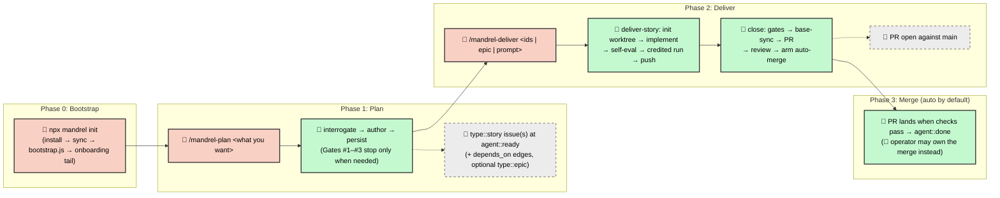

# Software Development Life Cycle (SDLC) Workflow

Mandrel uses **Story-centric GitHub orchestration** — GitHub Issues,
Labels, and Projects V2 are the Single Source of Truth. Planned work
persists as `type::story` tickets, optionally ordered by `depends_on`
edges; each Story is delivered on its own `story-<id>` branch and reaches
`main` through its own PR.

**Execution is Story-only.** The Story is the one executable ticket: it
carries its folded Tech Spec in `## Spec` and its binding contract as
`acceptance[]` / `verify[]`. `type::epic` exists as a **container only** —
a goal plus a child checklist, no `agent::*` label, never delivered itself
(ADR `20260905-5139`). `/mandrel-plan` can adopt or create one (Gate #3),
`/mandrel-deliver <epicId>` expands it to its open children, and every close
rolls the container's status up from its children. Linkage runs
parent→child only. There is no Epic wave loop, no `epic/<id>` integration
branch, and a ticket still carrying a v1 `Epic: #N` footer is **refused** by
`/mandrel-deliver` (see [§ Troubleshooting](#epic-n-refusal)).

The framework is **Claude Code-first**: `.claude/`, hooks, skills, role-scoped
agents, and the slash-command surface lean in on Claude Code as the reference
runtime (ADR `20260512-coupling-stance` in [`decisions.md`](decisions.md)).
Workflows are projected into `.claude/commands/` by `sync-claude-commands.js`;
role contexts under `.agents/agents/` are projected into `.claude/agents/`.

---

## The simple flow

From zero to shipped:

1. **Plan the work.** Run [`/mandrel-plan`](../.agents/workflows/mandrel-plan.md)
   and say what you want — there are no operator flags. The workflow derives
   the mode from what you typed and announces it: prose → **seed**, an existing
   file → **seed-file**, issue ids → **tickets** (re-plan existing issues,
   preferring an N=1 rewrite), a delivered Story's id → **amends**, nothing →
   it asks. It then runs **interrogate → author → persist**, authoring **one
   Story by default** and splitting into N>1 only under the default-single
   split policy.

2. **Deliver the Story.** Run
   [`/mandrel-deliver <storyId>`](../.agents/workflows/mandrel-deliver.md). It
   also takes several ids, an inclusive range (`4712 - 4716`), a container
   Epic id, or — for genuinely small unplanned work — a plain-language prompt
   (the [light path](#the-unplanned-light-path)). Every Story runs through the
   one delivery engine,
   [`helpers/deliver-story`](../.agents/workflows/helpers/deliver-story.md):
   init → implement → acceptance self-eval → credited suite run → push →
   close (gates, PR, review, auto-merge) → merge confirm.

That is the whole happy path. Everything below is **detail** you only need
when the default flow requires adjustment. It **links** to
[`mandrel-plan.md`](../.agents/workflows/mandrel-plan.md) and
[`mandrel-deliver.md`](../.agents/workflows/mandrel-deliver.md) rather than
re-documenting the ceremony they own.

## Core Principles

- **GitHub is the state of record.** Ticket lifecycle state lives in GitHub
  labels; structured comments (`story-plan-state`, `verification-results`,
  `follow-ups`, `friction`) are the operator-visible record. Local run
  artifacts under `temp/` are caches and ledgers, never the authority. See
  [§ State stores](#state-stores).
- **Provider Abstraction.** Orchestration flows through
  `ITicketingProvider`, an abstract interface with a shipped GitHub
  implementation.
- **Story-level branching.** All work for a Story lands on its
  `story-<id>` branch, seeded from `project.baseBranch` (`main` by default).
  Each Story reaches the base branch through its own PR (squash + required
  checks).
- **One delivery engine.** `/mandrel-deliver` resolves and sequences a Story
  set; `helpers/deliver-story` executes each Story identically. A one-Story
  run executes **inline** in the operator's session; a multi-Story run spawns
  one `story-worker` sub-agent per ready Story (worktree filesystem isolation
  either way) and closes their hand-offs serially in the orchestrating
  session.
- **PR is the sole promotion gate.** Delivery opens a PR against the base
  branch and (by default) arms GitHub native auto-merge; no workflow runs
  `git merge` into `main`. Branch protection enforces required checks before
  the merge fires.
- **HITL-minimal by default.** On the delivery happy path the only mandatory
  operator touchpoint is blocker resolution. See
  [§ HITL model](#hitl-human-in-the-loop-model).

---

## State stores

Each store has one canonical writer and a well-defined idempotency key.
Run-scoped artifacts live under `temp/run-<id>/` (standalone Stories under
`temp/standalone/stories/story-<id>/`), resolved by
[`lib/config/temp-paths.js`](../.agents/scripts/lib/config/temp-paths.js).

| State Store | Owner (canonical writer) | Mutation API | Idempotency key | Authority |
| --- | --- | --- | --- | --- |
| GitHub labels | `transitionTicketState` (`lib/orchestration/ticketing/transition.js`, re-exported by `ticketing.js`) | `update-ticket-state.js` | `(ticketId, label-set)` — set-equality before write | **Authoritative** for current ticket lifecycle state. Nothing re-derives labels from a local ledger. |
| Structured comments | `upsertStructuredComment` (`ticketing.js`); `verification-results` via `lib/orchestration/code-review.js` | Upsert by comment `type` marker | `(ticketId, type)` | Authoritative for the record each type carries (plan summary, review findings, follow-ups, friction). Critical review findings block close. |
| Lifecycle ledger NDJSON | `appendLedgerEvent` (`lib/orchestration/lifecycle/emit-ledger-event.js`) — a bare `appendFileSync` from the close path | Append-only, schema-validated line write | One record per merge-terminal outcome | Records only `merge.unlanded` and `merge.flip-failed` for post-hoc attribution. See [`LIFECYCLE.md`](LIFECYCLE.md). |
| Run ledger | `deliver-run.js` | JSON under `temp/run-<id>/` | `(runId, storyId)` — every id the beat hands out | Local dispatch bookkeeping for a multi-Story run; each beat re-probes live GitHub state. |
| Validation evidence cache | `evidence-gate.js` | JSON cache under the run temp tree | `(storyId, gate, HEAD, tree fingerprint, command-config hash)` | Pure cache: a miss re-runs the gate; eviction is safe. |
| PR / auto-merge state | `single-story-close.js` (`phases/auto-merge.js`) | `gh pr create`; `gh pr merge --auto --squash --delete-branch` | `(prNumber, head SHA)` — `gh pr list --head` probes before create | GitHub is authoritative for PR and auto-merge state. |
| Worktree cleanup state | `WorktreeManager.reap` (via `single-story-close` `phases/worktree-reap.js`) | `git worktree remove` + pending-cleanup JSON | `(storyId, worktree-path)` | Filesystem is authoritative; the pending-cleanup JSON only tracks entries needing a follow-up sweep. |

> A lint rule in `scripts/check-lifecycle-lint.js` confines the literal
> `gh pr merge` command to the sanctioned close path.

---

## End-to-End Process



---

## Phase 0: Bootstrap (one-time setup)

Before any workflow, bootstrap your project to seed `.agentrc.json`, wire the
framework system prompt, and create the GitHub labels, Projects V2 fields, and
(when enabled) main-branch protection the orchestration engine depends on:

```bash
npx mandrel init
```

`mandrel init` installs `mandrel` (when `./.agents/` is absent), materializes
`./.agents/` via `mandrel sync`, then asks **"Begin interactive setup?
[Y/n]"**. Yes runs `node .agents/scripts/bootstrap.js`; no leaves just the
files (re-run `mandrel init` later). `--assume-yes` skips the prompt; a non-TTY
run without it stays files-only so GitHub provisioning never runs unattended.
The `bootstrap.js` pipeline and the onboarding tail are documented in
[`README.md` § Activation](../.agents/README.md#activation). Bootstrap is safe
to re-run — existing labels, fields, and branch-protection entries are
preserved; missing ones are added.

---

## Phase 1: Planning

Planning is owned end-to-end by
[`/mandrel-plan`](../.agents/workflows/mandrel-plan.md); on-demand detail is in
[`helpers/plan-reference.md`](../.agents/workflows/helpers/plan-reference.md).
This section states the contract the rest of the SDLC depends on.

- **Modes are derived, not typed.** The operator states intent; the workflow
  derives `ask` / `seed` / `seed-file` / `tickets` / `amends` and fills in the
  `plan-context.js` flags (`--seed`, `--seed-file`, `--tickets`, `--amends`).
  A bare id is resolved from live state: an `agent::done` Story can only be
  amended, an open unplanned issue only planned. `--yes` is runner-set
  (cron, `/loop`, headless) and means nobody is at the keyboard.
- **Interrogate.** `plan-context.js` writes the planning envelope (docs
  context, the story-author system prompt, duplicate candidates, Epic and
  dependency candidates, prior feedback, advisory complexity signals) and a
  `stories.template.json` skeleton to `temp/plan-<slug>/`. Each open unknown
  is triaged: an **AFK** unknown (research settles it) is resolved before
  authoring; a **HITL** unknown (a product or architecture call) goes to the
  operator — or, under `--yes`, becomes a declarative
  *decision-made-by-default* Key Assumption.
- **One Story by default.** The author writes `stories.json` in one pass: a
  body (`## Goal`, optional `## Slicing`, `## Spec`, `## Changes`,
  `## Non-Goals`) plus top-level `acceptance[]` / `verify[]`. Specs are inline
  at any length, never spilled to `docs/`. It splits into N>1 siblings
  **only** on near-zero overlap or a genuine architectural seam; coupled work
  stays one Story, staged by `## Slicing` checkpoints.
- **Three conditional gates.**
  - **Gate #1** stops only for a HITL unknown or a non-empty `duplicates[]`;
    otherwise the run announces the sharpened intent and one advisory line.
  - **Gate #2** stops for approval only when the draft has more than one
    Story, or the operator asked to review.
  - **Gate #3** offers to adopt an open `type::epic` (any N) or create a new
    container (N>2). Never unasked.
  - The maker-blind **pre-mortem critic** (`plan-critics.js`) is not a gate;
    it runs only when the operator asks for it.
- **Persist is one command.** `plan-persist.js` runs every deterministic gate
  write-free first — body parse and plan shape, seed-provenance carriage,
  the ticket validator, reachability, cross-plan links (`--epic`, `#<id>`
  blockers), the tickets-mode `supersedes[]` map, and at N>1 the
  **same-wave collision refusal** (siblings declaring a common path must be
  merged or ordered by `depends_on`). On a clean list it creates the issues,
  posts a `story-plan-state` summary, writes `blocked by #<id>` footers and
  native `blocked_by` edges, and flips every Story to `agent::ready` as the
  **terminal** step. Warnings are listed but never stop the persist.
  Tickets mode closes the superseded source issues as `not_planned`.
- **Handoff.** The `story-plan-state` comment names the delivery command:
  `/mandrel-deliver <storyId> [<storyId> ...]`.

There is no `epic|story` routing verdict, scorer, or token budget anywhere on
the path: sizing is the authoring model's cohesion judgment, and the one
deterministic split gate is the collision refusal.

Audit findings enter planning through
[`/audit-to-stories`](../.agents/workflows/audit-to-stories.md), which groups and
deduplicates findings and hands off via `--emit-plan-seed` →
`/mandrel-plan <seed-file>`.

---

## Phase 2: Delivery

Delivery is owned end-to-end by
[`/mandrel-deliver`](../.agents/workflows/mandrel-deliver.md), which delegates
every Story to
[`helpers/deliver-story`](../.agents/workflows/helpers/deliver-story.md). Every
delivery reads [`helpers/deliver-digest.md`](../.agents/workflows/helpers/deliver-digest.md)
once; situational detail is in
[`deliver-reference.md`](../.agents/workflows/helpers/deliver-reference.md) and
[`deliver-story-reference.md`](../.agents/workflows/helpers/deliver-story-reference.md).

### Invocation modes

| Invocation | What happens |
| --- | --- |
| `/mandrel-deliver` | Lists open `agent::ready` Stories and asks which to deliver. |
| `/mandrel-deliver <storyId>` | One Story, **inline** in this session — no `story-worker` spawn. |
| `/mandrel-deliver <a> <b> …` / `<a> - <b>` | A Story set or inclusive range. `deliver-run.js` beats sequence it by the dependency graph discovered from live state (body edges ∪ native `blocked_by`, each blocker checked against its real issue state), dispatching up to `delivery.deliverRunner.concurrencyCap` (default **3**) `story-worker`s at once. A file-overlap guard (`delivery.deliverRunner.footprintGuard`, `enforce` by default) withholds two Stories whose footprints would race the same path. |
| `/mandrel-deliver <epicId>` | The container Epic's **open** child Stories; mixes with Story ids. |
| `/mandrel-deliver <prompt>` | Unplanned small work — the [light path](#the-unplanned-light-path). |

`resolve-stories.js` hard-errors on an id that is neither `type::story` nor
`type::epic`, an Epic with no open children, a Story still carrying an
`Epic: #N` footer, a Story with no `agent::*` label (unless
`--allow-unlabelled`), or edges it cannot read. `plan-run::<id>` labels are
filter metadata, never a resolution input — Stories deliver across plan runs.

### The per-Story engine

1. **Init** — `single-story-init.js` validates the Story, takes the
   assignee lease, seeds `story-<id>` from the base branch, materializes the
   worktree at `.worktrees/story-<id>/`, and flips `agent::executing`.
2. **Implement** — against the Story's `## Spec`, `acceptance[]` and
   `verify[]`, walking any `## Slicing` rows as intra-session commit
   checkpoints.
3. **Acceptance self-eval (required)** — one verdict file covering every
   `acceptance[]` item, scored by `acceptance-eval.js` with `verify[]` output
   as evidence, bounded by `delivery.acceptanceEval.maxRounds` (default 2):
   `proceed` / `redraft` / `block`.
4. **Preflight, credited run, push** — lint + `quality-preview.js`, merge the
   base branch in, then the **one** credited full-suite run
   (`coverage-capture.js` or `evidence-gate.js`), seat baseline rows for new
   methods, push `story-<id>`, and compute the held Story-scope review
   (`story-review-compute.js`), fixing any CRITICAL before hand-off.
5. **Close** (`single-story-close.js`, the orchestrator's step) — close-
   validation gates → base-sync → push → PR → Story-scope code review →
   arm auto-merge → `agent::closing` → worktree reap → merge wait →
   `agent::done` → post-land tail. It emits one schema-validated terminal
   envelope: `landed` | `pending` | `blocked` | `failed`.
6. **Per-run epilogue (N>1)** — `plan-run-epilogue.js` after the last Story
   lands: the `follow-ups` roll-up and a container-Epic report; the audit
   roster is opt-in (`--audit-roster`).

### Branch model (authoritative)

```text
story-<id>  →  PR  →  main (squash + required checks)
```

There is no `epic/<id>` integration branch and no `--no-ff` wave merge.
Dependent Stories land sequentially so each builds on the previous merge.

### Ceremony

Who authors a Story's acceptance verdict is selected by
`delivery.routing.ceremonyProfile` (`minimal` | `standard` | `strict`, default
`standard`) and by nothing else: `minimal` / `standard` → the implementing
agent's inline self-eval; `strict` → a fresh maker-blind `acceptance-critic`.
The **derived change level** (`ceremony-derive.js`: a registered sensitive
path → `high`) is a separate decision that tunes **review depth** only. Hard
gates (lint / test / format / coverage / CRAP / maintainability) always run at
close. The profile table lives in
[`deliver-reference.md` § Ceremony](../.agents/workflows/helpers/deliver-reference.md).

### The unplanned (light) path

`/mandrel-deliver "<prompt>"` takes genuinely small, unplanned work straight to
execution while keeping every gate
([`helpers/deliver-light.md`](../.agents/workflows/helpers/deliver-light.md)):

1. `deliver-light.js` judges the predicted footprint for **risk only** — a
   sensitive-path class or a migration paired with its consumers escalates.
   An escalation emits an `escalated` terminal envelope naming the
   `/mandrel-plan` command that owns the work, and creates nothing.
2. Otherwise it authors a minimal **receipt Story**, and the work runs through
   the same `single-story-init.js` engine, self-eval and credited run.
3. A **diff backstop** (`deliver-light.js --backstop`) re-checks the actual
   committed diff against `LIGHT_DIFF_CEILINGS`; an over-ceiling or sensitive
   diff blocks and recycles the receipt into `/mandrel-plan <storyId>`.
4. Close is the unchanged `single-story-close.js`.

### State sync

Agents update state on GitHub, always through `update-ticket-state.js`:

- **Labels**: `agent::ready` → `agent::executing` → `agent::closing` →
  `agent::done`, with `agent::blocked` reachable from any live state. The
  `agent::done` flip happens only after the merge is confirmed (in-process
  under close-and-land, or via `single-story-confirm-merge.js` in async
  mode). Issues filed through the `story.yml` form start at
  `agent::review-spec` — awaiting planning — and `/mandrel-deliver` refuses
  them before dispatch, naming the `/mandrel-plan <id>` remedy that moves
  them to `agent::ready`. When a `projectNumber` is configured, the Projects v2
  Status column is synced on each transition and re-asserted after merge.
- **Acceptance/verify**: the agent works the Story's inline `acceptance[]` /
  `verify[]`; `verify[]` output is the evidence the self-eval scores.
- **Friction and follow-ups**: a blocked Story gets a structured `friction`
  comment naming the decision needed (posted by the blocking agent or by the
  close phase that stopped — base-sync conflict, review block, wrong-tree
  guard). Out-of-scope discoveries become a `follow-ups` comment, rolled up
  per run at the epilogue. `diagnose-friction.js` is separate: it wraps a
  command and records a local NDJSON signal, never a ticket comment.

### Cross-clone coordination

- **The assignee-as-lease is the cross-clone layer.** To stop two clones from
  both starting the same Story, init takes an exclusive, time-bounded claim
  via [`ticket-lease.js`](../.agents/scripts/lib/orchestration/ticket-lease.js),
  riding the ticket's GitHub `assignees` field so a live foreign claim is
  visible to every clone. It **fails closed** on a foreign assignee; `--steal`
  is the only override. See
  [`README.md` § Multi-developer coordination](../.agents/README.md#multi-developer-coordination).
- **Filesystem locks are same-machine-only.** The merged-branch sweep lock
  (`lib/single-story-sweep/sweep-lock.js`, PID + mtime heartbeat under
  `temp/`) and the host full-suite lock coordinate only the sessions on one
  machine.

### Concurrent close

`single-story-close.js` merges `origin/<baseBranch>` into the Story branch
before pushing and opening/locating the PR, so concurrent closes serialize
through their own worktrees rather than racing one shared branch (the
orchestrator also runs closes one at a time). The push is a single attempt: a
rejected push, or a real content conflict at base-sync, aborts the merge,
leaves the tree clean, flips the Story to `agent::blocked` with a `friction`
comment, and exits non-zero — resolve it, then re-run `/mandrel-deliver <id>`.

---

## HITL (Human-in-the-Loop) model

**Planning** stops only when it needs you: Gate #1 for a HITL unknown or a
likely duplicate, Gate #2 for a multi-Story split, Gate #3 for an Epic offer.
**Delivery** has exactly one mandatory touchpoint on the happy path —
blocker resolution. PR merge is autonomous via armed auto-merge.

1. **Blocker resolution (mandatory when triggered).** A Story that hits an
   unresolvable condition flips to `agent::blocked` and gets a `friction`
   comment naming the decision needed. The operator resolves the cause (a
   hand-fix commit on the Story branch, or a scope edit on the ticket), then
   runs `node .agents/scripts/deliver-recover.js --story <id>` — it prints the
   one command that resumes the Story — or re-runs `/mandrel-deliver <id>`.
   Flipping the label back by hand does nothing on its own; nothing watches
   for it.
2. **PR merge (autonomous by default).** Close opens a PR and arms native
   auto-merge; when required checks pass the PR lands and the Story flips to
   `agent::done`. The operator owns the merge instead when they disarm it
   (`--no-auto-merge` per run, or `delivery.ci.autoMerge: "strict"`), and
   becomes a touchpoint when required checks fail and need remediation.

> **Blocked Stories notify you.** A Story or Epic entering `agent::blocked`
> rates `high` severity: the ticket comment @mentions the operator and the
> webhook message is prefixed `[Action Required]` under the default
> allowlists (see [§ Notification system](#notification-system)). The
> Story's `friction` comment names the decision needed.

### What triggers `agent::blocked`

- A base-sync content conflict the automated merge cannot reconcile.
- Test failures that persist after automated remediation.
- Ambiguity requiring a product/scope decision the agent cannot make from
  ticket context alone.
- A destructive action not pre-authorized by the ticket body.
- `remoteVerified: false` at init, or an external-service failure preventing
  progress.
- Acceptance self-eval exhausting its round cap with criteria still unmet, or
  a CRITICAL review finding that survives the fix loop.
- A light-path diff backstop refusal.

### What is *not* gated at runtime

- `risk::high` Stories **run without pause.** The label is planning/audit
  metadata only; the sole runtime pause point is `agent::blocked`. Branch
  protection and blocker escalation are the runtime defenses for destructive
  actions.
- Individual Story completion — no per-Story approval prompt beyond the PR
  merge gate.

---

## Testing strategy

Tests are **pyramid-aware**. Every test written during Story delivery
belongs to exactly one tier — **unit**, **contract**, or **e2e /
acceptance**. The canonical tier definitions, assertion-placement rules,
and coverage thresholds live in
[`rules/testing-standards.md`](../.agents/rules/testing-standards.md); Gherkin
authoring for `.feature` files is governed by
[`rules/gherkin-standards.md`](../.agents/rules/gherkin-standards.md).

A Story's `acceptance[]` items are **outcomes a PR reviewer can confirm** from
the diff and the `verify[]` output; mechanical checks (a command exiting 0, a
scoped test run) belong in `verify[]` as exact commands.

### QA workflows: explore, assist, and run-harness

Three complementary QA workflows sit alongside the automated pyramid, all
reading the consumer's `qa.*` contract through
[`resolve-qa-contract.js`](../.agents/scripts/lib/qa/resolve-qa-contract.js) (which
fails loudly when no `qa` block is bound):

- **[`/qa-explore`](../.agents/workflows/qa-explore.md)** — **agent-led**
  Plan → Capture → Triage sweep of a named surface (read-only capture; every
  state-changing action lands in Triage after operator confirmation).
- **[`/qa-assist`](../.agents/workflows/qa-assist.md)** — the **human-led**
  sibling: a rolling, resumable multi-observation session (Intake → Enrich →
  Record per observation), ending in Triage & Plan that hands off to
  `/mandrel-plan`.
- **[`/qa-run`](../.agents/workflows/qa-run.md)** — the **automated
  complement**: steps a known set of Gherkin `.feature` scenarios through a
  real browser into structured `F#` findings.

Consumer adoption steps are in
[`README.md` § Adopting the QA harness](../.agents/README.md#adopting-the-qa-harness).

---

## Static analysis & audit orchestration

Audit lenses are woven into delivery as a **shift-left** model in which each
lens concern is verified at one tier, chosen by the lens's `scope` field in
`audit-rules.json` (resolved by `resolveLensTier`).

| Tier | When | What runs | Blocking? |
| --- | --- | --- | --- |
| Tier 1 — write-time | During implementation of a **sub-agent-dispatched** Story (multi-Story runs) | Footprint-matched **local**-lens authoring checklists written into the worker's dispatch prompt (`checklistPath`) | advisory |
| Tier 2 — Story-scope | Worker push (held review) and `single-story-close.js` | Review pillars over the Story diff via the provider chain, posted as `verification-results` — no lens pass (retired by Story #5416) | blocking on 🔴 |
| Tier 3 — run closeout | `plan-run-epilogue.js --audit-roster` (N>1, **opt-in**) | Cumulative + global lenses (`selectAudits`) over the run's combined landed change, posted as a `plan-run-audit-roster` comment for the host to walk | advisory |

- **`local`** lenses are decidable from one Story's diff; **`cumulative`**
  lenses only across a run's combined diff; **`global`** lenses are
  whole-product properties. The run-closeout roster excludes local lenses.
- There is no risk-routed lens tier. The `sensitivePaths` classes in
  `audit-rules.json` route review **depth**, not lenses.
- A one-Story (inline) run receives no Tier 1 checklist.

### Code review

The Story-scope review runs over `origin/<baseBranch>...story-<id>`, outside
the maker's reasoning context:

- **Held review at hand-off.** After the credited run and push, the worker
  runs `story-review-compute.js`, which computes the configured provider
  chain's review, posts nothing, and deposits the result keyed on the diff
  digest. A CRITICAL is the worker's to fix before hand-off
  ([`deliver-reference.md` § Held review](../.agents/workflows/helpers/deliver-reference.md)).
- **Close adopts, else computes.** When the deposit's digest matches the
  diff at close, close posts it after PR-open; otherwise it reviews itself.
  Either way it posts one `verification-results` comment and halts on a
  surviving 🔴 Critical finding (`--override-review-block <reason>` is the
  audited escape).

The provider chain (default: `native` maintainability scoring, then an optional
low-effort `claude --print` bug review) is owned by
[`README.md` § Code review providers](../.agents/README.md#code-review-providers-pluggable-chain);
the walk-through is in [`helpers/code-review.md`](../.agents/workflows/helpers/code-review.md).

### Quality ratchets

The maintainability, CRAP and other baseline gates run through
`check-baselines.js` at close-validation and in `ci.yml`; `.husky/pre-push`
runs the CRAP gate plus `quality-preview.js`. Baseline edits are committed
with a `baseline-refresh:` commit-subject tag. The runbooks (bootstrap,
refresh, floor policy) are owned by [`quality-gates.md`](quality-gates.md).

### Audits → Stories

The standalone `/audit-<dimension>` workflows write
`audit-<dimension>-results.md` under `temp/audits/`;
[`/audit-to-stories`](../.agents/workflows/audit-to-stories.md) groups and
deduplicates those findings against existing Issues (by provenance footer)
and either hands off a plan seed to `/mandrel-plan` or opens standalone
Stories, closing the loop back into planning.

---

## Notification system

Every notification routes through the unified
[`notify.js`](../.agents/scripts/notify.js) dispatcher — both explicit
`notify()` calls and auto-fired ticket-state transitions. It lives in
`.agents/` so it ships to consuming projects.

| Channel | What it does |
| --- | --- |
| GitHub comment | Posts to the targeted ticket; @mentions the operator for `high`, and for `medium` only when `github.notifications.mentionOperator` is true (default false). |
| Webhook | Fire-and-forget POST to `NOTIFICATION_WEBHOOK_URL` (Make.com / Slack / Discord), HMAC-signed with `X-Signature-256` when `WEBHOOK_SECRET` is set. Failures never block execution. |

Severity vocabulary:

| Severity | Used for | Webhook prefix |
| --- | --- | --- |
| `low` | Every state transition except a Story/Epic reaching `agent::done` or `agent::blocked`. Suppressed at the emit point. | `[low]` |
| `medium` | A Story or Epic reaching `agent::done`. | `[medium]` |
| `high` | A Story or Epic entering `agent::blocked` — the one runtime pause point — plus explicit operator-action `notify()` calls (e.g. the `notify.js` CLI). | `[Action Required]` |

Two optional event allowlists in `github.notifications` filter each channel
independently (no fallback chain; set an array to `[]` to silence a channel):

- `commentEvents` — default `["state-transition", "story-merged", "operator-message"]`.
- `webhookEvents` — default `["state-transition", "story-merged", "story-closing", "operator-message", "merge.unlanded", "merge.flip-failed"]`.

The events that exist are `state-transition`, `story-closing` (PR open,
merge pending), `story-merged`, `operator-message` (the `notify.js` CLI), and
the two merge-terminal ledger events. **Webhook URL resolution** is the
`NOTIFICATION_WEBHOOK_URL` process env var only (loaded from `.env`), never
`.agentrc.json` or `.mcp.json`. Because `notify()` is called in-band, it does
**not** capture manual label clicks in the GitHub UI.

---

## Troubleshooting

### Sub-agent CI workflow editing

A token without GitHub's workflows permission (a GitHub App installation
token, or a PAT without the `workflow` scope / "Workflows: Read and write")
**cannot push changes under `.github/workflows/**`**:

> refusing to allow a GitHub App to create or update workflow
> `.github/workflows/<file>.yml` without `workflows` permission

This is a hard constraint, not a transient failure. **When a Story plans a
new CI gate**, route the check through a `package.json` script (add it to
`npm run lint` / `npm run docs:check` / `npm test`, or wire a new
`npm run check:<name>` script) so an existing CI job picks it up by
transitivity. **When a workflow file genuinely must change**, an operator
whose token carries the workflows permission makes that edit.

### Worktree config shadow

Each Story runs in `.worktrees/story-<id>/`, which checks out the **Story
branch's own copy** of every tracked file — including `.agentrc.json` — and
receives a **copy** of `.agentrc.local.json` at provisioning. Edits made in
the main checkout afterwards do **not** reach worker-side scripts that run
against the worktree (`ceremony-derive.js`, `coverage-capture.js`,
`evidence-gate.js`). Close runs with `--cwd <main-repo>` and reads the main
checkout's config directly. When tuning knobs mid-Story:

1. **Prefer an env-var override** when the knob exposes one (timeouts,
   `AGENT_LOG_LEVEL`, concurrency caps) — env vars bypass the shadow.
2. **Edit the file inside the worktree** (`.worktrees/story-<id>/.agentrc.json`
   or its `.agentrc.local.json`) so the next worker-side read sees it.
3. Put per-machine tuning you never commit in `.agentrc.local.json` (see
   [`configuration.md`](../.agents/docs/configuration.md#per-machine-local-overrides))
   **before** init, so it is copied into new worktrees.

### `Epic: #N` refusal

`/mandrel-deliver` refuses any ticket that still carries an `Epic: #N`
footer, or that is neither `type::story` nor `type::epic`. This is expected —
v2 has no Epic *delivery* path. Close the ticket or re-plan it as a v2 Story
with `/mandrel-plan <id>` (tickets mode).

The container Epic (ADR `20260905-5139`) does **not** soften this. Its linkage
runs parent→child only — the Epic body lists its children, and no Story body
gains a footer pointing back — so a ticket carrying `Epic: #N` is still a v1
ticket and still refused.

---

## Quick reference

| Command | Purpose |
| --- | --- |
| `npx mandrel init` | Cold-start — install `mandrel` (if absent), `mandrel sync`, then optionally `bootstrap.js` (repo + Projects V2 board, labels, branch protection) and the onboarding tail. |
| `/mandrel-update` | Upgrade a consumer: newest version → install → re-materialize `.agents/` → migrate → doctor → changelog. |
| `/mandrel-plan <what you want>` | Plan from prose, a notes file, or issue ids — interrogate → author **one Story by default** → persist at `agent::ready`. |
| `/mandrel-plan <doneStoryId>` | Amend a delivered Story from a delta envelope. |
| `/mandrel-deliver <storyId> [<storyId>…]` | Deliver one Story inline, or a set / range in `depends_on` order, then the per-run epilogue. |
| `/mandrel-deliver <epicId>` | Deliver every open Story under a container Epic. |
| `/mandrel-deliver <prompt>` | Unplanned small work via the light path — risk gate, receipt Story, same close. |
| `/git-deliver` | Ad-hoc delivery of working-tree changes — escalates to commit, commit + push, or commit + push + PR (auto-merge armed). |
| `/prototype` | Operator-invoked single-file UI prototype before UI acceptance criteria are frozen. |
| `/audit-<dimension>` · `/audit-to-stories` | Run an audit lens; convert findings into a plan seed or Stories. |
| `/qa-explore` · `/qa-assist` · `/qa-run` | Agent-led / human-led exploratory QA and the automated Gherkin harness. |
| `/memory-consolidate` | Attended consolidation of the agent memory pool. |
| `/clean-git` · `/clean-temp` · `/clean-worktrees` | Recovery tools for the checkout, the temp tree, and dead worktrees. |
| *helper* `helpers/deliver-story` | Per-Story engine invoked by `/mandrel-deliver`; not an operator slash command. |

The full generated command index is
[`.agents/docs/workflows.md`](../.agents/docs/workflows.md).
