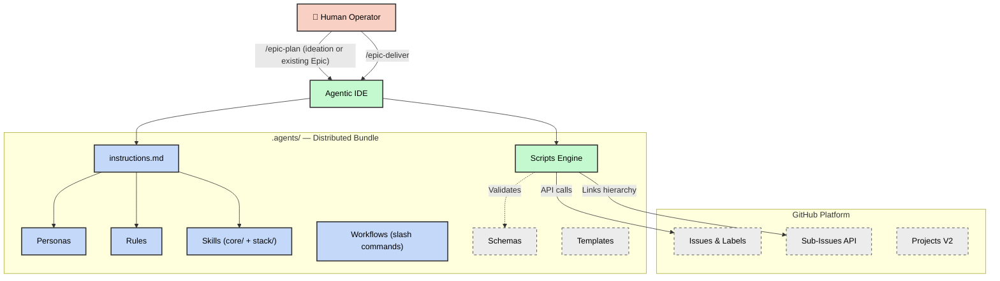
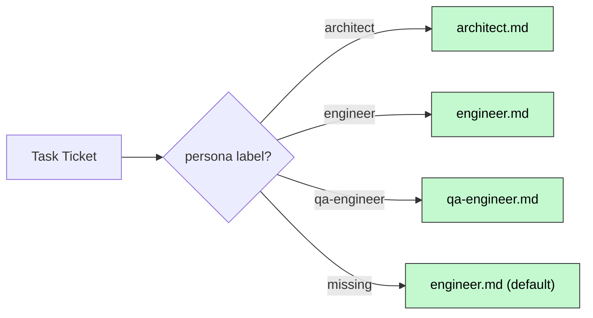
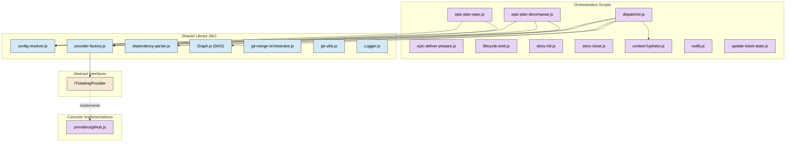
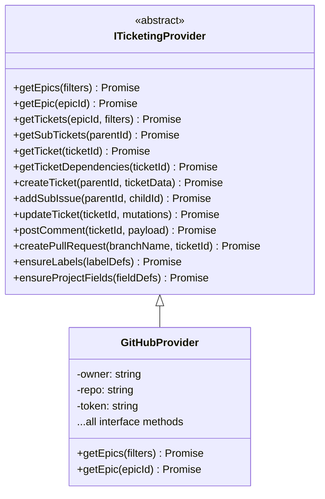
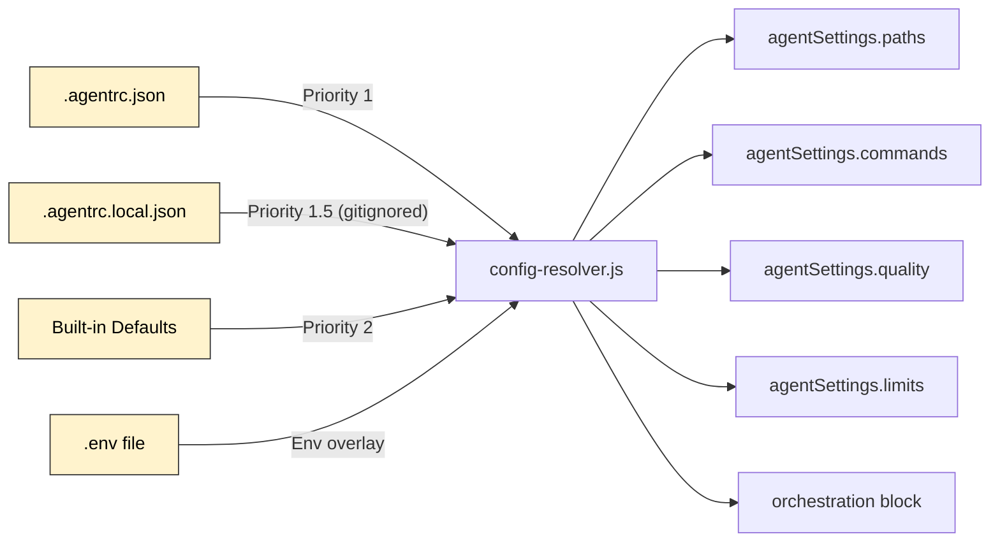
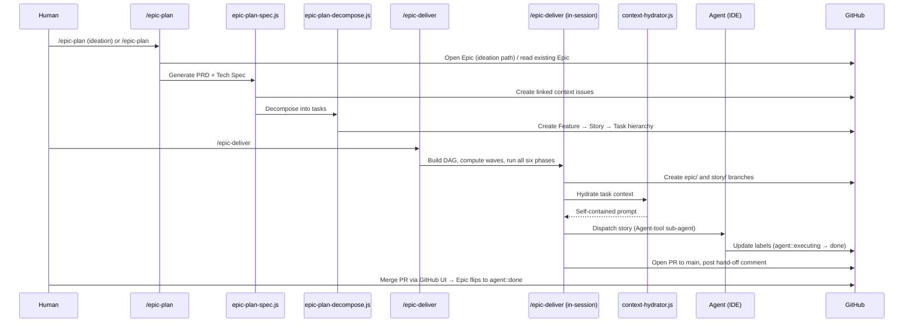
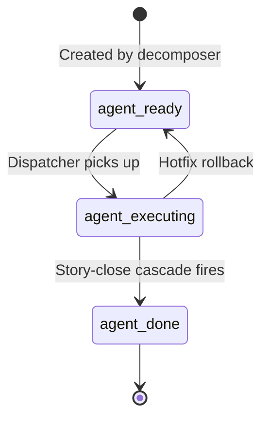

# Architecture

This document describes the internal architecture of Mandrel — a
framework of instructions, personas, skills, and SDLC workflows that govern AI
coding assistants. It is the authoritative reference for how the system is
structured, how components interact, and where to find each subsystem.

> **For the end-to-end workflow narrative** — how the commands compose, label
> transitions, HITL touchpoints — see [`.agents/SDLC.md`](../.agents/SDLC.md).
> This file covers the *architecture* (modules, interfaces, data flow) that
> the workflow runs on top of. The slash-command reference index lives in
> [`workflows.md`](workflows.md).
>
> **Coupling stance.** Mandrel is a **Claude Code-first opinionated
> workflow framework**. The dispatcher / `.agents/scripts/` library
> produces a **dispatch manifest** (md + structured comment) as the
> cross-runtime contract; the workflow / `.claude/` / hook / skill
> surface leans in on Claude Code as the in-session reference runtime.
> See ADR `20260512-coupling-stance` and the adapter-removal ADR in
> [`decisions.md`](decisions.md) for the rationale and what it
> explicitly is and isn't.

---

## High-Level Overview

Mandrel follows an **Epic-Centric GitHub Orchestration** model where
GitHub Issues, Labels, and Projects V2 serve as the Single Source of Truth
(SSOT). The framework decomposes product initiatives (Epics) into executable
agent tasks, dispatches them across parallel waves, and integrates the results —
all without local state files.



---

## Repository Layout

The repository has a clear separation between the **distributed product**
(`.agents/`) and **development tooling** (root-level files).

```text
mandrel/
├── .agents/                  ← Distributed bundle (the "product")
│   ├── instructions.md       ← Primary system prompt (all agent rules)
│   ├── VERSION               ← Semantic version
│   ├── SDLC.md               ← End-to-end workflow guide
│   ├── README.md             ← Consumer documentation
│   ├── starter-agentrc.json ← Bootstrap delta-seed (copy to .agentrc.json)
│   ├── full-agentrc.json    ← Exhaustive editor reference (every schema key)
│   │
│   ├── personas/             ← Role-specific behavior files
│   ├── rules/                ← Domain-agnostic coding standards
│   ├── skills/               ← Two-tier skill library
│   │   ├── core/             ←   Universal process skills
│   │   └── stack/            ←   Tech-stack guardrails
│   ├── workflows/            ← Slash-command workflows
│   ├── scripts/              ← Deterministic JavaScript tooling
│   │   ├── lib/              ←   Shared modules & interfaces
│   │   ├── providers/        ←   Ticketing provider implementations
│   │   └── adapters/         ←   Execution adapter implementations
│   ├── schemas/              ← JSON Schema for structured output
│   └── templates/            ← Prompt and planning templates
│
├── .agentrc.json             ← Runtime configuration (dogfooding)
├── .github/workflows/        ← CI/CD pipeline (ci.yml)
├── docs/                     ← Project documentation
├── tests/                    ← Framework test suite
│   └── lib/                  ←   Library-specific unit tests
├── temp/                     ← Ephemeral runtime artifacts (git-ignored)
├── biome.json                ← Biome linter/formatter config
├── package.json              ← npm tooling + dev dependencies
└── AGENTS.md                 ← Repository-level onboarding
```

---

## Core Subsystems

### 1. Instruction Layer

The instruction layer defines **what agents are** and **how they must behave**.

| Component     | Path                           | Purpose                                                                                                                                         |
| ------------- | ------------------------------ | ----------------------------------------------------------------------------------------------------------------------------------------------- |
| System Prompt | `.agents/instructions.md`      | Master behavioral contract — guardrails, FinOps, shell protocol, philosophy, quality discipline, Git conventions.                                |
| Personas      | `.agents/personas/*.md`        | Role-specific constraint files (architect, engineer, qa-engineer, etc.) that override default behavior when activated.                          |
| Rules         | `.agents/rules/*.md`           | Domain-agnostic coding standards (API conventions, git conventions, security baseline, testing, etc.).                                          |
| Skills        | `.agents/skills/{core,stack}/` | Two-tier library of callable capabilities.                                                                                                       |

#### Persona Routing



#### Skill Architecture

Skills use a **two-tier layout**:

- **`core/`** — Universal, process-driven skills (debugging, TDD, security,
  code review, context engineering, etc.)
- **`stack/`** — Technology-specific skills organized by category:
  - `architecture/` — Monorepo strategies, system design
  - `backend/` — Server frameworks, API patterns
  - `frontend/` — UI frameworks, CSS systems
  - `qa/` — Testing frameworks (Playwright, Vitest)
  - `security/` — Hardening patterns

Each skill contains a `SKILL.md` file with constraints and an optional
`examples/` directory.

---

### 2. Orchestration Engine

The orchestration engine is the **runtime brain** — a set of JavaScript ESM
scripts that automate the entire SDLC from planning through integration. The
operator-facing surface is two slash commands on the SDL critical
path — `/epic-plan` (with optional ideation entry) and `/epic-deliver` —
plus `/story-deliver` for single-Story drives off the dispatch table.
Planning is **git-state-free**: `/epic-plan` produces a declarative
`epic.yaml` artifact (Epic #1182) that is diff-able, replayable,
and reconcilable against GitHub via `epic-reconcile.js`; the Epic branch
is no longer created at plan time.
`/epic-deliver`'s host LLM owns the wave loop and fans Story sub-agents
out directly via the Agent tool inside the operator's Claude session —
there is no intermediate wave skill, no subprocess spawn pathway, and no
GitHub Actions runner. The PR opened by `/epic-deliver` Phase 6 is the
sole promotion gate to `main`; the workflow never executes `git merge`
against `main` itself.

#### Component Diagram



#### Key Scripts

| Script                       | Responsibility                                                                                                                                                                              |
| ---------------------------- | ------------------------------------------------------------------------------------------------------------------------------------------------------------------------------------------- |
| `epic-plan-spec.js`          | Authoring wrapper for PRD + Tech Spec; flips Epic to `agent::review-spec` and writes the `epic-plan-state` checkpoint. Threads `docsContext` and a `codebaseSnapshot` (Story #2634, see below) into the spec-author envelope so the Architect persona cites real modules instead of doc-only names. |
| `epic-plan-decompose.js`     | Authoring wrapper for the 4-tier ticket hierarchy; flips Epic to `agent::ready` and posts the dispatch manifest.                                                                              |
| `dispatcher.js`              | Builds dependency DAG, computes execution waves, posts the dispatch manifest (consumed by `/epic-deliver`).                                                                                   |
| `epic-deliver-prepare.js`    | Snapshots the Epic, builds the wave plan, and initialises the `epic-run-state` checkpoint at the start of `/epic-deliver` Phase 1.                                                            |
| `lifecycle-emit.js`          | Generic argv-driven emit helper. `/epic-deliver` Phase 6 / 7.5 / 8 fire `epic.close.end` / `epic.automerge.start` / `epic.merge.armed` through this CLI; the matching listener chain (`Finalizer`, `AutomergePredicate` + `AutomergeArmer`, `Cleaner`) runs the PR open, auto-merge arm, and branch reap. |
| `story-init.js`              | Initialises a Story worktree, transitions Tasks to `agent::executing`.                                                                                                                        |
| `story-close.js`             | Validates, merges, reaps, and cascades on Story completion. Thin CLI shell over `lib/orchestration/story-close/{merge-runner,cleanup-reconciler,comment-bodies}`. |
| `context-hydrator.js`        | Assembles self-contained prompts (protocol + persona + skills + hierarchy + task).                                                                                                            |
| `update-ticket-state.js`     | Syncs ticket status via GitHub labels (`agent::ready` → `agent::done`).                                                                                                                       |
| `notify.js`                  | Dispatches notifications via @mention and webhook channels.                                                                                                                                   |
| `analyze-execution.js`       | Reads per-Story `signals.ndjson` and emits the `story-perf-summary` / `epic-perf-report` consumed by the retro. Wired into the post-merge pipeline and into `/epic-deliver` Phase 5.           |

#### In-process orchestration modules

These modules fold the close-tail into the deliver runner so
`/epic-deliver` runs end-to-end without spawning helper sessions:

| Module                                   | Role                                                                                                                                                              |
| ---------------------------------------- | ----------------------------------------------------------------------------------------------------------------------------------------------------------------- |
| `lib/orchestration/code-review.js`       | Phase 4 inline audit. Extracted from `helpers/epic-code-review.md`; halts the runner on critical findings and persists results as a `code-review` structured comment. |
| `lib/orchestration/retro-runner.js`      | Phase 5 retro authoring. Extracted from the (now-deleted) retro helper; aggregates perf signals, friction, hotfixes, recuts, parked stories, and HITL count.        |
| `lib/duplicate-search.js`                | `/epic-plan` ideation entry — cross-Epic title + body keyword search; returns a ranked list of overlapping open Epics or `[]`.                                     |

#### Dispatch Engine Submodules

`lib/orchestration/dispatch-engine.js` is a coordinator that composes six
cohesive submodules. Consumers (`dispatcher.js`, tests) import `dispatch`,
`resolveAndDispatch`, `collectOpenStoryIds`, `detectEpicCompletion`, and the
`AGENT_*` / `RISK_HIGH_LABEL` / `TYPE_TASK_LABEL` constants from the
coordinator path.

| Submodule                     | Responsibility                                                                            |
| ----------------------------- | ----------------------------------------------------------------------------------------- |
| `dispatch-pipeline.js`        | Resolve context, fetch Epic, reconcile state, build DAG, scaffold branch, run worktree GC. |
| `wave-dispatcher.js`          | `dispatchWave`, `dispatchNextWave`, per-task dispatch, `collectOpenStoryIds`.              |
| `risk-gate-handler.js`        | Risk labels are metadata only; no runtime gate.                                            |
| `epic-lifecycle-detector.js`  | Epic-completion detection (final-wave → Phase 3 close-validation transition).              |

#### Presentation Layer Submodules

`lib/presentation/manifest-renderer.js` is a façade composing:

| Submodule                 | Responsibility                                                                                     |
| ------------------------- | -------------------------------------------------------------------------------------------------- |
| `manifest-formatter.js`   | Pure Markdown / CLI rendering (`formatManifestMarkdown`, `printStoryDispatchTable`). No fs access. |
| `manifest-persistence.js` | File I/O — writes dispatch and story manifests to `temp/`.                                         |

The data-shape owner (`lib/orchestration/manifest-builder.js`) is unchanged.
Only the façade file is part of the stable public surface — downstream
consumers continue to import `renderManifestMarkdown`,
`renderStoryManifestMarkdown`, `persistManifest`, `printStoryDispatchTable`,
`postManifestEpicComment`, and `postParkedFollowOnsComment` from
`lib/presentation/manifest-renderer.js`.

#### Orchestration Context + ErrorJournal

The deliver-runner and plan-runner thread an explicit typed context through every
submodule:

| Context                | Path                            | Consumers                                                       |
| ---------------------- | ------------------------------- | --------------------------------------------------------------- |
| `OrchestrationContext` | `lib/orchestration/context.js`  | Shared base — provider, settings, logger, `errorJournal`.       |
| `EpicRunnerContext`    | `lib/orchestration/context.js`  | Every `epic-runner/*` submodule accepts `ctx` as first arg.     |
| `PlanRunnerContext`    | `lib/orchestration/context.js`  | `epic-plan-spec.js` / `epic-plan-decompose.js` drivers.         |

The `errorJournal` field on each context is an `ErrorJournal` instance
(`lib/orchestration/error-journal.js`) that writes structured JSONL to
`temp/epic-<id>-errors.log`. Sites that previously did silent
`catch (err) { logger.warn(...) }` in the deliver runner and the blocker
handler now also call `errorJournal?.record({ phase, error, context })`
so the error surface is auditable after a run completes. See
[`docs/patterns.md`](patterns.md) for the pattern and the
`errorJournal?.record(...)` idiom.

`lib/orchestration/epic-runner/progress-reporter.js` emits a periodic
`epic-run-progress` structured comment on the Epic, driven by
`orchestration.runners.deliverRunner.progressReportIntervalSec`.

#### Codebase snapshot (Phase 7)

`lib/codebase-snapshot.js` emits a structural view of the consumer repo
that Phase 7 spec authoring threads into the `planner-context.json`
envelope under `codebaseSnapshot`. The snapshot is bounded — file tree
(filtered by the configured include/exclude globs), `package.json`
exports + scripts, recently-touched directories from `git log`, and the
detected test/BDD surface. Tier is controlled by
`planning.codebaseSnapshot.tier` in `.agentrc.json`:

- **`skinny` (default)** — file paths only. Target: ~2–5k tokens on a
  mid-size repo.
- **`medium`** — skinny + a per-file export signature list extracted via
  a regex pass over each `.js` / `.ts` body. Target: ~15–30k tokens.

The Architect persona is instructed (via the
`epic-plan-spec-author` skill) to prefer module / file names that
appear in the snapshot over names that appear only in `docsContext.items[]`,
because the docs may be stale relative to the source tree. Any error in
the snapshot generation degrades to a `Logger.warn` and an empty
envelope so Phase 7 stays non-blocking.

#### Resilience layers

| Module                                              | Role                                                                                                                                                  |
| --------------------------------------------------- | ----------------------------------------------------------------------------------------------------------------------------------------------------- |
| `lib/orchestration/epic-runner/commit-assertion.js` | Post-wave guard — a "done" wave whose stories produced zero commits on `origin/story-<id>` is reclassified as `halted` instead of silently passing.   |
| `lib/observability/signals-writer.js`               | Append-only NDJSON writer for `friction` / trace records under `temp/epic-<eid>/story-<sid>/signals.ndjson`. The single producer for the telemetry pipeline; the consolidated reader (`lib/observability/signals-reader.js`) is the sole consumer. |
| `lib/orchestration/column-sync.js`                  | Drives the Projects v2 Status column from `agent::` labels (best-effort). Invoked from inside `transitionTicketState` (Story #2548) so every label flip — Epic, Story, Task — mirrors onto the board.                  |

`CommitAssertion`'s default git adapter falls back to a `resolves #<storyId>`
grep on `origin/epic/<id>` when `origin/story-<id>` has already been deleted
by `story-close` — closing the window where a successfully-merged Story was
misreported as a zero-delta failure.

#### Throughput primitives

| Module                                                     | Role                                                                                                                                                 |
| ---------------------------------------------------------- | ---------------------------------------------------------------------------------------------------------------------------------------------------- |
| `lib/util/concurrent-map.js`                               | `concurrentMap(items, fn, { concurrency })` bounded-concurrency fanout. Adopted in `wave-gate`, wave-end `commit-assertion`, and `ProgressReporter`. |
| `providers/github/cache-manager.js`                        | `getTicket(id, { maxAgeMs })` treats entries older than the caller's max age as cache misses; `primeTicketCache` after every `getTickets(epicId)`.   |
| `providers/github/issues.js`                               | Bulk `GET /issues?labels=agent::*&state=open` path replaces per-ticket probes when the tracked-story set is large; per-ticket fallback on errors.    |
| `lib/util/phase-timer.js` + `phase-timer-state.js`         | Records `{ phase, elapsedMs }` spans across the `story-init` → sub-agent → `story-close` boundaries. Posts `phase-timings` comments on Story close.  |
| `ProgressReporter.setPlan({ waves })`                      | With a plan set, each fire renders every wave + story (queued / in-flight / done / blocked) with a `Wave` column. Reads `phase-timings` to render p50/p95. |

#### Tunable concurrency caps

The three `concurrentMap` adoption sites are configurable via
`orchestration.concurrency`, resolved from `.agentrc.json` and threaded
through `ctx.concurrency` by `lib/orchestration/concurrency.js`:

| Key                | Default        | Semantics                                                                                                                       |
| ------------------ | -------------- | ------------------------------------------------------------------------------------------------------------------------------- |
| `waveGate`         | `0` (uncapped) | `wave-gate` retains the `Promise.all` fanout when omitted; a positive integer routes through `concurrentMap` with that cap.     |
| `commitAssertion`  | `4`            | Wave-end `CommitAssertion.check` concurrent git-read cap.                                                                       |
| `progressReporter` | `8`            | Progress-reporter concurrent `provider.getTicket` cap.                                                                          |

`resolveConcurrency(source)` reads either `orchestration.concurrency` or a
pre-narrowed concurrency sub-block, coerces per-field, and falls back to
`DEFAULT_CONCURRENCY` for missing or malformed values. Consumers tuning caps
read the `epic-perf-report` structured comment posted by
`analyze-execution.js` at Epic close — it surfaces per-phase p50/p95 and
the workload signals the retro consumes.

#### Direct CLIs (no MCP server)

The framework ships no MCP server. Every orchestration capability is a
direct Node CLI under `.agents/scripts/`, with `lib/orchestration/ticketing.js`
as the authoritative SDK for runtime callers. Operators see the simplification
at first-run time (no MCP-server bootstrap step) and at secrets-resolution
time (`GITHUB_TOKEN` and `NOTIFICATION_WEBHOOK_URL` read only from
`process.env`).

---

### 3. Provider Abstraction Layer

All ticketing interactions are mediated through the **`ITicketingProvider`**
abstract interface, enabling future portability beyond GitHub.



**Resolution**: `provider-factory.js` reads `orchestration.provider` from
`.agentrc.json` and instantiates the matching concrete class.

**Internal layout**: `providers/github.js` is a thin façade over focused
modules under `providers/github/`: `ticket-mapper.js` (REST/GraphQL payload →
ticket shape), `graphql-builder.js` (named query + mutation strings),
`cache-manager.js` (per-instance ticket cache backed by `lib/CacheLayer`), and
`error-classifier.js` (GraphQL error → category). The façade re-exports every
symbol consumers previously imported.

---

### 4. Execution Path

Mandrel runs Claude-Code-in-session: `/epic-deliver` fans out via the
`Agent` tool over a wave of Story sub-agents, each driving the per-Story
Task loop directly from the Story worktree. There is no separate
adapter abstraction — `wave-dispatcher.js` synthesizes the
`{ taskId, dispatchId, status }` record inline at the dispatch site,
and the **dispatch manifest** (md + structured comment, schema
[`dispatch-manifest.json`](../.agents/schemas/dispatch-manifest.json))
is the load-bearing artifact downstream tooling (and operators) read.
The manifest is the cross-runtime contract: any future host that wants
to replay or audit a Mandrel dispatch consumes the manifest, not an
in-process interface.

The `executor` field on the manifest is fixed to `"claude-code"`. See
the adapter-removal ADR in [`decisions.md`](decisions.md) (Epic #2646)
for the rationale; the deletion landed as a hard cutover with no
shim layer, per the policy codified there.

---

### 5. Configuration System

Configuration follows a **layered resolution** pattern with operational
settings organised into a **grouped contract**:



The runtime AJV schemas in `lib/config-schema.js` and
`lib/config-settings-schema.js` are the source of truth; the static mirror at
`.agents/schemas/agentrc.schema.json` exists for editor tooling and human
readers, kept in sync by a drift test.

#### Key Configuration Sections

| Section                  | Purpose                                                                |
| ------------------------ | ---------------------------------------------------------------------- |
| `agentSettings.paths`    | Required filesystem roots (`agentRoot`, `docsRoot`, `tempRoot`).        |
| `agentSettings.commands` | Validate / lint / test / typecheck / build commands; `null` disables.  |
| `agentSettings.quality`  | Maintainability + CRAP + lint baselines and `prGate.checks`.            |
| `agentSettings.limits`   | Resource ceilings + `friction.*` anti-thrashing thresholds.             |
| `orchestration`          | Provider, GitHub block, worktree isolation, runners, retry tuning.      |

Each grouped block is read through a typed accessor (`getPaths(config)`,
`getCommands(config)`, `getQuality(config)`, `getLimits(config)`) — there are
no flat-key reads anywhere in the resolver or its consumers.

> See [`docs/configuration.md`](configuration.md) for the canonical
> reader-facing reference: every key, default, and required-vs-optional flag,
> the root-dogfood-vs-distributed-template diff table, and baseline
> conventions (canonical `/baselines/` vs per-wave drift snapshots under
> `.agents/state/`). Project-specific technology context lives under the
> **Tech Stack** section below — intentionally not in `.agentrc.json`.

**Security**: The config resolver blocks shell metacharacter injection
(`; & | \`` `` $()`) in all string values that flow into subprocesses, and the
schema enforces non-empty strings on every command field.

---

### 6. Dependency Graph Engine

The `Graph.js` module provides the mathematical foundation for task scheduling:

| Function                  | Algorithm                                  | Complexity |
| ------------------------- | ------------------------------------------ | ---------- |
| `buildGraph()`            | Adjacency list construction                | O(N)       |
| `detectCycle()`           | DFS 3-color cycle detection                | O(V+E)     |
| `assignLayers()`          | Memoized layer assignment                  | O(V+E)     |
| `computeWaves()`          | Layer-grouped wave partitioning            | O(V+E)     |
| `topologicalSort()`       | Kahn's algorithm (deterministic tie-break) | O(V+E)     |
| `transitiveReduction()`   | DFS-based edge pruning                     | O(V·(V+E)) |
| `autoSerializeOverlaps()` | Focus-area conflict serialization          | O(N²+V·E)  |
| `computeReachability()`   | Memoized DFS transitive closure            | O(V·(V+E)) |

The auto-serialization pass prevents file-level merge conflicts by injecting
synthetic dependency edges between tasks with overlapping `focusAreas`.

---

## Data Flow: Epic Lifecycle



---

## Epic Deliver Runner

The `/epic-deliver <epicId>` slash command is the sole entry point for
Epic delivery. It runs end-to-end inside the operator's Claude session,
composing the orchestration primitives into a six-phase execution
coordinator with the lifecycle bus chain at its core. There is no
remote-trigger surface — delivery only ever runs locally, in the
operator's session, with Story sub-agents launched through the Agent
tool. Story #2259 (Epic #2172) retired the legacy deliver-runner CLI
wrapper; the slash command supplants it entirely.

The bus is the **single canonical runner model** under Epic #2172:
every phase transition, ticket-state flip, structured-comment upsert,
and webhook fan-out is emitted as a typed event that fixed-roster
listeners consume. The append-only NDJSON ledger at
`temp/epic-<id>/lifecycle.ndjson` is the resume contract. See
[`LIFECYCLE.md`](LIFECYCLE.md) for the bus contract, event taxonomy,
ledger format, and listener model — that document is the canonical
reference for the lifecycle bus, and the older "phase boundaries
inline-emit comments" framing is retired.

### State machine (Epic labels)

```text
        /epic-plan ideation creates the Epic with type::epic only
                              (no state::* label at creation)
                                       │
                                       │ PRD + Tech Spec authored
                                       ▼
                               agent::review-spec  ◄── operator reviews on GitHub
                                       │
                                       │ operator confirms; decomposition runs
                                       ▼
                                 agent::ready  ◄── /epic-plan terminates here
                                       │
                                       │ operator runs /epic-deliver <id>
                                       ▼
                              agent::executing  ◄── wave loop + close-validation +
                                       │              code-review + retro + finalize
                                       │ wave halts on blocker
                                       ▼
                              agent::blocked  ──── operator flips back ───┐
                                       │                                  │
                                       └─────────────────────────────────┘
                                       │ /epic-deliver Phase 6 opens PR to main
                                       │ Epic stays at agent::executing
                                       │ (PR's existence is the merge signal;
                                       │  /epic-deliver terminates here)
                                       │ operator merges PR via GitHub UI
                                       ▼
                              agent::done  ◄── set via standard label-transition
                                                pathway when the PR merge fires
                                                (no GitHub Action; retro already ran)
```

### Submodules

| Module              | Role                                                                                                |
| ------------------- | --------------------------------------------------------------------------------------------------- |
| `wave-scheduler`    | Iterates waves from `Graph.computeWaves()`; never spawns workers.                                   |
| `story-launcher`    | Fans out up to `concurrencyCap` `/story-deliver <storyId>` Agent-tool sub-agents in one message.    |
| `checkpointer`      | Upserts the `epic-run-state` structured comment; handles phase-granular resume across the six phases. |
| `blocker-handler`   | The sole runtime pause point; halts on `agent::blocked`, waits to resume.                           |
| `notification-hook` | Fire-and-forget webhook; never blocks execution.                                                    |
| `wave-observer`     | Emits `wave-N-start` / `wave-N-end` structured comments each boundary.                              |
| `column-sync`       | Drives the Projects v2 Status column from `agent::` labels (best-effort).                           |
| `code-review`       | `lib/orchestration/code-review.js` — Phase 4 inline audit (extracted from the helper).              |
| `retro-runner`      | `lib/orchestration/retro-runner.js` — Phase 5 retro authoring (extracted from the helper).          |

### HITL touchpoints

One runtime pause point — `agent::blocked` on the Epic. `risk::high` is
metadata; mid-run changes are ignored. Branch protection on `main` (set up
during `node .agents/scripts/bootstrap.js`) is the load-bearing destructive-action
guard now that the operator's PR merge is the sole promotion gate.

---

## Ticket Hierarchy

The framework uses a 4-tier GitHub Issue hierarchy with label-based typing and
`blocked by #NNN` dependency wiring:

```text
Epic (type::epic)
├── PRD (context::prd)
├── Tech Spec (context::tech-spec)
├── Feature (type::feature)
│   ├── Story (type::story)
│   │   ├── Task (type::task)     ← Atomic agent work unit
│   │   │   ├── - [ ] subtask 1
│   │   │   └── - [ ] subtask 2
│   │   └── Task (type::task)
│   └── Story (type::story)
└── Feature (type::feature)
```

### State Machine

Each Task progresses through a label-driven state machine:



### Cascade Behavior

When a child ticket transitions to `agent::done`, `cascadeCompletion()` walks
upward through the hierarchy and closes parents whose children are all done.
The cascade is **not** uniform across tiers — the table below is the
authoritative contract:

| Parent tier                                     | Auto-closes via cascade? | How it closes                                                    |
| ----------------------------------------------- | ------------------------ | ---------------------------------------------------------------- |
| Story (`type::story`)                           | Yes                      | Last Task → `agent::done` cascades.                              |
| Feature (`type::feature'`)                      | Yes                      | Last Story → `agent::done` cascades.                             |
| Epic (`type::epic`)                             | **No** — cascade stops.  | Operator merges the `/epic-deliver` PR via the GitHub UI.        |
| Planning (`context::prd`, `context::tech-spec`) | **No** — cascade stops.  | Operator close after the Epic PR is merged.                      |

**Why Features auto-close but Epics and Planning don't.** A Feature is a
purely hierarchical grouping — no standalone branch, no merge step, no
release artefacts. When its last child Story closes, the Feature is complete
by definition; a manual Feature-close step would be pure ceremony. Operators
who need Feature-level acceptance-criteria verification should encode it in
the final child Story, not add a manual gate. Epics, by contrast, gate on a
real pull-request merge — cascade must not pre-empt the operator's
required-checks review. Planning tickets (PRD, Tech Spec) are narrative
artefacts the operator closes once the Epic PR is merged.

Implementation: [`.agents/scripts/lib/orchestration/ticketing.js`](../.agents/scripts/lib/orchestration/ticketing.js)
— `cascadeCompletion()` explicitly skips `type::epic`, `context::prd`, and
`context::tech-spec` parents; every other parent tier is eligible. The
`fromState` lookup inside `transitionTicketState()` has a deliberate
try/catch — a network flake reading the prior state label must not block a
legitimate transition; failures emit a `debug`-level log instead of swallowing
silently.

---

## Workflow System

The shipped slash commands (under `.agents/workflows/`) fall into six
categories — planning, execution, closure, audits, git operations, and
setup/meta. The canonical reference is [`workflows.md`](workflows.md); the
workflow narrative that wires them together lives in
[`.agents/SDLC.md`](../.agents/SDLC.md).

### Worktree Isolation

When `orchestration.worktreeIsolation.enabled` is `true`, each dispatched
story runs inside its own `git worktree` at `.worktrees/story-<id>/`. The main
checkout's HEAD never moves during a parallel run; branch swaps, staging
operations, and reflog activity are isolated per-story.

The `WorktreeManager` (`.agents/scripts/lib/worktree-manager.js`) is the
single authority for worktree `ensure`/`reap`/`list`/`isSafeToRemove`/`gc`.
No other script may call `git worktree` directly. All git calls are
argv-based (no shell interpolation) and validate `storyId` / `branch` before
shelling out. `reap` only reaches `git worktree remove --force` after its
safety gate has already established the Story worktree is removable and the
plain remove path has exhausted Windows lock/cwd retry.

**Internal submodule layout.** `worktree-manager.js` is a façade composing
four cohesive submodules under `.agents/scripts/lib/worktree/`:

| Submodule                  | Responsibility                                                                                          |
| -------------------------- | ------------------------------------------------------------------------------------------------------- |
| `lifecycle-manager.js`     | `ensure`, `reap`, `list`, `gc`, `prune`, `sweepStaleLocks`, Windows-lock-aware remove recovery.         |
| `node-modules-strategy.js` | `applyNodeModulesStrategy` + `installDependencies` for `per-worktree` / `symlink` / `pnpm-store`.       |
| `bootstrapper.js`          | Bootstrap-file copy (`.env`), `.agents/` snapshot for submodule consumers, submodule-index scrub.       |
| `inspector.js`             | Pure porcelain parsing, path helpers (`samePath`, `storyIdFromPath`, `isInsideWorktree`), Windows path warnings. |

The submodules are **internal implementation detail**. Downstream projects
must continue to import `WorktreeManager` from `lib/worktree-manager.js`.

Dispatcher integration:

- **Ensure before dispatch**: `dispatch()` calls `wm.ensure(storyId, branch)`
  and threads the resolved worktree path as `cwd` on the dispatch record.
  Downstream consumers of the dispatch manifest can use the `cwd` to
  pin sub-agent execution to the right worktree.
- **Reap on merge**: `story-close` calls `wm.reap` after a successful merge.
  The reap refuses dirty trees and logs a warning.
- **GC on dispatch start**: `dispatch()` sweeps orphaned worktrees whose
  stories have no remaining live tasks. Refuses to delete unmerged branches.

Setting `orchestration.worktreeIsolation.enabled: false` (or omitting the
block) restores single-tree behavior. The `assert-branch.js` pre-commit guard
and focus-area wave serialization remain in place as defense-in-depth in both
modes.

See [`worktree-lifecycle.md`](../.agents/workflows/helpers/worktree-lifecycle.md) for
the operator reference, node_modules strategies, Windows long-path handling,
and escape hatches.

### Execution-model modes

The two-skill execution surface (`/epic-deliver` and `/story-deliver`) runs
in two execution-model modes that share one codepath and differ only in
whether worktrees are created. The `resolveWorktreeEnabled` function in
`lib/config-resolver.js` selects the mode at startup based on
`AP_WORKTREE_ENABLED` and `CLAUDE_CODE_REMOTE` (precedence in
[`patterns.md`](patterns.md)):

```text
┌──── Local-parallel (worktrees on, default) ─────┐  ┌──── Web-parallel (worktrees off, auto) ─────┐
│                                                  │  │                                              │
│  one machine, one clone of the repo              │  │  N web tabs, each its own sandboxed clone   │
│                                                  │  │                                              │
│  ┌─ main checkout ──────────────────────┐        │  │  ┌─ tab 1 (clone A) ─┐                      │
│  │                                       │        │  │  │  story-680        │                      │
│  │  HEAD never moves while waves run     │        │  │  │  branch HEAD      │                      │
│  │                                       │        │  │  └───────────────────┘                      │
│  │  ┌─ .worktrees/story-680/ ─┐         │        │  │  ┌─ tab 2 (clone B) ─┐                      │
│  │  │  story-680 branch HEAD  │         │        │  │  │  story-681        │                      │
│  │  └─────────────────────────┘         │        │  │  │  branch HEAD      │                      │
│  │  ┌─ .worktrees/story-681/ ─┐         │        │  │  └───────────────────┘                      │
│  │  │  story-681 branch HEAD  │         │        │  │  ┌─ tab 3 (clone C) ─┐                      │
│  │  └─────────────────────────┘         │        │  │  │  story-682        │                      │
│  └───────────────────────────────────────┘        │  │  │  branch HEAD      │                      │
│                                                  │  │  └───────────────────┘                      │
│  Concurrency primitive: git worktree             │  │  Concurrency primitive: separate clones      │
│  Coordination at close: filesystem lock          │  │  Coordination at close: bounded push retry   │
│  Operator launches: N IDE windows                │  │  Operator launches: N web tabs               │
└──────────────────────────────────────────────────┘  └──────────────────────────────────────────────┘
                            ▲                                         ▲
                            │                                         │
                            └────────── shared launch primitive ──────┘
                              operator picks Story id from /epic-plan
                                  dispatch table, one session per id
```

Both modes share:

- The same `/story-deliver` Agent-tool sub-agent contract and the same
  parent-driven dispatch logic out of `/epic-deliver`'s wave loop.
- The launch-time dependency guard (`runDispatchManifestGuard`) that refuses
  a story with unmerged blockers.
- Deterministic, operator-driven story assignment — `/story-deliver` always
  takes an explicit Story id. There is no per-launch label race.
- The bounded retry on the epic-branch push (`lib/push-epic-retry.js`,
  configured by `orchestration.runners.storyMergeRetry`) so concurrent closes from
  separate clones converge cleanly.

They differ only in:

- **Filesystem layout.** Worktrees create `.worktrees/story-<id>/` siblings
  to the main checkout; web sessions write directly into the cloned workspace
  because the session is already isolated.
- **`node_modules` strategy.** `nodeModulesStrategy` runs only in worktree-on
  mode. Web sessions install once at the workspace root.
- **Path-length warnings.** Windows long-path warnings come from worktree
  paths — they don't fire on web (Linux) or in worktree-off mode generally.
- **GC scope.** `WorktreeManager.gc()` runs at dispatch start in worktree-on
  mode; in worktree-off mode it is a no-op.

---

## Security Architecture

### Input Validation

- **Shell injection protection**: `config-resolver.js` scans all config string
  values against a metacharacter regex (`/([;&|`]|\$\()/`) before they reach
  subprocess calls.
- **Branch name validation**: `dependency-parser.js` enforces safe branch
  component characters (alphanumeric, hyphens, underscores, dots, slashes).
- **Schema validation**: `orchestration` config is validated against an
  embedded JSON Schema via `ajv`. The static `.agents/schemas/*.json`
  mirrors and the runtime AJV schemas declare `additionalProperties:
  false` on every nested object as well as the document roots of
  `audit-results`, `friction-event`, `agentrc`, and `epic.yaml`, and use
  a closed enum for `validation-evidence.gateName`. Payloads with extra
  keys or free-text discriminators fail validation rather than silently
  passing.

### HITL pause point

The sole runtime pause is `agent::blocked` on the Epic. `risk::high` is
informational/planning metadata only — it ranks work in the dispatch table and
helps reviewers prioritize, but does not pause execution.
`planning.riskHeuristics` in `.agentrc.json` drives the ranking heuristics.

### Anti-Thrashing Protocol

The framework enforces two circuit breakers to prevent runaway cost:

- **Error Threshold** (`consecutiveErrorCount`, default 3): Stop after N
  consecutive tool errors.
- **Stagnation Threshold** (`stagnationStepCount`, default 5): Stop after N
  steps without file modifications.

---

## Observability

### Performance-Signal Telemetry

The framework emits a closed taxonomy of NDJSON record kinds — the
active detectors `friction`, `hotspot`, `rework`, `retry`, plus the raw
`trace` (schema:
[`signal-event.schema.json`](../.agents/schemas/signal-event.schema.json)).
The schema also reserves `churn` and `idle` slots for future use; their
detectors and config keys were dropped under Epic #1721 (see ADR in
[`docs/decisions.md`](decisions.md)) but the names remain in
`EVENT_KINDS` so a future re-introduction does not need a schema bump.
Records are written **append-only to local disk** under
`temp/epic-<eid>/story-<sid>/signals.ndjson` (and a sibling
`traces.ndjson` for `kind: trace`). GitHub tickets receive **summaries
only**, never raw events.

The model has three layers:

1. **Producers — `signals-writer.js`.** Detectors and the runtime
   `tool-trace-hook.js` funnel through `appendSignal` /  `appendTrace`.
   The writer is **best-effort and unbuffered**: every call opens, writes
   one newline-terminated JSON line, and closes. fs / JSON failures are
   swallowed via `Logger.warn` so observability never halts a wave, and
   detectors that fire from inside a sub-agent that may exit abruptly do
   not lose their tail. The per-Story directory is created lazily on the
   first write; `epicId` / `storyId` must be positive integers.
2. **Detectors — `diagnose-friction.js` and the per-detector pure
   modules under `lib/signals/detectors/` (`rework.js`, `retry.js`,
   `hotspot.js`).** Rework + retry run inside the post-Task close
   pipeline (`lib/orchestration/post-merge-pipeline.js`); hotspot runs
   at Epic close from `lib/orchestration/epic-runner/progress-reporter.js`.
   Each call site resolves thresholds via `getSignals(config)`
   (defaults: `hotspot.p95Multiplier=1.25`, `rework.editsPerFile=5`,
   `retry.repeatCount=3`). Operators override individual keys in
   `.agentrc.json` under `delivery.signals.*`; the resolver shallow-
   merges per detector, so a re-tuned `hotspot.p95Multiplier` does not
   require re-listing the others.
3. **Analyzers — Story close + Epic deliver retro.** At Story close,
   `story-close.js` rolls the local NDJSON into a single
   [`structured:story-perf-summary`](../.agents/schemas/story-perf-summary.schema.json)
   comment carrying friction counts by category, phase timings,
   top-slow phases vs baseline, a rework score, and retry density. At
   `/epic-deliver` Phase 5, `analyze-execution.js` aggregates every
   Story's NDJSON into one
   [`structured:epic-perf-report`](../.agents/schemas/epic-perf-report.schema.json)
   comment alongside the retro: per-kind signal counts, per-wave
   parallelism utilization, top hotspots, and the most-friction Stories.

The split — events local, summaries on tickets — keeps the GitHub
comment surface bounded (one summary per Story, one report per Epic) and
keeps the raw stream cheap enough that detectors can fire on every
tool-call without rate-limiting or batching. The per-Epic temp tree is
reaped together with the worktree on `WorktreeManager.reap`. See
[`docs/decisions.md`](decisions.md) ADR for the architectural rationale.

### Log Levels

`lib/Logger.js` is the single orchestrator logger. Level is selected via
`AGENT_LOG_LEVEL`:

- `silent`  — only `fatal` emits.
- `info`    — default. `info` / `warn` / `error` / `fatal` emit; `debug` is
  suppressed.
- `verbose` — all levels emit, including `debug` trace output. `debug` is
  accepted as a backward-compatible alias for `verbose`.

### Notification System

| Event               | Severity | Channel            |
| ------------------- | -------- | ------------------ |
| `task-complete`     | INFO     | GitHub @mention    |
| `feature-complete`  | INFO     | GitHub @mention    |
| `epic-complete`     | INFO     | @mention + webhook |
| `review-needed`     | ACTION   | @mention + webhook |
| `approval-required` | ACTION   | Webhook            |
| `blocked`           | ACTION   | Webhook            |

`agentSettings.notifications` carries two independent per-channel gates,
both using the same event-name-allowlist model: `commentEvents` filters
GitHub-ticket comment posting; `webhookEvents` filters
`NOTIFICATION_WEBHOOK_URL` deliveries. There is no fallback chain;
raising or lowering one channel never affects the other. The default
comment allowlist is `state-transition`, `story-merged`,
`operator-message`; the default webhook allowlist is the curated
`epic-*` vocabulary — `epic-started`, `epic-progress`, `epic-blocked`,
`epic-unblocked`, `epic-complete` — so Slack consumers see the epic
narrative (% progress + blockers) without the per-story firehose.
`transitionTicketState` suppresses the `notify()` dispatch entirely
for low-severity transitions (task-level, non-terminal story / epic
flips) so the comment channel sees only the medium-severity
story-level events operators expect. Severity is carried as envelope
metadata and still drives `@mention` behavior on the comment channel
but is no longer a routing factor for either channel. Webhook
subscribers receive a typed envelope
(`{ text, severity, ticketId, event?, level?, epicId?, phase? }`) so
allowlisted events stay routable by event name and hierarchy level.

---

## Testing

The test suite uses the **Node.js native test runner** (`node --test`) with no
external test framework dependencies. Tests live under `tests/` with
`tests/lib/` for library-specific unit tests and `tests/epic-runner/` for
runner-integration tests. Run with `npm test`.

---

## CI/CD Pipeline

A single GitHub Actions workflow (`ci.yml`) runs on every push and PR:

1. **Lint** — Biome (JavaScript) + markdownlint (Markdown).
2. **Format Check** — Biome format verification.
3. **Test** — Full test suite via `npm test`.
4. **Maintainability Check** — `check-maintainability.js` no-regression gate
   on the per-file MI baseline.
5. **CRAP Check** — `check-crap.js` (per-method complexity × coverage risk).
   Diff-scoped on PRs (`--changed-since origin/<base_ref>`); full-repo scan on
   push-to-main so a regression in an untouched file cannot ride in alongside
   an unrelated PR. JSON report uploaded as the `crap-report` artifact.
6. **Dist Sync** — On merge to `main`, syncs `.agents/` to the `dist` branch
   for consumer submodule distribution.

The baseline-refresh CI guardrail was removed alongside the bot-approver
pipeline; the `baseline-refresh:` commit subject + non-empty body
convention is preserved (the pre-push hook and local close-validation
still consume it) but it is no longer machine-enforced on PRs. The
operator owns refresh justification during `/epic-deliver`'s Phase 7
watch loop.

### Quality-gate diagram

```text
        ┌───────────────────────────────────────┐
local ▶ │ pre-push (.husky/pre-push):           │
        │   quality-preview (diff) →            │
        │   coverage-capture → crap:check       │
        │   (full lint+test: npm run verify)    │
        └───────────────────┬───────────────────┘
                            │
        ┌───────────────────▼───────────────────┐
close ▶ │ close-validation DEFAULT_GATES:       │
        │   lint → test → biome format →        │
        │   check-maintainability → check-crap  │
        │   (each gate skips when SHA-keyed     │
        │    evidence still matches)            │
        └───────────────────┬───────────────────┘
                            │
        ┌───────────────────▼───────────────────┐
CI    ▶ │ ci.yml:                               │
        │   lint+format → MI → test:coverage →  │
        │   check-crap → upload crap-report     │
        └───────────────────────────────────────┘
```

### Evidence-aware gate caching

Local close-validation, `epic-code-review`, and `/epic-deliver` Phase 3
(close-validation) wrap each gate in `evidence-gate.js`. On a successful
run the wrapper records
`{ gateName, commitSha, commandConfigHash, timestamp }` under the per-Epic
tree at `temp/epic-<epicId>/validation-evidence.json` for Epic-scoped
gates and `temp/epic-<epicId>/story-<storyId>/validation-evidence.json`
for Story-scoped gates (both gitignored via `temp/`). Callers must pass
both `--scope-id` and `--epic-id`. Subsequent invocations against the same
`git rev-parse HEAD` and resolved command config skip in milliseconds.
`--no-evidence` forces a re-run; pre-push and CI ignore the evidence file
entirely so independent verification is never bypassed.

All three sites converge on the same `check-crap.js` binary and the same
`baselines/crap.json` artifact, so a regression caught at any one site fails
the gate identically at the others.

### Local Hooks

- **Husky** + **lint-staged**: Auto-lint and format staged files on commit.

---

## FinOps Model

The framework implements an economic guardrail system for LLM cost management:

### Budget Protocol

- **Soft Warning** at 80% of `maxTokenBudget` → user notification + webhook.
- **Hard Stop** at 100% → execution halt, requires human override.

---

## Distribution Model

Mandrel is distributed as a **Git submodule** via the `dist` branch:

```text
Consumer Project/
├── .agents/          ← Git submodule pointing to dist branch
│   ├── instructions.md
│   ├── personas/
│   ├── rules/
│   ├── skills/
│   ├── workflows/
│   ├── scripts/
│   └── ...
├── .agentrc.json     ← Project-specific configuration
└── ...
```

Consumers add the submodule, copy `starter-agentrc.json` to their project
root as `.agentrc.json`, and configure their `orchestration` block — see
`full-agentrc.json` for the exhaustive reference. Project-specific
technology context lives in `docs/architecture.md` under the **Tech Stack**
section below — not in `.agentrc.json`.

---

## Tech Stack

This section is the authoritative reference for the technology choices the
agent should assume when working in this repository. Keep it **current**: the
agent reads this to decide how to write code, which commands to run, and which
conventions to follow.

> **Template note:** Downstream projects should maintain their own
> `## Tech Stack` section in their own `docs/architecture.md`. Mandrel
> does not ship a standalone template — this section doubles as the working
> example.

### Runtime & Language

- **Runtime:** Node.js (ESM, `"type": "module"` in `package.json`)
- **Language:** JavaScript with JSDoc for type hints (no TypeScript build step)
- **Package manager:** npm

### Tooling

- **Linter & formatter:** Biome (`@biomejs/biome`)
- **Markdown lint:** `markdownlint-cli`
- **Markdown format:** Prettier (markdown only)
- **Git hooks:** Husky + `lint-staged`
- **JSON Schema validation:** Ajv + `ajv-formats`
- **In-memory filesystem for tests:** `memfs`
- **Shell argv parsing:** `string-argv`
- **Complexity metrics:** `typhonjs-escomplex` (maintainability baseline
  enforcement)

### Testing

- **Framework:** Node.js native test runner (`node --test`)
- **Test file pattern:** `tests/**/*.test.js`
- **Coverage:** `node --experimental-test-coverage` with absolute
  floors enforced per-file: lines ≥ 90, branches ≥ 85, functions ≥ 90,
  MI ≥ 70, CRAP ≤ 20. See [`quality-gates.md`](quality-gates.md) for the
  ratchet-plus-floor policy.

### Key Scripts

- **Orchestration engine:** `.agents/scripts/lib/orchestration/` — dispatch,
  manifest build, story execution, context hydration
- **Ticketing provider abstraction:** `.agents/scripts/lib/ITicketingProvider.js`
  with a shipped GitHub implementation in `.agents/scripts/providers/github.js`
- **Execution path:** Claude-Code-in-session; the dispatch record is
  synthesized inline at `wave-dispatcher.js` and the
  [dispatch manifest](../.agents/schemas/dispatch-manifest.json) is the
  cross-runtime contract. Epic #2646 removed the previous
  `IExecutionAdapter` abstraction as a hard cutover.
- **Config resolution:** `.agents/scripts/lib/config-resolver.js` +
  `config-schema.js` (shell-metacharacter injection guards built in)

### Ticketing & CI

- **Ticketing provider:** GitHub (Issues, Labels, Projects V2, Sub-Issues API)
- **CI:** GitHub Actions
- **Distribution:** GitHub Releases (tagged from `main` post-PR-merge; tagging is operator-driven since `/epic-deliver` exits at PR-open).

### Testing Contract

Consumers of the framework follow a **pyramid-aware** testing contract defined
in `.agents/rules/testing-standards.md`. Every test belongs to exactly one of
three tiers and carries distinct scope, dependency, and assertion rules:

- **Unit** — pure logic, no I/O; assertions on return values and rendered
  output.
- **Contract** — API ↔ DB invariants and schema conformance; this is the sole
  correct home for HTTP status codes, response body shapes, and error-envelope
  assertions.
- **E2E / Acceptance** — `.feature` files authored against
  `.agents/rules/gherkin-standards.md` (the SSOT for the tag taxonomy and
  forbidden patterns) and executed via `/run-bdd-suite`, whose Cucumber
  HTML/JSON report is the canonical evidence artifact consumed by the
  `workflows/helpers/epic-testing.md` helper.

Stack skills `skills/stack/qa/gherkin-authoring` and `skills/stack/qa/playwright-bdd`
provide authoring guidance and runtime wiring respectively; neither redefines
the rule. Scripts in this repository do not themselves run `.feature` files —
they ship the contract that consumer projects implement.

### What the Agent Should **Not** Assume

- There is no monorepo tool (no Turborepo, no pnpm workspaces) — this is a
  single-package repository.
- There is no web, mobile, database, or auth layer — this repo is a framework
  of protocols and scripts, not an application.
- There is no TypeScript compilation step; do not add `tsc` invocations.
- There is no bundler; scripts are executed directly with `node`.
