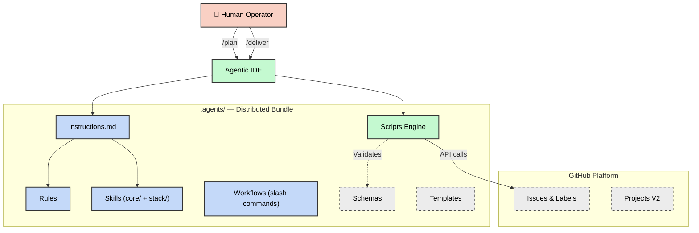
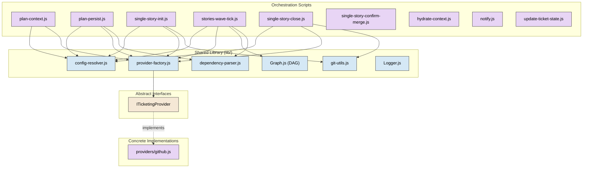
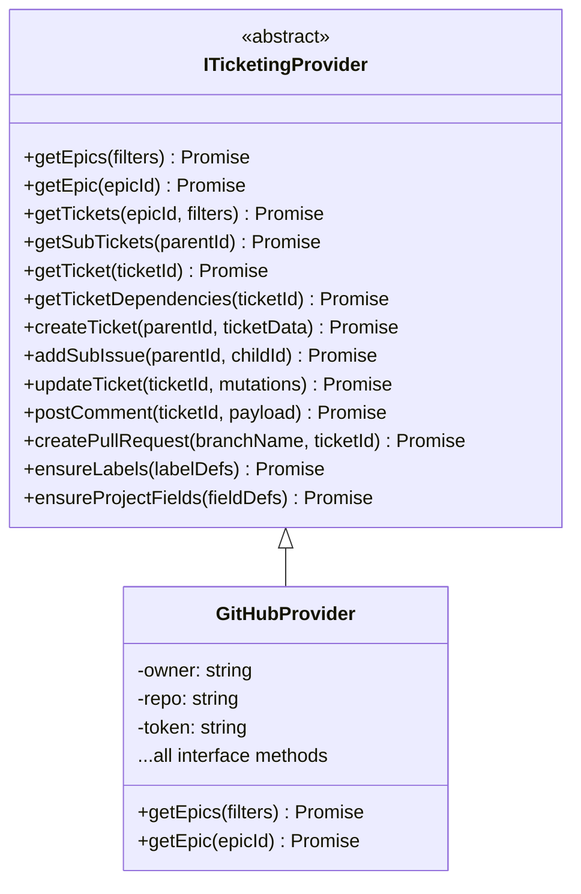
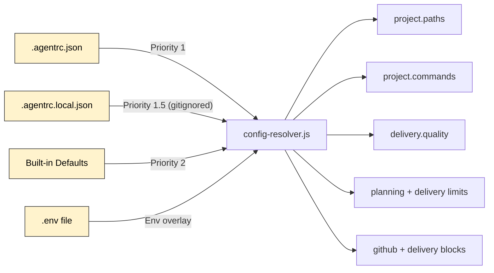
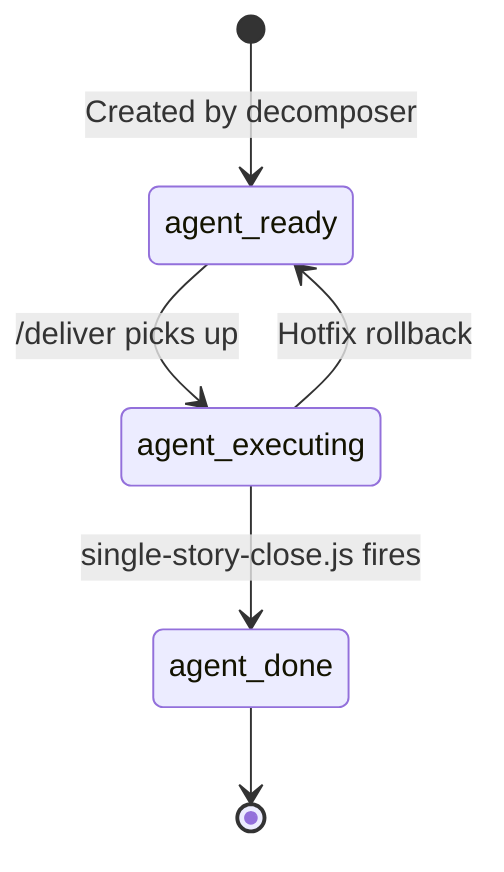

# Architecture

This document describes the internal architecture of Mandrel — a
framework of instructions, skills, rules, and SDLC workflows that govern AI
coding assistants. It is the authoritative reference for how the system is
structured, how components interact, and where to find each subsystem.

> **For the end-to-end workflow narrative** — how the commands compose, label
> transitions, HITL touchpoints — see [`.agents/docs/SDLC.md`](../.agents/docs/SDLC.md).
> This file covers the *architecture* (modules, interfaces, data flow) that
> the workflow runs on top of. The slash-command reference index lives in
> [`.agents/docs/workflows.md`](../.agents/docs/workflows.md).
>
> **Coupling stance.** Mandrel is a **Claude Code-first opinionated
> workflow framework**. The dispatcher / `.agents/scripts/` library
> produces a **dispatch manifest** (md + structured comment) as the
> cross-runtime contract; the workflow / `.claude/` / hook / skill
> surface leans in on Claude Code as the in-session reference runtime.
> See ADR `20260512-coupling-stance` and the adapter-removal ADR in
> [`decisions.md`](decisions.md) for the rationale and what it
> explicitly is and isn't.

---

## High-Level Overview

Mandrel follows a **Story-only GitHub Orchestration** model where
GitHub Issues, Labels, and Projects V2 serve as the Single Source of Truth
(SSOT). `/plan` authors one or more `type::story` tickets; `/deliver` runs
each Story on `story-<id>` → PR → `main` via `helpers/deliver-story`, with
optional `depends_on` edges ordering rare multi-Story runs — resolved
from live state, so they order Stories across plan runs and over time. An Epic is at most an optional untyped human umbrella issue outside
orchestration — there is no `type::epic` delivery path.



---

## Repository Layout

The repository has a clear separation between the **distributed product**
(`.agents/`) and **development tooling** (root-level files).

```text
mandrel/
├── .agents/                  ← Distributed bundle (the "product")
│   ├── instructions.md       ← Primary system prompt (all agent rules)
│   ├── README.md             ← Consumer documentation
│   ├── starter-agentrc.json ← Bootstrap delta-seed (copy to .agentrc.json)
│   │
│   ├── agents/               ← Role-scoped spawn boot contexts (optional)
│   ├── rules/                ← Domain-agnostic coding standards
│   ├── skills/               ← Two-tier skill library
│   │   ├── core/             ←   Universal process skills
│   │   └── stack/            ←   Tech-stack guardrails
│   ├── workflows/            ← Slash-command workflows
│   ├── scripts/              ← Deterministic JavaScript tooling
│   │   ├── lib/              ←   Shared modules & interfaces
│   │   └── providers/        ←   Ticketing provider implementations
│   ├── schemas/              ← JSON Schema for structured output
│   ├── templates/            ← Prompt and planning templates
│   └── docs/                 ← Shipped consumer reference docs
│       ├── SDLC.md           ←   End-to-end workflow guide
│       ├── configuration.md  ←   Every .agentrc.json key (shipped)
│       └── agentrc-reference.json ← Exhaustive editor reference
│
├── .agentrc.json             ← Runtime configuration (dogfooding)
├── .github/workflows/        ← CI/CD pipeline (ci.yml)
├── docs/                     ← Project documentation
├── tests/                    ← Framework test suite
│   └── lib/                  ←   Library-specific unit tests
├── temp/                     ← Ephemeral runtime artifacts (git-ignored)
├── biome.json                ← Biome linter/formatter config
├── package.json              ← npm tooling + dev dependencies
└── AGENTS.md                 ← Repository-level onboarding
```

---

## Core Subsystems

### 1. Instruction Layer

The instruction layer defines **what agents are** and **how they must behave**.

| Component     | Path                           | Purpose                                                                                                                                         |
| ------------- | ------------------------------ | ----------------------------------------------------------------------------------------------------------------------------------------------- |
| System Prompt | `.agents/instructions.md`      | Master behavioral contract — guardrails, FinOps, shell protocol, philosophy, quality discipline, Git conventions.                                |
| Rules         | `.agents/rules/*.md`           | Domain-agnostic coding standards (API conventions, git conventions, security baseline, testing, etc.).                                          |
| Skills        | `.agents/skills/{core,stack}/` | Two-tier library of callable capabilities.                                                                                                       |
| Role agents   | `.agents/agents/*.md`          | Optional role-scoped spawn boot contexts (`delivery.routing.roleScopedAgents`). No `persona::*` GitHub label axis.                              |


#### Skill Architecture

Skills use a **two-tier layout**:

- **`core/`** — Universal, process-driven skills (debugging, TDD, security,
  code review, context engineering, etc.)
- **`stack/`** — Technology-specific skills organized by category:
  - `architecture/` — Monorepo strategies, system design
  - `backend/` — Server frameworks, API patterns
  - `frontend/` — UI frameworks, CSS systems
  - `qa/` — Testing frameworks (Playwright, Vitest)
  - `security/` — Hardening patterns

Each skill contains a `SKILL.md` file with constraints and an optional
`examples/` directory.

---

### 2. Orchestration Engine

The orchestration engine is the **runtime brain** — a set of JavaScript ESM
scripts that automate the entire SDLC from planning through integration. The
operator-facing surface is two slash commands on the SDL critical
path — `/plan` (with optional ideation entry) and `/deliver` —
where `/deliver` also routes single-Story drives off the dispatch table.
Planning is **git-state-free**: `/plan` produces a declarative
`epic.yaml` artifact (Epic #1182) that is diff-able, replayable,
and reconcilable against GitHub via `epic-reconcile.js`; the Epic branch
is no longer created at plan time.
`/deliver`'s host LLM owns the wave loop and fans Story sub-agents
out directly via the Agent tool inside the operator's Claude session —
there is no intermediate wave skill, no subprocess spawn pathway, and no
GitHub Actions runner. The PR opened by `/deliver` Phase 7 is the
sole promotion gate to `main`; the workflow never executes `git merge`
against `main` itself. When the run is end-to-end clean, Phase 8.5's
auto-merge gate arms `gh pr merge --auto --squash --delete-branch`
(Story #3901); otherwise the operator merges via the GitHub UI.

#### Component Diagram



#### Key Scripts

| Script                           | Responsibility                                                                                                                                                                              |
| -------------------------------- | ------------------------------------------------------------------------------------------------------------------------------------------------------------------------------------------- |
| `plan-context.js`                | Single authoring-envelope emitter for `/plan`: Story brief + docs digest + `codebaseSnapshot` + duplicate search + clarity + rendered system prompts. |
| `plan-persist.js`                | Single GitHub-write surface for `/plan`: section gate, risk verdict, ticket validator + file-assumption + DAG + budget gates, Story creation, terminal `agent::ready` flip, `plan-summary` comment. |
| `single-story-init.js`           | Validates a standalone Story, branches from `main`, creates the worktree, flips `agent::executing`. |
| `stories-wave-tick.js`           | Ready-set planner for multi-Story `/deliver` (shared `selectReadySet` core; default concurrency 3). |
| `single-story-close.js`          | Close-validation gate chain, opens PR to `main` with auto-merge armed, rests Story at `agent::closing`. |
| `single-story-confirm-merge.js`  | Post-merge confirmation: after checks go green and the PR merges, flips `agent::closing → agent::done`. |
| `hydrate-context.js`             | Assembles self-contained prompts (protocol + skills + hierarchy). Emits the JSON envelope by default; `--emit prompt` writes the raw prompt. |
| `update-ticket-state.js`         | Syncs ticket status via GitHub labels (`agent::ready` → `agent::done`). |
| `notify.js`                      | Dispatches notifications via @mention and webhook channels. |
| `analyze-execution.js`           | Reads per-Story `signals.ndjson` and emits the `story-perf-summary` structured comment (wired from `helpers/deliver-story` / close path). |

#### In-process orchestration modules

| Module                                   | Role                                                                                                                                                              |
| ---------------------------------------- | ----------------------------------------------------------------------------------------------------------------------------------------------------------------- |
| `lib/orchestration/code-review.js`       | Inline review companion to `helpers/code-review.md`; persists results as a `code-review` structured comment. |
| `lib/duplicate-search.js`                | `/plan` ideation entry — title + body keyword search across open Stories; returns a ranked list or `[]`. |

#### Ready-set / DAG helpers

Multi-Story ordering for `/deliver` uses `lib/wave-runner/ready-set.js`
(`selectReadySet`) driven by `stories-wave-tick.js`. Pre-v2
`dispatch-engine.js` / `dispatcher.js` entry scripts are deleted; residual
DAG helpers under `lib/orchestration/` remain only where live paths still
import them.

| Helper                        | Responsibility                                                                            |
| ----------------------------- | ----------------------------------------------------------------------------------------- |
| `lib/wave-runner/ready-set.js` | Select the next ready Story set given deps + concurrency. |
| `dependency-parser.js`        | Parse `depends_on` / `blocked by #N` edges from Story bodies. |

#### Presentation Layer Submodules

`lib/presentation/manifest-renderer.js` is a façade composing:

| Submodule                 | Responsibility                                                                                     |
| ------------------------- | -------------------------------------------------------------------------------------------------- |
| `manifest-formatter.js`   | Pure Markdown / CLI rendering (`formatManifestMarkdown`, `printStoryDispatchTable`). No fs access. |
| `manifest-persistence.js` | File I/O — writes run artefacts to `temp/`.                                              |

The data-shape owner (`lib/orchestration/manifest-builder.js`) is unchanged
for residual run envelopes. Pre-v2 Epic dispatch-manifest consumers
are gone; `/deliver` no longer posts an Epic-scoped dispatch manifest.
#### ErrorJournal

`ErrorJournal` (`lib/orchestration/error-journal.js`) writes structured
JSONL to `temp/run-<id>-errors.log` via
`errorJournal?.record({ phase, error, context })`, so failure sites that
would otherwise be silent `catch (err) { logger.warn(...) }` blocks stay
auditable after a run completes. See [`docs/patterns.md`](patterns.md)
for the pattern and the `errorJournal?.record(...)` idiom. The typed
context classes that once threaded it through an in-process runner
(`OrchestrationContext` / `EpicRunnerContext` / `PlanRunnerContext` in
`lib/orchestration/context.js`) were deleted with the dead in-process
epic-runner stratum (#3908) — the host LLM drives the CLIs directly.

Progress reporting for the deleted in-process epic-runner stratum
(`lib/orchestration/epic-runner/progress-reporter/`, consumed by
`epic-execute-record-wave.js`) was removed in PR #3936 / #3908. Live
Story progress surfaces via lifecycle ledger events and structured
comments (`story-init`, `friction`, `verification-results`, `follow-ups`)
posted by the single-story init/close path — the host LLM drives those
CLIs directly.

#### Codebase snapshot (Phase 7)

`lib/codebase-snapshot.js` emits a structural view of the consumer repo
that Phase 7 spec authoring threads into the `planner-context.json`
envelope under `codebaseSnapshot`. The snapshot is bounded — file tree
(filtered by the configured include/exclude globs), `package.json`
exports + scripts, recently-touched directories from `git log`, and the
detected test/BDD surface. Tier is controlled by
`planning.codebaseSnapshot.tier` in `.agentrc.json`:

- **`skinny` (default)** — file paths only. Target: ~2–5k tokens on a
  mid-size repo.
- **`medium`** — skinny + a per-file export signature list extracted via
  a regex pass over each `.js` / `.ts` body. Target: ~15–30k tokens.

The Architect persona is instructed (via the
`epic-plan-spec-author` skill) to prefer module / file names that
appear in the snapshot over names that appear only in the docs digest
(`docsContext.digestPath` — digest-first since Story #4433), because the
docs may be stale relative to the source tree. Any error in
the snapshot generation degrades to a `Logger.warn` and an empty
envelope so Phase 7 stays non-blocking.

#### Resilience layers

| Module                                              | Role                                                                                                                                                  |
| --------------------------------------------------- | ----------------------------------------------------------------------------------------------------------------------------------------------------- |
| `lib/orchestration/wave-record-io.js`               | `verifySingleResult` — the zero-commit "done" guard. Each "done" claim in a wave record is re-fetched from the provider and downgraded (`verify-error`) when the ticket is not actually at `agent::done`/closed. |
| `lib/observability/signals-writer.js`               | Append-only NDJSON writer for `friction` / trace records under `temp/run-<eid>/stories/story-<sid>/signals.ndjson` (standalone Stories: `temp/standalone/stories/story-<sid>/`). The single producer for the telemetry pipeline; readers are the `read()` async generator in `lib/signals/read.js` and the perf-report readers in `lib/observability/perf-report-readers.js`. |
| `lib/orchestration/column-sync.js`                  | Drives the Projects v2 Status column from `agent::` labels (best-effort). Invoked from inside `transitionTicketState` (Story #2548) so every label flip — Epic and Story — mirrors onto the board.                  |

The earlier `CommitAssertion` post-wave guard was epic-runner-scoped and
was deleted with the in-process epic-runner stratum (#3908);
`verifySingleResult` in `wave-record-io.js` is the surviving guard against
a Story being reported "done" without verifiable completion.

#### Throughput primitives

| Module                                                     | Role                                                                                                                                                 |
| ---------------------------------------------------------- | ---------------------------------------------------------------------------------------------------------------------------------------------------- |
| `lib/util/concurrent-map.js`                               | `concurrentMap(items, fn, { concurrency })` bounded-concurrency fanout. Adopters: `detect-merges.js`, `hierarchy-gate.js`, `providers/github/issues.js`, `providers/github/sub-issues.js`, `lib/observability/perf-report-readers.js`, `lib/orchestration/wave-record-io.js`. |
| `providers/github/cache.js`                                | Per-instance ticket cache; `peekFresh(ticketId, maxAgeMs)` treats entries older than the caller's max age as cache misses, and the cache is primed after bulk ticket fetches.   |
| `providers/github/issues.js`                               | Bulk `GET /issues?labels=agent::*&state=open` path replaces per-ticket probes when the tracked-story set is large; per-ticket fallback on errors.    |
| `lib/util/phase-timer.js` + `phase-timer-state.js`         | Records `{ phase, elapsedMs }` spans across the `story-init` → sub-agent → `story-close` boundaries. Posts `phase-timings` comments on Story close.  |

#### Concurrency caps

The wave fan-out cap is resolved deterministically by
`resolveConcurrencyCap` in `lib/orchestration/wave-record-projection.js`
and surfaced on the ready-set envelopes that
`stories-wave-tick.js` emits. The epic-runner-era concurrency surface —
`wave-gate.js`, `lib/orchestration/concurrency.js`
(`DEFAULT_CONCURRENCY` / `resolveConcurrency`), `CommitAssertion`, and
the `ProgressReporter` listener class — was deleted with the dead
in-process stratum (#3908); do not confuse the surviving
`resolveConcurrencyCap` with the deleted `resolveConcurrency`. Consumers
monitoring throughput read the Story / run perf summaries posted by
`analyze-execution.js` — they surface per-phase p50/p95 and the workload
signals follow-up capture consumes.

#### Direct CLIs (no MCP server)

The framework ships no MCP server. Every orchestration capability is a
direct Node CLI under `.agents/scripts/`, with `lib/orchestration/ticketing.js`
as the authoritative SDK for runtime callers. Operators see the simplification
at first-run time (no MCP-server bootstrap step) and at secrets-resolution
time (`GITHUB_TOKEN` and `NOTIFICATION_WEBHOOK_URL` read only from
`process.env`).

#### Lifecycle vs. Runtime partition boundary

Scripts in the Mandrel framework divide into two non-overlapping sets. The
partition is determined by **who invokes the script**:

| Partition     | Invocation context                                       | Resident path                    |
| ------------- | -------------------------------------------------------- | -------------------------------- |
| **Lifecycle** | Human operators (CLI, one-time setup, consumer sync)     | `bin/` (mandrel CLI subcommands) |
| **Runtime**   | Agent sessions, git hooks, CI pipelines                  | `.agents/scripts/`               |

**Lifecycle scripts** are invoked only by human operators — never by agent
sessions, git hooks, or CI pipelines. They were moved to the `mandrel` CLI
bin (under `bin/`) as part of Epic #3435 to make the boundary explicit and
machine-enforceable:

- `bootstrap.js` — one-time consumer onboarding
- `agents-bootstrap-github.js` — GitHub-side bootstrap (labels, branch
  protection)
- `sync-claude-commands.js` — projects `.agents/workflows/` into the flat
  Claude Code `.claude/commands/` tree (invoked as `/<name>`)
- `sync-agentrc.js` — merges upstream `starter-agentrc.json` deltas into the
  consumer's `.agentrc.json`
- `check-windows-git-perf.js` — one-time Windows git performance diagnostic
- `lib/bootstrap/*` — shared bootstrap helper modules

**Runtime orchestration scripts** are invoked by agent sessions, git hooks,
or CI pipelines and must remain at their `.agents/scripts/<name>` paths
(because agents and hooks resolve them via that stable path):

- `single-story-init.js`, `single-story-close.js`,
  `single-story-confirm-merge.js` — Story worktree + PR lifecycle
- `stories-wave-tick.js` — multi-Story ready-set sequencer (`/deliver`)
- `update-ticket-state.js` — GitHub label transitions
- And all other scripts under `.agents/scripts/` not listed above

**The rule:** a script is *lifecycle* if it is only ever invoked by a human
operator at the terminal; it is *runtime* if it is invoked by an agent
session, a git hook, or a CI step via the `.agents/scripts/<name>` path.
Moving a lifecycle script to `bin/` without updating the hook or CI
invocation site breaks the calling surface; moving a runtime script away
from `.agents/scripts/` breaks agent sessions and git hooks.

This partition is enforced by the invariant test at
`tests/cli/partition.test.js`: it asserts that `.claude/settings.json`'s
`UserPromptSubmit` hook no longer contains a bare
`node .agents/scripts/sync-claude-commands.js` invocation — evidence that
the hook migration from Story #3451 has taken effect and the lifecycle
script is now correctly invoked through the `mandrel` CLI.

---

### 3. Provider Abstraction Layer

All ticketing interactions are mediated through the **`ITicketingProvider`**
abstract interface, enabling future portability beyond GitHub.



**Resolution**: `provider-factory.js` instantiates `GitHubProvider` — the
only shipped concrete class. The post-reshape canonical config has no
provider-selector key; the factory's `PROVIDERS` map is the registry.

**Internal layout**: `provider-factory.js` is the canonical entrypoint for
obtaining a `GitHubProvider`; callers go through the factory rather than
constructing the class directly. `providers/github.js` is a thin composition
root over focused modules under `providers/github/` (tickets, sub-issues,
comments, labels, branch-protection, merge-methods, PRs, project-board, and
issues gateways). The barrel is **not** a single public re-export point: it
re-exports the `GitHubProvider` class plus the five error-classification
helpers (`classifyGithubError`, `extractErrorFields`, `isPermissionSignal`,
`isTransientByCodeOrMessage`, `isTransientStatus`) — the mapper, auth, and
sub-issue symbols were removed as dead exports in Story #3650 (Epic #3599). The
remaining `providers/github/*` helper modules (e.g. `blocked-by-add.js`,
`board-add.js`) are imported **directly** at their call sites, not through the
façade.

---

### 4. Execution Path

Mandrel runs Claude-Code-in-session: `/deliver` fans out via the
`Agent` tool over a wave of Story sub-agents, each driving the per-Story
implementation loop directly from the Story worktree. There is no separate
adapter abstraction — `lib/orchestration/manifest-builder.js` synthesizes
the `{ taskId, dispatchId, status }` record inline at the dispatch site,
and the **dispatch manifest** (md + structured comment, formerly schema-backed)
is the load-bearing artifact downstream tooling (and operators) read.
The manifest is the cross-runtime contract: any future host that wants
to replay or audit a Mandrel dispatch consumes the manifest, not an
in-process interface.

The `executor` field on the manifest is fixed to `"claude-code"`. See
the adapter-removal ADR in [`decisions.md`](decisions.md) (Epic #2646)
for the rationale; the deletion landed as a hard cutover with no
shim layer, per the policy codified there.

---

### 5. Configuration System

Configuration follows a **layered resolution** pattern with operational
settings organised into a **grouped contract**. Optional `.agentrc.local.json`
(gitignored) deep-merges on top of `.agentrc.json`; built-in defaults fill any
remaining gaps. Absent local file is a no-op.



The runtime AJV schemas in `lib/config-schema.js` and
`lib/config-settings-schema.js` are the source of truth; the static mirror at
`.agents/schemas/agentrc.schema.json` exists for editor tooling and human
readers, kept in sync by a drift test.

#### Key Configuration Sections

| Section                  | Purpose                                                                |
| ------------------------ | ---------------------------------------------------------------------- |
| `project.paths`          | Required filesystem roots (`agentRoot`, `docsRoot`, `tempRoot`).        |
| `project.commands`       | Validate / lint / test / typecheck / build commands; `null` disables.  |
| `delivery.quality`       | Maintainability + CRAP + lint baselines and gate configuration.         |
| `planning.context`, `delivery.maxTokenBudget`, `delivery.execution` | Resource ceilings (planning-context budget, token budget, execution timeout). |
| `github` + `delivery`    | GitHub provider config, worktree isolation, deliver-runner tuning.      |

Each grouped block is read through a typed accessor (`getPaths(config)`,
`getCommands(config)`, `getQuality(config)`, `getLimits(config)`) — there are
no flat-key reads anywhere in the resolver or its consumers.

> See [`.agents/docs/configuration.md`](../.agents/docs/configuration.md) for the canonical
> reader-facing reference: every key, default, and required-vs-optional flag,
> the root-dogfood-vs-distributed-template diff table, and baseline
> conventions (canonical `/baselines/` vs per-wave drift snapshots under
> `.agents/state/`). Project-specific technology context lives under the
> **Tech Stack** section below — intentionally not in `.agentrc.json`.

**Security**: The config resolver blocks shell metacharacter injection
(`; & | \`` `` $()`) in all string values that flow into subprocesses, and the
schema enforces non-empty strings on every command field.

---

### 6. Dependency Graph Engine

The `Graph.js` module provides the mathematical foundation for task scheduling:

| Function                  | Algorithm                                  | Complexity |
| ------------------------- | ------------------------------------------ | ---------- |
| `buildGraph()`            | Adjacency list construction                | O(N)       |
| `detectCycle()`           | DFS 3-color cycle detection                | O(V+E)     |
| `assignLayers()`          | Memoized layer assignment                  | O(V+E)     |
| `computeWaves()`          | Layer-grouped wave partitioning            | O(V+E)     |
| `topologicalSort()`       | Kahn's algorithm (deterministic tie-break) | O(V+E)     |
| `transitiveReduction()`   | DFS-based edge pruning                     | O(V·(V+E)) |
| `autoSerializeOverlaps()` | Focus-area conflict serialization          | O(N²+V·E)  |
| `computeReachability()`   | Memoized DFS transitive closure            | O(V·(V+E)) |

The auto-serialization pass prevents file-level merge conflicts by injecting
synthetic dependency edges between tasks with overlapping `focusAreas`.

---

## Data Flow: Story Lifecycle

```mermaid
sequenceDiagram
    participant H as Human
    participant P as /plan
    participant EP as plan-context.js
    participant TD as plan-persist.js
    participant D as /deliver
    participant DS as helpers/deliver-story
    participant A as Agent (IDE)
    participant GH as GitHub

    H->>P: /plan (seed / seed-file / tickets)
    P->>EP: Emit the authoring envelope (all GitHub reads)
    P->>P: Author Story body (+ optional N>1 siblings)
    P->>TD: Persist (all gates, all GitHub writes)
    TD->>GH: Create type::story issue(s); no type::epic

    H->>D: /deliver <storyId...>
    D->>DS: story-<id> from main (no epic/<id> branch)
    DS->>GH: Init worktree / branch; implement; close-validation
    DS->>A: Story delivery (Agent-tool sub-agent when fanned out)
    A->>GH: Labels agent::ready → executing → closing
    DS->>GH: Open PR to main; arm auto-merge when clean
    H->>GH: Required checks + squash → agent::done
```

There is no Epic wave loop, no `epic/<id>` integration branch, and no
`--no-ff` wave merges. See
[`workflows/deliver.md`](../.agents/workflows/deliver.md) and
[`.agents/docs/SDLC.md`](../.agents/docs/SDLC.md).

---

## Deliver Runner

The `/deliver <storyId...>` slash command is the sole entry point for Story
delivery. It runs end-to-end inside the operator's Claude session, composing the
orchestration primitives into a Story-sequencing coordinator (see
[`workflows/deliver.md`](../.agents/workflows/deliver.md)) with the lifecycle
bus chain at its core. There is no remote-trigger surface — delivery only ever
runs locally, in the operator's session, with Story sub-agents launched through
the Agent tool. Story #2259 (Epic #2172) retired the legacy deliver-runner CLI
wrapper; the slash command supplants it entirely.

The bus is the **single canonical runner model** under Epic #2172:
every phase transition, ticket-state flip, structured-comment upsert,
and webhook fan-out is emitted as a typed event that fixed-roster
listeners consume. The append-only NDJSON ledger at
`temp/run-<id>/lifecycle.ndjson` is the resume contract. See
[`LIFECYCLE.md`](LIFECYCLE.md) for the bus contract, event taxonomy,
ledger format, and listener model — that document is the canonical
reference for the lifecycle bus, and the older "phase boundaries
inline-emit comments" framing is retired.

### State machine (Story labels)

```text
        /plan persist creates the Story with type::story
                              (agent::ready once planning completes)
                                       │
                                       │ operator runs /deliver <storyId>
                                       ▼
                              agent::executing  ◄── helpers/deliver-story
                                       │              (implement → gates →
                                       │               review → acceptance)
                                       │ stall / unmet AC / critical finding
                                       ▼
                              agent::blocked  ──── operator flips back ───┐
                                       │                                  │
                                       └─────────────────────────────────┘
                                       │ close opens PR to main;
                                       │ clean run arms auto-merge
                                       │ (gh pr merge --auto --squash);
                                       │ otherwise the operator merges
                                       │ via the GitHub UI
                                       ▼
                              agent::closing  ◄── PR open / auto-merge armed
                                       │
                                       │ required checks + squash land
                                       ▼
                              agent::done  ◄── single-story-confirm-merge
                                                (no GitHub Action required)
```

### Submodules

| Module              | Role                                                                                                |
| ------------------- | --------------------------------------------------------------------------------------------------- |
| `stories-wave-tick` | Continuous ready-set planner for multi-Story `/deliver` — adapter over `selectReadySet`; emits the per-beat dispatch set (no Epic wave barrier). |
| `story-launcher`    | Fans out up to `concurrencyCap` `/deliver <storyId>` Agent-tool sub-agents in one message.    |
| `notification-hook` | Fire-and-forget webhook; never blocks execution.                                                    |
| `column-sync`       | Drives the Projects v2 Status column from `agent::` labels (best-effort).                           |
| `code-review`       | `lib/orchestration/code-review.js` — inline review (companion to `helpers/code-review.md`). |
| `run-epilogue`      | Cross-Story epilogue for rare N>1 runs (`plan-run-epilogue.js` / `lib/orchestration/run-epilogue.js`). |

The epic-runner-era `blocker-handler` and `wave-observer` listeners were
deleted with the in-process stratum (#3908); `agent::blocked` remains the
sole runtime pause point, enforced by the workflow prose rather than a
resident listener.

### Change-set-matched audit lenses

During the review/audit ceremony, `/deliver` resolves audit lenses inline with
the Story review path. `plan-run-epilogue` / the Story close path call the
audit-suite `selectAudits` SDK: it selects the audit lenses whose file patterns
or keyword triggers match the change-set. Findings feed a bounded auto-fix loop.
The retired `epic-audit-prepare.js` / `epic-audit-recheck.js` CLIs were deleted
with the v2 Story-only cutover.

Lens selection is **not** risk-routed. Story #4542 deleted the risk→lens router
(`resolveAuditLenses`): it had zero callers while this section and two other
shipped documents claimed it ran inside close. What the sensitive-path classes
in `audit-rules.json` route is review **depth** (`light` / `standard` / `deep`,
via `review-depth.js#deriveChangeLevel`), derived from the diff rather than from
a planner's self-assessment.

### HITL touchpoints

One runtime pause point — `agent::blocked` on the Story. `risk::high` is
metadata; mid-run changes are ignored. Branch protection on `main` (set up
during `node .agents/scripts/bootstrap.js`) is the load-bearing destructive-action
guard on the promotion path: each Story PR merges either via the close-time
auto-merge gate (armed only when the clean-run predicate passes — zero
manual interventions, zero 🔴/🟠 review findings;
Story #3901) or via the operator's GitHub-UI merge on the fallback path.
Either way, required status checks gate the squash onto `main`.

### Per-Story acceptance self-eval

Inside each Story delivery (`helpers/deliver-story` Step 1a), a bounded
**acceptance self-eval** loop runs after the implementation commits land and
before the Story proceeds to close. A **fresh-context critic** sub-agent —
independent of the implementing turn — scores the working diff against
each inline `acceptance[]` item, using `verify[]` as evidence;
`acceptance-eval.js` records the per-criterion verdict.
On `proceed` the Story flips to `closing`; unmet criteria trigger a
redraft round, bounded by `delivery.acceptanceEval.maxRounds`
(default 2, clamped into `[1, hard ceiling]` — the loop cannot be
disabled). If the round cap is reached with criteria still unmet, the
Story escalates: `agent::blocked`, a `friction` comment naming the unmet
criteria, and a non-zero exit. The single prose home for the mechanic is
[`helpers/acceptance-self-eval.md`](../.agents/workflows/helpers/acceptance-self-eval.md).

### Multi-Story delivery (no Epic)

Stories without an `Epic: #N` reference are the only valid `/deliver` inputs.
`/deliver <id> [<id>...]` routes them through
[`helpers/deliver-story.md`](../.agents/workflows/helpers/deliver-story.md),
building a dependency-aware plan and running one Story delivery worker per ready
Story. The script surface is:

| Script                         | Responsibility                                                                                                   |
| ------------------------------ | ----------------------------------------------------------------------------------------------------------------- |
| `single-story-init.js`         | Validates the standalone Story, branches directly from `main` (no `epic/<id>` seed, no dispatch-manifest gate).   |
| `stories-wave-tick.js`         | Continuous ready-set planner for the standalone fan-out — a thin adapter over the shared `selectReadySet` core; emits the per-beat dispatch set on the `stories-ready-set` envelope and resolves the global `concurrencyCap` (default 3). |
| `story-phase.js`               | Phase snapshot + heartbeat writer at each Story-level transition (init → implementing → closing → done / blocked). |
| `single-story-close.js`        | Runs the canonical close-validation gate chain against the base branch, opens the PR straight to `main` with auto-merge armed, and rests the Story at `agent::closing`. |
| `single-story-confirm-merge.js` | Post-merge confirmation: once `gh pr checks --watch` exits green and the PR merges, flips `agent::closing → agent::done` and closes the issue. |

The exit contract: each Story reaches `main` via its own human-visible PR
(auto-merge armed at close), and the deferred confirm-merge step — not an
in-script merge — performs the terminal label flip after GitHub's
asynchronous auto-merge completes.

### Operator-tunable delivery knobs

Several schema-declared `delivery.*` blocks tune delivery without
changing its shape (full per-field reference:
[`.agents/docs/configuration.md`](../.agents/docs/configuration.md)):

- **`delivery.codeReview.providers` / `providerConfig`** —
  pluggable review backend for Story close. `providers: []` sequences one or
  more of `native` / `codex` / `security-review` (plus optional
  `ultrareview` manual-prompt entries) with per-entry scopes and label
  conditions; unset/empty defaults to `[{ name: "native" }]`.
  `providerConfig` is an open-shape escape hatch for adapter-specific
  options.
- **`delivery.mergeWatch.{intervalSeconds,maxBudgetSeconds}`** — poll
  cadence and total wall-clock budget for merge confirmation after
  auto-merge is armed (defaults 30s / 3600s); exceeding the budget
  surfaces `agent::blocked` with reason `budget-exceeded`. Tune on repos
  with slow required checks.
- **`delivery.refactorStage.enabled`** — opt-in (default off) advisory
  post-green refactor checkpoint in Story delivery (the
  `core/code-review-and-quality` skill's Post-Green Refactor Pass); never
  alters close-validation gate semantics.
- **`delivery.feedbackLoop.auditResultsAutoFile`** —
  default `true`: non-blocking code-review / audit findings may be
  auto-filed as follow-up issues (routed via `lib/feedback-loop/`). Set
  `false` to keep findings only in structured comments.
- **`delivery.ci.skipForStoryPushes`** — default `true`: pre-push
  tooling appends `[skip ci]` to Story-branch commit subjects so
  intermediate pushes don't stampede CI; the final PR to `main` never
  carries the marker for the merge commit GitHub creates.
- **`delivery.routing.closeAndLand`** — default `true`: `single-story-close`
  arms auto-merge and may poll to confirmation; set `false` to stop at
  PR-open for operator-driven merge.
---

## Ticket Hierarchy

The framework uses a **Story-only** GitHub Issue model with
label-based typing. Optional `depends_on` / `blocked by #NNN` edges order
rare multi-Story plans; there is no batch label (Story #4540 retired
`plan-run::<id>`), because `/deliver` takes ids and resolves the graph from
live state — which is what lets an edge point at a Story planned in an
earlier run. The folded
Tech Spec lives inline on the Story body (`## Spec` only — over-budget
Specs fail closed as a sizing smell, never spill to `docs/`):

```text
Story (type::story)              ← ## Spec + acceptance[] + verify[]
└── (optional siblings ordered by `blocked by #NNN` edges)
```

`/deliver` runs a single Story-implementation phase per Story on
`story-<id>` → PR → `main`. The state machine and worktree-isolation
contract documented below apply at the Story tier.

### State Machine

Each Story progresses through a label-driven state machine:



### Cascade Behavior

v2 has no parent ticket tier above Story. Closing a Story is owned by
`helpers/deliver-story` / `single-story-close.js` (PR to `main`, required
checks, squash). Legacy `cascadeCompletion()` hygiene for historical
parent issues remains in
[`.agents/scripts/lib/orchestration/ticketing.js`](../.agents/scripts/lib/orchestration/ticketing.js)
but is not part of the active Story-only delivery path. The
`fromState` lookup inside `transitionTicketState()` has a deliberate
try/catch — a network flake reading the prior state label must not block a
legitimate transition; failures emit a `debug`-level log instead of swallowing
silently.

---

## Workflow System

The shipped slash commands (under `.agents/workflows/`) fall into six
categories — planning, execution, closure, audits, git operations, and
setup/meta. The canonical reference is
[`.agents/docs/workflows.md`](../.agents/docs/workflows.md); the
workflow narrative that wires them together lives in
[`.agents/docs/SDLC.md`](../.agents/docs/SDLC.md).

### Worktree Isolation

When `delivery.worktreeIsolation.enabled` is `true`, each dispatched
story runs inside its own `git worktree` at `.worktrees/story-<id>/`. The main
checkout's HEAD never moves during a parallel run; branch swaps, staging
operations, and reflog activity are isolated per-story.

The `WorktreeManager` (`.agents/scripts/lib/worktree-manager.js`) is the
single authority for worktree `ensure`/`reap`/`list`/`isSafeToRemove`/`gc`.
No other script may call `git worktree` directly. All git calls are
argv-based (no shell interpolation) and validate `storyId` / `branch` before
shelling out. `reap` only reaches `git worktree remove --force` after its
safety gate has already established the Story worktree is removable and the
plain remove path has exhausted Windows lock/cwd retry.

**Internal submodule layout.** `worktree-manager.js` is a façade composing
four cohesive submodules under `.agents/scripts/lib/worktree/`:

| Submodule                  | Responsibility                                                                                          |
| -------------------------- | ------------------------------------------------------------------------------------------------------- |
| `lifecycle-manager.js`     | `ensure`, `reap`, `list`, `gc`, `prune`, `sweepStaleLocks`, Windows-lock-aware remove recovery.         |
| `node-modules-strategy.js` | `applyNodeModulesStrategy` + `installDependencies` for `per-worktree` / `symlink` / `pnpm-store`.       |
| `bootstrapper.js`          | Bootstrap-file copy (`.env`) into a freshly created worktree.                                           |
| `inspector.js`             | Pure porcelain parsing, path helpers (`samePath`, `storyIdFromPath`, `isInsideWorktree`), Windows path warnings. |

The submodules are **internal implementation detail**. Downstream projects
must continue to import `WorktreeManager` from `lib/worktree-manager.js`.

Dispatcher integration:

- **Ensure before dispatch**: `dispatch()` calls `wm.ensure(storyId, branch)`
  and threads the resolved worktree path as `cwd` on the dispatch record.
  Downstream consumers of the dispatch manifest can use the `cwd` to
  pin sub-agent execution to the right worktree.
- **Reap on merge**: `story-close` calls `wm.reap` after a successful merge.
  The reap refuses dirty trees and logs a warning.
- **GC on dispatch start**: `dispatch()` sweeps orphaned worktrees whose
  stories have no remaining live work. Refuses to delete unmerged branches.

Setting `delivery.worktreeIsolation.enabled: false` (or omitting the
block) restores single-tree behavior. The `assert-branch.js` pre-commit guard
and focus-area wave serialization remain in place as defense-in-depth in both
modes.

See [`worktree-lifecycle.md`](../.agents/workflows/helpers/worktree-lifecycle.md) for
the operator reference, node_modules strategies, Windows long-path handling,
and escape hatches.

### Execution-model modes

The unified `/deliver` execution surface runs
in two execution-model modes that share one codepath and differ only in
whether worktrees are created. The `resolveWorktreeEnabled` function in
`lib/config-resolver.js` selects the mode at startup based on
`AP_WORKTREE_ENABLED` and `CLAUDE_CODE_REMOTE` (precedence in
[`patterns.md`](patterns.md)):

```text
┌──── Local-parallel (worktrees on, default) ─────┐  ┌──── Web-parallel (worktrees off, auto) ─────┐
│                                                  │  │                                              │
│  one machine, one clone of the repo              │  │  N web tabs, each its own sandboxed clone   │
│                                                  │  │                                              │
│  ┌─ main checkout ──────────────────────┐        │  │  ┌─ tab 1 (clone A) ─┐                      │
│  │                                       │        │  │  │  story-680        │                      │
│  │  HEAD never moves while waves run     │        │  │  │  branch HEAD      │                      │
│  │                                       │        │  │  └───────────────────┘                      │
│  │  ┌─ .worktrees/story-680/ ─┐         │        │  │  ┌─ tab 2 (clone B) ─┐                      │
│  │  │  story-680 branch HEAD  │         │        │  │  │  story-681        │                      │
│  │  └─────────────────────────┘         │        │  │  │  branch HEAD      │                      │
│  │  ┌─ .worktrees/story-681/ ─┐         │        │  │  └───────────────────┘                      │
│  │  │  story-681 branch HEAD  │         │        │  │  ┌─ tab 3 (clone C) ─┐                      │
│  │  └─────────────────────────┘         │        │  │  │  story-682        │                      │
│  └───────────────────────────────────────┘        │  │  │  branch HEAD      │                      │
│                                                  │  │  └───────────────────┘                      │
│  Concurrency primitive: git worktree             │  │  Concurrency primitive: separate clones      │
│  Coordination at close: filesystem lock          │  │  Coordination at close: bounded push retry   │
│  Operator launches: N IDE windows                │  │  Operator launches: N web tabs               │
└──────────────────────────────────────────────────┘  └──────────────────────────────────────────────┘
                            ▲                                         ▲
                            │                                         │
                            └────────── shared launch primitive ──────┘
                              operator picks Story id from /plan
                                  dispatch table, one session per id
```

Both modes share:

- The same `/deliver` Agent-tool sub-agent contract and the same
  parent-driven dispatch logic out of `/deliver`'s wave loop.
- The launch-time blocker pre-flight (`validateBlockers` in
  `lib/story-init/blocker-validator.js`, run by `story-init.js`) that refuses
  a story with unmerged blockers.
- Deterministic, operator-driven story assignment — `/deliver` always
  takes an explicit Story id. There is no per-launch label race.
- The bounded retry on the epic-branch push (`lib/push-epic-retry.js`,
  using the framework-internal `DEFAULT_STORY_MERGE_RETRY` constant) so concurrent closes from
  separate clones converge cleanly.

They differ only in:

- **Filesystem layout.** Worktrees create `.worktrees/story-<id>/` siblings
  to the main checkout; web sessions write directly into the cloned workspace
  because the session is already isolated.
- **`node_modules` strategy.** `nodeModulesStrategy` runs only in worktree-on
  mode. Web sessions install once at the workspace root.
- **Path-length warnings.** Windows long-path warnings come from worktree
  paths — they don't fire on web (Linux) or in worktree-off mode generally.
- **GC scope.** `WorktreeManager.gc()` runs at dispatch start in worktree-on
  mode; in worktree-off mode it is a no-op.

---

## Security Architecture

### Input Validation

- **Shell injection protection**: `config-resolver.js` scans all config string
  values against a metacharacter regex (`/([;&|`]|\$\()/`) before they reach
  subprocess calls.
- **Branch name validation**: `dependency-parser.js` enforces safe branch
  component characters (alphanumeric, hyphens, underscores, dots, slashes).
- **Schema validation**: `orchestration` config is validated against an
  embedded JSON Schema via `ajv`. The static `.agents/schemas/*.json`
  mirrors and the runtime AJV schemas declare `additionalProperties:
  false` on every nested object as well as the document roots of
  `audit-results`, `friction-event`, `agentrc`, and `epic.yaml`, and use
  a closed enum for `validation-evidence.gateName`. Payloads with extra
  keys or free-text discriminators fail validation rather than silently
  passing.

### HITL pause point

The sole runtime pause is `agent::blocked` on the Epic. `risk::high` is
informational/planning metadata only — it ranks work in the dispatch table and
helps reviewers prioritize, but does not pause execution.
`planning.riskHeuristics` in `.agentrc.json` drives the ranking heuristics.

### Anti-Thrashing Protocol

The protocol is **qualitative, agent-judgment-based** — there are no numeric
thresholds and no config keys to tune, because no framework code increments a
counter or fires at a boundary. The authoritative contract is
[`.agents/instructions.md` § 1.I](../.agents/instructions.md); the agent stops,
summarizes, and re-plans (or yields to the operator) on any of three cues:

- **Failure cluster**: a handful of tool calls in a row return errors of the
  same shape and the next attempt is unlikely to surface new information.
- **Research drift**: several steps of reading code or docs without writing
  anything, and the additional reads no longer narrow the problem space.
- **Same fix, same failure**: the same kind of fix has been applied more than
  once for the same error class and the failure mode hasn't changed — the
  diagnosis is wrong.

The protocol has a runtime substrate: a Story delivery sub-agent emits a
`story.heartbeat` lifecycle event on each meaningful progress boundary (or
when it stalls on a long-running step), and the parent `/deliver` host
reads those heartbeats from the lifecycle ledger under `temp/run-<id>/`
(and the PostToolUse hook auto-emits via `lib/observability/hook-heartbeat.js`)
to distinguish a child still making progress from a dead one. Multi-Story
ready-set sequencing is owned by `stories-wave-tick.js` (not an idle
watchdog CLI). A child with no recent `story.heartbeat`, no commit on its
`story-<id>` branch, and no `agent::blocked` label is the failure mode the
host re-dispatches or escalates without the child's participation.

---

## Observability

### Performance-Signal Telemetry

The framework emits a closed taxonomy of NDJSON record kinds — the
active detectors `friction`, `hotspot`, `rework`, `retry`, plus the raw
`trace` (schema:
[`signal-event.schema.json`](../.agents/schemas/signal-event.schema.json)).
The schema also reserves `churn` and `idle` slots for future use; their
detectors and config keys were dropped under Epic #1721 (see ADR in
[`docs/decisions.md`](decisions.md)) but the names remain in
`EVENT_KINDS` so a future re-introduction does not need a schema bump.
Records are written **append-only to local disk** under
`temp/run-<eid>/stories/story-<sid>/signals.ndjson` (and a sibling
`traces.ndjson` for `kind: trace`; standalone Stories use
`temp/standalone/stories/story-<sid>/`). GitHub tickets receive **summaries
only**, never raw events.

The model has three layers:

1. **Producers — `signals-writer.js`.** Detectors and the runtime
   `tool-trace-hook.js` funnel through `appendSignal` /  `appendTrace`.
   The writer is **best-effort and unbuffered**: every call opens, writes
   one newline-terminated JSON line, and closes. fs / JSON failures are
   swallowed via `Logger.warn` so observability never halts a wave, and
   detectors that fire from inside a sub-agent that may exit abruptly do
   not lose their tail. The per-Story directory is created lazily on the
   first write; `epicId` / `storyId` must be positive integers.
2. **Detectors — `diagnose-friction.js` and the per-detector pure
   modules under `lib/signals/detectors/` (`rework.js`, `retry.js`,
   `hotspot.js`).** Signals are aggregated by the retro's signal-gathering
   phase (`lib/orchestration/retro/phases/gather-signals.js`).
   Each call site resolves thresholds via `getSignals(config)`
   (defaults: `hotspot.p95Multiplier=1.25`, `rework.editsPerFile=5`,
   `retry.repeatCount=3`). Operators override individual keys in
   `.agentrc.json` under `delivery.signals.*`; the resolver shallow-
   merges per detector, so a re-tuned `hotspot.p95Multiplier` does not
   require re-listing the others.
3. **Analyzers — the retro.** Story #4545 deleted the perf-summary /
   perf-report analyzers (`analyze-execution.js` and the
   `lib/observability/perf-*` modules it exclusively owned): the CLI
   hard-failed without an Epic id, read signals from a path a standalone
   Story can never produce, and no workflow invoked it. The surviving
   consumer of the stream is the retro's signal-gathering phase, which routes
   recurring friction into proposals. Nothing writes a
   `structured:story-perf-summary` or `structured:epic-perf-report` comment.

The split — events local, summaries on tickets — keeps the GitHub
comment surface bounded and keeps the raw stream cheap enough that detectors
can fire on every tool-call without rate-limiting or batching. The per-Epic temp tree is
reaped together with the worktree on `WorktreeManager.reap`. See
[`docs/decisions.md`](decisions.md) ADR for the architectural rationale.

### Log Levels

`lib/Logger.js` is the single orchestrator logger. Level is selected via
`AGENT_LOG_LEVEL`:

- `silent`  — only `fatal` emits.
- `info`    — default. `info` / `warn` / `error` / `fatal` emit; `debug` is
  suppressed.
- `verbose` — all levels emit, including `debug` trace output. There is no
  `debug` level alias; unrecognized values fall back to `info`.

### Notification System

| Event               | Severity | Channel            |
| ------------------- | -------- | ------------------ |
| `task-complete`     | INFO     | GitHub @mention    |
| `feature-complete`  | INFO     | GitHub @mention    |
| `epic-complete`     | INFO     | @mention + webhook |
| `review-needed`     | ACTION   | @mention + webhook |
| `approval-required` | ACTION   | Webhook            |
| `blocked`           | ACTION   | Webhook            |

`github.notifications` carries two independent per-channel gates,
both using the same event-name-allowlist model: `commentEvents` filters
GitHub-ticket comment posting; `webhookEvents` filters
`NOTIFICATION_WEBHOOK_URL` deliveries. There is no fallback chain;
raising or lowering one channel never affects the other. The default
comment allowlist is `state-transition`, `story-merged`,
`operator-message`; the default webhook allowlist is the curated
`epic-*` vocabulary — `epic-started`, `epic-progress`, `epic-blocked`,
`epic-unblocked`, `epic-complete` — so Slack consumers see the epic
narrative (% progress + blockers) without the per-story firehose.
`transitionTicketState` suppresses the `notify()` dispatch entirely
for low-severity transitions (non-terminal story / epic
flips) so the comment channel sees only the medium-severity
story-level events operators expect. Severity is carried as envelope
metadata and still drives `@mention` behavior on the comment channel
but is no longer a routing factor for either channel. Webhook
subscribers receive a typed envelope
(`{ text, severity, ticketId, event?, level?, epicId?, phase? }`) so
allowlisted events stay routable by event name and hierarchy level.

---

## Testing

The test suite uses the **Node.js native test runner** (`node --test`) with no
external test framework dependencies. Tests live under `tests/` with
`tests/lib/` for library-specific unit tests (including historical
`tests/epic-runner/` leftovers from the deleted in-process stratum). Run with
`npm test`.

---

## CI/CD Pipeline

A single GitHub Actions workflow (`ci.yml`) runs on every push and PR,
with three jobs:

1. **Validate and Test** — the main job, in step order: `npm audit`
   (SCA), TruffleHog secret scanning, **Lint and Format** via
   `npm run lint` (which folds in the Biome format check — Story #1829),
   **Maintainability Check** via `npm run maintainability:check`
   (`node .agents/scripts/check-baselines.js --gate maintainability`;
   diff-scoped on PRs, `BASELINE_SCOPE=full` on push-to-main), and
   **Run Tests with Coverage** via `npm run test:coverage`. Artifacts:
   `test-results` (test output) and `coverage-final` (c8 coverage map).
2. **baselines** — `node .agents/scripts/check-baselines.js --format text`,
   surfaced as its own required status check (Epic #1943 / Story #1981);
   the unified floor + tolerance + schema gate that replaced the retired
   per-kind `check-maintainability` / `check-crap` / `check-mutation`
   scripts.
3. **Windows Smoke** — advisory (non-required) Windows leg (Story #3389):
   bootstrap dry-run, command sync, and config-resolution tests.

Distribution is **not** handled by `ci.yml`. A separate `release-please.yml`
workflow cuts releases and runs the `npm-publish` job that publishes
`mandrel` to npm with Sigstore build provenance once a release is
tagged. The retired `dist`-branch mirror that `ci.yml` once synced no longer
exists.

The baseline-refresh CI guardrail was removed alongside the bot-approver
pipeline; the `baseline-refresh:` commit subject + non-empty body
convention is preserved (the pre-push hook and local close-validation
still consume it) but it is no longer machine-enforced on PRs. The
operator owns refresh justification during `/deliver`'s Phase 8
watch-and-iterate loop.

### Quality-gate diagram

```text
        ┌───────────────────────────────────────┐
local ▶ │ pre-push (.husky/pre-push):           │
        │   quality-preview (diff) →            │
        │   coverage-capture → crap:check       │
        │   (full lint+test: npm run verify)    │
        └───────────────────┬───────────────────┘
                            │
        ┌───────────────────▼───────────────────┐
close ▶ │ close-validation DEFAULT_GATES:       │
        │   typecheck → lint → test → format →  │
        │   coverage-capture → check-baselines  │
        │   (test drops when crap.enabled;      │
        │    each gate skips when SHA-keyed     │
        │    evidence still matches)            │
        └───────────────────┬───────────────────┘
                            │
        ┌───────────────────▼───────────────────┐
CI    ▶ │ ci.yml:                               │
        │   audit+secrets → lint+format → MI    │
        │   (check-baselines --gate maint.) →   │
        │   test:coverage → baselines job       │
        │   (check-baselines --format text)     │
        └───────────────────────────────────────┘
```

### Evidence-aware gate caching

Local close-validation, the `helpers/code-review.md` review pass, and `/deliver` Phase 3
(close-validation) wrap each gate in `evidence-gate.js`. On a successful
run the wrapper records
`{ gateName, commitSha, commandConfigHash, timestamp }` under the run
tree at `temp/run-<id>/validation-evidence.json` for run-scoped
gates and `temp/run-<id>/stories/story-<storyId>/validation-evidence.json`
for Story-scoped gates (standalone Stories use
`temp/standalone/stories/story-<storyId>/validation-evidence.json`; both
gitignored via `temp/`). Callers must pass both `--scope-id` and the
owning run id (`--epic-id` remains the CLI flag name for historical
reasons). Subsequent invocations against the same
`git rev-parse HEAD` and resolved command config skip in milliseconds.
`--no-evidence` forces a re-run; pre-push and CI ignore the evidence file
entirely so independent verification is never bypassed.

All three sites converge on the same `check-baselines.js` runner (per-kind
invocations use `--gate <kind>`, e.g. `check-baselines.js --gate crap`) and
the same `baselines/` artifacts, so a regression caught at any one site
fails the gate identically at the others.

### Local Hooks

- **Husky** + **lint-staged**: Auto-lint and format staged files on commit.

#### `lint-staged` biome config: `--no-errors-on-unmatched`

The biome steps in `.lintstagedrc` (`biome check` / `biome format`) carry
the `--no-errors-on-unmatched` flag. This is the canonical fix for the
defect tracked in **Story #3529**.

**Background.** `biome.json` sets `vcs.useIgnoreFile=true`, so biome honours
`.gitignore`. Epic #3436 (PR #3485) briefly added `/.agents/` to
`.gitignore` as part of the in-flight npm-distribution migration. Because
`.agents/` is the framework's own committed source tree, every staged
`.agents/**/*.js` change was then handed to biome as an *ignored* path:
biome processed 0 files and **exited 1**, hard-failing the pre-commit hook
on any framework `.js` commit. Story #3489 (PR #3531) removed the
`/.agents/` ignore in this source repo (the `.gitignore` NOTE block records
why the framework repo keeps `.agents/` tracked while consumer projects
ignore their materialized copy), which eliminates the original trigger.

**Why the flag stays.** `--no-errors-on-unmatched` is retained as a
defensive default rather than reverted now that #3489 fixed the root cause.
Without it, biome treats an "all staged paths ignored" set as an error and
exits non-zero; with it, biome still lints/formats every *non-ignored*
staged file (no silent coverage loss — verified: a staged `.agents/scripts/`
edit passes the hook and is linted) but no longer hard-fails when a commit
happens to stage only ignored paths. The `.gitignore` in this repo still
ignores local-override paths (`.agents/*.local.md`, `.agents/*local.json`)
and consumer projects ignore their entire materialized `/.agents/` copy, so
an all-ignored staged set remains a reachable state the flag guards against
at zero cost. `.lintstagedrc` is plain JSON and cannot carry an inline
comment, so this rationale lives here.

---

## FinOps Model

The framework limits context and dispatch cost through **estimation**, not
live LLM metering:

### Budget protocol

- **`delivery.maxTokenBudget`**: caps hydrated task prompts. `hydrate-context`
  estimates tokens (≈4 characters per token) and elides sections when the
  envelope exceeds the cap (`elideEnvelope` in `context-envelope.js`).
- **`delivery.preflight.*`** (optional): preflight helpers compare
  estimates (Stories, install time, GitHub API calls, Claude quota
  tokens) to configured ceilings before `/deliver` fan-out. Live entry
  is via `single-story-init.js` / `helpers/deliver-story` (the pre-v2
  `epic-deliver-preflight.js` entry is deleted).
- **Host runtime**: session quota and billing hard stops are enforced by the
  operator's editor / CLI provider, not by Mandrel scripts.

---

## Distribution Model

Mandrel is distributed as the
[`mandrel`](https://www.npmjs.com/package/mandrel) npm package.
The package payload is materialized into the consumer's `./.agents/` directory
as plain regular files by `mandrel sync` (run best-effort from the package
`postinstall`, or invoked directly):

```text
Consumer Project/
├── node_modules/
│   └── mandrel/  ← installed package (pinned, provenance-signed)
├── .agents/          ← materialized by `mandrel sync` (copy-only, never a symlink)
│   ├── instructions.md
│   ├── agents/
│   ├── rules/
│   ├── skills/
│   ├── workflows/
│   ├── scripts/
│   └── ...
├── .agentrc.json     ← Project-specific configuration
└── ...
```

Consumers `npm install mandrel` (which pins an exact,
provenance-signed version in the lockfile), run `mandrel sync` to materialize
`./.agents/`, copy `starter-agentrc.json` to their project root as
`.agentrc.json`, and configure their `orchestration` block — see
`.agents/docs/agentrc-reference.json` for the exhaustive reference. The ongoing upgrade path is
`mandrel update` (bump → sync → migrate → doctor). Project-specific
technology context lives in `docs/architecture.md` under the **Tech Stack**
section below — not in `.agentrc.json`.

---

## Tech Stack

This section is the authoritative reference for the technology choices the
agent should assume when working in this repository. Keep it **current**: the
agent reads this to decide how to write code, which commands to run, and which
conventions to follow.

> **Template note:** Downstream projects should maintain their own
> `## Tech Stack` section in their own `docs/architecture.md`. Mandrel
> does not ship a standalone template — this section doubles as the working
> example.

### Runtime & Language

- **Runtime:** Node.js (ESM, `"type": "module"` in `package.json`)
- **Language:** JavaScript with JSDoc for type hints (no TypeScript build step)
- **Package manager:** npm

### Tooling

- **Linter & formatter:** Biome (`@biomejs/biome`)
- **Markdown lint:** `markdownlint-cli`
- **Markdown format:** Prettier (markdown only)
- **Git hooks:** Husky + `lint-staged`
- **JSON Schema validation:** Ajv + `ajv-formats`
- **In-memory filesystem for tests:** `memfs`
- **Shell argv parsing:** `string-argv`
- **Complexity metrics:** `typhonjs-escomplex` (maintainability baseline
  enforcement)

### Testing

- **Framework:** Node.js native test runner (`node --test`)
- **Test file pattern:** `tests/**/*.test.js`
- **Coverage:** `node --experimental-test-coverage` with absolute
  floors enforced per-file: lines ≥ 90, branches ≥ 85, functions ≥ 90,
  MI ≥ 70, CRAP ≤ 20. See [`.agents/docs/quality-gates.md`](../.agents/docs/quality-gates.md) for the
  ratchet-plus-floor policy.

### Key Scripts

- **Orchestration engine:** `.agents/scripts/lib/orchestration/` — dispatch,
  manifest build, story execution, context hydration
- **Ticketing provider abstraction:** `.agents/scripts/lib/ITicketingProvider.js`
  with a shipped GitHub implementation in `.agents/scripts/providers/github.js`
- **Execution path:** Claude-Code-in-session; the dispatch record is
  synthesized inline at `lib/orchestration/manifest-builder.js` and the
  dispatch manifest is the cross-runtime contract. Epic #2646 removed the previous
  `IExecutionAdapter` abstraction as a hard cutover.
- **Config resolution:** `.agents/scripts/lib/config-resolver.js` +
  `config-schema.js` (shell-metacharacter injection guards built in)
- **Operator scripts catalog:**
  [`.agents/scripts/README.md`](../.agents/scripts/README.md) documents
  the optional operator-only CLIs (`loc-delta.js`,
  `validate-docs-freshness.js`,
  `update-mutation-baseline.js`) that are not wired into `npm` /
  Husky / CI.

### Ticketing & CI

- **Ticketing provider:** GitHub (Issues, Labels, Projects V2, Sub-Issues API)
- **CI:** GitHub Actions
- **Distribution:** GitHub Releases (tagged from `main` post-PR-merge; tagging is operator-driven since `/deliver` exits at PR-open).

### Testing Contract

Consumers of the framework follow a **pyramid-aware** testing contract defined
in `.agents/rules/testing-standards.md`. Every test belongs to exactly one of
three tiers and carries distinct scope, dependency, and assertion rules:

- **Unit** — pure logic, no I/O; assertions on return values and rendered
  output.
- **Contract** — API ↔ DB invariants and schema conformance; this is the sole
  correct home for HTTP status codes, response body shapes, and error-envelope
  assertions.
- **E2E / Acceptance** — `.feature` files authored against
  `.agents/rules/gherkin-standards.md` (the SSOT for the tag taxonomy and
  forbidden patterns) and executed via `/qa-run`, whose sweep summary
  and structured findings are the canonical evidence artifact consumed by the
  `workflows/helpers/epic-testing.md` helper.

Stack skills `skills/stack/qa/gherkin-authoring` and `skills/stack/qa/playwright-bdd`
provide authoring guidance and runtime wiring respectively; neither redefines
the rule. Scripts in this repository do not themselves run `.feature` files —
they ship the contract that consumer projects implement.

### Agent-driven QA harness

The E2E/Acceptance tier is executed by the **agent-driven QA harness**
(`/qa-run`, Epic #3214). It is the successor to the framework's
earlier headless BDD runner (now retired): rather than a
Node orchestrator running Cucumber headlessly, the harness is a **prose
workflow** the host LLM executes against a **real browser** through the
`chrome-devtools` MCP surface, with a human observing. For the harness,
the deterministic Node helpers under `.agents/scripts/lib/qa/` do contract
resolution (`resolve-qa-contract.js`), scenario selection
(`resolve-selection.js`), and console filtering (`console-allowlist.js`);
the LLM owns navigation, assertion, and triage. The same `lib/qa/`
directory also houses the shared exploratory-QA core consumed by
`/qa-assist` and `/qa-explore` (see below): `qa-session.js`,
`redact-evidence.js`, `coverage-verdict.js`, `coverage-report.js`,
`propose-missing-test.js`, and `qa-context-hydrator.js`. The full run procedure is the SSOT in
[`.agents/workflows/qa-run.md`](../.agents/workflows/qa-run.md);
the instrumentation conventions live in the
`skills/stack/qa/qa-harness` skill.

**How it is invoked.** `/qa-run <selector>`, where the selector
scopes the sweep to a concrete, deterministic scenario set:

- `feature:<id>` — the single `.feature` file whose `featureRoot`-relative
  path stem (or basename) matches the id.
- `tag:<expression>` — the scenario set satisfying a cucumber boolean tag
  expression (`@smoke and not @wip`).
- `domain:<name>` — every scenario under the `featureRoot`-relative
  subdirectory `name`.

**Run pipeline.** Each sweep runs the same fixed sequence:

1. **Resolve** the consumer's `qa` contract via `resolveQaContract(config)`,
   then select the target environment with `resolveQaEnvironment(contract,
   target)` — by environment name or raw-URL origin match against each
   environment's `baseUrl`. The resolver **fails loudly** — there is no
   auto-detection fallback — when the block is absent, malformed, missing a
   required field, or the target names an unknown environment.
2. **Select** the scenario set deterministically (`(file, line)`-sorted) so
   re-running the same selector scopes the identical set and evidence stays
   diffable.
3. **Sign in** once per persona via the resolved environment's `signInSeam`
   (each entry in the `environments` map carries its own seam). Under a
   `{ urlTemplate }` dev seam no real credentials are entered; under a
   `{ skill }` seam against a deployed environment, real auth uses only
   `credentialRef`-indirected material — secrets are never inlined, echoed, or
   persisted, and captured evidence passes `redact-evidence.js`. When the
   resolved environment sets `allowWrites: false` (the default for every
   environment except `local`), mutating scenarios are excluded unless the
   operator overrides in-session.
4. **Drive** each scenario **navigation-first**: start at a root and reach
   the surface under test only via UI affordances (never URL-jump to a deep
   link), and assert every `Then` **semantically** against the accessibility
   snapshot — never against DOM/CSS selectors, HTTP status codes, or DB rows
   (those are contract-tier concerns).
5. **Instrument & inspect** per surface: capture console and network, filter
   console through the `consoleAllowlist`, and spot-check against
   `designTokens` when set. Each surviving signal becomes one structured `F#`
   finding, recorded as a `QaLedgerItem` on the shared session ledger under
   `temp/qa/` (`qa-session.js`).
6. **Triage** the ledger through the shared classify/route/dedup/promote core
   (`classify-finding.js` → `route-finding.js` fingerprint-footer dedup against
   open **and** closed issues → `promote-finding.js`) after the preserved
   **operator sign-off** gate — the harness never files tickets autonomously,
   and re-run sweeps dedup previously-filed findings instead of re-drafting
   them.

**The `qa` contract block.** Binding the harness is opt-in: a consumer adds
a top-level `qa` block to `.agentrc.json`. The block is *optional in the
schema* (so config validation never breaks a non-QA consumer); presence is
enforced at run time by `resolveQaContract`. The full reference shape lives
in [`.agents/docs/agentrc-reference.json`](../.agents/docs/agentrc-reference.json). Fields:

| Field              | Required | Meaning                                                                                                                                                       |
| ------------------ | -------- | ------------------------------------------------------------------------------------------------------------------------------------------------------------- |
| `featureRoot`      | yes      | Filesystem root the selector resolves `.feature` files against.                                                                                               |
| `fixturesManifest` | yes      | Path to the persona → seed-data manifest loaded before sign-in.                                                                                               |
| `environments`     | yes      | Map keyed by environment name (`local`, `staging`, `production`, …); each entry is `{ baseUrl, signInSeam, allowWrites? }`. `signInSeam` is the per-environment discriminated union `{ urlTemplate }` (substitute `{persona}` into a dev sign-in URL) **or** `{ skill }` (invoke a named consumer skill for procedural real sign-in). `allowWrites` defaults to `true` only for `local`, `false` otherwise. Selected per invocation via `resolveQaEnvironment` (by name or `baseUrl` origin). |
| `personas`         | yes      | Either a name-only `string[]` (the honest shape under a `{ urlTemplate }` seam, where the persona name is the sole input) **or** a map of persona name → `{ credentialRef }` / `{ signInSkill }` (per-persona auth material, consulted only under a `{ skill }` or credential seam). Never an inline secret. The resolver normalizes both to one canonical map keyed by persona name. |
| `consoleAllowlist` | no       | Benign-console substring patterns to suppress (default `[]`). A noise filter, **not** a security control — never expand it to silence a genuine error.        |
| `designTokens`     | no       | Pointer to the token/style source for visual spot-checks (default `null`). When `null`, the design-token check is skipped entirely.                            |

**Findings — the shared ledger.** Every captured problem is normalized into an
`F#` finding shape (`{ id, classification, surface, symptom, likelyRootCause,
disposition, acceptance, evidence: { console[], network[] } }`, produced in its
console-derived subset by `console-allowlist.js`) and recorded as a
`QaLedgerItem` on the shared session ledger under `temp/qa/`, validated against
[`.agents/schemas/qa-ledger.schema.json`](../.agents/schemas/qa-ledger.schema.json)
— the same ledger `/qa-explore` and `/qa-assist` use (Story #4330 retired
`/qa-run`'s separate finding schema and draft-bundle path). Captured evidence is
scrubbed of tokens, session cookies, and PII before any finding is rendered,
because findings are posted to GitHub at approval time.

#### Exploratory QA: `/qa-assist` and `/qa-explore`

Two sibling prose workflows complement the scenario-stepping harness with
open-ended QA, both routed through the same shared core under
`.agents/scripts/lib/qa/` and `.agents/scripts/lib/findings/`:

- **`/qa-assist`** — **human-led**, single-observation-at-a-time
  (Intake → Enrich → Record). The operator reports one observation; the
  agent enriches it into a triage-ready ledger item — clean repro,
  root-cause locus (`file:line`), and a coverage verdict — asking
  clarifying questions when the observation is ambiguous, and appends it
  only after explicit operator confirmation.
- **`/qa-explore`** — **agent-led**, bounded per-surface exploration
  (Plan → Capture → Triage), HITL-gated at every phase transition. The
  agent plans an explicit static-vs-drive method choice, drives the
  surface (browser MCP or static) under a strictly read-only capture
  invariant, then triages the ledger into routed, classified, dedup'd
  follow-up dispositions.

Both record observations as `QaLedgerItem`s
(`.agents/schemas/qa-ledger.schema.json`) in a **persistent, resumable
rolling session under `temp/qa/`** (`qa-session.js` owns session/ledger
resolution), so items from either entry point flow through the identical
machinery: dedup/classification/routing (`lib/findings/`), coverage
verdicts (`coverage-verdict.js` / `coverage-report.js`), missing-test
proposals (`propose-missing-test.js`), context hydration
(`qa-context-hydrator.js`), and evidence redaction
(`redact-evidence.js`). Procedure SSOT remains the workflow files:
[`qa-assist.md`](../.agents/workflows/qa-assist.md) and
[`qa-explore.md`](../.agents/workflows/qa-explore.md).

### What the Agent Should **Not** Assume

- There is no monorepo tool (no Turborepo, no pnpm workspaces) — this is a
  single-package repository.
- There is no web, mobile, database, or auth layer — this repo is a framework
  of protocols and scripts, not an application.
- There is no TypeScript compilation step; do not add `tsc` invocations.
- There is no bundler; scripts are executed directly with `node`.
