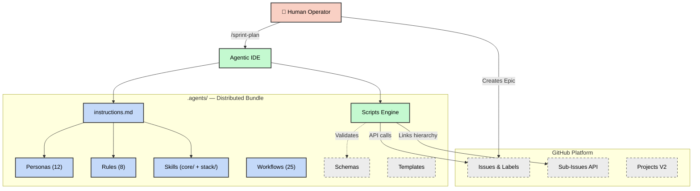
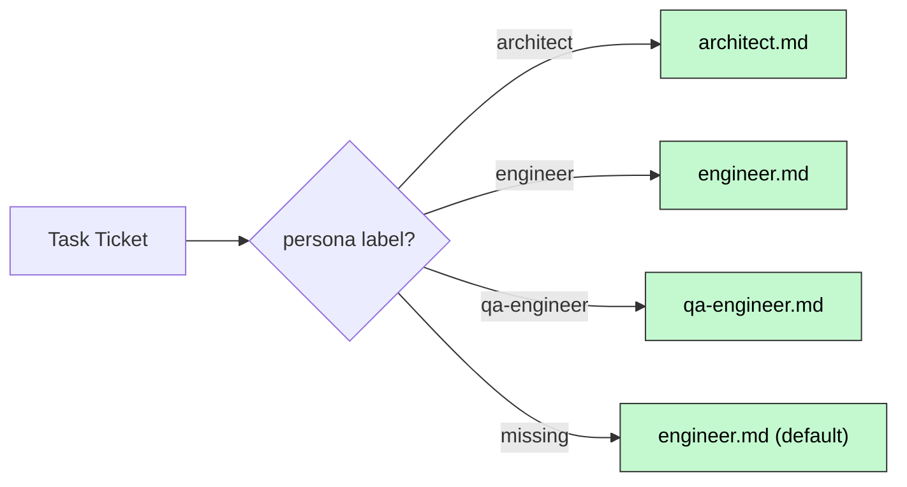
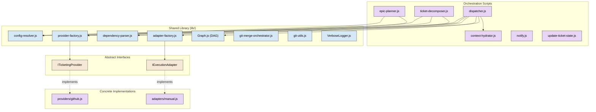
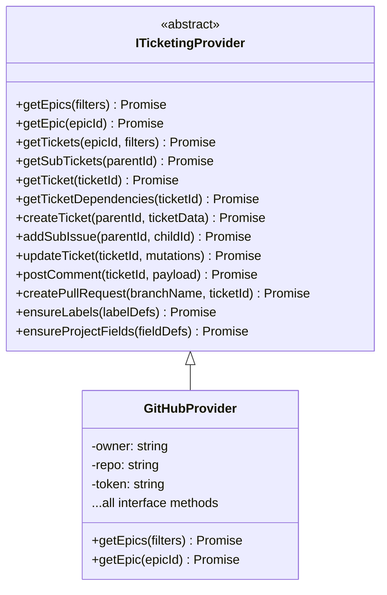
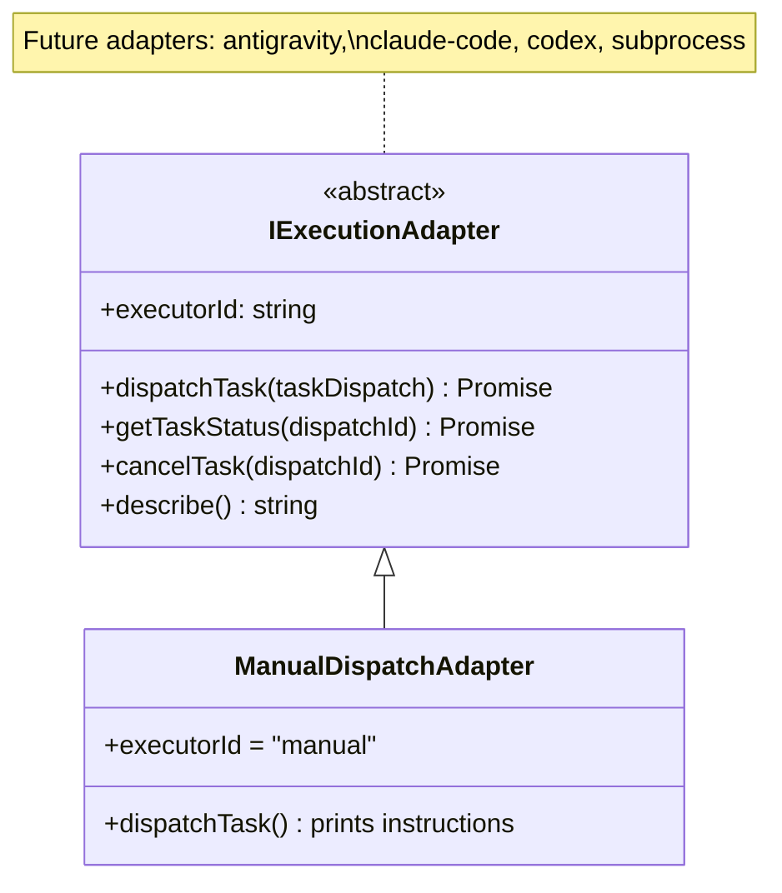
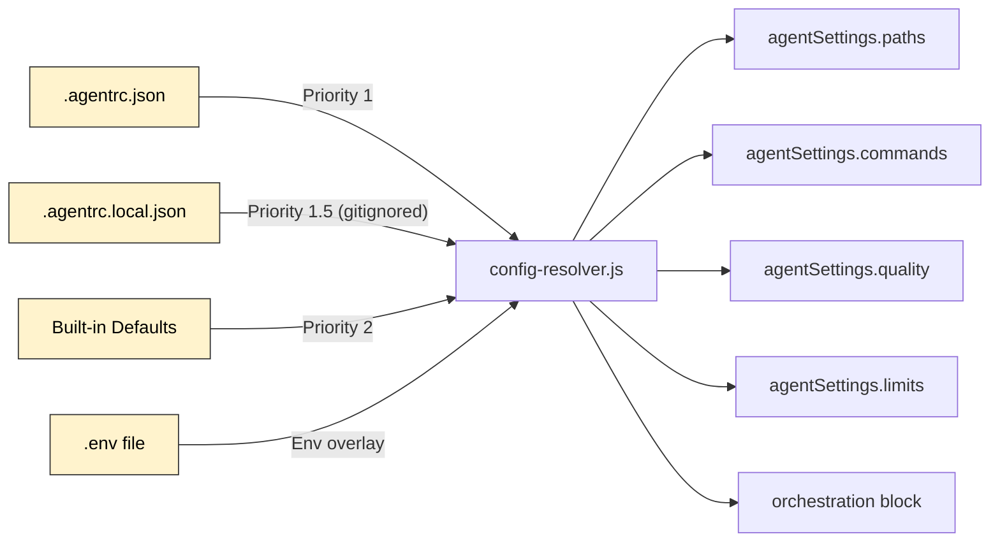
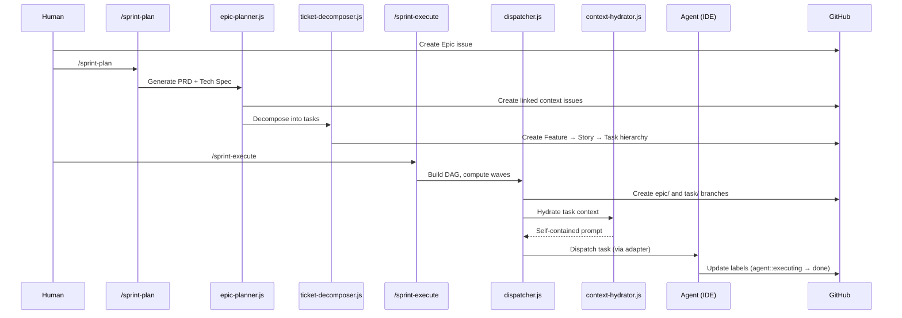
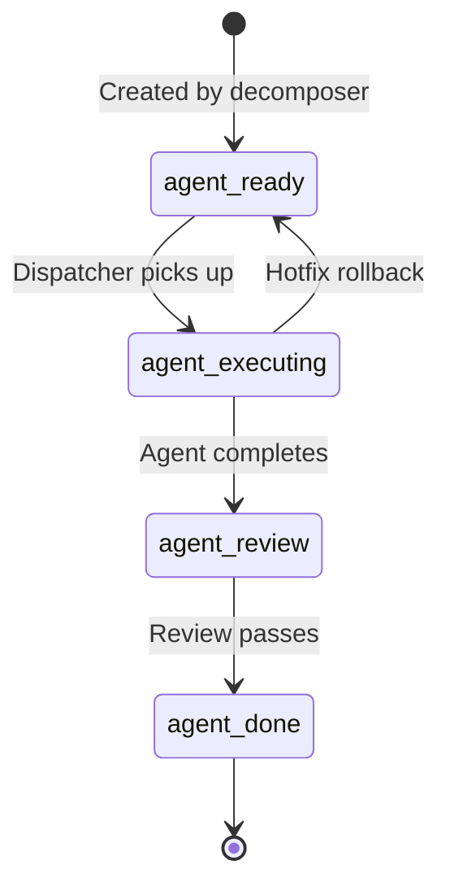

# Architecture

> **Version:** 5.30.0 · **Updated:** 2026-04-27
>
> **Epic #857 update.** `.agents/` bundle drift remediation: the
> `dispatch-manifest.json` schema gained `storyTitle`, `agentTelemetry`,
> and `type` discriminator fields, and dropped `heldForApproval`
> (BREAKING, framework-internal — replay confirmed it was always empty).
> `.agents/instructions.md` was realigned with the v5.29 runtime
> (`story-<id>` branches canonical, retired-MCP fallback gone,
> mandatory-docs sourced from `agentSettings.docsContextFiles`). The
> rule-as-SSOT pattern modeled by `gherkin-standards.md` is now applied
> to API, security, and testing layers — the rule files own the
> taxonomy; the corresponding skills slim to process + anchored links.
> A `docs/deprecation-register.md` and `tests/enforcement/` directory
> were introduced; new enforcement tests block `process.exit()` in
> library code and empty-reason `Logger.fatal()` calls.
>
> **Epic #773 update.** `orchestration` consolidated under
> `orchestration.runners` (the previously-flat `epicRunner`, `planRunner`,
> `concurrency`, `closeRetry` peers now group together);
> `config-resolver.js` split into a facade over `quality`, `paths`,
> `commands`, `limits`, and `runners` accessor submodules; two further
> facades shipped — `providers/github.js` and
> `lib/worktree/lifecycle-manager.js` each ≤250 LOC over focused
> submodules with strict ctx-threading discipline (no inter-submodule
> imports). All public surfaces remain byte-identical.

This document describes the internal architecture of Agent Protocols — a
framework of instructions, personas, skills, and SDLC workflows that govern AI
coding assistants. It is the authoritative reference for how the system is
structured, how components interact, and where to find each subsystem.

> **For the end-to-end workflow narrative** — how the commands compose,
> label transitions, HITL touchpoints, local-vs-remote comparison — see
> [`.agents/SDLC.md`](../.agents/SDLC.md). It is the canonical workflow
> doc as of v5.15.0; this file covers the *architecture* (modules,
> interfaces, data flow) that the workflow runs on top of. The slash-command
> reference index lives in [`workflows.md`](workflows.md).

---

## High-Level Overview

Agent Protocols follows an **Epic-Centric GitHub Orchestration** model where
GitHub Issues, Labels, and Projects V2 serve as the Single Source of Truth
(SSOT). The framework decomposes product initiatives (Epics) into executable
agent tasks, dispatches them across parallel waves, and integrates the results —
all without local state files.



---

## Repository Layout

The repository has a clear separation between the **distributed product**
(`.agents/`) and **development tooling** (root-level files).

```text
agent-protocols/
├── .agents/                  ← Distributed bundle (the "product")
│   ├── instructions.md       ← Primary system prompt (all agent rules)
│   ├── VERSION               ← Semantic version (currently 5.15.0)
│   ├── SDLC.md               ← Sprint pipeline user guide
│   ├── README.md             ← Consumer documentation
│   ├── default-agentrc.json  ← Default config template
│   │
│   ├── personas/             ← 12 role-specific behavior files
│   ├── rules/                ← 8 domain-agnostic coding standards
│   ├── skills/               ← Two-tier skill library
│   │   ├── core/             ←   20 universal process skills
│   │   └── stack/            ←   5 tech-stack categories
│   ├── workflows/            ← 25 SDLC slash-command workflows
│   ├── scripts/              ← Deterministic JavaScript tooling
│   │   ├── lib/              ←   Shared modules & interfaces
│   │   ├── providers/        ←   Ticketing provider implementations
│   │   └── adapters/         ←   Execution adapter implementations
│   ├── schemas/              ← JSON Schema for structured output
│   └── templates/            ← Prompt and planning templates
│
├── .agentrc.json             ← Runtime configuration (dogfooding)
├── .github/workflows/        ← CI/CD pipeline (ci.yml)
├── docs/                     ← Project documentation
├── tests/                    ← Framework test suite
│   └── lib/                  ←   Library-specific unit tests
├── temp/                     ← Ephemeral runtime artifacts (git-ignored)
├── biome.json                ← Biome linter/formatter config
├── package.json              ← npm tooling + dev dependencies
└── AGENTS.md                 ← Repository-level onboarding
```

---

## Core Subsystems

### 1. Instruction Layer

The instruction layer defines **what agents are** and **how they must behave**.

| Component     | Path                           | Purpose                                                                                                                                         |
| ------------- | ------------------------------ | ----------------------------------------------------------------------------------------------------------------------------------------------- |
| System Prompt | `.agents/instructions.md`      | Master behavioral contract — 10 sections covering guardrails, FinOps, shell protocol, philosophy, quality discipline, Git conventions, and more |
| Personas      | `.agents/personas/*.md`        | 12 role-specific constraint files (architect, engineer, qa-engineer, etc.) that override default behavior when activated                        |
| Rules         | `.agents/rules/*.md`           | 8 domain-agnostic coding standards (API conventions, git conventions, security baseline, testing, etc.)                                         |
| Skills        | `.agents/skills/{core,stack}/` | Two-tier library of callable capabilities                                                                                                       |

#### Persona Routing



#### Skill Architecture

Skills use a **two-tier layout**:

- **`core/`** — 20 universal, process-driven skills (debugging, TDD, security,
  code review, context engineering, etc.)
- **`stack/`** — Technology-specific skills organized by category:
  - `architecture/` — Monorepo strategies, system design
  - `backend/` — Server frameworks, API patterns
  - `frontend/` — UI frameworks, CSS systems
  - `qa/` — Testing frameworks (Playwright, Vitest)
  - `security/` — Hardening patterns

Each skill contains a `SKILL.md` file with constraints and an optional
`examples/` directory.

---

### 2. Orchestration Engine

The orchestration engine is the **runtime brain** — a set of JavaScript ESM
scripts that automate the entire SDLC from planning through integration.

#### Component Diagram



#### Key Scripts

| Script                   | Responsibility                                                                    |
| ------------------------ | --------------------------------------------------------------------------------- |
| `epic-planner.js`        | Synthesizes Epic body → generates PRD and Tech Spec tickets via LLM               |
| `ticket-decomposer.js`   | Recursively decomposes specs into Feature → Story → Task hierarchy                |
| `dispatcher.js`          | Builds dependency DAG, computes execution waves, dispatches tasks                 |
| `context-hydrator.js`    | Assembles self-contained prompts (protocol + persona + skills + hierarchy + task) |
| `update-ticket-state.js` | Syncs task status via GitHub labels (`agent::ready` → `agent::done`)              |
| `notify.js`              | Dispatches notifications via @mention and webhook channels                        |
| `health-monitor.js`      | Updates real-time sprint status and tool success rates in GitHub                  |

#### Dispatch Engine Submodules (v5.13.0+)

`lib/orchestration/dispatch-engine.js` is a ~200-LOC SDK coordinator that
composes six cohesive submodules. Consumers (`dispatcher.js`, tests) continue
to import `dispatch`,
`resolveAndDispatch`, `collectOpenStoryIds`, `detectEpicCompletion`, and
the `AGENT_*` / `RISK_HIGH_LABEL` / `TYPE_TASK_LABEL` constants from the
coordinator path — the split is an internal reorganisation only.

| Submodule                     | Responsibility                                                                          |
| ----------------------------- | --------------------------------------------------------------------------------------- |
| `dispatch-pipeline.js`        | Resolve context, fetch Epic, reconcile state, build DAG, scaffold branch, run worktree GC |
| `wave-dispatcher.js`          | `dispatchWave`, `dispatchNextWave`, per-task dispatch, `collectOpenStoryIds`             |
| `risk-gate-handler.js`        | Retired task-level `risk::high` runtime gate; risk labels are metadata only              |
| `health-check-service.js`     | Sprint Health issue ensure                                                               |
| `epic-lifecycle-detector.js`  | Epic-completion detection + bookend lifecycle fire                                       |
| `dispatch-logger.js`          | Shared lazy `VerboseLogger` proxy used by every submodule                                |

#### Presentation Layer Submodules (v5.13.0+)

`lib/presentation/manifest-renderer.js` is a ~175-LOC facade composing:

| Submodule                 | Responsibility                                                                       |
| ------------------------- | ------------------------------------------------------------------------------------ |
| `manifest-formatter.js`   | Pure Markdown / CLI rendering (`formatManifestMarkdown`, `printStoryDispatchTable`). No fs access. |
| `manifest-persistence.js` | File I/O — writes dispatch and story manifests to `temp/`.                           |

The data-shape owner (`lib/orchestration/manifest-builder.js`) is
unchanged. As with the worktree submodules, only the facade file is part
of the stable public surface — downstream consumers continue to import
`renderManifestMarkdown`, `renderStoryManifestMarkdown`, `persistManifest`,
`printStoryDispatchTable`, `postManifestEpicComment`, and
`postParkedFollowOnsComment` from `lib/presentation/manifest-renderer.js`.

#### Orchestration Context + ErrorJournal (v5.15.1 / Epic #380)

The epic-runner and plan-runner previously threaded a loosely-shaped
`opts` bag through every submodule — provider, logger, settings, and
ad-hoc flags mingled in the same object. Epic #380 replaced this with
explicit typed contexts:

| Context                 | Path                                              | Consumers                                                       |
| ----------------------- | ------------------------------------------------- | --------------------------------------------------------------- |
| `OrchestrationContext`  | `lib/orchestration/context.js`                    | Shared base — provider, settings, logger, `errorJournal`.       |
| `EpicRunnerContext`     | `lib/orchestration/context.js`                    | Every `epic-runner/*` submodule accepts `ctx` as first arg.     |
| `PlanRunnerContext`     | `lib/orchestration/context.js`                    | `epic-plan-spec.js` / `epic-plan-decompose.js` drivers.     |

The `errorJournal` field on each context is an `ErrorJournal` instance
(`lib/orchestration/error-journal.js`) that writes structured JSONL to
`temp/epic-<id>-errors.log`. Sites that previously did silent
`catch (err) { logger.warn(...) }` in `epic-runner.js`,
`blocker-handler.js`, and `bookend-chainer.js` now also call
`errorJournal?.record({ phase, error, context })` so the error surface
is auditable after a run completes. See
[`docs/patterns.md#orchestrationcontext-dependency-injection-v5151`](patterns.md#orchestrationcontext-dependency-injection-v5151)
for the pattern and the `errorJournal?.record(...)` idiom.

`lib/orchestration/epic-runner/progress-reporter.js` (also new in
v5.15.1 / #380) emits a periodic `epic-run-progress` structured
comment on the Epic, driven by
`orchestration.epicRunner.progressReportIntervalSec`.

#### Spawner hardening + whole-epic progress (v5.15.2 / Epic #413)

Three resilience layers were added around the runner's sub-agent
dispatch path so the Epic #380 spawn-failure regression class cannot
recur silently:

| Module                                                             | Role                                                                                                                                                  |
| ------------------------------------------------------------------ | ----------------------------------------------------------------------------------------------------------------------------------------------------- |
| `lib/orchestration/epic-runner/spawn-smoke-test.js`                | Pre-Wave-1 `claude --version` probe via the real `buildClaudeSpawn` shape; flips Epic to `agent::blocked` with friction comment if the probe fails.   |
| `lib/orchestration/epic-runner/commit-assertion.js`                | Post-wave guard — a "done" wave whose stories produced zero commits on `origin/story-<id>` is reclassified as `halted` instead of silently passing.   |
| `tests/epic-runner/build-claude-spawn.integration.test.js`         | Real cross-platform `claude --version` integration test; honours `CLAUDE_BIN` for stub-friendly CI; runs under the Node 22/24 matrix in `ci.yml`.     |

`progress-reporter.js` was extended in the same Epic with
`setPlan({ waves })`, called once at runner start. With a plan set,
each fire renders every wave + story (queued / in-flight / done /
blocked) with a `Wave` column rather than only the active wave —
operators can see overall epic progress at a glance. Mechanical
detectors live under `lib/orchestration/epic-runner/progress-signals/`
(`stalled-worktree.js`, `maintainability-drift.js`) and their bullets
appear in the Notable section of each snapshot. The runner CLI's
`defaultSpawn` and `defaultRunSkill` now honour
`orchestration.epicRunner.logsDir` (default `temp/epic-runner-logs/`)
so per-story logs land in the standard temp tree.

#### Observability & friction hardening (v5.15.3 / Epic #441)

Three modules close the observability gaps surfaced during Epic #413's
Wave 1:

| Module                                                             | Role                                                                                                                                               |
| ------------------------------------------------------------------ | -------------------------------------------------------------------------------------------------------------------------------------------------- |
| `lib/orchestration/epic-runner/column-sync.js` (patched #448)      | Dropped the unused `$issueId: Int!` GraphQL variable; removed the silent-swallow try/catch so missing project rows surface as friction, not `unknown`. |
| `lib/orchestration/friction-emitter.js` (new #450)                 | Rate-limited (`storyId` + marker hash, 60s cooldown) `friction` emitter wrapping `provider.postComment`.                                                |

`CommitAssertion`'s default git adapter now falls back to a
`resolves #<storyId>` grep on `origin/epic/<id>` when
`origin/story-<id>` has already been deleted by `sprint-story-close` —
closing the window where a successfully-merged Story was misreported
as a zero-delta failure.

#### Throughput & observability pass (v5.21.0 / Epic #553)

One primitive + one observability surface, adopted at every epic-runner
fanout:

| Module                                              | Role                                                                                                                                                                                                                                             |
| --------------------------------------------------- | ------------------------------------------------------------------------------------------------------------------------------------------------------------------------------------------------------------------------------------------------ |
| `lib/util/concurrent-map.js` (new)                  | `concurrentMap(items, fn, { concurrency })` bounded-concurrency fanout. Adopted in `sprint-wave-gate` (no cap), wave-end `commit-assertion` (cap 4), and `ProgressReporter` (cap 8).                                                             |
| `providers/github/cache-manager.js` (extended)      | `getTicket(id, { maxAgeMs })` treats entries older than the caller's max age as cache misses. The progress-reporter uses `{ maxAgeMs: 10_000 }` so repeat ticks inside the TTL serve from cache; `primeTicketCache` is called after every `getTickets(epicId)` sweep so downstream `getTicket` reads cost zero HTTP. |
| `lib/orchestration/epic-runner/state-poller.js` (extended) | Bulk `GET /issues?labels=agent::*&state=open` path replaces per-ticket probes when the tracked-story set is large. Malformed payloads or missing `labels` arrays fall back to the per-ticket path; out-of-scope issues in the bulk response are filtered against the tracked-story set. |
| `lib/util/phase-timer.js` + `phase-timer-state.js` (new) | Records `{ phase, elapsedMs }` spans across the `sprint-story-init` → spawned agent → `sprint-story-close` process boundaries via `snapshot` / `restore`. On close, posts a `phase-timings` structured comment on the Story ticket.              |
| `ProgressReporter.setPlan()` (extended)             | Reads closed-story `phase-timings` comments for the current Epic and renders **median / p95** per phase into the `epic-run-progress` comment so consumer projects can distinguish framework overhead from their own install/validation cost.    |

Additional framework-wide reductions landed in the same Epic:
`gh auth token` is memoized into `process.env.GITHUB_TOKEN` so
subsequent provider constructions short-circuit;
`manifest-formatter` content-hashes repeat renders to skip rebuild;
`scanDirectory` uses `withFileTypes` to avoid the per-entry `statSync`.
Windows worktree reap recovers from cwd-like removal failures and
always runs `git worktree prune` after `remove`.

#### Tunable concurrency caps (v5.23.0 / Epic #638)

The three `concurrentMap` adoption sites shipped in #553 are now
configurable via `orchestration.concurrency`, resolved from
`.agentrc.json` and threaded through `ctx.concurrency` by a small
resolver at `lib/orchestration/concurrency.js`:

| Key | Default | Semantics |
| --- | --- | --- |
| `waveGate` | `0` (uncapped) | `sprint-wave-gate` retains the v5.21.0 `Promise.all` fanout when omitted; a positive integer routes through `concurrentMap` with that cap. |
| `commitAssertion` | `4` | Wave-end `CommitAssertion.check` concurrent git-read cap. |
| `progressReporter` | `8` | Progress-reporter concurrent `provider.getTicket` cap. |

`resolveConcurrency(source)` reads either `orchestration.concurrency`
or a pre-narrowed concurrency sub-block, coerces per-field, and falls
back to `DEFAULT_CONCURRENCY` for missing or malformed values.
`createRuntimeContext({ orchestration })` and `OrchestrationContext`
both expose `ctx.concurrency`; `CommitAssertion` and `ProgressReporter`
read `ctx.concurrency.commitAssertion` / `.progressReporter` through
the epic-runner factory. Consumers tuning caps supply the CLI at
`.agents/scripts/aggregate-phase-timings.js` with Epic IDs; it reads
`phase-timings` structured comments across Stories, aggregates p50/p95
per phase, and prints recommended caps.

#### MCP server retired (Epic #702)

The framework previously shipped an `agent-protocols` stdio MCP server
exposing seven tools (`cascade_completion`, `dispatch_wave`,
`hydrate_context`, `post_structured_comment`, `run_audit_suite`,
`select_audits`, `transition_ticket_state`). That server is **gone** as
of Epic #702: every capability is preserved as a direct Node CLI under
`.agents/scripts/` (or inlined into `update-ticket-state.js`), and
`lib/orchestration/ticketing.js` remains the authoritative SDK for
runtime callers. Architectural consequence: there is no longer a
"parallel pathway" for orchestration — the SDK is the single
implementation surface, and `.mcp.json` is no longer consulted by any
framework code. Operators see the simplification at first-run time
(no MCP-server bootstrap step) and at secrets-resolution time
(`GITHUB_TOKEN` and `NOTIFICATION_WEBHOOK_URL` read only from
`process.env`). See `docs/CHANGELOG.md` for the retired-tool → CLI
mapping and the operator migration path.

---

### 3. Provider Abstraction Layer

All ticketing interactions are mediated through the **`ITicketingProvider`**
abstract interface, enabling future portability beyond GitHub.



**Resolution**: The `provider-factory.js` reads `orchestration.provider` from
`.agentrc.json` and instantiates the matching concrete class.

**Internal layout (post Epic #470)**: The `providers/github.js` façade is a
thin composition over focused modules under `providers/github/`:
`ticket-mapper.js` (REST/GraphQL payload → ticket shape), `graphql-builder.js`
(named query + mutation strings), `cache-manager.js` (per-instance ticket
cache backed by `lib/CacheLayer`), and `error-classifier.js` (GraphQL error →
category). The façade re-exports every symbol consumers previously imported,
so the split is source-compatible.

---

### 4. Execution Adapter Layer

The **`IExecutionAdapter`** interface separates _what to run_ (Dispatcher) from
_how to run it_ (Adapter), enabling pluggable agentic runtimes.



**Resolution**: The `adapter-factory.js` reads `orchestration.executor` from
`.agentrc.json` (default: `"manual"`).

---

### 4. Configuration System

Configuration follows a **layered resolution** pattern, with operational
settings organised into a **grouped contract** post-Epic #730:



The runtime AJV schemas in `lib/config-schema.js` and
`lib/config-settings-schema.js` are the source of truth; the static mirror at
`.agents/schemas/agentrc.schema.json` exists for editor tooling and human
readers, kept in sync by a drift test.

#### Key Configuration Sections

| Section                     | Purpose                                                              |
| --------------------------- | -------------------------------------------------------------------- |
| `agentSettings.paths`       | Required filesystem roots (`agentRoot`, `docsRoot`, `tempRoot`)      |
| `agentSettings.commands`    | Validate / lint / test / typecheck / build commands; `null` disables |
| `agentSettings.quality`     | Maintainability + CRAP + lint baselines and `prGate.checks`          |
| `agentSettings.limits`      | Resource ceilings + `friction.*` anti-thrashing thresholds           |
| `orchestration`             | Provider, GitHub block, worktree isolation, runners, retry tuning    |

Each grouped block is read through a typed accessor (`getPaths(config)`,
`getCommands(config)`, `getQuality(config)`, `getLimits(config)`) — there are
no flat-key reads anywhere in the resolver or its consumers.

> See [`docs/configuration.md`](configuration.md) for the canonical
> reader-facing reference: every key, default, and required-vs-optional flag,
> the root-dogfood-vs-distributed-template diff table, and baseline
> conventions (canonical `/baselines/` vs per-wave drift snapshots under
> `.agents/state/`). Project-specific technology context still lives in this
> file under the **Tech Stack** section — intentionally not in `.agentrc.json`.

**Security**: The config resolver blocks shell metacharacter injection
(`; & | \`` `` $()`) in all string values that flow into subprocesses, and the
schema enforces non-empty strings on every command field.

---

### 5. Dependency Graph Engine

The `Graph.js` module provides the mathematical foundation for task scheduling:

| Function                  | Algorithm                                  | Complexity |
| ------------------------- | ------------------------------------------ | ---------- |
| `buildGraph()`            | Adjacency list construction                | O(N)       |
| `detectCycle()`           | DFS 3-color cycle detection                | O(V+E)     |
| `assignLayers()`          | Memoized layer assignment                  | O(V+E)     |
| `computeWaves()`          | Layer-grouped wave partitioning            | O(V+E)     |
| `topologicalSort()`       | Kahn's algorithm (deterministic tie-break) | O(V+E)     |
| `transitiveReduction()`   | DFS-based edge pruning                     | O(V·(V+E)) |
| `autoSerializeOverlaps()` | Focus-area conflict serialization          | O(N²+V·E)  |
| `computeReachability()`   | Memoized DFS transitive closure            | O(V·(V+E)) |

The auto-serialization pass prevents file-level merge conflicts by injecting
synthetic dependency edges between tasks with overlapping `focusAreas`.

---

## Data Flow: Epic Lifecycle



---

## Epic Runner (remote orchestration)

The epic runner (`.agents/scripts/lib/orchestration/epic-runner.js`) composes
the existing orchestration primitives into an unattended execution loop.
Invoked via `/sprint-execute <epicId>` (Epic Mode) — either locally, or by
the GitHub remote trigger workflow `.github/workflows/epic-orchestrator.yml`
when an Epic is labelled `agent::dispatching`.

### State machine (Epic labels)

```
                    apply agent::dispatching
                   ┌───────────────────────────┐
                   │                           ▼
  (any state) ──► agent::dispatching ──► agent::executing
                                               │
                                               │ wave-N halts on blocker
                                               ▼
                                        agent::blocked  ──── operator flips back ───┐
                                               │                                    │
                                               │ ───────────────────────────────────┘
                                               ▼
                        final wave completes ──► agent::review
                                                    │
                                 epic::auto-close?  │
                               (snapshot at dispatch)
                                                    │ yes
                                                    ▼
                                               /sprint-close
                                          (auto-invokes helpers:
                                           epic-code-review.md,
                                           epic-retro.md)
                                                    │
                                                    ▼
                                               agent::done
```

### Submodules

| Module                | Role                                                                     |
| --------------------- | ------------------------------------------------------------------------ |
| `wave-scheduler`      | Iterates waves from `Graph.computeWaves()`; never spawns workers.        |
| `story-launcher`      | Fans out up to `concurrencyCap` `/sprint-execute <storyId>` sub-agents.  |
| `state-poller`        | Polls Epic + child-Story labels; emits blocker / cancel / closed events. |
| `checkpointer`        | Upserts the `epic-run-state` structured comment; handles resume.         |
| `blocker-handler`     | The sole runtime pause point; halts on `agent::blocked`, waits to resume.|
| `notification-hook`   | Fire-and-forget webhook; never blocks execution.                         |
| `bookend-chainer`     | Invokes `/sprint-close` on auto-close (which in turn auto-invokes the code-review + retro helpers). |
| `wave-observer`       | Emits `wave-N-start` / `wave-N-end` structured comments each boundary.   |
| `column-sync`         | Drives the Projects v2 Status column from agent:: labels (best-effort).  |

### HITL touchpoints

One runtime pause point — `agent::blocked` on the Epic. All other labels
(`risk::high`, `epic::auto-close`, `agent::dispatching`) are snapshots or
metadata; mid-run changes are ignored. Branch protection on `main`
replaces `risk::high` runtime gating for destructive-action containment.

---

## Ticket Hierarchy

The framework uses a 4-tier GitHub Issue hierarchy with label-based typing and
`blocked by #NNN` dependency wiring:

```text
Epic (type::epic)
├── PRD (context::prd)
├── Tech Spec (context::tech-spec)
├── Feature (type::feature)
│   ├── Story (type::story)
│   │   ├── Task (type::task)     ← Atomic agent work unit
│   │   │   ├── - [ ] subtask 1
│   │   │   └── - [ ] subtask 2
│   │   └── Task (type::task)
│   └── Story (type::story)
└── Feature (type::feature)
```

### State Machine

Each Task progresses through a label-driven state machine:



### Cascade Behavior

When a child ticket transitions to `agent::done`, `cascadeCompletion()` walks
upward through the hierarchy and closes parents whose children are all done.
The cascade is **not** uniform across tiers — the table below is the
authoritative contract:

| Parent tier                      | Auto-closes via cascade? | How it closes                                |
| -------------------------------- | ------------------------ | -------------------------------------------- |
| Story (`type::story`)            | Yes                      | Last Task → `agent::done` cascades.          |
| Feature (`type::feature`)        | Yes                      | Last Story → `agent::done` cascades.         |
| Epic (`type::epic`)              | **No** — cascade stops.  | `/sprint-close` only.                        |
| Planning (`context::prd`, `context::tech-spec`) | **No** — cascade stops.  | Operator close after Epic is finalized.      |

**Why Features auto-close but Epics and Planning don't.** A Feature is a
purely hierarchical grouping — no standalone branch, no merge step, no
release artefacts. When its last child Story closes, the Feature is complete
by definition; a manual Feature-close step would be pure ceremony. Operators
who need Feature-level acceptance-criteria verification should encode it in
the final child Story, not add a manual gate. Epics, by contrast, close via
`/sprint-close` which owns branch merges, version bumps, and release tags —
cascade must not pre-empt that machinery. Planning tickets (PRD, Tech Spec)
are narrative artefacts the operator closes once the Epic is finalized.

Implementation: [`.agents/scripts/lib/orchestration/ticketing.js`](../.agents/scripts/lib/orchestration/ticketing.js)
— `cascadeCompletion()` explicitly skips `type::epic`, `context::prd`, and
`context::tech-spec` parents; every other parent tier is eligible.

> **Pinned under Epic #511.** The exclusion list above was previously
> implicit — Features auto-closed because nothing stopped them, not because
> the behaviour had been decided. Epic #511 made the decision explicit (keep
> Feature auto-close, because a Feature carries no branch/merge/release
> machinery) and pinned it with a regression test so future refactors can't
> drift. The `fromState` lookup inside `transitionTicketState()` was
> reviewed at the same time: its try/catch is deliberate — a network flake
> reading the prior state label must not block a legitimate transition —
> and now emits a `debug`-level log instead of swallowing silently.

---

## Workflow System

The shipped slash commands (under `.agents/workflows/`) fall into six
categories — planning, execution, closure, audits, git operations, and
setup/meta. The canonical reference is [`workflows.md`](workflows.md); the
workflow narrative that wires them together lives in
[`.agents/SDLC.md`](../.agents/SDLC.md).

### Worktree Isolation (v5.7.0+)

When `orchestration.worktreeIsolation.enabled` is `true`, each dispatched
story runs inside its own `git worktree` at `.worktrees/story-<id>/`. The
main checkout's HEAD never moves during a parallel sprint; branch swaps,
staging operations, and reflog activity are isolated per-story.

The `WorktreeManager` (`.agents/scripts/lib/worktree-manager.js`) is the
single authority for worktree `ensure`/`reap`/`list`/`isSafeToRemove`/`gc`.
No other script may call `git worktree` directly. All git calls are
argv-based (no shell interpolation) and validate `storyId` / `branch`
before shelling out. `reap` only reaches `git worktree remove --force` after
its safety gate has already established the Story worktree is removable and
the plain remove path has exhausted Windows lock/cwd retry.

**Internal submodule layout (v5.13.0+).** `worktree-manager.js` is a
~220-LOC facade that composes four cohesive submodules under
`.agents/scripts/lib/worktree/`:

| Submodule                  | Responsibility                                                                                   |
| -------------------------- | ------------------------------------------------------------------------------------------------ |
| `lifecycle-manager.js`     | `ensure`, `reap`, `list`, `gc`, `prune`, `sweepStaleLocks`, Windows-lock-aware remove recovery   |
| `node-modules-strategy.js` | `applyNodeModulesStrategy` + `installDependencies` for `per-worktree` / `symlink` / `pnpm-store` |
| `bootstrapper.js`          | Bootstrap-file copy (`.env`), `.agents/` snapshot for submodule consumers, submodule-index scrub |
| `inspector.js`             | Pure porcelain parsing, path helpers (`samePath`, `storyIdFromPath`, `isInsideWorktree`), Windows path-length warnings |

The submodules are **internal implementation detail**. Downstream projects
must continue to import `WorktreeManager` from `lib/worktree-manager.js` —
the submodule paths are not part of the stable public surface.

Dispatcher integration:

- **Ensure before dispatch**: `dispatch()` calls `wm.ensure(storyId, branch)`
  and threads the resolved worktree path as `cwd` into
  `IExecutionAdapter.dispatchTask`. The `ManualDispatchAdapter` surfaces the
  path as a `cd "<path>"` instruction for the HITL operator.
- **Reap on merge**: `sprint-story-close` calls `wm.reap` after a
  successful merge. The reap refuses dirty trees and logs a warning.
- **GC on dispatch start**: `dispatch()` sweeps orphaned worktrees whose
  stories have no remaining live tasks. Refuses to delete unmerged branches.

Setting `orchestration.worktreeIsolation.enabled: false` (or omitting the
block) restores v5.5.1 single-tree behavior. The `assert-branch.js`
pre-commit guard and focus-area wave serialization remain in place as
defense-in-depth in both modes.

See [`worktree-lifecycle.md`](../.agents/workflows/worktree-lifecycle.md)
for the operator reference, node_modules strategies, Windows long-path
handling, and escape hatches.

### Execution-model modes (Epic #668, v5.24.0+)

`/sprint-execute` runs in two execution-model modes that share one codepath
and differ only in whether worktrees are created. The `resolveWorktreeEnabled`
function in `lib/config-resolver.js` selects the mode at startup based on
`AP_WORKTREE_ENABLED` and `CLAUDE_CODE_REMOTE` (precedence in
[`patterns.md`](patterns.md#worktree-off-mode-v5240)):

```text
┌──── Local-parallel (worktrees on, default) ─────┐  ┌──── Web-parallel (worktrees off, auto) ─────┐
│                                                  │  │                                              │
│  one machine, one clone of the repo              │  │  N web tabs, each its own sandboxed clone   │
│                                                  │  │                                              │
│  ┌─ main checkout ──────────────────────┐        │  │  ┌─ tab 1 (clone A) ─┐                      │
│  │                                       │        │  │  │  story-680        │                      │
│  │  HEAD never moves while waves run     │        │  │  │  branch HEAD      │                      │
│  │                                       │        │  │  └───────────────────┘                      │
│  │  ┌─ .worktrees/story-680/ ─┐         │        │  │  ┌─ tab 2 (clone B) ─┐                      │
│  │  │  story-680 branch HEAD  │         │        │  │  │  story-681        │                      │
│  │  └─────────────────────────┘         │        │  │  │  branch HEAD      │                      │
│  │  ┌─ .worktrees/story-681/ ─┐         │        │  │  └───────────────────┘                      │
│  │  │  story-681 branch HEAD  │         │        │  │  ┌─ tab 3 (clone C) ─┐                      │
│  │  └─────────────────────────┘         │        │  │  │  story-682        │                      │
│  └───────────────────────────────────────┘        │  │  │  branch HEAD      │                      │
│                                                  │  │  └───────────────────┘                      │
│  Concurrency primitive: git worktree             │  │  Concurrency primitive: separate clones      │
│  Coordination at close: filesystem lock          │  │  Coordination at close: bounded push retry   │
│  Operator launches: N IDE windows                │  │  Operator launches: N web tabs               │
└──────────────────────────────────────────────────┘  └──────────────────────────────────────────────┘
                            ▲                                         ▲
                            │                                         │
                            └────────── shared launch primitive ──────┘
                              operator picks Story id from /sprint-plan
                                  dispatch table, one session per id
```

Both modes share:

- The same `/sprint-execute` slash command and the same routing logic.
- The launch-time dependency guard (`runDispatchManifestGuard`) that refuses
  a story with unmerged blockers.
- Deterministic, operator-driven story assignment — `/sprint-execute` always
  takes an explicit Story id. The legacy claim-protocol pool mode was
  retired in story #909; there is no per-launch label race.
- The bounded retry on the epic-branch push (`lib/push-epic-retry.js`,
  configured by `orchestration.closeRetry`) so concurrent closes from
  separate clones converge cleanly.

They differ only in:

- **Filesystem layout.** Worktrees create `.worktrees/story-<id>/` siblings
  to the main checkout; web sessions write directly into the cloned
  workspace because the session is already isolated.
- **`node_modules` strategy.** `nodeModulesStrategy` runs only in
  worktree-on mode. Web sessions install once at the workspace root.
- **Path-length warnings.** Windows long-path warnings come from worktree
  paths — they don't fire on web (Linux) or in worktree-off mode generally.
- **GC scope.** `WorktreeManager.gc()` runs at dispatch start in worktree-on
  mode; in worktree-off mode it is a no-op.

---

## Security Architecture

### Input Validation

- **Shell injection protection**: `config-resolver.js` scans all config string
  values against a metacharacter regex (`/([;&|`]|\$\()/`) before they reach
  subprocess calls.
- **Branch name validation**: `dependency-parser.js` enforces safe branch
  component characters (alphanumeric, hyphens, underscores, dots, slashes).
- **Schema validation**: `orchestration` config is validated against an embedded
  JSON Schema via `ajv`.

### HITL pause point

The sole runtime pause is `agent::blocked` on the Epic. `risk::high` is
informational/planning metadata only — it ranks work in the dispatch table and
helps reviewers prioritize, but does not pause execution. The retired
`risk-gate-handler.js` is preserved in `decisions.md` for context.
`riskGates.heuristics` in `.agentrc.json` continues to drive the ranking
heuristics.

### Anti-Thrashing Protocol

The framework enforces two circuit breakers to prevent runaway cost:

- **Error Threshold** (`consecutiveErrorCount`, default 3): Stop after N
  consecutive tool errors.
- **Stagnation Threshold** (`stagnationStepCount`, default 5): Stop after N
  steps without file modifications.

---

## Observability

### Friction Telemetry

Operational difficulties are logged directly to GitHub Task tickets via
`diagnose-friction.js`. This captures tool failures, command errors, and
automation candidates as structured comments.

### Log Levels

`lib/Logger.js` is the single orchestrator logger. Level is selected via
`AGENT_LOG_LEVEL`:

- `silent`  — only `fatal` emits.
- `info`    — default. `info` / `warn` / `error` / `fatal` emit; `debug` is
  suppressed.
- `verbose` — all levels emit, including `debug` trace output. `debug` is
  accepted as a backward-compatible alias for `verbose`.

### Notification System

| Event               | Severity | Channel            |
| ------------------- | -------- | ------------------ |
| `task-complete`     | INFO     | GitHub @mention    |
| `feature-complete`  | INFO     | GitHub @mention    |
| `epic-complete`     | INFO     | @mention + webhook |
| `review-needed`     | ACTION   | @mention + webhook |
| `approval-required` | ACTION   | Webhook            |
| `blocked`           | ACTION   | Webhook            |

---

## Testing

The test suite uses the **Node.js native test runner** (`node --test`) with no
external test framework dependencies:

```text
tests/
├── bootstrap.test.js            ← Bootstrap script tests
├── config-orchestration.test.js ← Orchestration config validation
├── context-hydrator.test.js     ← Context assembly tests
├── diagnose-friction.test.js    ← Friction telemetry tests
├── dispatcher.test.js           ← Dispatch engine tests
├── epic-planner.test.js         ← Planning pipeline tests
├── execution-adapter.test.js    ← Adapter interface tests
├── notify.test.js               ← Notification system tests
├── provider-factory.test.js     ← Provider resolution tests
├── providers-github.test.js     ← GitHub provider tests
├── structure.test.js            ← File structure validation
├── ticket-decomposer.test.js   ← Decomposition pipeline tests
├── ticketing-provider.test.js   ← Provider interface tests
├── update-ticket-state.test.js  ← State sync tests
├── verify-prereqs.test.js       ← Prerequisite verification tests
└── lib/
    ├── config-resolver.test.js  ← Config resolver tests
    └── task-utils.test.js       ← Task utility tests
```

**Run**: `npm test` (invokes `node --test tests/*.test.js tests/lib/*.test.js`)

---

## CI/CD Pipeline

A single GitHub Actions workflow (`ci.yml`) runs on every push and PR:

1. **Lint** — Biome (JavaScript) + markdownlint (Markdown)
2. **Format Check** — Biome format verification
3. **Test** — Full test suite via `npm test`
4. **Maintainability Check** — `check-maintainability.js` no-regression gate
   on the per-file MI baseline.
5. **CRAP Check** — `check-crap.js` (per-method complexity × coverage risk).
   Diff-scoped on PRs (`--changed-since origin/<base_ref>`) so the gate stays
   fast on large diffs; full-repo scan on push-to-main so a regression in an
   untouched file cannot ride in alongside an unrelated PR. JSON report
   uploaded as the `crap-report` artifact.
6. **Baseline-refresh guardrail** — separate `pull_request`-only workflow
   (`.github/workflows/baseline-refresh-guardrail.yml`) that reads the **base
   branch** `.agentrc.json` via `git show origin/<base>:.agentrc.json`,
   re-runs `check-crap` with those values forced via `CRAP_NEW_METHOD_CEILING`
   / `CRAP_TOLERANCE` / `CRAP_REFRESH_TAG` env vars, and enforces that any PR
   touching `baselines/crap.json` or `baselines/maintainability.json` carries a
   commit whose subject starts with the configured `refreshTag` (default
   `baseline-refresh:`) and has a non-empty body. Baseline-only PRs receive
   the `review::baseline-refresh` label automatically.
7. **Dist Sync** — On merge to `main`, syncs `.agents/` to the `dist` branch
   for consumer submodule distribution.

### Quality-gate diagram

```
        ┌───────────────────────────────────────┐
local ▶ │ pre-push (.husky/pre-push):           │
        │   lint → format → MI → audit →        │
        │   test:coverage → check-crap          │
        └───────────────────┬───────────────────┘
                            │
        ┌───────────────────▼───────────────────┐
close ▶ │ close-validation DEFAULT_GATES:       │
        │   lint → test → biome format →        │
        │   check-maintainability → check-crap  │
        │   (each gate skips when SHA-keyed     │
        │    evidence still matches; #817)      │
        └───────────────────┬───────────────────┘
                            │
        ┌───────────────────▼───────────────────┐
CI    ▶ │ ci.yml:                               │
        │   lint+format → MI → test:coverage →  │
        │   check-crap → upload crap-report     │
        │ baseline-refresh-guardrail.yml:       │
        │   base-config → tag check →           │
        │   check-crap (CRAP_*=base) →          │
        │   review::baseline-refresh label      │
        └───────────────────────────────────────┘
```

### Evidence-aware gate caching (Epic #817, v5.28.0+)

Local close-validation, sprint-code-review, and sprint-close Phase 4 wrap
each gate in `evidence-gate.js`. On a successful run the wrapper records
`{ gateName, commitSha, commandConfigHash, timestamp }` in
`temp/validation-evidence-<scopeId>.json` (gitignored). Subsequent invocations
against the same `git rev-parse HEAD` and resolved command config skip in
milliseconds. `--no-evidence` forces a re-run; pre-push and CI ignore the
evidence file entirely so independent verification is never bypassed.

All three sites converge on the same `check-crap.js` binary and the same
`baselines/crap.json` artifact, so a regression caught at any one site fails
the gate identically at the others. The base-enforced re-run in the guardrail
workflow exists so a PR cannot simultaneously raise `newMethodCeiling` AND
ship a method over the base ceiling — the guardrail rejects it under
base-branch values regardless of what the PR-branch config says.

### Local Hooks

- **Husky** + **lint-staged**: Auto-lint and format staged `.md` files on commit

---

## FinOps Model

The framework implements an economic guardrail system for LLM cost management:

### Model Tiers

| Tier           | Models                                  | Use Case                             | Budget Allocation            |
| -------------- | --------------------------------------- | ------------------------------------ | ---------------------------- |
| **Architects** | Claude Opus 4.6, Gemini 3.1 Pro (High)  | Complex design, deep debugging       | 5-10% of tasks               |
| **Workhorses** | Claude Sonnet 4.6, Gemini 3.1 Pro (Low) | Standard features, API integration   | 20-30% of tasks              |
| **Sprinters**  | Gemini 3 Flash                          | Boilerplate, formatting, quick fixes | 60-80% of tasks, <10% budget |

### Budget Protocol

- **Soft Warning** at 80% of `maxTokenBudget` → user notification + webhook
- **Hard Stop** at 100% → execution halt, requires human override

---

## Distribution Model

Agent Protocols is distributed as a **Git submodule** via the `dist` branch:

```text
Consumer Project/
├── .agents/          ← Git submodule pointing to dist branch
│   ├── instructions.md
│   ├── personas/
│   ├── rules/
│   ├── skills/
│   ├── workflows/
│   ├── scripts/
│   └── ...
├── .agentrc.json     ← Project-specific configuration
└── ...
```

Consumers add the submodule, copy `default-agentrc.json` to their project root
as `.agentrc.json`, and configure their `orchestration` block. Project-specific
technology context lives in `docs/architecture.md` under the **Tech Stack**
section below — not in `.agentrc.json`.

---

## Tech Stack

This section is the authoritative reference for the technology choices the
agent should assume when working in this repository. Keep it **current**: the
agent reads this to decide how to write code, which commands to run, and which
conventions to follow.

> **Template note:** Downstream projects should maintain their own
> `## Tech Stack` section in their own `docs/architecture.md`. Agent Protocols
> does not ship a standalone template — this section doubles as the working
> example.

### Runtime & Language

- **Runtime:** Node.js (ESM, `"type": "module"` in `package.json`)
- **Language:** JavaScript with JSDoc for type hints (no TypeScript build step)
- **Package manager:** npm

### Tooling

- **Linter & formatter:** Biome (`@biomejs/biome`)
- **Markdown lint:** `markdownlint-cli`
- **Markdown format:** Prettier (markdown only)
- **Git hooks:** Husky + `lint-staged`
- **JSON Schema validation:** Ajv + `ajv-formats`
- **In-memory filesystem for tests:** `memfs`
- **Shell argv parsing:** `string-argv`
- **Complexity metrics:** `typhonjs-escomplex` (maintainability baseline
  enforcement)

### Testing

- **Framework:** Node.js native test runner (`node --test`)
- **Test file pattern:** `tests/**/*.test.js`
- **Coverage:** `node --experimental-test-coverage` with thresholds
  enforced in `npm run test:coverage` (lines 85, branches 70, functions 75)

### Key Scripts

- **Orchestration engine:** `.agents/scripts/lib/orchestration/` — dispatch,
  manifest build, story execution, context hydration, model-tier resolution
- **Ticketing provider abstraction:** `.agents/scripts/lib/ITicketingProvider.js`
  with a shipped GitHub implementation in `.agents/scripts/providers/github.js`
- **Execution adapter abstraction:** `.agents/scripts/lib/IExecutionAdapter.js`
  with a manual adapter in `.agents/scripts/adapters/manual.js`
- **Config resolution:** `.agents/scripts/lib/config-resolver.js` +
  `config-schema.js` (shell-metacharacter injection guards built in)

### Ticketing & CI

- **Ticketing provider:** GitHub (Issues, Labels, Projects V2, Sub-Issues API)
- **CI:** GitHub Actions
- **Distribution:** GitHub Releases (tagged from `main` by `/sprint-close`)

### Testing Contract (v5.11.0+)

Consumers of the framework follow a **pyramid-aware** testing contract defined
in `.agents/rules/testing-standards.md`. Every test belongs to exactly one of
three tiers and carries distinct scope, dependency, and assertion rules:

- **Unit** — pure logic, no I/O; assertions on return values and rendered
  output.
- **Contract** — API ↔ DB invariants and schema conformance; this is the sole
  correct home for HTTP status codes, response body shapes, and error-envelope
  assertions.
- **E2E / Acceptance** — `.feature` files authored against
  `.agents/rules/gherkin-standards.md` (the SSOT for the tag taxonomy and
  forbidden patterns) and executed via `/run-bdd-suite`, whose Cucumber
  HTML/JSON report is the canonical evidence artifact consumed by the
  `workflows/helpers/epic-testing.md` helper.

Stack skills `skills/stack/qa/gherkin-authoring` and `skills/stack/qa/playwright-bdd`
provide authoring guidance and runtime wiring respectively; neither redefines
the rule. Scripts in this repository do not themselves run `.feature` files —
they ship the contract that consumer projects implement.

### What the Agent Should **Not** Assume

- There is no monorepo tool (no Turborepo, no pnpm workspaces) — this is a
  single-package repository.
- There is no web, mobile, database, or auth layer — this repo is a framework
  of protocols and scripts, not an application.
- There is no TypeScript compilation step; do not add `tsc` invocations.
- There is no bundler; scripts are executed directly with `node`.
