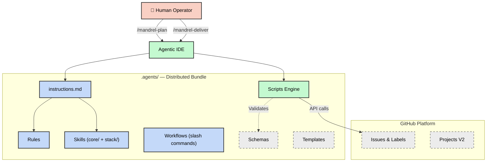
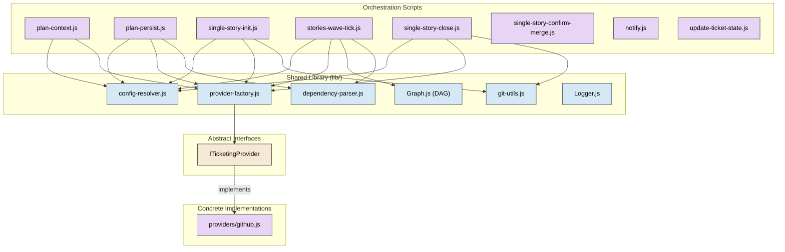
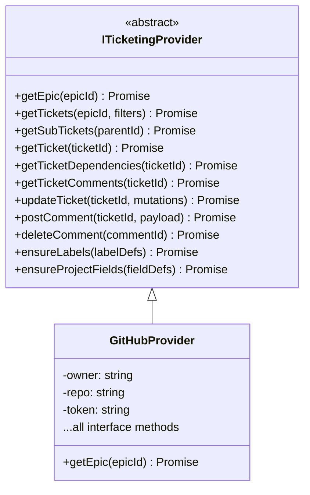
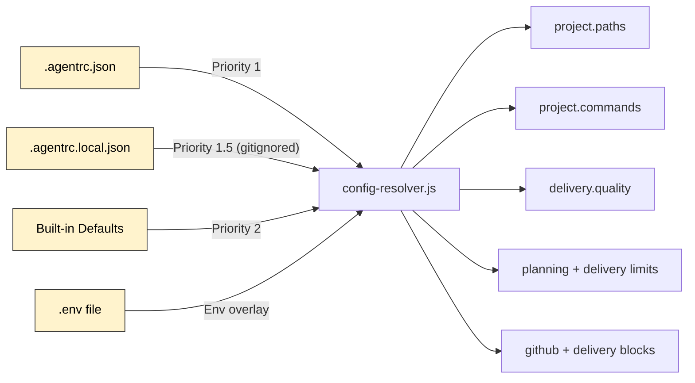
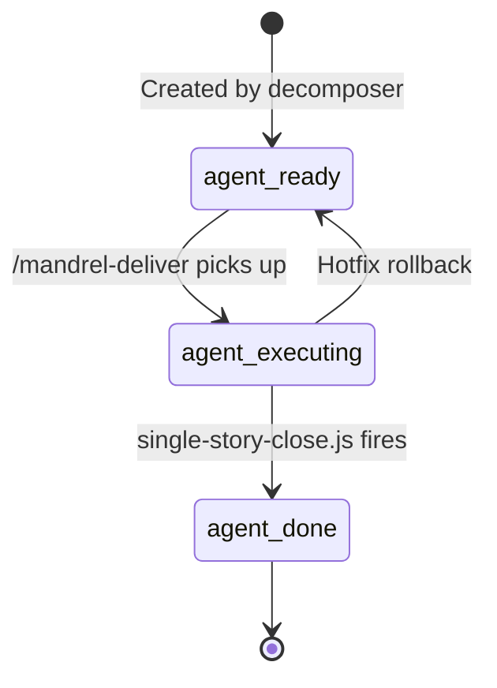

# Architecture

This document describes the internal architecture of Mandrel — a
framework of instructions, skills, rules, and SDLC workflows that govern AI
coding assistants. It is the authoritative reference for how the system is
structured, how components interact, and where to find each subsystem.

> **For the end-to-end workflow narrative** — how the commands compose, label
> transitions, HITL touchpoints — see [`.agents/docs/SDLC.md`](../.agents/docs/SDLC.md).
> This file covers the *architecture* (modules, interfaces, data flow) that
> the workflow runs on top of. The slash-command reference index lives in
> [`.agents/docs/workflows.md`](../.agents/docs/workflows.md).
>
> **Coupling stance.** Mandrel is a **Claude Code-first opinionated
> workflow framework**. The orchestration / `.agents/scripts/` library
> treats the **Story issue's body and structured comments** as the
> cross-runtime contract; the workflow / `.claude/` / hook / skill
> surface leans in on Claude Code as the in-session reference runtime.
> See ADR `20260512-coupling-stance` and the adapter-removal ADR in
> [`decisions.md`](decisions.md) for the rationale and what it
> explicitly is and isn't. For a file-level inventory of *where* that
> coupling actually lives — and what is deliberately not coupled — see
> [`claude-coupling-review.md`](claude-coupling-review.md).

---

## High-Level Overview

Mandrel follows a **Story-only GitHub Orchestration** model where
GitHub Issues, Labels, and Projects V2 serve as the Single Source of Truth
(SSOT). `/mandrel-plan` authors one or more `type::story` tickets; `/mandrel-deliver` runs
each Story on `story-<id>` → PR → `main` via `helpers/deliver-story`, with
optional `depends_on` edges ordering rare multi-Story runs — resolved
from live state, so they order Stories across plan runs and over time.
A `type::epic` issue is a **pure container**: a `## Goal` paragraph plus a
`- [ ] #N` child checklist, with no `## Spec`, no `acceptance[]` /
`verify[]`, and no `agent::*` label. `/mandrel-plan` Gate #3 creates or
adopts one; `/mandrel-deliver <epicId>` expands it to its open children and
delivers those; its board Status, assignee and closure are derived from
those children rather than labelled on it. The container is never branched,
never implemented and never delivered — **delivery is Story-only**, and the
retired `Epic: #N` body footer stays refused because linkage is
parent→child only.


```mermaid
graph TB
    classDef human fill:#f9d0c4,stroke:#333,stroke-width:2px,color:#000
    classDef agent fill:#c4f9d0,stroke:#333,stroke-width:2px,color:#000
    classDef infra fill:#c4d9f9,stroke:#333,stroke-width:2px,color:#000
    classDef data fill:#ececec,stroke:#333,stroke-width:1px,stroke-dasharray: 5 5,color:#000

    H["👤 Human Operator"]:::human
    IDE["Agentic IDE"]:::agent

    subgraph Framework [".agents/ — Distributed Bundle"]
        direction TB
        INS["instructions.md"]:::infra
        RUL["Rules"]:::infra
        SKL["Skills (core/ + stack/)"]:::infra
        WFL["Workflows (slash commands)"]:::infra
        SCR["Scripts Engine"]:::agent
        SCH["Schemas"]:::data
        TPL["Templates"]:::data
    end

    subgraph GitHub ["GitHub Platform"]
        direction TB
        ISS["Issues & Labels"]:::data
        PRJ["Projects V2"]:::data
    end

    H -->|"/mandrel-plan"| IDE
    H -->|"/mandrel-deliver"| IDE
    IDE --> INS
    INS --> RUL & SKL
    IDE --> SCR
    SCR -->|"API calls"| ISS
    SCR -.->|"Validates"| SCH
```

---

## Repository Layout

Directories marked *Distributed* below are the published package; everything
else is **dev tooling**. What ships, what is materialized into a consumer
tree, and how a release is cut are stated once, under
[**Distribution Model**](#distribution-model) — not repeated here.

```text
mandrel/
├── .agents/                  ← Distributed + materialized (the "product")
│   ├── instructions.md       ← Primary system prompt (all agent rules)
│   ├── README.md             ← Consumer documentation
│   ├── starter-agentrc.json ← Bootstrap delta-seed (copy to .agentrc.json)
│   │
│   ├── agents/               ← Role-scoped spawn boot contexts (optional)
│   ├── rules/                ← Domain-agnostic coding standards
│   ├── skills/               ← Two-tier skill library
│   │   ├── core/             ←   Universal process skills
│   │   └── stack/            ←   Tech-stack guardrails
│   ├── workflows/            ← Slash-command workflows
│   ├── scripts/              ← Deterministic JavaScript tooling
│   │   ├── lib/              ←   Shared modules & interfaces
│   │   └── providers/        ←   Ticketing provider implementations
│   ├── schemas/              ← JSON Schema for structured output
│   ├── templates/            ← Prompt and planning templates
│   └── docs/                 ← Shipped consumer reference docs
│       ├── SDLC.md           ←   End-to-end workflow guide
│       ├── configuration.md  ←   Every .agentrc.json key (shipped)
│       └── agentrc-reference.json ← Exhaustive editor reference
│
├── bin/                      ← Distributed: mandrel.js, postinstall.js
├── lib/                      ← Distributed: cli/ (subcommands) + migrations/
│
├── .agentrc.json             ← Runtime configuration (dogfooding)
├── .github/workflows/        ← CI/CD pipeline (ci.yml)
├── docs/                     ← Project documentation
├── tests/                    ← Framework test suite
│   └── lib/                  ←   Library-specific unit tests
├── temp/                     ← Ephemeral runtime artifacts (git-ignored)
├── biome.json                ← Biome linter/formatter config
├── package.json              ← npm tooling + dev dependencies
└── AGENTS.md                 ← Repository-level onboarding
```

---

## Core Subsystems

### 1. Instruction Layer

The instruction layer defines **what agents are** and **how they must behave**.

| Component     | Path                           | Purpose                                                                                                                                         |
| ------------- | ------------------------------ | ----------------------------------------------------------------------------------------------------------------------------------------------- |
| System Prompt | `.agents/instructions.md`      | Master behavioral contract — guardrails, FinOps, shell protocol, philosophy, quality discipline, Git conventions.                                |
| Rules         | `.agents/rules/*.md`           | Domain-agnostic coding standards (API conventions, git conventions, security baseline, testing, etc.).                                          |
| Skills        | `.agents/skills/{core,stack}/` | Two-tier library of callable capabilities.                                                                                                       |
| Role agents   | `.agents/agents/*.md`          | Optional role-scoped spawn boot contexts (`delivery.routing.roleScopedAgents`). No `persona::*` GitHub label axis.                              |

#### Skill Architecture

Skills use a **two-tier layout**:

- **`core/`** — Universal, process-driven skills (debugging, TDD, security,
  code review, context engineering, etc.)
- **`stack/`** — Technology-specific skills organized by category:
  - `architecture/` — Monorepo strategies, system design
  - `backend/` — Server frameworks, API patterns
  - `frontend/` — UI frameworks, CSS systems
  - `qa/` — Testing frameworks (Playwright, Vitest)
  - `security/` — Hardening patterns

Each skill contains a `SKILL.md` file with constraints and an optional
`examples/` directory.

---

### 2. Orchestration Engine

The orchestration engine is the **runtime brain** — a set of JavaScript ESM
scripts that automate the entire SDLC from planning through integration. The
operator-facing surface is two slash commands on the SDL critical
path — `/mandrel-plan` (with optional ideation entry) and `/mandrel-deliver`.
Planning is **git-state-free**: `/mandrel-plan` persists Stories directly to
GitHub via `plan-persist.js` — there is no plan-time artifact and no
branch is created at plan time.
`/mandrel-deliver` takes Story ids, resolves their dependency graph from live
state (`resolve-stories.js`), and its host LLM dispatches each ready
Story to a `helpers/deliver-story` sub-agent directly via the Agent tool
inside the operator's Claude session — a continuous ready-set model with
no wave barrier, no intermediate wave skill, no subprocess spawn pathway,
and no GitHub Actions runner. Each Story's own pull request
(`story-<id>` → squash + required checks) is the sole promotion gate to
`main`; the workflow never executes `git merge` against `main` itself.
The close path arms `gh pr merge --auto --squash --delete-branch`
(Story #3901); otherwise the operator merges via the GitHub UI.

#### Component Diagram


```mermaid
graph TB
    classDef script fill:#e8d5f5,stroke:#333,color:#000
    classDef lib fill:#d5e8f5,stroke:#333,color:#000
    classDef iface fill:#f5e8d5,stroke:#333,color:#000

    subgraph Scripts ["Orchestration Scripts"]
        EP["plan-context.js"]:::script
        TD["plan-persist.js"]:::script
        SSI["single-story-init.js"]:::script
        SWT["stories-wave-tick.js"]:::script
        SSC["single-story-close.js"]:::script
        SCM["single-story-confirm-merge.js"]:::script
        NO["notify.js"]:::script
        UTS["update-ticket-state.js"]:::script
    end

    subgraph Lib ["Shared Library (lib/)"]
        CR["config-resolver.js"]:::lib
        PF["provider-factory.js"]:::lib
        GH["Graph.js (DAG)"]:::lib
        DP["dependency-parser.js"]:::lib
        GU["git-utils.js"]:::lib
        LG["Logger.js"]:::lib
    end

    subgraph Interfaces ["Abstract Interfaces"]
        ITP["ITicketingProvider"]:::iface
    end

    subgraph Implementations ["Concrete Implementations"]
        GHP["providers/github.js"]:::script
    end

    SSI --> CR & PF & GU
    SWT --> CR & PF & GH & DP
    SSC --> CR & PF & GU
    EP --> CR & PF
    TD --> CR & PF & DP

    PF --> ITP
    ITP -.->|"implements"| GHP
```

#### Key Scripts

| Script                           | Responsibility                                                                                                                                                                              |
| -------------------------------- | ------------------------------------------------------------------------------------------------------------------------------------------------------------------------------------------- |
| `plan-context.js`                | Single authoring-envelope emitter for `/mandrel-plan`: Story brief + docs digest + duplicate search + clarity + rendered system prompts. |
| `plan-critics.js`                | Single critic-dispatch evaluation point for `/mandrel-plan`, run between Author and Persist: prints the consolidation + pre-mortem verdict as JSON (advisory — exits 0 on any verdict) and ledgers every skip. Exits 1 on a usage/IO error, where no critic ran and no skip was ledgered: do not proceed to Persist. |
| `plan-persist.js`                | Single GitHub-write surface for `/mandrel-plan`: section gate, ticket validator + file-assumption + DAG + budget gates, Story creation, terminal `agent::ready` flip, `plan-summary` comment. |
| `single-story-init.js`           | Validates a standalone Story, branches from `main`, creates the worktree, flips `agent::executing`. |
| `stories-wave-tick.js`           | Ready-set planner for multi-Story `/mandrel-deliver` (shared `planReadySet` core; default concurrency 3). |
| `single-story-close.js`          | Close-validation gate chain, opens PR to `main` with auto-merge armed, rests Story at `agent::closing`. |
| `single-story-confirm-merge.js`  | Post-merge confirmation: after checks go green and the PR merges, flips `agent::closing → agent::done`. |
| `update-ticket-state.js`         | Syncs ticket status via GitHub labels (`agent::ready` → `agent::done`). |
| `notify.js`                      | Dispatches notifications via @mention and webhook channels. |

#### In-process orchestration modules

| Module                                   | Role                                                                                                                                                              |
| ---------------------------------------- | ----------------------------------------------------------------------------------------------------------------------------------------------------------------- |
| `lib/orchestration/code-review.js`       | Inline review companion to `helpers/code-review.md`; persists results as a `code-review` structured comment. |
| `lib/orchestration/change-set.js`        | The **one** Story change-set enumerator (`computeChangeSet`): computed once per delivery and injected into ceremony routing, review depth, and every acceptance critic, so no consumer re-derives a different set. Total — an unenumerable diff yields `{ files: null }`. |
| `lib/duplicate-search.js`                | `/mandrel-plan` ideation entry — title + body keyword search across open Stories; returns a ranked list or `[]`. |
| `lib/orchestration/epic-container.js`    | The **one** description of a container Epic — the `## Goal` + child-checklist shape, rendered by `plan-persist` and read back by expansion, so the written and read shapes cannot drift. Companions: `epic-checklist.js` (surgical in-place child insertion on adoption, preserving ticked rows) and `epic-candidates.js` (ranks the open Epics a new plan could join, for Gate #3). |
| `lib/orchestration/epic-expansion.js`    | Turns a container-Epic id into the open Story ids under it, strictly before `resolve-stories.js` runs — so `/mandrel-deliver <epicId>` hands the Story-only engine an ordinary id list. |
| `lib/orchestration/epic-rollup.js`       | Derives the container's Projects v2 Status, assignee and closure from its children and writes them directly (the Epic never gains an `agent::*` label). Invoked from both per-Story lifecycle edges, so the rollup holds at N=1; Status recomputes both ways, closure is one-way, and every step degrades rather than throwing. |

#### Ready-set / DAG helpers

Multi-Story ordering for `/mandrel-deliver` uses `lib/wave-runner/ready-set.js`
(`planReadySet`) driven by `stories-wave-tick.js` — there is no
`dispatch-engine.js` / `dispatcher.js` entry script. Residual DAG helpers
under `lib/orchestration/` remain only where live paths still import them.

| Helper                        | Responsibility                                                                            |
| ----------------------------- | ----------------------------------------------------------------------------------------- |
| `lib/wave-runner/ready-set.js` | Select the next ready Story set given deps + concurrency. |
| `lib/wave-runner/live-probe.js` | State-probing adapter feeding the pure `planReadySet` kernel from live GitHub state (done / in-flight / foreign blockers) instead of caller-transcribed flags. |
| `dependency-parser.js`        | Parse `depends_on` / `blocked by #N` edges from Story bodies. |

#### Failure auditability

There is **no** `ErrorJournal` and no epic-runner progress reporter — do not
write `errorJournal?.record(...)`; nothing can inject it. Two file-based
surfaces carry failure auditability instead: the append-only signals stream
(`lib/observability/signals-writer.js`, written by `diagnose-friction.js`) and
the per-script logs under `temp/orchestration/`. Live Story progress surfaces
via lifecycle ledger events and structured comments (`story-init`, `friction`,
`verification-results`, `follow-ups`) posted by the single-story init/close
path. History:
[Failure auditability — what `ErrorJournal` was](archive/architecture-2026-08.md#failure-auditability--what-errorjournal-was).

#### Spec grounding (no codebase snapshot)

There is **no** pre-computed codebase snapshot. The codebase-snapshot module,
its authoring-grounding companion, and the spec-freshness helpers behind them
were deleted in Story #4811, along with the planning config block that tuned
them — do not reintroduce a manifest-derived replacement.

The post-mortem — why the snapshot grounded nothing it promised — is archived
at [Why the codebase snapshot was deleted](archive/architecture-2026-08.md#why-the-codebase-snapshot-was-deleted).

Two mechanisms ground spec authoring instead, both reading the real tree:

- **The author's own targeted retrieval.** The `/mandrel-plan` authoring step (host
  LLM, per [`workflows/mandrel-plan.md`](../.agents/workflows/mandrel-plan.md)) is a
  tool-bearing agent that reads the files it intends to cite, at the moment it
  cites them — the same digest-first reasoning that moved docs context to
  pull-on-demand in Story #4433. A pre-computed inventory is a second, staler
  answer to a question the author can ask directly.
- **The Phase 8 file-assumption gate.** `validateStoryFileAssumptions`
  (`lib/orchestration/file-assumptions.js`) probes every authored
  `{path, assumption}` pair against the working tree, wave-aware, as a hard
  error at persist time. It is ground truth, not a hint, and it is where a
  wrong path is actually caught.

#### Resilience layers

| Module                                              | Role                                                                                                                                                  |
| --------------------------------------------------- | ----------------------------------------------------------------------------------------------------------------------------------------------------- |
| `lib/orchestration/single-story-close/phases/confirm-merge.js` | The merge-confirmation wait — the default terminal step of every close. A Story is only reported landed when its PR is observably merged; a checks-aware, resumable poll classifies unlanded outcomes instead of assuming success. |
| `lib/observability/signals-writer.js`               | Append-only NDJSON writer for `friction` records under `temp/run-<eid>/stories/story-<sid>/signals.ndjson` (standalone Stories: `temp/standalone/stories/story-<sid>/`). The single producer for the telemetry pipeline; the reader is `forEachSignalStreamLine` in the same module. |
| `lib/orchestration/column-sync.js`                  | Drives the Projects v2 Status column from `agent::` labels (best-effort). Invoked from inside `transitionTicketState` (Story #2548) so every label flip mirrors onto the board.                  |

The guard against a Story being reported "done" without verifiable completion
is structural: `agent::done` follows the confirmed squash-merge of the Story's
own PR.

#### Throughput primitives

| Module                                                     | Role                                                                                                                                                 |
| ---------------------------------------------------------- | ---------------------------------------------------------------------------------------------------------------------------------------------------- |
| `lib/util/concurrent-map.js`                               | `concurrentMap(items, fn, { concurrency })` bounded-concurrency fanout. Adopters: `resolve-stories.js`, `providers/github/issues.js`, `providers/github/sub-issues.js`, `providers/github/blocked-by-add.js`, `lib/orchestration/ticketing/bulk.js`. |
| `providers/github/cache.js`                                | Per-instance ticket cache; `peekFresh(ticketId, maxAgeMs)` treats entries older than the caller's max age as cache misses, and the cache is primed after bulk ticket fetches.   |
| `providers/github/issues.js`                               | Bulk `GET /issues?labels=agent::*&state=open` path replaces per-ticket probes when the tracked-story set is large; per-ticket fallback on errors.    |

#### Concurrency caps

The fan-out cap is resolved deterministically by
`resolveConcurrencyCap` in `stories-wave-tick.js`
(from `delivery.deliverRunner.concurrencyCap`) and surfaced on the
ready-set envelopes the same script emits. Do not confuse it with the deleted
`resolveConcurrency`; the throughput surface it belonged to is archived at
[The epic-runner-era concurrency surface](archive/architecture-2026-08.md#the-epic-runner-era-concurrency-surface).

#### Direct CLIs (no MCP server)

The framework ships no MCP server. Every orchestration capability is a
direct Node CLI under `.agents/scripts/`, with `lib/orchestration/ticketing.js`
as the authoritative SDK for runtime callers. Operators see the simplification
at first-run time (no MCP-server bootstrap step) and at secrets-resolution
time (`GITHUB_TOKEN` and `NOTIFICATION_WEBHOOK_URL` read only from
`process.env`).

#### Lifecycle vs. Runtime partition boundary

Scripts in the Mandrel framework divide into two non-overlapping sets. The
partition is determined by **who invokes the script**:

| Partition     | Invocation context                                    | Resident path       |
| ------------- | ----------------------------------------------------- | ------------------- |
| **Lifecycle** | Human operators (CLI, one-time setup, consumer sync)  | `.agents/scripts/`  |
| **Runtime**   | Agent sessions, git hooks, CI pipelines               | `.agents/scripts/`  |

It is a boundary of **who invokes**, not of where the file lives: both sets
resolve under `.agents/scripts/`. `bin/` holds exactly two files
(`bin/mandrel.js`, the subcommand dispatcher, and `bin/postinstall.js`), with
the implementations in `lib/cli/`. The Epic #3435 plan to relocate the
lifecycle set into `bin/` was **not** carried out — `lib/cli/`'s `sync`,
`sync-commands`, and `sync-agents` delegate back into the engines below.

**Lifecycle scripts** are invoked only by human operators — never by agent
sessions, git hooks, or CI. Every one is still at `.agents/scripts/<name>`:

- `bootstrap.js` / `agents-bootstrap-github.js` — consumer and GitHub-side
  onboarding (via `mandrel init`)
- `sync-claude-commands.js` / `sync-claude-agents.js` — project
  `.agents/workflows/` and `.agents/agents/` into `.claude/commands/` and
  `.claude/agents/` (via `mandrel sync-commands` / `sync-agents`)
- `sync-agentrc.js` — merges `starter-agentrc.json` deltas into `.agentrc.json`
- `check-windows-git-perf.js` — one-time Windows git perf diagnostic
- `lib/bootstrap/*` — shared bootstrap helper modules

**Runtime orchestration scripts** are invoked by agent sessions, git hooks,
or CI pipelines and must remain at their `.agents/scripts/<name>` paths
(because agents and hooks resolve them via that stable path):

- `single-story-init.js`, `single-story-close.js`,
  `single-story-confirm-merge.js` — Story worktree + PR lifecycle
- `stories-wave-tick.js` — multi-Story ready-set sequencer (`/mandrel-deliver`)
- `update-ticket-state.js` — GitHub label transitions
- And all other scripts under `.agents/scripts/` not listed above

**The rule:** *lifecycle* = only ever invoked by a human at the terminal;
*runtime* = invoked by an agent session, git hook, or CI step via the
`.agents/scripts/<name>` path — moving one off that path breaks both. The
invariant test `tests/cli/partition.test.js` enforces it: `.claude/settings.json`'s
`UserPromptSubmit` hook must not call `sync-claude-commands.js` directly.

---

### 3. Provider Abstraction Layer

All ticketing interactions are mediated through the **`ITicketingProvider`**
abstract interface, enabling future portability beyond GitHub.


```mermaid
classDiagram
    class ITicketingProvider {
        <<abstract>>
        +getEpic(epicId) Promise
        +getTickets(epicId, filters) Promise
        +getSubTickets(parentId) Promise
        +getTicket(ticketId) Promise
        +getTicketDependencies(ticketId) Promise
        +getTicketComments(ticketId) Promise
        +updateTicket(ticketId, mutations) Promise
        +postComment(ticketId, payload) Promise
        +deleteComment(commentId) Promise
        +ensureLabels(labelDefs) Promise
        +ensureProjectFields(fieldDefs) Promise
    }

    class GitHubProvider {
        -owner: string
        -repo: string
        -token: string
        +getEpic(epicId) Promise
        ...all interface methods
    }

    ITicketingProvider <|-- GitHubProvider
```

**Resolution**: `provider-factory.js` instantiates `GitHubProvider` — the
only shipped concrete class. The post-reshape canonical config has no
provider-selector key; the factory's `PROVIDERS` map is the registry.

**Internal layout**: `provider-factory.js` is the canonical entrypoint for
obtaining a `GitHubProvider`; callers go through the factory rather than
constructing the class directly. `providers/github.js` is a thin composition
root over focused modules under `providers/github/` (tickets, sub-issues,
comments, labels, branch-protection, merge-methods, PRs, project-board, and
issues gateways). The barrel is **not** a single public re-export point: it
re-exports the `GitHubProvider` class plus the five error-classification
helpers (`classifyGithubError`, `extractErrorFields`, `isPermissionSignal`,
`isTransientByCodeOrMessage`, `isTransientStatus`) — the mapper, auth, and
sub-issue symbols were removed as dead exports in Story #3650 (Epic #3599). The
remaining `providers/github/*` helper modules (e.g. `blocked-by-add.js`,
`board-add.js`) are imported **directly** at their call sites, not through the
façade.

---

### 4. Execution Path

Mandrel runs Claude-Code-in-session: `/mandrel-deliver` fans out via the
`Agent` tool over the ready set of Story sub-agents, each driving the
per-Story implementation loop directly from the Story worktree. There is
no separate adapter abstraction and no dispatch-time artifact: the
auditable record of a dispatch is the Story's own GitHub surface —
`agent::*` labels, structured comments, the lifecycle ledger under
`temp/`, and the `story-<id>` PR. Any future host that wants to replay
or audit a Mandrel run consumes that live state, not an in-process
interface.

See the adapter-removal ADR in [`decisions.md`](decisions.md)
(Epic #2646) for the rationale; the deletion landed as a hard cutover
with no shim layer, per the policy codified there.

---

### 5. Configuration System

Configuration follows a **layered resolution** pattern with operational
settings organised into a **grouped contract**. Optional `.agentrc.local.json`
(gitignored) deep-merges on top of `.agentrc.json`; built-in defaults fill any
remaining gaps. Absent local file is a no-op.


```mermaid
graph LR
    classDef cfg fill:#fff3cd,stroke:#333,color:#000

    A[".agentrc.json"]:::cfg -->|"Priority 1"| R["config-resolver.js"]
    L[".agentrc.local.json"]:::cfg -->|"Priority 1.5 (gitignored)"| R
    B["Built-in Defaults"]:::cfg -->|"Priority 2"| R
    C[".env file"]:::cfg -->|"Env overlay"| R
    R --> P["project.paths"]
    R --> CMD["project.commands"]
    R --> Q["delivery.quality"]
    R --> LM["planning + delivery limits"]
    R --> O["github + delivery blocks"]
```

The runtime AJV schemas in `lib/config-schema.js` and
`lib/config-settings-schema.js` are the source of truth; the static mirror at
`.agents/schemas/agentrc.schema.json` exists for editor tooling and human
readers, kept in sync by a drift test.

#### Key Configuration Sections

| Section                  | Purpose                                                                |
| ------------------------ | ---------------------------------------------------------------------- |
| `project.paths`          | Required filesystem roots (`agentRoot`, `docsRoot`, `tempRoot`).        |
| `project.commands`       | Validate / lint / test / typecheck / build commands; `null` disables.  |
| `delivery.quality`       | Maintainability + CRAP + lint baselines and gate configuration.         |
| `delivery.execution` | Resource ceilings (per-process execution timeout). Planner-context size is bounded by the fixed `PLAN_CONTEXT_ENVELOPE_BYTE_CEILING`, not a config knob; the assignee-as-lease TTL was deleted in Story #5006. |
| `github` + `delivery`    | GitHub provider config, worktree isolation, deliver-runner tuning.      |

Each grouped block is read through a typed accessor (`getPaths(config)`,
`getCommands(config)`, `getQuality(config)`, `getLimits(config)`) — there are
no flat-key reads anywhere in the resolver or its consumers.

> See [`.agents/docs/configuration.md`](../.agents/docs/configuration.md) for the canonical
> reader-facing reference: every key, default, and required-vs-optional flag,
> the root-dogfood-vs-distributed-template diff table, and baseline
> conventions (canonical `/baselines/` vs per-wave drift snapshots under
> `.agents/state/`). Project-specific technology context lives under the
> **Tech Stack** section below — intentionally not in `.agentrc.json`.

**Security**: The config resolver blocks shell metacharacter injection
(`; & | \`` `` $()`) in all string values that flow into subprocesses, and the
schema enforces non-empty strings on every command field.

---

### 6. Dependency Graph Engine

The `Graph.js` module provides the mathematical foundation for task scheduling:

| Function                  | Algorithm                                  | Complexity |
| ------------------------- | ------------------------------------------ | ---------- |
| `buildGraph()`            | Adjacency list construction                | O(N)       |
| `detectCycle()`           | DFS 3-color cycle detection                | O(V+E)     |
| `assignLayers()`          | Memoized layer assignment                  | O(V+E)     |
| `computeWaves()`          | Layer-grouped wave partitioning            | O(V+E)     |
| `topologicalSort()`       | Kahn's algorithm (deterministic tie-break) | O(V+E)     |
| `transitiveReduction()`   | DFS-based edge pruning                     | O(V·(V+E)) |
| `computeReachability()`   | Memoized DFS transitive closure            | O(V·(V+E)) |
| `computeChatDependencies()` | Session-level edge rollup + reduction    | O(V+E)     |

That is the complete live export surface — in particular there is **no**
`autoSerializeOverlaps()`. The focus-area auto-serialization pass it named is
gone; its job now happens at *selection* time via `storiesOverlap()` in
`lib/wave-runner/ready-set.js`, where `planReadySet` skips a Story whose
**widened** footprint overlaps an already-selected peer, or which shares a
**concrete** path with a Story still **in flight** from an earlier beat. What
counts as a footprint — declared paths, scraped evidence, and the three token
sources the scrape excludes — lives one layer down in
`lib/wave-runner/footprint.js`, so the scheduler schedules and the footprint
layer owns what counts as evidence. The cross-beat half needs the in-flight
Stories' records, which only probe mode holds: `live-probe.js` returns them as
`inFlightRecords`, and the tick reports each withholding in the envelope's
`inFlightReservation` naming the blocking id and why; beat-local skips are
reported alongside in `footprintGuard`. Flag mode carries a count and no
records, so it reports `available: false` rather than an indistinguishable
empty result. The two halves treat unknown width differently on purpose —
§ Scheduler safety mechanics.

---

## Data Flow: Story Lifecycle

```mermaid
sequenceDiagram
    participant H as Human
    participant P as /mandrel-plan
    participant EP as plan-context.js
    participant TD as plan-persist.js
    participant D as /mandrel-deliver
    participant DS as helpers/deliver-story
    participant A as Agent (IDE)
    participant GH as GitHub

    H->>P: /mandrel-plan (seed / seed-file / tickets)
    P->>EP: Emit the authoring envelope (all GitHub reads)
    P->>P: Author Story body (+ optional N>1 siblings)
    P->>TD: Persist (all gates, all GitHub writes)
    TD->>GH: Create type::story issue(s) + optional container type::epic

    H->>D: /mandrel-deliver <storyId...>
    D->>DS: story-<id> from main (no epic/<id> branch)
    DS->>GH: Init worktree / branch; implement; close-validation
    DS->>A: Story delivery (Agent-tool sub-agent when fanned out)
    A->>GH: Labels agent::ready → executing → closing
    DS->>GH: Open PR to main; arm auto-merge when clean
    H->>GH: Required checks + squash → agent::done
```

There is no Epic wave loop, no `epic/<id>` integration branch, and no
`--no-ff` wave merges. See
[`workflows/mandrel-deliver.md`](../.agents/workflows/mandrel-deliver.md) and
[`.agents/docs/SDLC.md`](../.agents/docs/SDLC.md).

---

## Deliver Runner

The `/mandrel-deliver <storyId...>` slash command is the sole entry point for Story
delivery. It runs end-to-end inside the operator's Claude session, composing the
orchestration primitives into a Story-sequencing coordinator (see
[`workflows/mandrel-deliver.md`](../.agents/workflows/mandrel-deliver.md)). There is no
remote-trigger surface and no deliver-runner CLI — delivery only ever runs
locally, in the operator's session, with Story sub-agents launched through the
Agent tool.

**Side effects are direct calls, not events.** Epic #2172 routed phase
transitions through a typed lifecycle bus with a fixed listener roster; the
Story-only cutover moved every one of those side effects into the close path
itself (`helpers/deliver-story` / `single-story-close.js`), and Story #5024
retired the emptied bus. What survives is a narrow append-only ledger: two
merge-terminal events written directly by `appendLedgerEvent`. See
[`LIFECYCLE.md`](LIFECYCLE.md) for the ledger contract, its two-event taxonomy,
and the record format.

### Sub-agent topology

A `/mandrel-deliver` run is a three-level agent tree; everything else on the
close path (code review, audit lenses, gates) runs in-process or as
deterministic CLIs, not as sub-agents:

- **Depth 0 — host orchestrator.** The operator's session executing
  [`workflows/mandrel-deliver.md`](../.agents/workflows/mandrel-deliver.md). It loops
  `stories-wave-tick.js` per beat and dispatches each `ready` id; it
  performs no git or label mutation itself.
- **Depth 1 — `story-worker`** (one per ready Story, parallel up to
  `concurrencyCap`). When `delivery.routing.roleScopedAgents` is enabled
  (the default) the spawn uses the role-scoped boot context at
  [`.agents/agents/story-worker.md`](../.agents/agents/story-worker.md)
  — its own system prompt with no CLAUDE.md / `instructions.md` closure,
  re-importing only `rules/security-baseline.md`; with routing off it
  falls back to a generic sub-agent carrying the full closure.
- **Depth 2 — `acceptance-critic`** (maker-blind, per AC-cluster). Spawned
  from Step 1a of `helpers/deliver-story` only for clusters the ceremony
  router resolves to `fresh` (see below). Requires nested Agent dispatch
  (verified depth 2); where nesting is unavailable the critic is authored
  inline — same gate, schema, and round cap, weaker isolation.

**Ceremony routing (fresh vs. inline).** `resolveCeremonyForRisk`
(`lib/orchestration/ceremony-routing.js`) routes each acceptance-criteria
cluster: profile `minimal` → always inline, `strict` → always fresh, and
the default `standard` routes by the same `deriveChangeLevel` signal that
sets review depth — sensitive-path (`high`) clusters go fresh, `low`
clusters stay inline except for a deterministic sampling floor
(`freshCriticSampleRate`, default 0.2), and an unknown level fails safe
to fresh. The cluster count is owned by the dispatching caller and handed
to the router as an input; routing never changes it.

**Evidence share.** A fresh critic re-runs the Story's `verify[]`
commands itself as required evidence; its byte-identical `lint` /
`typecheck` runs go through `evidence-gate.js --standalone` so close can
short-circuit those two gates at unchanged HEAD. Coverage and CRAP
evidence are deliberately excluded from the share and always re-run at
close.

### State machine (Story labels)

```text
        /mandrel-plan persist creates the Story with type::story
                              (agent::ready once planning completes)
                                       │
                                       │ operator runs /mandrel-deliver <storyId>
                                       ▼
                              agent::executing  ◄── helpers/deliver-story
                                       │              (implement → gates →
                                       │               review → acceptance)
                                       │ stall / unmet AC / critical finding
                                       ▼
                              agent::blocked  ──── operator flips back ───┐
                                       │                                  │
                                       └─────────────────────────────────┘
                                       │ close opens PR to main;
                                       │ clean run arms auto-merge
                                       │ (gh pr merge --auto --squash);
                                       │ otherwise the operator merges
                                       │ via the GitHub UI
                                       ▼
                              agent::closing  ◄── PR open / auto-merge armed
                                       │
                                       │ required checks + squash land
                                       ▼
                              agent::done  ◄── single-story-confirm-merge
                                                (no GitHub Action required)
```

### Submodules

| Module              | Role                                                                                                |
| ------------------- | --------------------------------------------------------------------------------------------------- |
| `stories-wave-tick` | Continuous ready-set planner for multi-Story `/mandrel-deliver` — adapter over `planReadySet`; emits the per-beat dispatch set (no Epic wave barrier). |
| (host fan-out)      | There is no `story-launcher` module: the `/mandrel-deliver` host session itself fans out up to `concurrencyCap` Story sub-agents per ready-set beat, per [`workflows/mandrel-deliver.md`](../.agents/workflows/mandrel-deliver.md). |
| `notification-hook` | Fire-and-forget webhook; never blocks execution.                                                    |
| `column-sync`       | Drives the Projects v2 Status column from `agent::` labels (best-effort).                           |
| `code-review`       | `lib/orchestration/code-review.js` — inline review (companion to `helpers/code-review.md`). |
| `run-epilogue`      | Cross-Story epilogue for rare N>1 runs (`plan-run-epilogue.js` / `lib/orchestration/run-epilogue.js`). |

`agent::blocked` is the sole runtime pause point, enforced by the workflow
prose rather than a resident listener.

### Change-set-matched audit lenses

During the review/audit ceremony, `/mandrel-deliver` resolves audit lenses inline with
the Story review path. `plan-run-epilogue` / the Story close path call the
audit-suite `selectAudits` SDK: it selects the audit lenses whose file patterns
or keyword triggers match the change-set. Findings feed a bounded auto-fix loop.
There is no audit-suite CLI.

Lens selection is **not** risk-routed — there is no risk→lens router. What the
sensitive-path classes in `audit-rules.json` route is review **depth** (`light`
/ `standard` / `deep`, via `review-depth.js#deriveChangeLevel`), derived from
the diff rather than from a planner's self-assessment. Removal notes:
[Deleted listeners, CLIs and the heartbeat emitter](archive/architecture-2026-08.md#deleted-listeners-clis-and-the-heartbeat-emitter).

### HITL touchpoints

One runtime pause point — `agent::blocked` on the Story. `risk::high` is
metadata; mid-run changes are ignored. Branch protection on `main` (set up
during `node .agents/scripts/bootstrap.js`) is the load-bearing destructive-action
guard on the promotion path: each Story PR merges either via the close-time
auto-merge gate (armed only when the clean-run predicate passes — zero
manual interventions, zero 🔴/🟠 review findings;
Story #3901) or via the operator's GitHub-UI merge on the fallback path.
Either way, required status checks gate the squash onto `main`.

### Per-Story acceptance self-eval

Inside each Story delivery (`helpers/deliver-story` Step 1a), a bounded
**acceptance self-eval** loop runs after the implementation commits land and
before the Story proceeds to close. Each acceptance-criteria cluster is
scored either by a **fresh-context critic** sub-agent — independent of
the implementing turn — or inline, per the ceremony routing described
under **Sub-agent topology** above; the critic scores the change set its
caller computed once via `change-set.js` and injected — it must not
re-derive one (Story #4593) — against each inline `acceptance[]` item,
using `verify[]` as evidence, and `acceptance-eval.js` records the
per-criterion verdict.
On `proceed` the Story flips to `closing`; unmet criteria trigger a
redraft round, bounded by `delivery.acceptanceEval.maxRounds`
(default 2, clamped into `[1, hard ceiling]` — the loop cannot be
disabled). If the round cap is reached with criteria still unmet, the
Story escalates: `agent::blocked`, a `friction` comment naming the unmet
criteria, and a non-zero exit. The single prose home for the mechanic is
[`helpers/acceptance-self-eval.md`](../.agents/workflows/helpers/acceptance-self-eval.md).

### Multi-Story delivery (no Epic wave)

Stories are the only thing `/mandrel-deliver` ever delivers; a container
`<epicId>` is accepted only as shorthand, expanded to its open children
before resolution, and an `Epic: #N` body footer on a Story is still refused.
`/mandrel-deliver <id> [<id>...]` routes them through
[`helpers/deliver-story.md`](../.agents/workflows/helpers/deliver-story.md),
building a dependency-aware plan and running one Story delivery worker per ready
Story. The script surface is:

| Script                         | Responsibility                                                                                                   |
| ------------------------------ | ----------------------------------------------------------------------------------------------------------------- |
| `single-story-init.js`         | Validates the standalone Story, branches directly from `main` (no `epic/<id>` seed, no dispatch-manifest gate).   |
| `stories-wave-tick.js`         | Continuous ready-set planner for the standalone fan-out — a thin adapter over the shared `planReadySet` core; emits the per-beat dispatch set on the `stories-ready-set` envelope and resolves the global `concurrencyCap` (default 3). |
| `single-story-close.js`        | Runs the canonical close-validation gate chain against the base branch, opens the PR straight to `main` with auto-merge armed, and rests the Story at `agent::closing`. |
| `single-story-confirm-merge.js` | Post-merge confirmation: once `gh pr checks --watch` exits green and the PR merges, flips `agent::closing → agent::done` and closes the issue. |

The exit contract: each Story reaches `main` via its own human-visible PR
(auto-merge armed at close), and the deferred confirm-merge step — not an
in-script merge — performs the terminal label flip after GitHub's
asynchronous auto-merge completes.

### Scheduler safety mechanics

The per-beat selector (`lib/wave-runner/ready-set.js#planReadySet`) is
stateless and side-effect-free; these guards make the loop fail safe:

- **File-overlap footprint guard.** Candidates are admitted greedily in
  ascending-id order and skipped when their **widened** footprint — the
  declared `files` plus the paths the Story's own title and body name,
  a declaration being only a lower bound (#4875) — collides. An
  **empty** footprint means "no known overlap" and is never withheld.
  Together with the declared `depends_on` edges this is the **whole** of
  `/mandrel-deliver`'s serialization authority: the edges order what the plan
  knew, the guard catches what it did not.
- **The widening reads edit intent, not machine text** (#5044,
  `lib/wave-runner/footprint.js`). Three token sources are excluded
  before the scrape, each structurally incapable of naming an edit
  target: `audit-fingerprints` / `audit-semantic-keys` provenance
  footers, paths under `project.paths.tempRoot`, and markdown-link URL
  interiors. The strip is surgical — a blanket HTML-comment strip would
  swallow a `<!-- DECOMPOSITION -->` block, whose paths are genuine
  intent (`instructions.md` § 7). Before it, the sweep-wide provenance
  union `plan-persist` stamps made every pair of an audit-derived plan
  collide (10/10 measured; 0/10 after).
- **Beat-local and cross-beat differ.** Against a peer admitted **this
  beat**, a **glob** — or the UNKNOWN sentinel `resolve-stories.js`
  substitutes for an unparseable body — overlaps *everything*: unknown
  width is not no width. Against a Story **in flight from an earlier
  beat** (or held by a foreign lease) only a shared **concrete** path
  reserves; the glob class reserves nothing (#4960), because that
  window spans a whole implementation, so one glob withheld the entire
  run and one unparseable body made it serial. Reservation needs the
  in-flight records, so it is `--probe-live`-only; each withholding is
  named in `inFlightReservation` with its blocker and a `reason`
  (`in-flight-earlier-beat` / `foreign-lease`), and flag mode reports
  `available: false` rather than an indistinguishable empty result.
- **Every withhold is explained.** Beat-local skips ride the tick
  envelope's `footprintGuard` report — they used to be an unreported
  `continue`, so an unfilled slot read exactly like a cap that was never
  reached. Entries in both reports name the colliding `paths` and tag
  `source`: `declared-overlap` (both `changes[]` named it — intended
  serialization, e.g. a shared generated baseline) versus
  `scraped-overlap` (only the text evidence produced it).
  `delivery.deliverRunner.footprintGuard` selects `enforce` (default) or
  `advisory`, where collisions are still detected and reported but
  dispatch follows the declared edges alone.
- **Cycle vs. wedge, distinct exits.** A dependency cycle is detected up
  front (`detectCycle`, exit 2); a wedge — nothing ready, nothing in
  flight, undone work with unmet blockers — exits 3 via `detectWedge`.
  An ordinary empty `ready[]` with work in flight just means "waiting".
- **Fail-closed Story lease.** `single-story-init.js` acquires a
  per-Story lease (`lib/orchestration/ticket-lease.js`); any foreign
  assignee is treated as a live claim and init refuses unless `--steal`,
  so two operators driving the same Story from separate clones fail
  closed instead of clobbering each other.
- **Strand recovery.** `deliver-recover.js` is a read-only decision
  table over `label × PR × branch × worktree` state that prints the one
  next command — the sanctioned way out of strands (e.g.
  merged-but-label-stale) that a `/mandrel-deliver` re-run refuses to touch.

### Operator-tunable delivery knobs

Several schema-declared `delivery.*` blocks tune delivery without
changing its shape (full per-field reference:
[`.agents/docs/configuration.md`](../.agents/docs/configuration.md)):

- **`delivery.codeReview.providers` / `providerConfig`** —
  pluggable review backend for Story close. `providers: []` sequences one or
  more of `native` / `codex` / `security-review` (plus optional
  `ultrareview` manual-prompt entries) with per-entry scopes and label
  conditions; unset/empty defaults to `[{ name: "native" }]`.
  `providerConfig` is an open-shape escape hatch for adapter-specific
  options.
- **`delivery.mergeWatch.{mode,intervalSeconds,maxBudgetSeconds}`** — poll
  cadence and total wall-clock budget for merge confirmation after
  auto-merge is armed (defaults 30s / 3600s); exhausting the budget
  surfaces `agent::blocked` attributed with a block class from
  `BLOCK_CLASSES`
  (`.agents/scripts/lib/orchestration/merge-block-class.js`:
  `checks-failed`, `checks-pending-timeout`,
  `branch-protection-human-required`, `arm-failure`, `api-race-other`).
  On repos with slow required checks, tune `mode` (Story #4698): the
  default `sync` keeps the in-close foreground wait; `async` caps the
  per-invocation wait to a short probe window and returns the resumable
  `pending` terminal so the merge lands via the envelope's
  `nextCommand` instead of a long foreground wait.
- **`delivery.refactorStage.enabled`** — opt-in (default off) advisory
  post-green refactor checkpoint in Story delivery (the
  `core/code-review-and-quality` skill's Post-Green Refactor Pass); never
  alters close-validation gate semantics.
- **`delivery.feedbackLoop.auditResultsAutoFile`** —
  default `true`: non-blocking code-review / audit findings may be
  auto-filed as follow-up issues (routed via `lib/feedback-loop/`). Set
  `false` to keep findings only in structured comments.
- **`delivery.ci`** — exactly two keys (`additionalProperties: false`, so a
  third fails AJV validation): `autoMerge` (`"trust-ci"` default arms once
  every *required* check is green; `"strict"` restores the clean-sprint
  predicate) and `watch` (the merge-wait budget). Required-check contexts come
  off the live ruleset, never off `.agentrc.json` —
  [`ci-contract.md`](ci-contract.md).
- **`delivery.routing.closeAndLand`** — default `true`: `single-story-close`
  arms auto-merge and may poll to confirmation; set `false` to stop at
  PR-open for operator-driven merge.

---

## Ticket Hierarchy

The framework uses a **Story-only** GitHub Issue model with
label-based typing. Optional `depends_on` / `blocked by #NNN` edges order
rare multi-Story plans. Each plan-persist run also applies a shared
`plan-run::<id>` grouping label to the Stories it creates (Story #4692) —
**metadata only**, for filtering and traceability; `/mandrel-deliver` takes ids and
resolves the graph from live state, never the label — which is what lets an
edge point at a Story planned in an earlier run. The folded
Tech Spec lives inline on the Story body (`## Spec` only — over-budget
Specs fail closed as a sizing smell, never spill to `docs/`):

```text
Story (type::story)              ← ## Spec + acceptance[] + verify[]
└── (optional siblings ordered by `blocked by #NNN` edges)
```

`/mandrel-deliver` runs a single Story-implementation phase per Story on
`story-<id>` → PR → `main`. The state machine and worktree-isolation
contract documented below apply at the Story tier.

### State Machine

Each Story progresses through a label-driven state machine:


```mermaid
stateDiagram-v2
    [*] --> agent_ready: Created by decomposer
    agent_ready --> agent_executing: /mandrel-deliver picks up
    agent_executing --> agent_done: single-story-close.js fires
    agent_done --> [*]

    agent_executing --> agent_ready: Hotfix rollback
```

### Cascade Behavior

v2 has no parent ticket tier above Story. Closing a Story is owned by
`helpers/deliver-story` / `single-story-close.js` (PR to `main`, required
checks, squash). Legacy `cascadeCompletion()` hygiene for historical
parent issues remains in
[`.agents/scripts/lib/orchestration/ticketing.js`](../.agents/scripts/lib/orchestration/ticketing.js)
but is not part of the active Story-only delivery path. The
`fromState` lookup inside `transitionTicketState()` has a deliberate
try/catch — a network flake reading the prior state label must not block a
legitimate transition; failures emit a `debug`-level log instead of swallowing
silently.

---

## Workflow System

The shipped slash commands (under `.agents/workflows/`) fall into six
categories — planning, execution, closure, audits, git operations, and
setup/meta. The canonical reference is
[`.agents/docs/workflows.md`](../.agents/docs/workflows.md); the
workflow narrative that wires them together lives in
[`.agents/docs/SDLC.md`](../.agents/docs/SDLC.md).

### Workflow read-tier (transitive closure)

Workflows are the largest instruction body Mandrel ships and, unlike every other
read-tier, form a **graph**. `lib/doc-tiers.js` delegates to
`lib/workflow-closure.js`, which walks each entry point's transitive
markdown-link closure and splits it in two: the **mandatory closure** (the entry
point plus the transitive closure of its `mandatoryReads:` edges) is gated as the
`workflow` tier in `baselines/context-budget.json`; the **reachable closure**
(every workflow file transitively linked from it) is recorded per entry point
under `workflowClosure` as a drift signal and never gates.

**Entry points** are the workflows a session can be invoked on: every top-level
`.agents/workflows/*.md`, plus any `helpers/*.md` whose H1 declares a slash
command named after the file itself (`helpers/deliver-story.md` →
`# /deliver-story …`). An appendix merely titled after the command it documents
(`helpers/deliver-reference.md` → `# /mandrel-deliver — reference appendix`) is
reachable, never an entry point.

**The marker is source-side and per-edge** — `mandatoryReads: [deliver-digest.md]`
in the declaring workflow's own frontmatter, paths relative to that file, flow or
block YAML. Tier is not intrinsic to a helper (the same file is mandatory from
one workflow and on-demand from another), so it cannot live in the target. The
key is **optional**: an absent key means zero mandatory edges and is never an
error, and every reachable link not named in it is classified on-demand.

Two authoring errors fail loudly, because a ratchet that silently shrinks its own
closure is worse than none: a `mandatoryReads` entry that does not resolve to a
workflow markdown file, and a cycle among `mandatoryReads` edges. The *reachable*
walk is deliberately cycle-tolerant — a spine pointing at its digest while the
digest points back is correct authoring — so it terminates via a visited set with
each file counted once. The walk never leaves `.agents/workflows/**`; rules and
skills are already tiered as flat sets, and following them would double-count
them. The per-file 8 KB ceiling in `workflow-spine-budget.test.js` remains a
complementary guard: it catches a fat file, this ratchet catches a fat *read*.

### Worktree Isolation

When `delivery.worktreeIsolation.enabled` is `true`, each dispatched
story runs inside its own `git worktree` at `.worktrees/story-<id>/`. The main
checkout's HEAD never moves during a parallel run; branch swaps, staging
operations, and reflog activity are isolated per-story.

The `WorktreeManager` (`.agents/scripts/lib/worktree-manager.js`) is the
single authority for worktree `ensure`/`reap`/`list`/`isSafeToRemove`/`gc`.
No other script may call `git worktree` directly. All git calls are
argv-based (no shell interpolation) and validate `storyId` / `branch` before
shelling out. `reap` only reaches `git worktree remove --force` after its
safety gate has already established the Story worktree is removable and the
plain remove path has exhausted Windows lock/cwd retry.

**Internal submodule layout.** `worktree-manager.js` is a façade composing
four cohesive submodules under `.agents/scripts/lib/worktree/`:

| Submodule                  | Responsibility                                                                                          |
| -------------------------- | ------------------------------------------------------------------------------------------------------- |
| `lifecycle-manager.js`     | `ensure`, `reap`, `list`, `gc`, `prune`, `sweepStaleLocks`, Windows-lock-aware remove recovery.         |
| `node-modules-strategy.js` | `applyNodeModulesStrategy` + `installDependencies` for `per-worktree` / `symlink` / `pnpm-store`.       |
| `bootstrapper.js`          | Bootstrap-file copy (`.env`) into a freshly created worktree.                                           |
| `inspector.js`             | Pure porcelain parsing, path helpers (`samePath`, `storyIdFromPath`, `isInsideWorktree`), Windows path warnings. |

The submodules are **internal implementation detail**. Downstream projects
must continue to import `WorktreeManager` from `lib/worktree-manager.js`.

Runtime integration:

- **Ensure before dispatch**: `single-story-init.js` calls
  `wm.ensure(storyId, branch)` and reports the resolved worktree path so
  the sub-agent's execution is pinned to the right worktree (`cwd`).
- **Reap on merge**: `single-story-close.js` calls `wm.reap` after a
  successful merge. The reap refuses dirty trees and logs a warning.
- **GC**: `wm.gc()` sweeps orphaned worktrees whose stories have no
  remaining live work. Refuses to delete unmerged branches.

Setting `delivery.worktreeIsolation.enabled: false` (or omitting the
block) restores single-tree behavior.

See [`worktree-lifecycle.md`](../.agents/workflows/helpers/worktree-lifecycle.md) for
the operator reference, node_modules strategies, Windows long-path handling,
and escape hatches.

### Execution-model modes

The unified `/mandrel-deliver` execution surface runs
in two execution-model modes that share one codepath and differ only in
whether worktrees are created. The `resolveWorktreeEnabled` function in
`lib/config-resolver.js` selects the mode at startup based on
`AP_WORKTREE_ENABLED` and `CLAUDE_CODE_REMOTE` (precedence in
[`patterns.md`](patterns.md)):

```text
┌──── Local-parallel (worktrees on, default) ─────┐  ┌──── Web-parallel (worktrees off, auto) ─────┐
│                                                  │  │                                              │
│  one machine, one clone of the repo              │  │  N web tabs, each its own sandboxed clone   │
│                                                  │  │                                              │
│  ┌─ main checkout ──────────────────────┐        │  │  ┌─ tab 1 (clone A) ─┐                      │
│  │                                       │        │  │  │  story-680        │                      │
│  │  HEAD never moves while waves run     │        │  │  │  branch HEAD      │                      │
│  │                                       │        │  │  └───────────────────┘                      │
│  │  ┌─ .worktrees/story-680/ ─┐         │        │  │  ┌─ tab 2 (clone B) ─┐                      │
│  │  │  story-680 branch HEAD  │         │        │  │  │  story-681        │                      │
│  │  └─────────────────────────┘         │        │  │  │  branch HEAD      │                      │
│  │  ┌─ .worktrees/story-681/ ─┐         │        │  │  └───────────────────┘                      │
│  │  │  story-681 branch HEAD  │         │        │  │  ┌─ tab 3 (clone C) ─┐                      │
│  │  └─────────────────────────┘         │        │  │  │  story-682        │                      │
│  └───────────────────────────────────────┘        │  │  │  branch HEAD      │                      │
│                                                  │  │  └───────────────────┘                      │
│  Concurrency primitive: git worktree             │  │  Concurrency primitive: separate clones      │
│  Coordination at close: filesystem lock          │  │  Coordination at close: bounded push retry   │
│  Operator launches: N IDE windows                │  │  Operator launches: N web tabs               │
└──────────────────────────────────────────────────┘  └──────────────────────────────────────────────┘
                            ▲                                         ▲
                            │                                         │
                            └────────── shared launch primitive ──────┘
                              operator picks Story id from /mandrel-plan
                                  dispatch table, one session per id
```

Both modes share:

- The same `/mandrel-deliver` Agent-tool sub-agent contract and the same
  parent-driven dispatch logic out of `/mandrel-deliver`'s continuous ready-set
  loop.
- The launch-time blocker pre-flight: `resolve-stories.js` resolves every
  `depends_on` / native `blocked_by` edge against live state, so a Story
  with unresolved blockers never enters the ready set.
- Deterministic, operator-driven story assignment — `/mandrel-deliver` always
  takes explicit Story ids. There is no per-launch label race.
- The per-Story ticket lease (`lib/orchestration/ticket-lease.js`,
  enforced by `single-story-init.js`) so two operators driving the same
  Story from separate clones fail closed instead of clobbering each
  other.

They differ only in:

- **Filesystem layout.** Worktrees create `.worktrees/story-<id>/` siblings
  to the main checkout; web sessions write directly into the cloned workspace
  because the session is already isolated.
- **`node_modules` strategy.** `nodeModulesStrategy` runs only in worktree-on
  mode. Web sessions install once at the workspace root.
- **Path-length warnings.** Windows long-path warnings come from worktree
  paths — they don't fire on web (Linux) or in worktree-off mode generally.
- **GC scope.** `WorktreeManager.gc()` runs at dispatch start in worktree-on
  mode; in worktree-off mode it is a no-op.

---

## Security Architecture

### Input Validation

- **Shell injection protection**: `config-resolver.js` scans all config string
  values against a metacharacter regex (`/([;&|`]|\$\()/`) before they reach
  subprocess calls.
- **Branch name validation**: `dependency-parser.js` enforces safe branch
  component characters (alphanumeric, hyphens, underscores, dots, slashes).
- **Schema validation**: `orchestration` config is validated against an
  embedded JSON Schema via `ajv`. The static `.agents/schemas/*.json`
  mirrors and the runtime AJV schemas declare `additionalProperties:
  false` on every nested object as well as at the `agentrc` document
  root, and use a closed enum for `validation-evidence.gateName`.
  Payloads with extra keys or free-text discriminators fail validation
  rather than silently passing.
- **No orphan contracts**: `check-schema-references.js` fails when a
  schema under `.agents/schemas/` is compiled by no code path. One kept
  deliberately declares it in a root `x-mandrel-uncompiled` block naming
  its real runtime gate — a well-formed schema is otherwise read as
  authoritative, and one such reading reached an acceptance criterion
  (Story #4938).

### HITL pause point

The sole runtime pause is `agent::blocked` on the Story. `risk::high` is
informational/planning metadata only — it ranks work and
helps reviewers prioritize, but does not pause execution.

### Anti-Thrashing Protocol

The protocol is **qualitative, agent-judgment-based** — there are no numeric
thresholds and no config keys to tune, because no framework code increments a
counter or fires at a boundary. The authoritative contract is
[`.agents/instructions.md` § 1.I](../.agents/instructions.md); the agent stops,
summarizes, and re-plans (or yields to the operator) on any of three cues:

- **Failure cluster**: a handful of tool calls in a row return errors of the
  same shape and the next attempt is unlikely to surface new information.
- **Research drift**: several steps of reading code or docs without writing
  anything, and the additional reads no longer narrow the problem space.
- **Same fix, same failure**: the same kind of fix has been applied more than
  once for the same error class and the failure mode hasn't changed — the
  diagnosis is wrong.

The protocol is prompt-level, not runtime-enforced. A Story delivery
sub-agent that genuinely cannot proceed transitions to `agent::blocked` and
exits non-zero rather than falling silent; its commits on `story-<id>` and
that label are the observable progress surface. Multi-Story ready-set
sequencing is owned by `stories-wave-tick.js` (not an idle watchdog CLI).

There is **no live liveness beat**. A child that stalls without an
`agent::blocked` label and without commits is indistinguishable from a dead
one, and is escalated by operator observation, not by an automatic staleness
check.

---

## Observability

### Performance-Signal Telemetry

The framework emits a closed taxonomy of **thirteen** NDJSON record kinds —
`EVENT_KINDS` (`lib/signals/schema.js`), mirrored by the `kind` enum in
[`signal-event.schema.json`](../.agents/schemas/signal-event.schema.json).

Enumerated ≠ produced: **no** detector module ships. `diagnose-friction.js`
and `lib/gates/friction.js` are the live writers; `hotspot`, `rework`,
`churn`, `idle`, `retry` and `trace` are **reserved names with no producer**.
Story #5003 deleted the rework / retry detector pair, their post-merge
sequencer, and the tool-trace hook that fed them: all three read a
`traces.ndjson` sibling stream whose only writer was the hook itself, and
nothing consumed their output. The kind names stay so a re-introduction needs
no schema bump. Records are written **append-only to
local disk** under `temp/run-<eid>/stories/story-<sid>/signals.ndjson`
(standalone Stories: `temp/standalone/stories/story-<sid>/`). GitHub tickets
receive **summaries only**, never raw events.

The model has three layers:

1. **Producers — `signals-writer.js`.** Every emitter funnels through
   `appendSignal`. The writer is **best-effort and unbuffered**: every call
   opens, writes one newline-terminated JSON line, and closes. fs / JSON
   failures are swallowed via `Logger.warn` so observability never halts a
   wave, and an emitter firing from inside a sub-agent that may exit abruptly
   does not lose its tail. The per-Story directory is created lazily on the
   first write; `epicId` / `storyId` must be positive integers.
2. **Emitters — `diagnose-friction.js` and `lib/gates/friction.js`.**
   Signals are read back by `forEachSignalStreamLine` in `signals-writer.js`
   and composed into routed proposals by
   `lib/orchestration/retro-proposals.js`, called from `run-epilogue.js` and
   `story-follow-ups.js`. `SIGNALS_DEFAULTS` (`lib/config/limits.js`) still
   carries the `rework` / `retry` threshold keys under an
   `additionalProperties: false` block, so `delivery.signals.hotspot` fails
   AJV validation.
3. **Analyzers — the retro.** The only analyzer is the retro proposal composer
   (`lib/orchestration/retro-proposals.js`), which routes recurring friction
   into framework / consumer / discarded proposals. Nothing writes a
   `structured:story-perf-summary` or `structured:epic-perf-report` comment —
   Story #4545 deleted those analyzers.

The split — events local, summaries on tickets — keeps the comment surface
bounded and the raw stream cheap enough that detectors can fire on every
emission without rate-limiting. The temp tree is reaped with the worktree on
`WorktreeManager.reap`. Rationale: the ADR in
[`docs/decisions.md`](decisions.md).

### Log Levels

`lib/Logger.js` is the single orchestrator logger. Level is selected via
`AGENT_LOG_LEVEL`:

- `silent`  — only `fatal` emits.
- `info`    — default. `info` / `warn` / `error` / `fatal` emit; `debug` is
  suppressed.
- `verbose` — all levels emit, including `debug` trace output. There is no
  `debug` level alias; unrecognized values fall back to `info`.

### Notification System

The vocabulary is an **allowlist per channel**, not a severity routing table.
Both lists are declared once in `lib/config-settings-schema.js` as enums, so
an event name outside its channel's list is an AJV validation failure, not a
silently-dropped subscription. `github.notifications` gates the two channels
independently — `commentEvents` for ticket comments, `webhookEvents` for
`NOTIFICATION_WEBHOOK_URL` — with no fallback chain between them.

| Event name          | `webhookEvents` | `commentEvents` |
| ------------------- | :-------------: | :-------------: |
| `state-transition`  | ✅              | ✅              |
| `story-merged`      | ✅              | ✅              |
| `operator-message`  | ✅              | ✅              |
| `story-closing`     | ✅              | ✅              |
| `merge.unlanded`    | ✅              | —               |
| `merge.flip-failed` | ✅              | —               |
| `loop.tick`         | ✅              | —               |

Shipped defaults: every webhook event, and the first three comment events.

The comment list is narrower on an axis of **ticket scope, not importance**:
a comment lands on a Story issue, so only Story-scoped narrative belongs
there, and `notify()` drops a comment for any dispatch without a resolvable
ticket id anyway. `story-closing` is allowlistable for comments but absent
from the shipped `NOTIFICATIONS_DEFAULTS` (`lib/config/github.js`).

`transitionTicketState` skips the dispatch for low-severity transitions
(`eventSeverity` rates only a Story/Epic reaching `agent::done` as `medium`;
everything else is `low`). Severity — `low` | `medium` | `high` — is envelope
metadata driving `@mention` behavior (`high` always; `medium` when
`mentionOperator` is set), never routing. Webhook subscribers receive
`{ text, severity, ticketId?, event?, level?, epicId?, phase? }`.

---

## Testing

The test suite uses the **Node.js native test runner** (`node --test`) with no
external test framework dependencies. Tests live under `tests/` with
`tests/lib/` for library-specific unit tests. Run with
`npm test`.

---

## CI/CD Pipeline

A single GitHub Actions workflow (`ci.yml`) runs on every push and PR,
with three jobs:

1. **Validate and Test** — the main job, in step order: `npm audit`
   (SCA), TruffleHog secret scanning, **Lint and Format** via
   `npm run lint` (which folds in the Biome format check — Story #1829),
   and **Run Tests with Coverage** via `npm run test:coverage`. Artifacts:
   `test-results` (test output) and `coverage-final` (c8 coverage map).
   A `Maintainability Check` step sat between the last two until Story
   #5004 removed it as a duplicate of the `baselines` job.
2. **baselines** — `node .agents/scripts/check-baselines.js --format text`,
   surfaced as its own required status check (Epic #1943 / Story #1981);
   the unified floor + tolerance + schema gate that replaced the retired
   per-kind `check-maintainability` / `check-crap` / `check-mutation`
   scripts.
3. **Windows Smoke** — advisory (non-required) Windows leg (Story #3389):
   bootstrap dry-run, command sync, and config-resolution tests.

A second workflow, `baseline-drift.yml`, runs on a nightly schedule rather
than per change. It is the only automated **full-scope**
baseline re-score in the repository: every gate in `ci.yml` reads committed
baseline rows, so none of them can see drift in a file no branch touched.

Distribution is **not** handled by `ci.yml` — see
[**Distribution Model**](#distribution-model).

The baseline-refresh CI guardrail was removed alongside the bot-approver
pipeline; the `baseline-refresh:` commit subject + non-empty body
convention is preserved (the pre-push hook and local close-validation
still consume it) but it is no longer machine-enforced on PRs. The
operator owns refresh justification during `/mandrel-deliver`'s Phase 8
watch-and-iterate loop.

### Quality-gate diagram

```text
        ┌───────────────────────────────────────┐
local ▶ │ pre-push (.husky/pre-push):           │
        │   quality-preview (diff) →            │
        │   coverage-capture → crap:check       │
        │   (full lint+test: npm run verify)    │
        └───────────────────┬───────────────────┘
                            │
        ┌───────────────────▼───────────────────┐
close ▶ │ close-validation DEFAULT_GATES:       │
        │   typecheck → lint → test → format →  │
        │   coverage-capture → check-baselines  │
        │   (test drops when crap.enabled;      │
        │    each gate skips when SHA-keyed     │
        │    evidence still matches)            │
        └───────────────────┬───────────────────┘
                            │
        ┌───────────────────▼───────────────────┐
CI    ▶ │ ci.yml:                               │
        │   audit+secrets → lint+format →       │
        │   test:coverage → baselines job       │
        │   (check-baselines --format text)     │
        └───────────────────┬───────────────────┘
                            │
        ┌───────────────────▼───────────────────┐
night ▶ │ baseline-drift.yml (05:43 UTC):       │
        │   check-baseline-drift --gate         │
        │   maintainability --require-scored    │
        │   (the ONLY full-scope re-score;      │
        │    files no diff touched)             │
        └───────────────────────────────────────┘
```

Every box above `baseline-drift.yml` is **diff-scoped** — it reads the
committed baseline rows for the files a change touched. The nightly box is
the only one that re-scores the tree, which is why drift in an untouched file
is invisible to all of them.

### Evidence-aware gate caching

Local close-validation, the `helpers/code-review.md` review pass, and `/mandrel-deliver` Phase 3
(close-validation) wrap each gate in `evidence-gate.js`. On a successful
run the wrapper records
`{ gateName, commitSha, commandConfigHash, timestamp }` at
`temp/standalone/stories/story-<storyId>/validation-evidence.json`
(gitignored via `temp/`). Callers pass `--standalone --scope-id
<storyId>`. Subsequent invocations against the same
`git rev-parse HEAD` and resolved command config skip in milliseconds.
`--no-evidence` forces a re-run; pre-push and CI ignore the evidence file
entirely so independent verification is never bypassed.

All three sites converge on the same `check-baselines.js` runner (per-kind
invocations use `--gate <kind>`, e.g. `check-baselines.js --gate crap`) and
the same `baselines/` artifacts, so a regression caught at any one site
fails the gate identically at the others.

### Local Hooks

- **Husky** + **lint-staged**: Auto-lint and format staged files on commit.

  The biome steps in `.lintstagedrc` carry `--no-errors-on-unmatched` as a
  defensive default: without it biome exits non-zero when every staged path is
  gitignored, which is still reachable (local-override paths here, the whole
  materialized `/.agents/` copy in a consumer). `.lintstagedrc` is plain JSON
  and cannot carry the note inline, so it lives here. Full incident write-up:
  [`lint-staged` biome config: `--no-errors-on-unmatched`](archive/architecture-2026-08.md#lint-staged-biome-config---no-errors-on-unmatched).

---

## FinOps Model

The framework limits context and dispatch cost through **estimation**, not
live LLM metering:

### Budget protocol

**There is no operator-configurable token budget.** The two keys this section
used to document — `delivery.maxTokenBudget` and `delivery.preflight.*` — are
on the "Dropped entirely" list in `lib/config/limits.js`, and the delivery
schema is `additionalProperties: false`, so writing either now fails AJV
validation. The surviving ceilings are **fixed framework constants**:

- **`PLAN_CONTEXT_ENVELOPE_BYTE_CEILING`** (`lib/orchestration/plan-context.js`,
  256,000 bytes) — the `/mandrel-plan` authoring envelope bound; an envelope
  over it is written truncated with a `truncated` note (Story #5312).
- **Checklist threading budget** (`lib/audit-suite/checklist-threading.js`)
  — the audit-checklist payload cap, in a private ≈4-chars/token estimate.
  Plan-time Story sizing (`DEFAULT_MODEL_CAPACITY`) and the Spec token budget
  were deleted by Story #5312.
- **Host runtime:** quota and billing hard stops are the operator's editor /
  CLI provider's job, not Mandrel's.

---

## Distribution Model

**The single statement of the release/distribution topology.** Mandrel is
distributed as the [`mandrel`](https://www.npmjs.com/package/mandrel) npm
package. Its `package.json` `files` array publishes `.agents/`, `bin/`,
`lib/`, and `docs/CHANGELOG.md`, minus two negations that strip the shipped
test trees (`!lib/**/__tests__`, `!.agents/**/__tests__`). Releases are cut by
the `release-please.yml` workflow — never by `ci.yml` — whose `npm-publish`
job publishes to npm with Sigstore build provenance once a release is tagged;
the `dist`-branch mirror `ci.yml` once synced no longer exists.

Only **`.agents/`** is materialized into the consumer's `./.agents/` directory
as plain regular files by `mandrel sync` (best-effort from `postinstall`, or
invoked directly); `bin/` + `lib/` stay in `node_modules/mandrel/`, reached
via `npx mandrel`:

```text
Consumer Project/
├── node_modules/
│   └── mandrel/  ← installed package (pinned, provenance-signed)
├── .agents/          ← materialized by `mandrel sync` (copy-only, never a symlink)
│   ├── instructions.md
│   ├── agents/
│   ├── rules/
│   ├── skills/
│   ├── workflows/
│   ├── scripts/
│   └── ...
├── .agentrc.json     ← Project-specific configuration
└── ...
```

Consumers `npm install mandrel` (which pins an exact,
provenance-signed version in the lockfile), run `mandrel sync` to materialize
`./.agents/`, copy `starter-agentrc.json` to their project root as
`.agentrc.json`, and configure their `orchestration` block — see
`.agents/docs/agentrc-reference.json` for the exhaustive reference. The ongoing upgrade path is
`mandrel update` (bump → sync → migrate → doctor). Project-specific
technology context lives in `docs/architecture.md` under the **Tech Stack**
section below — not in `.agentrc.json`.

---

## Tech Stack

This section is the authoritative reference for the technology choices the
agent should assume when working in this repository. Keep it **current**: the
agent reads this to decide how to write code, which commands to run, and which
conventions to follow.

> **Template note:** Downstream projects should maintain their own
> `## Tech Stack` section in their own `docs/architecture.md`. Mandrel
> does not ship a standalone template — this section doubles as the working
> example.

### Runtime & Language

- **Runtime:** Node.js (ESM, `"type": "module"` in `package.json`)
- **Language:** JavaScript with JSDoc for type hints (no TypeScript build step)
- **Package manager:** npm

### Tooling

- **Linter & formatter:** Biome (`@biomejs/biome`)
- **Markdown lint:** `markdownlint-cli`
- **Markdown format:** Prettier (markdown only)
- **Git hooks:** Husky + `lint-staged`
- **JSON Schema validation:** Ajv + `ajv-formats`
- **In-memory filesystem for tests:** `memfs`
- **Complexity metrics:** `typhonjs-escomplex` (maintainability baseline
  enforcement)

### Testing

- **Framework:** Node.js native test runner (`node --test`)
- **Test file pattern:** `tests/**/*.test.js`
- **Coverage:** `node --experimental-test-coverage` with absolute
  floors enforced per-file: lines ≥ 90, branches ≥ 85, functions ≥ 90,
  MI ≥ 70, CRAP ≤ 20. See [`.agents/docs/quality-gates.md`](../.agents/docs/quality-gates.md) for the
  ratchet-plus-floor policy.

### Key Scripts

- **Orchestration engine:** `.agents/scripts/lib/orchestration/` — dispatch,
  story execution, planning context
- **Ticketing provider abstraction:** `.agents/scripts/lib/ITicketingProvider.js`
  with a shipped GitHub implementation in `.agents/scripts/providers/github.js`
- **Execution path:** Claude-Code-in-session; the dispatch record is the
  Story's own GitHub surface (labels, structured comments, `story-<id>`
  PR). Epic #2646 removed the previous
  `IExecutionAdapter` abstraction as a hard cutover.
- **Config resolution:** `.agents/scripts/lib/config-resolver.js` +
  `config-schema.js` (shell-metacharacter injection guards built in)
- **Scripts catalog:**
  [`.agents/scripts/README.md`](../.agents/scripts/README.md) is the
  directory's orientation pointer; the caller set is derived mechanically by
  `check-knip-entries.js`, so there is no operator-only tier a CLI can hide
  in (`loc-delta.js`, `update-mutation-baseline.js`, and
  `validate-docs-freshness.js` no longer exist).

### Ticketing & CI

- **Ticketing provider:** GitHub (Issues, Labels, Projects V2, Sub-Issues API)
- **CI:** GitHub Actions
- **Distribution:** GitHub Releases (tagged from `main` post-PR-merge; tagging is operator-driven since `/mandrel-deliver` exits at PR-open).

### Testing Contract

Consumers of the framework follow a **pyramid-aware** testing contract defined
in `.agents/rules/testing-standards.md`. Every test belongs to exactly one of
three tiers and carries distinct scope, dependency, and assertion rules:

- **Unit** — pure logic, no I/O; assertions on return values and rendered
  output.
- **Contract** — API ↔ DB invariants and schema conformance; this is the sole
  correct home for HTTP status codes, response body shapes, and error-envelope
  assertions.
- **E2E / Acceptance** — `.feature` files authored against
  `.agents/rules/gherkin-standards.md` (the SSOT for the tag taxonomy and
  forbidden patterns) and executed via `/qa-run`, whose sweep summary
  and structured findings are the canonical evidence artifact.

Stack skills `skills/stack/qa/gherkin-authoring` and `skills/stack/qa/playwright-bdd`
provide authoring guidance and runtime wiring respectively; neither redefines
the rule. Scripts in this repository do not themselves run `.feature` files —
they ship the contract that consumer projects implement.

### Agent-driven QA harness

The E2E/Acceptance tier is executed by the **agent-driven QA harness**
(`/qa-run`, Epic #3214). It is the successor to the framework's
earlier headless BDD runner (now retired): rather than a
Node orchestrator running Cucumber headlessly, the harness is a **prose
workflow** the host LLM executes against a **real browser** through the
`chrome-devtools` MCP surface, with a human observing. For the harness,
the deterministic Node helpers under `.agents/scripts/lib/qa/` do contract
resolution (`resolve-qa-contract.js`), scenario selection
(`resolve-selection.js`), and console filtering (`console-allowlist.js`);
the LLM owns navigation, assertion, and triage. The same `lib/qa/`
directory also houses the shared exploratory-QA core consumed by
`/qa-assist` and `/qa-explore` (see below): `qa-session.js` and
`redact-evidence.js`. The full run procedure is the SSOT in
[`.agents/workflows/qa-run.md`](../.agents/workflows/qa-run.md);
the instrumentation conventions live in the
`skills/stack/qa/qa-harness` skill.

**How it is invoked.** `/qa-run <selector>`, where the selector
scopes the sweep to a concrete, deterministic scenario set:

- `feature:<id>` — the single `.feature` file whose `featureRoot`-relative
  path stem (or basename) matches the id.
- `tag:<expression>` — the scenario set satisfying a cucumber boolean tag
  expression (`@smoke and not @wip`).
- `domain:<name>` — every scenario under the `featureRoot`-relative
  subdirectory `name`.

**Run pipeline.** Each sweep runs the same fixed sequence:

1. **Resolve** the consumer's `qa` contract via `resolveQaContract(config)`,
   then select the target environment with `resolveQaEnvironment(contract,
   target)` — by environment name or raw-URL origin match against each
   environment's `baseUrl`. The resolver **fails loudly** — there is no
   auto-detection fallback — when the block is absent, malformed, missing a
   required field, or the target names an unknown environment.
2. **Select** the scenario set deterministically (`(file, line)`-sorted) so
   re-running the same selector scopes the identical set and evidence stays
   diffable.
3. **Sign in** once per persona via the resolved environment's `signInSeam`
   (each entry in the `environments` map carries its own optional seam; an
   environment declaring none is driven unauthenticated). Under a
   `{ urlTemplate }` dev seam no real credentials are entered; under a
   `{ skill }` seam against a deployed environment, real auth uses only
   `credentialRef`-indirected material — secrets are never inlined, echoed, or
   persisted, and captured evidence passes `redact-evidence.js`. When the
   resolved environment sets `allowWrites: false` (the default for every
   environment except `local`), mutating scenarios are excluded unless the
   operator overrides in-session.
4. **Drive** each scenario **navigation-first**: start at a root and reach
   the surface under test only via UI affordances (never URL-jump to a deep
   link), and assert every `Then` **semantically** against the accessibility
   snapshot — never against DOM/CSS selectors, HTTP status codes, or DB rows
   (those are contract-tier concerns).
5. **Instrument & inspect** per surface: capture console and network, filter
   console through the `consoleAllowlist`, and spot-check against
   `designTokens` when set. Each surviving signal becomes one structured `F#`
   finding, recorded as a `QaLedgerItem` on the shared session ledger under
   `temp/qa/` (`qa-session.js`).
6. **Triage** the ledger through the shared classify/route/dedup/promote core
   (`classify-finding.js` → `route-finding.js` fingerprint-footer dedup against
   open **and** closed issues → `promote-finding.js`) after the preserved
   **operator sign-off** gate — the harness never files tickets autonomously,
   and re-run sweeps dedup previously-filed findings instead of re-drafting
   them.

**The `qa` contract block.** Binding the harness is opt-in: a consumer adds
a top-level `qa` block to `.agentrc.json`. The block is *optional in the
schema* (so config validation never breaks a non-QA consumer); presence is
enforced at run time by `resolveQaContract`. The full reference shape lives
in [`.agents/docs/agentrc-reference.json`](../.agents/docs/agentrc-reference.json). Fields:

| Field              | Required | Meaning                                                                                                                                                       |
| ------------------ | -------- | ------------------------------------------------------------------------------------------------------------------------------------------------------------- |
| `featureRoot`      | yes      | Filesystem root the selector resolves `.feature` files against.                                                                                               |
| `fixturesManifest` | yes      | Path to the persona → seed-data manifest loaded before sign-in.                                                                                               |
| `environments`     | yes      | Map keyed by environment name (`local`, `staging`, `production`, …); each entry is `{ baseUrl, signInSeam?, allowWrites? }` — only `baseUrl` is required. `signInSeam` is the per-environment discriminated union `{ urlTemplate }` (substitute `{persona}` into a dev sign-in URL) **or** `{ skill }` (a tier-relative skill id resolved under `.agents/skills/` then the consumer-writable `.agents/local/skills/` zone, and rejected loudly when it resolves under neither); **omitted** declares a target with no sign-in seam, which the workflows drive unauthenticated. `allowWrites` defaults to `true` only for `local`, `false` otherwise. Selected per invocation via `resolveQaEnvironment` (by name or `baseUrl` origin). |
| `personas`         | yes      | Either a name-only `string[]` (the honest shape under a `{ urlTemplate }` seam, where the persona name is the sole input) **or** a map of persona name → `{ credentialRef }` / `{ signInSkill }` (per-persona auth material, consulted only under a `{ skill }` or credential seam). Never an inline secret. The resolver normalizes both to one canonical map keyed by persona name. |
| `consoleAllowlist` | no       | Benign-console substring patterns to suppress (default `[]`). A noise filter, **not** a security control — never expand it to silence a genuine error.        |
| `designTokens`     | no       | Pointer to the token/style source for visual spot-checks (default `null`). When `null`, the design-token check is skipped entirely.                            |

**Findings — the shared ledger.** Every captured problem is normalized into an
`F#` finding shape (`{ id, classification, surface, symptom, likelyRootCause,
disposition, acceptance, evidence: { console[], network[] } }`, produced in its
console-derived subset by `console-allowlist.js`) and recorded as a
`QaLedgerItem` on the shared session ledger under `temp/qa/`, validated against
[`.agents/schemas/qa-ledger.schema.json`](../.agents/schemas/qa-ledger.schema.json)
— the same ledger `/qa-explore` and `/qa-assist` use (Story #4330 retired
`/qa-run`'s separate finding schema and draft-bundle path). Captured evidence is
scrubbed of tokens, session cookies, and PII before any finding is rendered,
because findings are posted to GitHub at approval time.

#### Exploratory QA: `/qa-assist` and `/qa-explore`

Two sibling prose workflows complement the scenario-stepping harness with
open-ended QA, both routed through the same shared core under
`.agents/scripts/lib/qa/` and `.agents/scripts/lib/findings/`:

- **`/qa-assist`** — **human-led**, single-observation-at-a-time
  (Intake → Enrich → Record). The operator reports one observation; the
  agent enriches it into a triage-ready ledger item — clean repro,
  root-cause locus (`file:line`), and a coverage verdict — asking
  clarifying questions when the observation is ambiguous, and appends it
  only after explicit operator confirmation.
- **`/qa-explore`** — **agent-led**, bounded per-surface exploration
  (Plan → Capture → Triage), HITL-gated at every phase transition. The
  agent plans an explicit static-vs-drive method choice, drives the
  surface (browser MCP or static) under a strictly read-only capture
  invariant, then triages the ledger into routed, classified, dedup'd
  follow-up dispositions.

Both record observations as `QaLedgerItem`s
(`.agents/schemas/qa-ledger.schema.json`) in a **persistent, resumable
rolling session under `temp/qa/`** (`qa-session.js` owns session/ledger
resolution), so items from either entry point flow through the identical
machinery: dedup/classification/routing (`lib/findings/`) and evidence
redaction (`redact-evidence.js`). Locating code, reading per-tier coverage
against the three path rules in `.agents/rules/testing-standards.md`, and
naming the missing test are the model's own work — Story #5008 removed the
helpers that wrapped the first, and Story #5159 retired the coverage-verdict
helper as three path rules with no CLI. Procedure SSOT remains the workflow files:
[`qa-assist.md`](../.agents/workflows/qa-assist.md) and
[`qa-explore.md`](../.agents/workflows/qa-explore.md).

### What the Agent Should **Not** Assume

- There is no monorepo tool (no Turborepo, no pnpm workspaces) — this is a
  single-package repository.
- There is no web, mobile, database, or auth layer — this repo is a framework
  of protocols and scripts, not an application.
- There is no TypeScript compilation step; do not add `tsc` invocations.
- There is no bundler; scripts are executed directly with `node`.
