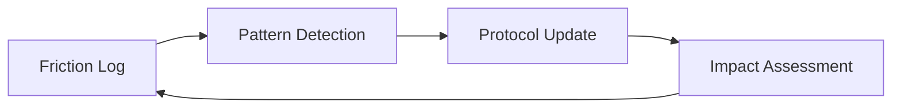

# Design Patterns

> **Epic #900 update.** The **Hierarchy-aligned slash-command split**
> pattern was added in v5.31.0: a single mega-skill that routed by label
> (`/sprint-execute`) was replaced by four narrow skills aligned to the
> Epic-centric ticket hierarchy — `/epic-execute` (wave loop),
> `/wave-execute` (one wave's Story fan-out), `/story-execute` (init →
> task loop → close for one Story), and the `task-execute.md` helper read
> inline by `/story-execute`. The shape lets the operator stop or resume
> at any level and removes the "skill routes by label" indirection. In
> the same Epic, **single-session Agent-tool fan-out** replaced the
> `claude -p` subprocess spawn — Story sub-agents launch through the
> Agent tool inside the operator's Claude session, so worktree
> filesystem isolation is preserved while the process boundary, the
> idle watchdog, the headless `--dangerously-skip-permissions` contract,
> and the progress-log tailing dance all disappear. References below
> to `/sprint-execute`, `/sprint-plan`, `/sprint-close`, `/sprint-retro`,
> or `sprint-{story,wave,code-review,hierarchy}-*.js` predate this
> Epic; the current names are `/epic-execute`, `/epic-plan`,
> `/epic-close`, the `epic-retro.md` helper, and
> `epic-{story,wave,code-review,hierarchy,plan}-*.js` respectively.
>
> **Epic #857 update.** The **Rule-as-SSOT** pattern — first modeled by
> `.agents/rules/gherkin-standards.md` and its `gherkin-authoring` skill
> companion — was applied to three further high-traffic surfaces: API
> conventions (`api-conventions.md` + `api-and-interface-design`),
> security baseline (`security-baseline.md` + `security-and-hardening`),
> and testing standards (`testing-standards.md` +
> `test-driven-development`). The rule files own the canonical taxonomy
> (response envelope, status codes, validation taxonomy, MUST lists,
> test-tier placement); the corresponding skills slim to process,
> examples, and anchored deep-links back into the rule. The shape lets
> agents load only the rule when they need the constraint and only the
> skill when they need the process — and prevents the duplicate-guidance
> drift that motivated this Epic.
>
> **Epic #773 update.** The **Facade + Responsibility-Bounded Submodules**
> pattern (originally documented for the v5.13.0 facade pass) was applied
> to two further large modules: `providers/github.js` and
> `lib/worktree/lifecycle-manager.js`. Each top-level file is now a ≤250
> LOC facade re-exporting submodules under `providers/github/*` and
> `lib/worktree/lifecycle/*`, with strict ctx-threading discipline (no
> inter-submodule imports). Public class surfaces remain byte-identical.
> The same pattern also drove the `config-resolver.js` split into
> `quality`/`paths`/`commands`/`limits`/`runners` accessor submodules.

## Schema-First, Grouped Configuration (Epic #730)

### Problem

A flat configuration namespace accumulates peer keys until the shape is
illegible: operators can't tell which keys are required, which are optional,
or how related keys group. Code-level fallbacks (`config.foo ?? 'default'`)
mask missing required values until a script blows up downstream. Sync
helpers that diff against a template silently strip legitimate optional
keys the operator added on purpose.

### Solution

Make the schema the source of truth and group related keys into typed
sub-blocks read through dedicated accessors:

1. **Authoritative AJV schemas at runtime.** Validate the loaded config at
   resolver entry. A missing required field is a validation error with a
   clear `instancePath`, never a silent fallback.
2. **Static JSON Schema mirror for editors.** Mirror the AJV schemas to a
   `.json` file the config declares via `"$schema": "..."`. A drift test
   prevents the mirror from going stale. Editors and operators get
   autocomplete and inline validation; the runtime keeps a single source of
   truth.
3. **Grouped sub-blocks with typed accessors.** Reorganise the namespace
   into a small number of sub-blocks (e.g. `paths`, `commands`, `quality`,
   `limits`) and read each through a single getter (`getPaths(config)`,
   `getCommands(config)`, ...). Consumers never reach into the raw shape.
4. **`null` for disabled, not empty string.** Optional commands that may be
   "not applicable" accept `string | null`. Empty strings are rejected by
   the schema. `null` is the canonical disabled value across every site.
5. **Schema-driven sync, not template-diff.** When reconciling a project
   config against a framework template, validate first, then merge missing
   keys from the template. Preserve every project-side key that validates,
   including optional keys absent from the template. A typo aborts the sync
   with a diagnostic instead of vanishing.

### Benefits

- **Discoverability.** Operators read one reference doc (e.g.
  `docs/configuration.md`) backed by the schema, not a scattered surface.
- **Validation fails fast.** Misconfiguration surfaces at startup, not
  three layers down at the call site that needed the missing value.
- **Editor support is free.** The `$schema` pointer gives autocomplete and
  inline diagnostics in any JSON-Schema-aware editor.
- **Localised future changes.** Adding a new sub-block is one schema edit,
  one resolver accessor, one doc row — instead of threading through
  multiple flat-key consumer sites.
- **Operator overrides survive sync.** Schema-valid keys absent from the
  template no longer disappear on `/agents-update`.

### Trade-offs

- The migration from a flat shape is mechanical but unavoidably breaking
  for consumers who had the flat keys set. Mitigate with a single
  changelog entry that names every flat → grouped mapping.
- Schema-driven sync trades silent strip for loud abort on validation
  failures. Operators see misconfiguration; the occasional false-positive
  abort (e.g. genuinely retired key) is the right trade.

### Companion: separate canonical baselines from drift snapshots

When the same problem domain produces multiple "baseline-shaped" files
(e.g. canonical ratchet baselines that gate every PR vs. per-wave drift
snapshots written by an orchestrator), give them **distinct filenames in
distinct directories** so a repo-wide grep never confuses one with the
other. In this codebase the canonical baselines live under `/baselines/`
and the per-wave drift snapshots under `.agents/state/wave-*-snapshot.json`.

---

## Self-Healing Protocol

### Problem
Static instructions (system prompts and skills) become outdated as the tech stack evolves or as agents encounter recurring edge cases.

### Solution
Implement a **Self-Healing Protocol** pattern:
1.  **Logging Phase:** Agents record "friction events" whenever a tool fails or a goal is blocked.
2.  **Synthesis Phase:** An analyzer clusters these events into patterns.
3.  **Healing Phase:** A refiner agent modifies the protocol (skills/rules) to prevent the recurring issue.
4.  **Verification Phase:** An impact tracker validates that the change actually reduced friction in subsequent tasks.

### Structure


---

## Story-Level Branching

### Problem
Epic branches become massive, long-lived, and prone to merge conflicts across dozens of tasks.

### Solution
The **Story-Level Branching** pattern restricts the integration scope:
1.  **Base Branch:** `epic/NNN`
2.  **Shared Story Branch:** `story/EPIC-ID/STORY-NAME`
3.  **Task Branches:** `task/EPIC-ID/TASK-NAME` (branch from story branch)
4.  **Integration:** Task merges into Story branch → Story merges into Epic branch.

### Benefits
*   Reduced integration surface area.
*   Parallel development of independent stories without conflict.
*   Easier cherry-picking and rollback.

---

## Worktree-per-Story Isolation (v5.7.0+)

### Problem
Under parallel sprint execution, multiple story agents share the same working
tree. Rapid `git checkout` swaps cause one agent's `git add -A` to sweep WIP
from a different agent's story into the wrong commit. The v5.5.1 guards
prevent the specific observed failure modes but not the underlying class of
bug: multiple agents mutating one working tree at the same time.

### Solution
Each dispatched story runs in its own `git worktree`:
1.  **Worktree root:** `.worktrees/story-<id>/` (path traversal guarded).
2.  **Single authority:** `WorktreeManager` owns `ensure`, `reap`, `list`,
    `isSafeToRemove`, `gc`. No other code calls `git worktree` directly.
3.  **Dispatcher integration:** `dispatch()` ensures the worktree before
    dispatching and threads its path as `cwd` through the adapter;
    `sprint-story-close` reaps after a successful merge.
4.  **Fallback:** `orchestration.worktreeIsolation.enabled: false`
    restores single-tree behavior; v5.5.1 guards remain the primary
    defense in that mode.

### Benefits
*   Main-checkout HEAD never moves during a parallel sprint.
*   Each story's staging, reflog, and checkout operations are isolated.
*   Defense-in-depth preserved: pre-commit branch guard runs inside each worktree.
*   Fallback mode is a first-class supported configuration.

### Trade-offs
*   Disk usage multiplies with the `per-worktree` `node_modules` strategy;
    `symlink` and `pnpm-store` mitigate at the cost of platform fragility.
*   Concurrent `git fetch` can collide on `.git/packed-refs.lock` — handled
    by bounded retry (`gitFetchWithRetry`) rather than a global mutex.
*   Windows path limits require a pre-flight warning when estimated depth
    exceeds the configured threshold.

## Worktree-off Mode (Epic #668, v5.24.0+)

### Problem

Two execution environments coexist for `/sprint-execute`: local Claude Code
sessions on a developer's machine (one shared filesystem, multiple agents) and
web Claude Code sessions at claude.ai/code (each session is its own sandboxed
clone). The worktree-isolation pattern from v5.7.0 was designed for the local
case where a shared working tree had to be partitioned. On web that problem
doesn't exist — the session itself is already an isolated clone — so creating
`.worktrees/story-<id>/` inside an already-isolated clone wastes disk, slows
the install step, and makes path-length warnings spuriously fire.

A single committed config value (`orchestration.worktreeIsolation.enabled`)
cannot serve both — flipping it whenever the operator switches between local
and web would pollute git history.

### Solution

The flag is **resolved**, not just read, by
`resolveWorktreeEnabled(opts, env)` in `lib/config-resolver.js`. Precedence:

1. `env.AP_WORKTREE_ENABLED === 'true'` → `true` (explicit operator override).
2. `env.AP_WORKTREE_ENABLED === 'false'` → `false` (explicit operator override).
3. `env.CLAUDE_CODE_REMOTE === 'true'` → `false` (web-session auto-detect).
4. Otherwise → committed `orchestration.worktreeIsolation.enabled`.

The committed config is read-only at runtime; no workflow writes it. A single
startup log line names the resolved value and the source of the decision so
the run is auditable from logs alone.

When resolved to `false`, every `WorktreeManager` method short-circuits to a
no-op, the `.agents/` copy and `nodeModulesStrategy` branches collapse to the
single repo-root install, and consumers use `process.cwd()` (the resolved
`PROJECT_ROOT`) wherever they would have used the worktree path. The
worktree-on path is byte-identical to its pre-resolver behaviour.

### When it engages

- A web Claude Code session: `CLAUDE_CODE_REMOTE` is set automatically.
- A local session with `AP_WORKTREE_ENABLED=false` exported.
- A repository whose committed `orchestration.worktreeIsolation.enabled` is
  `false` (uncommon — most repos leave the default `true`).

### Exercising it locally

Set `AP_WORKTREE_ENABLED=false` in your shell and run `/sprint-execute
<storyId>` against a story branch. The init script reports
`[ENV] worktreeIsolation=off (AP_WORKTREE_ENABLED override)` and runs the
story directly in the main checkout. Story close merges, reaps (a no-op),
pushes, and cascades exactly as it would with worktrees on. The same
`/sprint-execute` codepath drives both paths — there is no separate
"web mode" command.

### Identity signals

`runtime.sessionId`, also produced by the resolver, prefers
`CLAUDE_CODE_REMOTE_SESSION_ID` when available and falls back to a local
hostname+pid+random short-id. It is surfaced in the startup
`[ENV] sessionId=…` log line so two parallel sessions on the same
machine emit distinguishable diagnostics; a web session retains a stable
id across its run for log correlation.

### Trade-offs

- The off-path is exercised less often than the on-path locally, so
  regressions can land unnoticed without explicit coverage. The pattern is
  paired with a diff test that runs the same fixture both ways and asserts
  the on-branch logs are byte-identical to a saved baseline.
- The resolver consumes process environment, not config — operators get no
  schema validation on env-var typos. The string-equality match (`'true'` /
  `'false'`) is deliberate: any other value falls through to the next rule.

---

## Rule-as-SSOT, Skill-as-Guidance (v5.11.0+)

### Problem

When a framework ships both enforcement rules (`rules/*.md`) and authoring
guidance (`skills/**/SKILL.md`) covering the same domain, the skill tends to
drift — restating the rule's grammar in slightly different words, or inventing
parallel vocabularies when no constraint forces coherence. Over time the two
diverge, the reviewer has two documents to consult, and the rule's authority
erodes.

### Solution

Adopt a strict layering:

1. **Rule (`rules/<domain>.md`)** — the single SSOT for taxonomy, grammar,
   and forbidden patterns in its domain. Defines *what* is allowed.
2. **Skill (`skills/**/SKILL.md`)** — describes *how* and *when* authors
   apply the rule. Cross-links to the rule for the *what*; never restates
   the taxonomy or forbidden list.
3. **Workflow (`workflows/*.md`)** — describes *who triggers* the work and
   what artifact flows through the sprint. Defers to rule and skill for
   authoring specifics.

Enforced by a cross-reference audit (see Story #282 / Task #294): grep each
skill for redefinition of rule content and rewrite any violations.

### Benefits

*   Reviewers have exactly one place to verify tag or pattern validity.
*   Additions to the taxonomy require a rule PR — a deliberate, visible
    act rather than a silent divergence in a skill.
*   Skills stay short and focused on applied craft, not vocabulary.

### Trade-offs

*   Higher friction to add a new tag or forbidden pattern (rule PR + review).
*   Mitigated by designing extensible dimensions into the rule itself — e.g.
    `@domain-<slug>` lets consumers add project-specific domains without
    touching the rule.

### Example (this Epic)

`.agents/rules/gherkin-standards.md` owns the tag taxonomy and forbidden
patterns. `gherkin-authoring` teaches PRD AC → Scenario translation and the
step-reuse protocol by *pointing at* the rule. `playwright-bdd` configures the
runtime but *references* the rule's tag set instead of picking its own.

---

## Facade + Responsibility-Bounded Submodules

### Motivation

When an orchestration module grows past the point where a single file
usefully describes a single responsibility, we decompose it into cohesive
submodules behind a **thin facade**. The facade preserves every public
export at the existing import path; submodules are internal
implementation detail.

Introduced by Epic #297 (v5.13.0) to split `lib/worktree-manager.js`
(1,234 LOC), `lib/orchestration/dispatch-engine.js` (874 LOC), and
`lib/presentation/manifest-renderer.js` (600 LOC).

### Pattern

1. Create a sibling directory (`lib/worktree/`, `lib/orchestration/`,
   etc.) and extract cohesive submodules — each owning one
   responsibility, ≤350 LOC, with its own per-submodule test file.
2. Reduce the original file to a **facade** (typically ≤200 LOC) that
   imports the submodules, composes them, and re-exports the exact set
   of public symbols external callers currently consume.
3. For class-based modules (like `WorktreeManager`), the facade's class
   delegates each method body to a submodule helper that takes a
   lightweight `ctx` bag. State (e.g. caches) lives on the facade
   instance.
4. Preserve every test in the existing suite without edits. Where
   pre-existing tests probe internal helpers, add short
   backwards-compat delegate methods on the facade rather than
   rewriting the test.

### Benefits

*   Downstream consumers keep their import paths verbatim — no caller
    edits outside the three target areas.
*   Each submodule is individually unit-testable without mocking the
    entire class hierarchy.
*   Future behaviour changes land in the submodule that owns the
    concern, not a 1,000-LOC grab-bag.
*   The split merges are bisectable one-by-one because every
    intermediate state still preserves the public contract.

### Trade-offs

*   Backwards-compat delegates on the facade are technical debt —
    they exist solely to keep monkey-patch-heavy tests green. They
    must be actively retired as tests migrate.
*   Two-level indirection (facade → submodule helper) is a small
    readability tax on follow-up contributors; ADR and
    `architecture.md` must explicitly note which paths are the stable
    public surface.

### Example (this Epic)

```text
.agents/scripts/lib/worktree-manager.js       ← 223-LOC facade (public surface)
.agents/scripts/lib/worktree/
  lifecycle-manager.js                        ← git worktree ops
  node-modules-strategy.js                    ← per-worktree / symlink / pnpm-store
  bootstrapper.js                             ← .env, .agents copy
  inspector.js                                ← porcelain + path helpers
```

External callers continue to import `WorktreeManager` and
`parseWorktreePorcelain` from the facade path verbatim; the four
submodule paths are free to rename without a major version bump.

---

## Marker-keyed structured comment upsert (v5.14.0)

Long-running orchestrator state lives on the Epic issue itself rather
than in a local file or side database. The pattern relies on
`upsertStructuredComment(provider, ticketId, type, body)` (in
`lib/orchestration/ticketing.js`), which:

1. Derives a unique HTML marker of the form
   `<!-- ap:structured-comment type="<type>" -->` from the `type`.
2. Searches the ticket's comments for the marker.
3. If a match exists, deletes it first.
4. Posts the new body with the marker prepended.

The result is **idempotent by marker**: re-running the upsert replaces
the prior comment, so checkpoints and wave-boundary reports never
accumulate as clutter.

**Consumers in the epic runner:**

| Type                 | Writer                      | Purpose                                                     |
| -------------------- | --------------------------- | ----------------------------------------------------------- |
| `epic-run-state`     | `Checkpointer`              | JSON checkpoint (`currentWave`, `autoClose`, wave history). |
| `wave-<N>-start`     | `WaveObserver.waveStart`    | Per-wave start manifest + timestamp.                        |
| `wave-<N>-end`       | `WaveObserver.waveEnd`      | Per-wave outcomes + duration.                               |
| `dispatch-manifest`  | `sprint-plan` / dispatcher  | Frozen Story manifest for the wave-gate.                    |
| `parked-follow-ons`  | dispatcher                  | Out-of-manifest Stories surfaced at sprint-close gate.      |
| `retro`              | `/sprint-retro`             | Final retrospective body with `retro-complete` marker.      |
| `code-review`        | (planned, Epic #349)        | Findings report from `/sprint-code-review`.                 |

**When to reach for this pattern:** orchestrator state that must
survive restarts, be human-readable on the issue, and be
machine-parseable by downstream tooling (wave-gate, retro aggregator).
Prefer a local file only when the state is ephemeral and recoverable
(e.g. `temp/dispatch-manifest-<id>.{md,json}` is a view, not an SSOT).

**When NOT to use it:** high-frequency state updates (sub-second or
sub-minute) — the delete-then-post cycle has rate-limit cost. For those
cases, compute a running total and upsert at wave boundaries instead.

---

## Error Handling Convention (Fatal vs. Throw)

### Problem

Scripts under `.agents/scripts/` mix two ways of signalling failure —
`throw new Error(...)` and `Logger.fatal(...)` (which calls
`process.exit(1)`). Without a rule, library modules sometimes call
`process.exit()` directly, which makes them untestable and impossible to
compose. Conversely, CLI entry points sometimes let unhandled rejections
escape, losing the framework's prefixed error line.

### Rule

| Layer                                                   | How failure is signalled                                                            |
| ------------------------------------------------------- | ----------------------------------------------------------------------------------- |
| **Library code** (`lib/**`, imported by multiple CLIs)  | `throw` an `Error`. **Never** call `Logger.fatal()` or `process.exit()`.            |
| **CLI entry point** (`main()` in a top-level script)    | Let `throw`n errors bubble out of `main()`.                                         |
| **CLI wrapper** (the `runAsCli(import.meta.url, main)` line) | Funnels the rejection through `cli-utils.js` → prefixed stderr + `process.exit(1)`. |
| **Logger primitive** (`Logger.fatal` in `lib/Logger.js`) | The one sanctioned caller of `process.exit(1)` — used only by CLIs that cannot rely on the `runAsCli` handler (e.g. multi-phase orchestrators that print their own summary before exiting). |

**Equivalently:** recoverable errors (or errors whose caller might want
to retry, catch, or convert to a friction comment) are **thrown**. Fatal
errors — the process must not continue and no caller up-stack can
recover — are either thrown from `main()` so `runAsCli` handles them, or
surfaced via `Logger.fatal()` at the CLI boundary.

### Why it matters

1.  **Library code stays pure.** `lib/orchestration/**` and
    `lib/worktree/**` are imported by the MCP server, the epic runner,
    and multiple CLI scripts. If any of them called `process.exit()`,
    they would kill the MCP server process on a recoverable error. The
    only way library code ends a process is by throwing and letting the
    top-level `runAsCli` handler convert that to an exit.
2.  **`runAsCli` gives uniform error output.** Every CLI that wraps its
    `main()` in `runAsCli(import.meta.url, main, { source: '<name>' })`
    prints `[<name>] Fatal error: <stack>` before exiting 1. Scripts
    that bypass the wrapper and `process.exit()` themselves lose that
    uniformity.
3.  **Testability.** A library that `throw`s can be asserted against in
    a unit test; a library that `process.exit()`s cannot.

### Accepted exceptions

*   **`lib/Logger.js`** — defines `Logger.fatal`, the one sanctioned
    call site of `process.exit(1)`.
*   **`lib/cli-utils.js`** — `runAsCli` is the default CLI error
    handler; its `process.exit(exitCode)` implements the contract for
    all entry-point scripts.
*   **Orchestrator CLIs that print their own summary** (e.g.
    `story-close.js`, `epic-runner.js`) may call
    `Logger.fatal()` explicitly when the error has already been logged
    in a structured form and a raw stack trace would add noise.

### Quick sweep

```bash
# Sites that should exist only in lib/Logger.js + lib/cli-utils.js:
grep -rn "process\.exit" .agents/scripts/lib | grep -v Logger.js | grep -v cli-utils.js

# Sites that should exist only at CLI boundaries:
grep -rn "Logger\.fatal" .agents/scripts/lib
```

Both queries should return no results when the convention holds.

---

## OrchestrationContext Dependency Injection (v5.15.1)

### Problem

The epic-runner and plan-runner submodules previously took a loosely-shaped
`opts` bag as their first argument. Over the Epic #321 and Epic #349 cycles
this object grew to hold `provider`, `logger`, `settings`, ad-hoc
feature flags, injected `execImpl` for tests, and several siblings. Each
new submodule picked a slightly different subset. Adding a new cross-cutting
concern — for Epic #380 this was the `ErrorJournal` — meant editing every
call site and hoping no path silently dropped the new field.

### Pattern

`lib/orchestration/context.js` exports three typed context constructors:

- `OrchestrationContext` — the shared base. Holds `provider`, `settings`,
  `logger`, and `errorJournal`.
- `EpicRunnerContext extends OrchestrationContext` — adds epic-runner
  specifics (`epicId`, `concurrencyCap`, `runSkill` adapter, …).
- `PlanRunnerContext extends OrchestrationContext` — adds plan-runner
  specifics (`phase`, `decomposerAdapter`, …).

Every orchestration submodule takes `ctx` as its first argument:

```js
export async function dispatchWave(ctx, waveNumber) {
  const { provider, logger, errorJournal } = ctx;
  // …
}
```

Tests construct a minimal `ctx` with stub injectables rather than
reaching into a shared module state. Composition (epic-runner calling
into dispatch-engine) passes `ctx` through unchanged — submodules never
reconstruct a new context from an opts bag.

### The `errorJournal?.record(...)` idiom

Alongside the ctx refactor, every silent-catch site in the orchestration
layer now records to the journal:

```js
try {
  await doRiskyThing();
} catch (err) {
  logger.warn(`[epic-runner] ${err.message}`);
  errorJournal?.record({
    phase: 'blocker-handler',
    error: err,
    context: { storyId, label },
  });
}
```

The optional chaining (`errorJournal?.record`) is deliberate: older test
fixtures may construct a bare ctx without a journal, and that must
remain valid. In production the journal is always wired by the runner
entry points. The resulting `temp/epic-<id>-errors.log` is a JSONL
stream consumable by the retro aggregator (and, planned, by the
sprint-health dashboard).

### Benefits

*   Adding a new cross-cutting concern is a **one-line ctx extension** plus
    grep-safe call-site updates. Epic #380 added `errorJournal` this way.
*   Every submodule's first argument is typed and discoverable — no
    more "what's in `opts`?" guessing.
*   Tests no longer need to guess which `opts` keys a submodule peeks
    at; they build a stub ctx that matches the constructor shape.

### Trade-offs

*   Converting the initial call sites is a one-time grind — Epic #380
    Story #389 touched every `epic-runner/*` file.
*   The ctx constructor is the boundary where validation lives; don't
    sprinkle `if (!ctx.provider) …` checks across submodules.

---

## `pollUntil` / `sleep` instead of hand-rolled poll loops (v5.15.1)

### Problem

`state-poller.js` and `blocker-handler.js` each carried their own
`while (true) { await new Promise(r => setTimeout(r, ms)); … }` loops
with slightly different jitter, timeout, and abort handling. Adding a
timeout budget to one did not automatically apply to the other, and
the "is this done yet" check was inlined inside the loop body —
untestable without mocking `setTimeout`.

### Pattern

Epic #380 Story #392 / #407 extracted `lib/util/poll-loop.js`:

```js
import { pollUntil, sleep } from '../util/poll-loop.js';

const label = await pollUntil(
  () => provider.getLabel(ticketId),
  (labelValue) => labelValue === 'agent::review',
  { intervalMs: 30_000, timeoutMs: 15 * 60_000 },
);
```

`pollUntil(fn, predicate, opts)` runs `fn`, tests `predicate(result)`,
and sleeps `intervalMs` between attempts until either the predicate
passes or `timeoutMs` elapses. `sleep(ms)` is the trivial awaitable
`setTimeout` wrapper used elsewhere.

### When to reach for it

*   Waiting for an external label / state transition driven by another
    agent or a human operator.
*   Waiting for a file or structured comment to materialise on a ticket.

### When NOT to use it

*   Tight sub-second polling — `pollUntil` is designed for the tens-of-
    seconds to minutes regime typical of orchestrator pauses. For
    sub-second work use an event or a direct await.
*   Anything where the callee can tell you when it's done (a Promise, an
    emitter) — don't poll around it.

### Benefits

*   Timeout + interval behaviour is consistent across every orchestrator
    pause site.
*   One module to audit for jitter / abort / rate-limit behaviour.
*   Test fixtures can inject a fake clock against one module instead of
    three.

## Whole-epic progress reporting via `setPlan` (v5.15.2 / Epic #413)

The `ProgressReporter` (`lib/orchestration/epic-runner/progress-reporter.js`)
emits a periodic `epic-run-progress` snapshot. Before Epic #413 the
snapshot only covered the active wave's stories — operators couldn't
see queued work or completed earlier waves at a glance.

`setPlan({ waves })` is called once at runner start with the full wave
DAG. With a plan present, each fire fetches state for every story in
every wave and renders a single grouped table:

```text
### 📊 Progress — Wave 2/2 · 5/6 closed · 38m elapsed
| Wave | ID  | State        | Title                                         |
|------|-----|--------------|-----------------------------------------------|
| 1    | #419| ✅ done      | Spawner hardening suite                       |
| 1    | #420| ✅ done      | Post-wave commit assertion                    |
| 1    | #421| ✅ done      | sprint-story-close --resume / --restart       |
| 1    | #422| ✅ done      | Biome format gate + tagging sanity check      |
| 1    | #423| ✅ done      | error-journal parse-fix, validator wiring     |
| 2    | #424| 🔧 in-flight | ProgressReporter detectors + CI Node matrix   |
```

The pattern is back-compat — callers that don't migrate to `setPlan`
still see the prior single-wave table via `setWave({ stories })`. The
`Wave` column appears only when a plan is set.

**Why it matters:** the progress signal is what operators read while
the runner runs. A snapshot that only shows the active wave hides
"is the epic 20% done or 80% done?" — exactly the question the
operator is trying to answer when checking in. The grouped table
collapses that question into a single glance.

**When to extend the table:** add a new column only when every wave's
rendering benefits. Mechanical detectors (stalled-worktree,
maintainability-drift) belong in the `Notable` section under the
table — they fire once per snapshot, not once per row, so a column
would mostly be blank.

## `epic-runner` per-story log destination is configurable (v5.15.2 / Epic #413)

`orchestration.epicRunner.logsDir` controls where the runner CLI
writes per-story (`story-<id>.log`) and per-bookend
(`bookend-sprint-close-<epicId>.log`) subprocess logs. Default:
`temp/epic-runner-logs/` (was `.epic-runner-logs/` at the project root,
which leaked into untracked status output during every run).

The `defaultSpawn` and `defaultRunSkill` adapters in
`.agents/scripts/epic-runner.js` read the value once at CLI launch and
thread it as a closure into each subprocess. Tests don't need this
key — they inject their own `spawn` adapter via `EpicRunnerContext`.

**When to override:** only when running against a constrained
filesystem (e.g., `temp/` is mounted read-only in a container), or
when correlating runner logs with an external log shipper that
already watches a non-standard path. The default is right for every
local-dev and CI invocation.

---

## Per-Story rate-limited friction emission (v5.15.3 / Epic #441)

### Problem

Several failure sites in the orchestration pipeline (reap failures,
wave-poller read failures, mid-Story baseline refreshes) were silent
to the operator — they logged to stdout but never produced a
machine-readable surface on the Story ticket. Epic #413's Wave 1 ran
for ~30 minutes with the `variableNotUsed: $issueId` GraphQL error
masking every Story's state as `unknown` and not a single `friction`
comment was posted.

### Solution

`lib/orchestration/friction-emitter.js` wraps the MCP
`post_structured_comment` tool with per-Story deduplication:

1. **Key.** Dedupe key is `storyId` + a hash of the friction body's
   marker slug (e.g. `friction: reap-skipped`).
2. **Window.** 60-second cooldown per key — a stuck poller can't spam
   the ticket but a distinct failure mode still surfaces immediately.
3. **Emitters.** `story-close.js` reap failure, `epic-runner`
   wave-poller `getTicket` failure, and `check-maintainability.js`
   baseline-refresh sites are the three known consumers.

### When to use

Any silent `catch` + `logger.warn` site whose failure is operator-
actionable. A rule of thumb: if the operator needs to act on the
failure (inspect the worktree, re-run a reap, update a doc), emit.
If the failure is routine (a retry that succeeds on the next tick),
don't — the cooldown window will suppress duplicates anyway, but
polluting the ticket with sub-second retry chatter still costs
attention.

---

## Launcher-level config validation (v5.15.3 / Epic #441)

### Problem

`validateOrchestrationConfig` was wired into `resolveConfig()` in
Story #436 — but the actual CLI launchers (`epic-runner.js`,
`plan-runner.js`, `epic-plan-spec.js`, `epic-plan-decompose.js`)
call `resolveConfig()` and immediately dispatch to long-running
flows. A schema-invalid `.agentrc.json` would surface deep inside the
dispatch chain instead of at launcher startup, producing a confusing
stack trace instead of a clear schema error.

### Solution

Each launcher's `main()` now calls `validateOrchestrationConfig` after
`resolveConfig()` returns and exits non-zero on validation failure
before any provider call, GitHub I/O, or wave-loop begins. The
fixture test removes a required `orchestration.epicRunner` field and
asserts the launcher exits with a schema error before work starts.

### Why the explicit call (vs relying on `resolveConfig`)

`resolveConfig` reads the schema and layers defaults, but the
canonical validation path is the schema validator. The explicit call
in `main()` is the shift-left equivalent of a pre-flight check — a
future refactor of `resolveConfig`'s internals can't accidentally
drop the validation.

## Coordinator-plus-Phases Decomposition (Epic #470)

### Problem

`.agents/scripts/lib/orchestration/epic-runner.js` was a 600+ line
monolith. It composed the collaborator factory **and** implemented five
sequential workflow steps (smoke-test, snapshot, build-wave-dag,
iterate-waves, finalize) in-place. Any change to one step meant editing
a single long function; the surface was hostile to unit-testing each
step independently, and the cyclomatic complexity made new conditional
branches risky.

### Solution

The coordinator becomes a **thin dispatcher** that calls into one
phase module per step. The engine reduces to:

```js
let state = {};
state = await runSmokeTestPhase(ctx, collaborators, state);
if (state.halted) return state.halted;
state = await runSnapshotPhase(ctx, collaborators, state);
state = await runBuildWaveDagPhase(ctx, collaborators, state);
state = await runIterateWavesPhase(ctx, collaborators, state);
return runFinalizePhase(ctx, collaborators, state);
```

Each phase is a stand-alone module under
`.agents/scripts/lib/orchestration/epic-runner/phases/`. The contract
is uniform: `(ctx, collaborators, state) -> Promise<state>`.

### Benefits

- **Test surface**: each phase is independently importable and
  mockable. Collaborator fakes are constructed once and passed in.
- **Review scope**: a change to the iterate-waves loop touches only
  `iterate-waves.js`; the coordinator, snapshot, and finalize phases
  stay unchanged.
- **Pattern reuse**: the same coordinator-plus-phases layout is used
  by `story-init.js` (six injectable stages under
  `lib/story-init/`) and by `story-close.js`'s post-merge
  pipeline.

## `ctx` Runtime Context (Epic #470)

### Problem

Legacy orchestration utilities (dispatcher, reconciler, cascade,
health monitor) each hand-rolled their own opts-bag for `provider`,
`logger`, `config`, and the operator handle. Every new consumer
duplicated parameter-threading logic, and test doubles differed
subtly per call site.

### Solution

`.agents/scripts/lib/runtime-context.js` owns a single `ctx` shape
shared by the orchestration surface. Each entry point constructs the
context once at the start and threads it through every downstream
call. Legacy utilities accept either the ctx object or the legacy
opts-bag for a release of overlap.

### Benefits

- Shared lifecycle primitives (e.g. cancellation signal, clock) are
  always available without wiring them through each helper.
- Replacing any one primitive — swapping a real provider for a fake
  in integration tests — is a single-line override on the ctx object
  before it flows into the pipeline.

## Atomic file write via tmp + rename (Epic #511)

### Problem

Long-lived state files — the dispatch manifest is the motivating case —
must never be observed in a truncated state. A direct `fs.writeFileSync`
that is interrupted mid-write (process crash, disk full, CI cancel) leaves
the final path corrupt; the next reader consumes invalid JSON as though it
were canonical.

### Solution

Write to a sibling `.tmp` path, then `fs.renameSync()` to the final path.
`rename` is atomic on the same filesystem — the target path flips in a
single inode operation from the previous valid contents to the newly
written contents, with no intermediate truncated state.

```javascript
const tmp = `${target}.tmp`;
fs.writeFileSync(tmp, JSON.stringify(data, null, 2), 'utf8');
try {
  fs.renameSync(tmp, target);
} catch (err) {
  fs.rmSync(tmp, { force: true });
  throw err;
}
```

### Consequences

- **Crash safety.** A mid-write crash leaves either the previous valid
  contents at the final path, or both the previous contents and a stray
  `.tmp` sibling. Never a corrupt target.
- **Observability.** When the pattern is surfaced through an MCP tool
  result (the `dispatch_wave` case adds `manifestPersisted` and
  `manifestPersistError`), callers can react to persist failures instead
  of trusting a read-after-write.
- **Filesystem assumption.** `rename` is atomic only when source and
  target live on the same filesystem. Putting the `.tmp` file next to the
  target guarantees this.

## MCP tool-argument schema enforcement (Epic #511)

### Problem

Declaring an `inputSchema` per tool in the MCP registry does not enforce
it — the server had been validating the JSON-RPC envelope with AJV but
not the `tools/call` arguments themselves. A malformed payload (negative
`epicId`, string where a number was expected) reached the handler
unchecked and surfaced as a GraphQL 422 or a `Cannot read properties of
undefined` downstream, disguising a caller bug as a backend error.

### Solution

Compile each tool's `inputSchema` with AJV at registration time, then
validate `params.arguments` before invoking the handler. On failure,
respond with JSON-RPC `-32602 Invalid params` including the AJV error path
and a human-readable reason — the caller sees exactly which field failed,
at the protocol boundary.

### Consequences

- Tool schemas are no longer documentation-only; the registry is the
  enforced contract.
- Caller errors surface as protocol-level `-32602` with a precise path,
  not as opaque downstream exceptions.
- Tightened schemas catch subtle drifts (e.g. a `type::*` enum missing on
  one tool but present on its siblings) at the boundary.

## Bounded-concurrency fanout via `concurrentMap` (Epic #553)

### Problem

Framework hot paths that read many tickets per tick — `sprint-wave-gate`
(`getTicket` per story / recut / parked), `ProgressReporter` (per-story
label read on every cadence tick), wave-end `commit-assertion` (per-story
git probe) — were serial `for..of` loops over `await`. On a 20-story
epic the wall-clock compounded linearly. Converting to naked
`Promise.all` would swap that for an unbounded thundering herd against
the GitHub API and risk secondary rate limits.

### Solution

One primitive at `lib/util/concurrent-map.js`:
`concurrentMap(items, fn, { concurrency })`. Result order is preserved;
the first unhandled rejection aggregates out. Three adoption points,
each chosen for its bottleneck:

- `wave-gate.js` — no explicit cap (the story count *is* the
  cap); three prior serial fanouts become one outer `concurrentMap`.
- wave-end `commit-assertion.js` — cap **4**. Git is CPU/disk-bound;
  higher caps don't help and can contend on the repo lock.
- `progress-reporter.js` — cap **8**, layered over a 10-second TTL
  (`getTicket(id, { maxAgeMs: 10_000 })`) so repeated ticks inside the
  window serve from cache instead of fanning out at all.

### Consequences

- One primitive, one reviewer surface. New fanouts reuse the helper
  instead of re-rolling `Promise.all` + semaphore.
- TTL + cap are orthogonal: the TTL handles the tight ticks; the cap
  handles the wide waves.
- Caps are constants for now. The phase-timer surface shipped in the
  same Epic is the measurement that will justify an `agentSettings`
  override — not premature configurability.

## Prime the ticket cache after every `getTickets` sweep (Epic #553)

### Problem

`GitHubProvider` has carried a per-instance ticket cache for several
releases, but the bulk `getTickets(epicId)` sweep wasn't priming it.
Callers then did a second round-trip on every subsequent `getTicket(id)`
for the same Epic — a textbook N+1 that no one had noticed because it
was hidden behind two separate call sites and the cache's "it's there,
we use it" reputation.

### Solution

Every `provider.getTickets(...)` call site in `.agents/scripts/` is
followed by `provider.primeTicketCache(result)`. `primeTicketCache` was
already exported and tested; adoption is a one-line diff per site. A
regression test asserts zero extra HTTP calls across a sweep-plus-N-reads
sequence against a mocked `fetchImpl`.

### Consequences

- Dispatcher passes that read children after the sweep are free.
- The discipline is a pattern, not a new API — the helper already
  existed; we just made adoption consistent.
- Invalidation semantics are unchanged: any write through the provider
  invalidates the affected entries.

## Per-phase timer with `snapshot` / `restore` (Epic #553)

### Problem

Framework overhead was not directly observable. A slow Story could be
slow because `.agents/` copy was slow, or because `npm ci` was slow,
or because lint was slow — the runner's log said only "Story took 12
minutes." Consumer projects blaming framework overhead had no way to
prove it; framework maintainers had no way to refute it.

### Solution

`lib/util/phase-timer.js` + `phase-timer-state.js`. The timer records
`{ phase, elapsedMs }` spans and exposes `snapshot` / `restore` so
state survives the `sprint-story-init` → spawned agent →
`sprint-story-close` boundary (where three separate processes handle
one Story). Per-phase lines are emitted during the lifecycle; on
close, a `phase-timings` structured comment is posted to the Story
ticket. `ProgressReporter.setPlan()` reads closed-story timings and
renders median / p95 per phase into the Epic's `epic-run-progress`
comment.

### Consequences

- The phase-timings comment is a machine-readable artefact — consumer
  dashboards don't have to grep logs.
- Framework vs. consumer overhead is now attributable in a single
  report: `.agents/` copy, worktree create, bootstrap are framework;
  install, lint, test, implement are consumer.
- Future perf work starts with measurement. The next regression is
  caught by the p95 column drifting, not by a user filing an issue.

## Quality gates: maintainability vs CRAP (v5.22.0+)

### Problem

The maintainability (MI) gate enforces a no-regression ratchet on a
per-file composite score, but is **coverage-blind**: a 30-branch
function scores identically whether it has 0% or 100% test coverage. MI
catches files that grow gnarlier; it does not catch new untested
complexity.

### Solution

Two sibling gates with complementary signals, both reading from the
existing `typhonjs-escomplex` and `c8` outputs that the test runner
already produces:

| Gate                  | Granularity | Signal                                       | Answers                          |
| --------------------- | ----------- | -------------------------------------------- | -------------------------------- |
| `check-maintainability` | Per-file   | Composite MI score vs. baseline              | "What should I refactor?"        |
| `check-crap`            | Per-method | `c² · (1 − cov)³ + c` vs. baseline + ceiling | "What should I test next?"       |

Both gates run at the same three sites — pre-push, close-validation, CI
— and share an envelope shape (`{ kernelVersion, summary, violations }`)
so an agent can consume both reports through one parser.

### Hybrid enforcement (CRAP-specific)

CRAP cannot use a flat per-file ratchet because the unit is the method,
which moves between files. The compromise:

1. **Tracked methods** ratchet on `(file, method, startLine)` with a
   line-drift fallback; current ≤ baseline + tolerance.
2. **New methods** (no baseline match) must score ≤ `newMethodCeiling`
   (default 30 — the canonical CRAP threshold).
3. **Removed methods** are surfaced as a counter in the summary, never
   a failure — deletion is visible at review without blocking.

### Anti-gaming

A PR that simultaneously relaxes `newMethodCeiling` in `.agentrc.json`
and adds a method over the new (relaxed) ceiling would otherwise pass
its own gate. The `baseline-refresh-guardrail` CI job defends against
this by reading thresholds from the **base branch** and re-running
`check-crap` with those values forced via `CRAP_NEW_METHOD_CEILING` /
`CRAP_TOLERANCE` / `CRAP_REFRESH_TAG` env vars. Any PR that touches
`baselines/crap.json` or `baselines/maintainability.json` must also carry
a commit whose subject starts with the configured `refreshTag` (default
`baseline-refresh:`) AND has a non-empty body — the tag alone is not
enough. Baseline-only PRs are auto-labelled `review::baseline-refresh`
so a human sees every refresh, even on green CI.

### Consequences

- A regression in test coverage on a complex method now fails CI even
  if the per-file MI score holds steady.
- Agents authoring PRs receive `fixGuidance` (`minComplexityAt100Cov`,
  `minCoverageAtCurrentComplexity`) per offender so they can pick the
  cheaper axis to fix without parsing stdout.
- Baseline refreshes are a deliberate, justified, reviewer-visible
  action. Silent threshold relaxation is impossible without a tagged
  commit and a label that flags the PR for human eyes.

## Data-driven defaults over estimated constants (Epic #638)

### Context

Epic #553 shipped `concurrentMap` at three adoption sites with
constant-valued caps (wave-gate uncapped, commit-assertion=4,
progress-reporter=8). The constants were chosen from first-principles
reasoning before any real workload data existed. ADR-20260424-553a
committed to revisiting them once `phase-timings` telemetry
accumulated.

### Problem

Two anti-patterns lurk when perf defaults ship as constants:

1. **Frozen guesses.** Constants never get re-tuned because no one has
   time to hunt down the files; downstream consumers inherit an
   arbitrary choice forever.
2. **Silent config surfaces.** An operator hitting rate limits or
   under-utilised fanout has no tuning knob, so the only recourse is a
   framework fork or a monkey-patch.

### Solution

Turn each tuning site into a config key with its v5.21.0 constant as
the default, and ship a measurement helper that reads the Epic's own
observability surface. Three principles:

1. **Default preserves prior behaviour.** Omitting the key is
   bit-identical to the constant it replaces. Schema validators refuse
   typos. Regression tests assert the no-config path observably matches
   pre-tuning fanout (e.g. `Promise.all` vs `concurrentMap` with cap=0).
2. **One resolver, one shape.** A small helper
   (`lib/orchestration/concurrency.js#resolveConcurrency`) handles
   coercion, per-field fallback, and freezing. Every reader goes
   through the same shape; no adoption site re-invents defaults or
   reads `config.orchestration.concurrency` directly.
3. **Tuning data comes from inside.** A standalone CLI
   (`aggregate-phase-timings.js`) reads `phase-timings` structured
   comments across N Epics and prints recommended caps. Operators tune
   defaults from lived workload, not from outside measurement
   harnesses.

### Consequences

- New consumers see the exact v5.21.0 behaviour; existing `.agentrc.json`
  files need no edit.
- Operators hitting provider rate limits or idle fanout have a
  declarative tuning surface that the schema validates.
- Future perf retuning becomes a decision comment + a default-file
  edit, not a code archaeology exercise.

## Compact-path short-circuit with escape hatch (Epic #638)

### Context

`helpers/epic-retro.md` historically walked through six sections
regardless of sprint shape. On clean-manifest Epics (zero friction,
zero parked, zero recuts, zero hotfixes, zero HITL) four of those
sections degenerate to "nothing notable" boilerplate, burning minutes
of agent time for no retrospective value.

### Solution

A cheap predicate decides the branch up-front; the verbose path stays
one flag away.

1. **Pure-function predicate.** `isCleanManifest({ friction, parked,
   recuts, hotfixes, hitl })` returns `true` iff every signal is zero.
   Extracted into `lib/orchestration/retro-heuristics.js` so a future
   automated retro agent uses the same truth.
2. **Preserved downstream contract.** The compact body is still a
   `type: 'retro'` comment and still ends with `<!-- retro-complete:
   <ISO> -->`. `/sprint-close` Phase 6's completion gate is
   unchanged. No consumer sees a shape difference beyond length.
3. **Operator override.** A new `--full-retro` flag on `/sprint-close`
   (and a note in the helper) forces the six-section body when the
   operator disagrees with the predicate. Mirrors `--skip-retro` /
   `--skip-code-review`.

### When to reach for this pattern

The pattern generalises to any stage whose body is mechanically
populated from signals that are usually (but not always) zero. The
ingredients:

- A predicate that is a pure function of existing data (no new
  source-of-truth).
- A shorter body template that preserves the downstream contract
  (markers, comment types, downstream parsers).
- An operator flag that forces the verbose path without changing the
  predicate.

Use only when (a) the short path genuinely produces less work, not
less signal, and (b) the short path is the common case. If "clean" is
the outlier, skip — the short path becomes the one you forget to
update.

---

## Retire the parallel-pathway surface (Epic #702)

### Problem

The framework shipped a stdio MCP server (`agent-protocols`) exposing
seven tools that **duplicated** capabilities already implemented in the
SDK. The SDK was the runtime path; the MCP was a parallel surface that
existing scripts did not exercise. Two surfaces meant: two places to
audit, two places to keep in sync when the SDK changed, two places where
secrets had to be threaded (`.mcp.json` env block + `process.env`), and
a permanent "MCP-unavailable on web" degradation note in every web-launch
runbook. The MCP cost real maintenance for marginal ergonomic gain.

Earlier patterns in this file reference `MCP tool` / `post_structured_comment`
emitter wrappers and the `MCP tool-argument schema enforcement` decision.
Those references describe the architecture as it stood **before** Epic
#702 retired the MCP. The patterns themselves remain valid; only the
delivery surface changed (CLI invocation in place of MCP-routed call).

### Solution

When a parallel surface (SDK + MCP, SDK + RPC, etc.) duplicates work,
collapse to one surface in three sequenced steps:

1. **Add the missing CLIs first.** Wrap every capability the parallel
   surface offered with a thin Node CLI under `.agents/scripts/`. Each
   CLI emits the same JSON envelope the parallel tool produced and exits
   non-zero on the same failure modes. No behavioural change.
2. **Migrate every caller in committed code.** Grep workflow markdown,
   skills, helpers, scripts; every `mcp__agent-protocols__*` token gets
   rewritten to `node .agents/scripts/<name>.js …`. Add a pre-commit
   assertion (here: `check-markdown.js`) so reintroductions break the
   build.
3. **Delete the parallel surface in one shot.** Delete the server, its
   tool registry, the dedicated tests, the `agent-protocols` block in
   `.mcp.json` / `default-mcp.json`, the dedicated docs (`MCP.md`,
   `mcp-setup.md`). Do not leave deprecated wrappers or `mcp__X`
   aliases.

### Why one-shot deletion (no compatibility shims)

Backwards-compatibility shims for a surface no caller exercises are pure
liability: they keep the test surface alive, they keep the docs alive,
they keep the secrets path alive, and they create the false impression
that the surface is supported. The migration window is closed by Step 2;
Step 3 is bounded and reversible by a single-commit revert if Step 3
breaks something Steps 1–2 missed.

### When to reach for this pattern

Any time a feature ships in two places and one of them is the load-
bearing path. Diagnostic: does any committed code call the secondary
path? If no, the secondary path is liability the team is paying for in
mental overhead, doc surface, and audit cost. Run the three-step
collapse.

Skip when the secondary surface is a genuinely independent product
(e.g. a public SDK consumed by external integrators). The diagnostic
flips: if you cannot delete the surface in one shot without breaking
external contracts, the surfaces are not duplicates and this pattern
does not apply.

## SHA-keyed validation evidence: skip the re-run, not the gate (Epic #817)

When the same lint/test/format/maintainability/CRAP command is invoked
across phases against the same tree, the framework wraps each invocation
in `evidence-gate.js`. On success the wrapper writes
`{ gateName, commitSha, commandConfigHash, timestamp }` to
`temp/validation-evidence-<scopeId>.json`. The next caller reads the
record, compares against `git rev-parse HEAD` and the resolved command
config, and skips when both match.

Pattern shape:

1. **Authoritative gate runs first.** `story-close.js`'s
   close-validation chain is the source of truth — when it passes, it
   writes evidence.
2. **Subsequent phases consult evidence.** `sprint-code-review`,
   `sprint-close` Phase 4, and any other downstream caller wrap the same
   gate via `evidence-gate.js`. They skip when the recorded SHA still
   matches `HEAD` and the command config hash is unchanged.
3. **Any drift invalidates.** A new commit, a working-tree change at
   commit-SHA granularity, or a config drift (different env, different
   script args) invalidates the record and the gate runs.
4. **Independent verification stays independent.** Pre-push hooks and CI
   never read the evidence file; they always run the full gate. Evidence
   is per-clone, gitignored, and never committed.
5. **Explicit override.** `--no-evidence` on any wrapper invocation
   forces a re-run and overwrites the record. Use sparingly — for
   iterating on flaky tests or bisecting an environment-only failure.

Apply when: a phase needs the result of a deterministic, expensive,
working-tree-pure gate that another phase has already produced.

Skip when: the verification's authority depends on running independently
(CI, pre-push), or when the gate's behaviour is non-deterministic at the
commit-SHA granularity (e.g. integration tests against an external
service that may have drifted).

## Honest degraded modes: structured envelope, non-zero exit (Epic #817)

When a soft-failing gate (`select-audits.js`, `lint-baseline.js`,
`baseline-refresh-guardrail.js`) cannot fully execute — diff timeout,
JSON parse failure, missing ref — the previous behaviour was a permissive
zero-error fallback that read identically to a clean run. The current
contract is:

- Default mode: emit `{ ok: false, degraded: true, reason, detail }` on
  stdout and exit non-zero. Caller decides whether to absorb.
- `--gate-mode` (or `AGENT_PROTOCOLS_GATE_MODE=1`): fail closed without
  the permissive envelope. Use in CI / pre-push / authoritative gates.

Pattern: never let a degraded execution path mimic a clean one. The
caller's flexibility is preserved by the structured envelope; the
operator's ability to mistake degraded for clean is removed.
