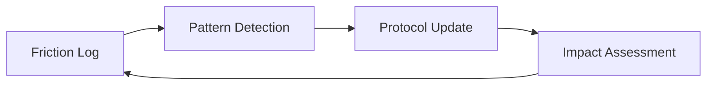

# Design Patterns

This document records the architectural patterns adopted across Agent
Protocols. Each entry describes the problem the pattern solves, the shape of
the solution, and the trade-offs it accepts. Use it as a reference when
designing new components — applying an established pattern is preferred over
inventing parallel surface area.

## Schema-First, Grouped Configuration

### Problem

A flat configuration namespace accumulates peer keys until the shape is
illegible: operators can't tell which keys are required, which are optional,
or how related keys group. Code-level fallbacks (`config.foo ?? 'default'`)
mask missing required values until a script blows up downstream. Sync
helpers that diff against a template silently strip legitimate optional
keys the operator added on purpose.

### Solution

Make the schema the source of truth and group related keys into typed
sub-blocks read through dedicated accessors:

1. **Authoritative AJV schemas at runtime.** Validate the loaded config at
   resolver entry. A missing required field is a validation error with a
   clear `instancePath`, never a silent fallback.
2. **Static JSON Schema mirror for editors.** Mirror the AJV schemas to a
   `.json` file the config declares via `"$schema": "..."`. A drift test
   prevents the mirror from going stale. Editors and operators get
   autocomplete and inline validation; the runtime keeps a single source of
   truth.
3. **Grouped sub-blocks with typed accessors.** Reorganise the namespace
   into a small number of sub-blocks (e.g. `paths`, `commands`, `quality`,
   `limits`) and read each through a single getter (`getPaths(config)`,
   `getCommands(config)`, ...). Consumers never reach into the raw shape.
4. **`null` for disabled, not empty string.** Optional commands that may be
   "not applicable" accept `string | null`. Empty strings are rejected by
   the schema. `null` is the canonical disabled value across every site.
5. **Schema-driven sync, not template-diff.** When reconciling a project
   config against a framework template, validate first, then merge missing
   keys from the template. Preserve every project-side key that validates,
   including optional keys absent from the template. A typo aborts the sync
   with a diagnostic instead of vanishing.

### Benefits

- **Discoverability.** Operators read one reference doc (e.g.
  `.agents/docs/configuration.md`) backed by the schema, not a scattered surface.
- **Validation fails fast.** Misconfiguration surfaces at startup, not
  three layers down at the call site that needed the missing value.
- **Editor support is free.** The `$schema` pointer gives autocomplete and
  inline diagnostics in any JSON-Schema-aware editor.
- **Localised future changes.** Adding a new sub-block is one schema edit,
  one resolver accessor, one doc row — instead of threading through
  multiple flat-key consumer sites.
- **Operator overrides survive sync.** Schema-valid keys absent from the
  template no longer disappear on `/mandrel-update`.

### Trade-offs

- The migration from a flat shape is mechanical but unavoidably breaking
  for consumers who had the flat keys set. Mitigate with a single
  changelog entry that names every flat → grouped mapping.
- Schema-driven sync trades silent strip for loud abort on validation
  failures. Operators see misconfiguration; the occasional false-positive
  abort (e.g. genuinely retired key) is the right trade.

### Companion: separate canonical baselines from drift snapshots

When the same problem domain produces multiple "baseline-shaped" files
(e.g. canonical ratchet baselines that gate every PR vs. per-wave drift
snapshots written by an orchestrator), give them **distinct filenames in
distinct directories** so a repo-wide grep never confuses one with the
other. In this codebase the canonical baselines live under `/baselines/`
and the per-wave drift snapshots under `.agents/state/wave-*-snapshot.json`.

---

## Self-Healing Protocol

### Problem
Static instructions (system prompts and skills) become outdated as the tech stack evolves or as agents encounter recurring edge cases. The same pattern applies at the workflow level: format drift introduced by upstream waves can break downstream pre-merge gates, and `lint-staged` globs can miss file types (Epic #990 hit this with JSON schemas). The fix is to make the close pipeline self-healing: `runFormatAutofix` (added in Epic #990) runs `biome format --write` and creates a `style:` fixup commit on the story branch when biome rewrites files, eliminating manual operator intervention for inherited drift.

### Solution
Implement a **Self-Healing Protocol** pattern:
1.  **Logging Phase:** Agents record "friction events" whenever a tool fails or a goal is blocked.
2.  **Synthesis Phase:** An analyzer clusters these events into patterns.
3.  **Healing Phase:** A refiner agent modifies the protocol (skills/rules) to prevent the recurring issue.
4.  **Verification Phase:** An impact tracker validates that the change actually reduced friction in subsequent tasks.

### Structure


---

## Story-Level Branching

### Problem
A shared, long-lived integration branch (the pre-v2 `epic/<id>` model)
becomes massive and prone to merge conflicts when every Story commits into
it, and its lifetime couples otherwise-independent Stories.

### Solution
The **Story-Level Branching** pattern gives each Story its own short-lived
branch integrated directly into `main`. The ticket model is Story-only
(`label-constants.js` `TYPE_LABELS` defines only `STORY`), so this is the
single branch shape:

1.  **Per-Story branch:** `story-<storyId>` (flat, hyphenated — **not**
    slash-namespaced) — created from `main` by `single-story-init.js`,
    materialized as a worktree at `.worktrees/story-<storyId>/`. All Story
    implementation commits land here.
2.  **Story → `main`:** each Story branch reaches `main` through its own
    pull request (squash merge + required checks), opened at close by
    `single-story-close.js` / `helpers/deliver-story`. There is no
    `epic/<id>` integration branch and no `--no-ff` wave merge.

This matches the canonical contract in
[`.agents/rules/git-conventions.md`](../.agents/rules/git-conventions.md) and
the Ticket Hierarchy / branch model in
[`docs/architecture.md`](architecture.md#ticket-hierarchy).

### Benefits
*   Reduced integration surface area.
*   Parallel development of independent stories without conflict.
*   Easier cherry-picking and rollback.

---

## Per-agent filesystem isolation

### Problem

Parallel story agents that share one working tree race on `git checkout` and
`git add -A`, so one agent's WIP can land in another's commit. Per-checkout
branch guards catch specific failure modes but not the underlying class.

### Solution

Each story runs in its own `git worktree` rooted at
`.worktrees/story-<id>/`, owned by a single `WorktreeManager` façade
(`ensure` / `reap` / `list` / `isSafeToRemove` / `gc` —
`lib/worktree-manager.js`, delegating to `lib/worktree/lifecycle/`). The
runtime threads the worktree path as `cwd`; `single-story-close.js` reaps
after merge.

Two reliability properties of the worktree primitive — both established in
Epic #1114 after #1072 surfaced the failure modes:

1. **Close-validation gates run inside the worktree.** Lint / format /
   maintainability / CRAP / typecheck / `npm audit` all spawn with
   `cwd=.worktrees/story-<id>/` and read shared baselines at the base
   ref via `lib/baseline-loader.js`. Cross-Story drift on the main
   checkout cannot block an unrelated Story's close.
2. **Auto-reap uses real reachability.** `WorktreeManager.isSafeToRemove`
   (`lib/worktree/lifecycle/reap.js` + `merge-reachability.js`) uses
   `git merge-base --is-ancestor HEAD <baseRef>` against the integration
   ref the Story must land in (`main` in v2; with a merge-commit fallback
   for force-pushed branches). The post-rebase false-positive that
   produced five manual reap recipes during Epic #1072 is locked down by
   a regression test.

A resolved-at-runtime override lets the same code path handle the *web
Claude Code* case where each session is already a sandboxed clone:
`resolveWorktreeEnabled(opts, env)` in `lib/config-resolver.js` checks env
vars (`AP_WORKTREE_ENABLED`, `CLAUDE_CODE_REMOTE`) before falling back to
the committed `delivery.worktreeIsolation.enabled` flag, so the flag
never has to be flipped per-environment.

For the architectural map, config keys, node_modules strategies, and the
Windows path-length notes see
[`docs/architecture.md`](architecture.md#worktree-isolation),
[`.agents/docs/configuration.md`](../.agents/docs/configuration.md#orchestrationworktreeisolation),
and [`.agents/workflows/helpers/worktree-lifecycle.md`](../.agents/workflows/helpers/worktree-lifecycle.md).

---

## Rule-as-SSOT, Skill-as-Guidance

### Problem

When a framework ships both enforcement rules (`rules/*.md`) and authoring
guidance (`skills/**/SKILL.md`) covering the same domain, the skill tends to
drift — restating the rule's grammar in slightly different words, or inventing
parallel vocabularies when no constraint forces coherence. Over time the two
diverge, the reviewer has two documents to consult, and the rule's authority
erodes.

### Solution

Adopt a strict layering:

1. **Rule (`rules/<domain>.md`)** — the single SSOT for taxonomy, grammar,
   and forbidden patterns in its domain. Defines *what* is allowed.
2. **Skill (`skills/**/SKILL.md`)** — describes *how* and *when* authors
   apply the rule. Cross-links to the rule for the *what*; never restates
   the taxonomy or forbidden list.
3. **Workflow (`workflows/*.md`)** — describes *who triggers* the work and
   what artifact flows through the sprint. Defers to rule and skill for
   authoring specifics.

Enforced by a cross-reference audit: grep each skill for redefinition of
rule content and rewrite any violations.

### Benefits

*   Reviewers have exactly one place to verify tag or pattern validity.
*   Additions to the taxonomy require a rule PR — a deliberate, visible
    act rather than a silent divergence in a skill.
*   Skills stay short and focused on applied craft, not vocabulary.

### Trade-offs

*   Higher friction to add a new tag or forbidden pattern (rule PR + review).
*   Mitigated by designing extensible dimensions into the rule itself — e.g.
    `@domain-<slug>` lets consumers add project-specific domains without
    touching the rule.

### Example

`.agents/rules/gherkin-standards.md` owns the tag taxonomy and forbidden
patterns. `gherkin-authoring` teaches PRD AC → Scenario translation and the
step-reuse protocol by *pointing at* the rule. `playwright-bdd` configures the
runtime but *references* the rule's tag set instead of picking its own.

---

## Facade + Responsibility-Bounded Submodules

### Motivation

When an orchestration module grows past the point where a single file
usefully describes a single responsibility, we decompose it into cohesive
submodules behind a **thin facade**. The facade preserves every public
export at the existing import path; submodules are internal
implementation detail.

Applied to `lib/worktree-manager.js` (live), and pre-v2 to
`lib/orchestration/dispatch-engine.js` and
`lib/presentation/manifest-renderer.js` (both deleted with the Epic
tier). The same pattern drives the
`config-resolver.js` split into accessor submodules under `lib/config/` and
the `providers/github.js` decomposition into focused modules under
`providers/github/*`. Epic #946 (v5.31.1) extended the pattern to
`story-close.js` — a 938-line CLI orchestrator collapsed into a 189-line
shell over `lib/orchestration/story-close/{merge-runner,cleanup-reconciler,comment-bodies}` —
and to `run-audit-suite.js`, decomposed into helpers under `lib/audit-suite/`.

### Pattern

1. Create a sibling directory (`lib/worktree/`, `lib/orchestration/`,
   etc.) and extract cohesive submodules — each owning one
   responsibility, ≤350 LOC, with its own per-submodule test file.
2. Reduce the original file to a **facade** (typically ≤200 LOC) that
   imports the submodules, composes them, and re-exports the exact set
   of public symbols external callers currently consume.
3. For class-based modules (like `WorktreeManager`), the facade's class
   delegates each method body to a submodule helper that takes a
   lightweight `ctx` bag. State (e.g. caches) lives on the facade
   instance.
4. Preserve every test in the existing suite without edits. Where
   pre-existing tests probe internal helpers, add short
   backwards-compat delegate methods on the facade rather than
   rewriting the test.

### Benefits

*   Downstream consumers keep their import paths verbatim — no caller
    edits outside the three target areas.
*   Each submodule is individually unit-testable without mocking the
    entire class hierarchy.
*   Future behaviour changes land in the submodule that owns the
    concern, not a 1,000-LOC grab-bag.
*   The split merges are bisectable one-by-one because every
    intermediate state still preserves the public contract.

### Trade-offs

*   Backwards-compat delegates on the facade are technical debt —
    they exist solely to keep monkey-patch-heavy tests green. They
    must be actively retired as tests migrate. The five `_`-prefixed
    delegates on `WorktreeManager` were paid down in Epic #946
    (v5.31.1) once the legacy test file was migrated off them.
*   Two-level indirection (facade → submodule helper) is a small
    readability tax on follow-up contributors; ADR and
    `architecture.md` must explicitly note which paths are the stable
    public surface.

### Example

```text
.agents/scripts/lib/worktree-manager.js       ← 223-LOC facade (public surface)
.agents/scripts/lib/worktree/
  lifecycle-manager.js                        ← git worktree ops
  node-modules-strategy.js                    ← per-worktree / symlink / pnpm-store
  bootstrapper.js                             ← .env, .agents copy
  inspector.js                                ← porcelain + path helpers
```

External callers continue to import `WorktreeManager` and
`parseWorktreePorcelain` from the facade path verbatim; the four
submodule paths are free to rename without a major version bump.

---

## Marker-keyed structured comment upsert

Long-running orchestrator state lives on the Epic issue itself rather
than in a local file or side database. The pattern relies on
`upsertStructuredComment(provider, ticketId, type, body)` (in
`lib/orchestration/ticketing.js`), which:

1. Derives a unique HTML marker of the form
   `<!-- ap:structured-comment type="<type>" -->` from the `type`.
2. Searches the ticket's comments for the marker.
3. If a match exists, deletes it first.
4. Posts the new body with the marker prepended.

The result is **idempotent by marker**: re-running the upsert replaces
the prior comment, so checkpoints and wave-boundary reports never
accumulate as clutter.

**Consumers in the delivery flow:**

| Type                        | Writer                                                                 | Purpose                                                                 |
| --------------------------- | ---------------------------------------------------------------------- | ----------------------------------------------------------------------- |
| `story-plan-state`          | `plan-persist.js` (`writeCheckpointV2`)                                | Per-Story planning checkpoint (persist receipt).                        |
| `plan-summary`              | `plan-persist.js`                                                      | Primary-Story persist receipt.                                          |
| `story-init`                | `single-story-init.js`                                                 | Init snapshot (worktree, deps, remote probe).                           |
| `friction`                  | single-story init/close phases                                         | Blockers / HITL telemetry on the Story issue.                           |
| `verification-results`      | `lib/orchestration/code-review.js`                                     | Unified code-review / lens findings (often on the PR).                  |
| `notification`              | `single-story-close` code-review phase                                 | Story-issue cross-link to PR-side verification results.                 |
| `follow-ups`                | `story-follow-ups.js` / confirm-merge + `run-epilogue.js`              | Routed follow-up proposals after land / plan-run rollup.                |
| `plan-run-audit-roster` / `plan-run-sibling-coherence` | `lib/orchestration/run-epilogue.js`               | Rare N>1 plan-run cross-Story audit + coherence artifacts.              |

**When to reach for this pattern:** orchestrator state that must
survive restarts, be human-readable on the issue, and be
machine-parseable by downstream tooling (`stories-wave-tick` sequencing,
close-validation, follow-up capture). Prefer a local file only when the
state is ephemeral and recoverable (e.g. `temp/run-<id>/manifest.md` is a
view, not an SSOT).

**When NOT to use it:** high-frequency state updates (sub-second or
sub-minute) — the delete-then-post cycle has rate-limit cost. For those
cases, append to the lifecycle / signals NDJSON ledger and upsert a
summary at Story close instead.

---

## Error Handling Convention (Fatal vs. Throw)

### Problem

Scripts under `.agents/scripts/` mix two ways of signalling failure —
`throw new Error(...)` and `Logger.fatal(...)` (which calls
`process.exit(1)`). Without a rule, library modules sometimes call
`process.exit()` directly, which makes them untestable and impossible to
compose. Conversely, CLI entry points sometimes let unhandled rejections
escape, losing the framework's prefixed error line.

### Rule

| Layer                                                   | How failure is signalled                                                            |
| ------------------------------------------------------- | ----------------------------------------------------------------------------------- |
| **Library code** (`lib/**`, imported by multiple CLIs)  | `throw` an `Error`. **Never** call `Logger.fatal()` or `process.exit()`.            |
| **CLI entry point** (`main()` in a top-level script)    | Let `throw`n errors bubble out of `main()`.                                         |
| **CLI wrapper** (the `runAsCli(import.meta.url, main)` line) | Funnels the rejection through `cli-utils.js` → prefixed stderr + `process.exit(1)`. |
| **Logger primitive** (`Logger.fatal` in `lib/Logger.js`) | The one sanctioned caller of `process.exit(1)` — used only by CLIs that cannot rely on the `runAsCli` handler (e.g. multi-phase orchestrators that print their own summary before exiting). |

**Equivalently:** recoverable errors (or errors whose caller might want
to retry, catch, or convert to a friction comment) are **thrown**. Fatal
errors — the process must not continue and no caller up-stack can
recover — are either thrown from `main()` so `runAsCli` handles them, or
surfaced via `Logger.fatal()` at the CLI boundary.

### Why it matters

1.  **Library code stays pure.** `lib/orchestration/**` and
    `lib/worktree/**` are imported by multiple CLI
    scripts. If any of them called `process.exit()`, they would kill a
    long-running parent process on a recoverable error. The only way
    library code ends a process is by throwing and letting the top-level
    `runAsCli` handler convert that to an exit.
2.  **`runAsCli` gives uniform error output.** Every CLI that wraps its
    `main()` in `runAsCli(import.meta.url, main, { source: '<name>' })`
    prints `[<name>] Fatal error: <stack>` before exiting 1. Scripts
    that bypass the wrapper and `process.exit()` themselves lose that
    uniformity.
3.  **Testability.** A library that `throw`s can be asserted against in
    a unit test; a library that `process.exit()`s cannot.

### Accepted exceptions

*   **`lib/Logger.js`** — defines `Logger.fatal`, the one sanctioned
    call site of `process.exit(1)`.
*   **`lib/cli-utils.js`** — `runAsCli` is the default CLI error
    handler; its `process.exit(exitCode)` implements the contract for
    all entry-point scripts.
*   **One-shot utility CLIs** (e.g. `update-ticket-state.js`,
    `generate-lifecycle-docs.js`) may call `Logger.fatal()` explicitly
    when the error has already been logged in a structured form and a
    raw stack trace would add noise. Orchestration scripts MUST `throw`
    instead — see
    [`rules/orchestration-error-handling.md`](../.agents/rules/orchestration-error-handling.md).

### Quick sweep

```bash
# Sites that should exist only in lib/Logger.js + lib/cli-utils.js:
grep -rn "process\.exit" .agents/scripts/lib | grep -v Logger.js | grep -v cli-utils.js

# Sites that should exist only at CLI boundaries:
grep -rn "Logger\.fatal" .agents/scripts/lib
```

Both queries should return no results when the convention holds.

---

## Historical note: OrchestrationContext Dependency Injection (retired)

This document previously taught an `OrchestrationContext` /
`EpicRunnerContext` / `PlanRunnerContext` typed-ctx DI pattern backed by
`lib/orchestration/context.js`. That substrate was deleted with the
in-process epic-runner stratum (PR #3936; the host-LLM-drives-CLIs model
superseded it), and no live module demonstrates the pattern. Do **not**
re-introduce a shared ctx object for new orchestration code — the
surviving style is **explicit named arguments**: each module declares
the collaborators it needs (`provider`, `logger`, `config`, …) as plain
destructured parameters, and tests pass stubs directly. See
[`rules/git-conventions.md` § Contract Cutovers](../.agents/rules/git-conventions.md)
for why the old stratum was removed wholesale rather than shimmed.

---

## `pollUntil` / `sleep` instead of hand-rolled poll loops

### Problem

Several runner-side modules (since deleted with the in-process
epic-runner stratum) each carried their own
`while (true) { await new Promise(r => setTimeout(r, ms)); … }` loops
with slightly different jitter, timeout, and abort handling. Adding a
timeout budget to one did not automatically apply to the other, and
the "is this done yet" check was inlined inside the loop body —
untestable without mocking `setTimeout`.

### Pattern

A shared helper at `lib/util/poll-loop.js`:

```js
import { pollUntil, sleep } from '../util/poll-loop.js';

const label = await pollUntil({
  fn: () => provider.getLabel(ticketId),
  predicate: (labelValue) => labelValue === 'agent::done',
  intervalMs: 30_000,
  timeoutMs: 15 * 60_000,
});
```

`pollUntil({ fn, predicate, intervalMs, timeoutMs, signal, logger })`
runs `fn`, tests `predicate(result)`, and sleeps `intervalMs` between
attempts until either the predicate passes, the optional `signal`
aborts, or `timeoutMs` elapses. `sleep(ms, signal)` is the cancellable
awaitable `setTimeout` wrapper used internally and exported for callers
that own their own cadence.

### When to reach for it

*   Waiting for an external label / state transition driven by another
    agent or a human operator.
*   Waiting for a file or structured comment to materialise on a ticket.

### When NOT to use it

*   Tight sub-second polling — `pollUntil` is designed for the tens-of-
    seconds to minutes regime typical of orchestrator pauses. For
    sub-second work use an event or a direct await.
*   Anything where the callee can tell you when it's done (a Promise, an
    emitter) — don't poll around it.

### Benefits

*   Timeout + interval behaviour is consistent across every orchestrator
    pause site.
*   One module to audit for jitter / abort / rate-limit behaviour.
*   Test fixtures can inject a fake clock against one module instead of
    three.

## Whole-epic progress reporting via `epic-run-progress` (historical)

> **Historical.** The progress-reporter module and its caller were
> deleted with the Epic tier in v2.0.0 — there is no Epic-level rollup
> comment any more (see the matching historical note in
> [`docs/data-dictionary.md`](data-dictionary.md)). The *pattern* —
> one idempotent, marker-keyed rollup covering every unit of work, not
> just the active ones — remains the reference shape for any future
> multi-Story progress surface.

The progress-reporter module
(`lib/orchestration/epic-runner/progress-reporter/composition.js`,
`upsertEpicRunProgress`) rendered the `epic-run-progress` snapshot
covering every story in the Epic — queued, in-flight, done, blocked —
so operators saw the full Epic at a glance.

`upsertEpicRunProgress` was called by `/deliver`'s per-Story status
recorder (`epic-execute-record-wave.js`) after each recorder beat.
Story #4155 (Epic #4151) cut the runtime over from the wave-batch
scheduler to the continuous ready-set core, so the rollup was a **flat
per-Story table** keyed by the checkpoint's `stories` status map — there
was no `Wave` column and no `waves[]` grouping:

```text
### 📊 Epic Progress — 5/6 stories done
| ID | State | Title |
|---|---|---|
| #419 | ✅ done | Spawner hardening suite |
| #420 | ✅ done | Post-wave commit assertion |
| #421 | ✅ done | story-close --resume / --restart |
| #422 | ✅ done | Biome format gate + tagging sanity check |
| #423 | ✅ done | error-journal parse-fix, validator wiring |
| #424 | 🔧 in-flight | ProgressReporter detectors + CI Node matrix |
```

There was no separate per-Story structured comment — `epic-run-progress`
was the single operator-facing summary, and the upsert was idempotent by
marker (see the structured-comment pattern above).

**Why it mattered (and still generalises):** a progress signal is what
operators read while a delivery loop runs. A snapshot that only shows
the active stories hides "is the run 20% done or 80% done?" — exactly
the question the operator is trying to answer when checking in. A flat
all-rows table collapses that question into a single glance; row-level
columns should be added only when every row benefits, with once-per-
snapshot detectors relegated to a `Notable` section under the table.

## Per-Story friction signal emission (NDJSON)

### Problem

Several failure sites in the orchestration pipeline (reap failures,
wave-poller read failures, mid-Story baseline refreshes) can be silent
to the operator — they log to stdout but never produce a machine-readable
surface. A single bad GraphQL variable can mask every Story's state as
`unknown` for the duration of a wave without a single `friction` record
being captured.

### Solution

`lib/observability/signals-writer.js#appendSignal` appends one
newline-terminated JSON record per friction event to
`temp/run-<eid>/stories/story-<sid>/signals.ndjson`. Records are best-effort
(any fs failure is logged via `Logger.warn` and swallowed — observability
must not halt the runner) and are picked up out-of-band by the analyzer
(Epic #1030).

1. **Shape.** `{ kind: 'friction', timestamp, epicId, storyId,
   category, source: { tool }, details, ... }` — callers own the rest of
   the payload.
2. **Consumers.** `diagnose-friction.js` (per-failure detector),
   `story-close.js` reap failure (via
   `lib/orchestration/post-merge/phases/worktree-reap.js`), and the
   baseline auto-refresh path
   (`lib/orchestration/story-close/auto-refresh-runner.js`, which fronts
   the unified `check-baselines.js` gate and its per-kind logic under
   `lib/baselines/kinds/`).
3. **Replaced.** Story #1042 (Epic #1030) cut the in-process cooldown
   module and its `upsertStructuredComment` round-trip — friction now
   lives on disk, not in GitHub comments.

### When to use

Any silent `catch` + `logger.warn` site whose failure is operator-
actionable or signal-worthy. The analyzer dedupes / aggregates
downstream, so callers do not need their own cooldown logic.

---

## Launcher-level config validation

### Problem

`validateOrchestrationConfig` is wired into `resolveConfig()`, but CLI
launchers (`plan-context.js`, `bootstrap.js`,
`agents-bootstrap-github.js`, `plan-context.js`, `plan-persist.js`,
`plan-persist.js`) call `resolveConfig()` and immediately dispatch
to long-running flows. A schema-invalid `.agentrc.json` would otherwise
surface deep inside the dispatch chain instead of at launcher startup,
producing a confusing stack trace instead of a clear schema error.

### Solution

Each launcher's `main()` now calls `validateOrchestrationConfig` after
`resolveConfig()` returns and exits non-zero on validation failure
before any provider call, GitHub I/O, or wave-loop begins (the same
check also runs inside `lib/config/runtime.js`). The fixture test
removes a required `delivery` field and asserts the launcher exits
with a schema error before work starts.

### Why the explicit call (vs relying on `resolveConfig`)

`resolveConfig` reads the schema and layers defaults, but the
canonical validation path is the schema validator. The explicit call
in `main()` is the shift-left equivalent of a pre-flight check — a
future refactor of `resolveConfig`'s internals can't accidentally
drop the validation.

## Coordinator-plus-Phases Decomposition

### Problem

`.agents/scripts/lib/orchestration/epic-runner.js` was a 600+ line
monolith. It composed the collaborator factory **and** implemented five
sequential workflow steps (smoke-test, snapshot, build-wave-dag,
iterate-waves, finalize) in-place. Any change to one step meant editing
a single long function; the surface was hostile to unit-testing each
step independently, and the cyclomatic complexity made new conditional
branches risky.

### Solution

The coordinator becomes a **thin dispatcher** that calls into one
phase module per step, with a uniform contract per phase:
`(ctx, collaborators, state) -> Promise<state>`. Each phase is a
stand-alone module under a sibling `phases/` directory.

The in-process epic-runner coordinator that motivated the pattern was
later deleted wholesale (PR #3936 — the host-LLM-drives-CLIs model
superseded it; only `phases/build-wave-dag.js` and `phases/snapshot.js`
survive under `lib/orchestration/epic-runner/phases/`, consumed by the
`/deliver` prepare/preflight CLIs), but the decomposition layout it
established is the live convention.

### Benefits

- **Test surface**: each phase is independently importable and
  mockable. Collaborator fakes are constructed once and passed in.
- **Review scope**: a change to one step touches only that phase
  module; the coordinator and sibling phases stay unchanged.
- **Pattern reuse**: the same coordinator-plus-phases layout is used
  by `story-init.js` (six injectable stages under
  `lib/story-init/`) and by `story-close.js`'s post-merge
  pipeline (`lib/orchestration/post-merge/phases/`).

## Decide / Execute / Run phase triple

### Problem

The [Coordinator-plus-Phases Decomposition](#coordinator-plus-phases-decomposition)
above splits a monolithic orchestrator into one module per workflow
step, but each individual phase can itself still braid **decision logic**
(which branch of the workflow applies, given the current state) with
**side effects** (the git command, the stdin prompt, the filesystem
write). When the two are interleaved inside a single `runXPhase`
function, the branching logic is only reachable by spinning up the real
I/O — you cannot assert "given a plan that is N commits behind in
`--yes` mode, the phase chooses to execute immediately" without an actual
git repo and a real subprocess. That is the humble-object anti-pattern:
testable logic trapped behind an untestable boundary.

### Solution

Decompose each phase into a **triple** — a pure decider, a thin impure
adapter, and an orchestrator that composes them:

- **`decideXPhase(state)` — pure.** Takes a plain `state` object (the
  plan, the resolved CLI options, the working directory) and returns a
  plain **action record** `{ kind, ...args }` describing *what* should
  happen — `'skip'`, `'dry-run'`, `'execute'`, `'prompt-then-execute'`,
  etc. It performs **no I/O**: no git, no stdin, no `fs`. Every branch
  of the workflow is therefore reachable by calling the function with a
  hand-built `state` and asserting on the returned record.
- **`executeXPhase(action)` — impure, thin.** Takes the action record
  the decider produced and performs the side effects for the
  non-interactive `kind`s (run the git command, emit the human log
  lines), returning the phase result. It carries **no branching policy**
  of its own beyond dispatching on `action.kind`, and throws on an
  unsupported kind so a mis-wired decider fails loudly.
- **`runXPhase(opts, …)` — orchestrator.** The sequencer that the
  coordinator actually calls: it builds the `state` (often by invoking a
  `planX` helper), calls the decider, threads the interactive prompt
  between decide and execute when the action's `kind` demands it (e.g.
  `'prompt-then-execute'`), and otherwise delegates to the adapter.

### Reference implementation

[`.agents/scripts/lib/orchestration/git-cleanup/phases/phase-drivers.js`](../.agents/scripts/lib/orchestration/git-cleanup/phases/phase-drivers.js)
is the canonical exemplar (the split was introduced by Story #2994).
It drives the git-cleanup phases as three such triples:

- `decideFastForwardPhase` / `executeFastForwardPhase` / `runFastForwardPhase`
- `decideBranchPhase` / `executeBranchPhase` / `runBranchPhase`
- `decideStashPhase` / `executeStashPhase` / `runStashPhase`

Each `decide*` returns an action record keyed by `kind` and touches no
git or stdin; each `execute*` is a thin dispatch on that `kind`; each
`run*` composes the pair and owns the interactive prompt.

### Benefits

- **Testable surface (humble object).** The decision logic — the part
  most worth testing and most prone to regression — is unit-testable on
  plain `state`, with no git repo, subprocess, or stdin mock. The I/O is
  quarantined in the thin `execute*` adapter, which has little logic left
  to test.
- **Cheap to assert every branch.** Skip, dry-run, declined-prompt, and
  execute paths are each one direct call to the decider with a different
  `state`, rather than one integration fixture per path.
- **Local reasoning.** A reviewer reads the decider to understand *what*
  the phase decides and the adapter to understand *how* it acts, without
  untangling the two.

### When to reach for it

Apply the triple to any new orchestration phase whose decision logic has
more than a trivial branch or two — the next `tick.js`-style refactor, a
new cleanup or migration step, any phase that chooses between skip /
dry-run / prompt / execute. A phase with a single unconditional side
effect and no branching (e.g. `runPrunePhase` in the same file) does not
need the split and is intentionally left as a plain `run*`.

## Atomic file write via tmp + rename

### Problem

Long-lived state files — the dispatch manifest is the motivating case —
must never be observed in a truncated state. A direct `fs.writeFileSync`
that is interrupted mid-write (process crash, disk full, CI cancel) leaves
the final path corrupt; the next reader consumes invalid JSON as though it
were canonical.

### Solution

Write to a sibling `.tmp` path, then `fs.renameSync()` to the final path.
`rename` is atomic on the same filesystem — the target path flips in a
single inode operation from the previous valid contents to the newly
written contents, with no intermediate truncated state.

```javascript
const tmp = `${target}.tmp`;
fs.writeFileSync(tmp, JSON.stringify(data, null, 2), 'utf8');
try {
  fs.renameSync(tmp, target);
} catch (err) {
  fs.rmSync(tmp, { force: true });
  throw err;
}
```

### Consequences

- **Crash safety.** A mid-write crash leaves either the previous valid
  contents at the final path, or both the previous contents and a stray
  `.tmp` sibling. Never a corrupt target.
- **Observability.** When the pattern is surfaced through an MCP tool
  result (the `dispatch_wave` case adds `manifestPersisted` and
  `manifestPersistError`), callers can react to persist failures instead
  of trusting a read-after-write.
- **Filesystem assumption.** `rename` is atomic only when source and
  target live on the same filesystem. Putting the `.tmp` file next to the
  target guarantees this.

## MCP tool-argument schema enforcement

### Problem

Declaring an `inputSchema` per tool in the MCP registry does not enforce
it — the server had been validating the JSON-RPC envelope with AJV but
not the `tools/call` arguments themselves. A malformed payload (negative
`epicId`, string where a number was expected) reached the handler
unchecked and surfaced as a GraphQL 422 or a `Cannot read properties of
undefined` downstream, disguising a caller bug as a backend error.

### Solution

Compile each tool's `inputSchema` with AJV at registration time, then
validate `params.arguments` before invoking the handler. On failure,
respond with JSON-RPC `-32602 Invalid params` including the AJV error path
and a human-readable reason — the caller sees exactly which field failed,
at the protocol boundary.

### Consequences

- Tool schemas are no longer documentation-only; the registry is the
  enforced contract.
- Caller errors surface as protocol-level `-32602` with a precise path,
  not as opaque downstream exceptions.
- Tightened schemas catch subtle drifts (e.g. a `type::*` enum missing on
  one tool but present on its siblings) at the boundary.

## Bounded-concurrency fanout via `concurrentMap`

### Problem

Framework hot paths that read many tickets per pass — dependency-graph
resolution, bulk issue/sub-issue reads, bulk state transitions — were
serial `for..of` loops over `await`. On a 20-story run the wall-clock
compounded linearly. Converting to naked `Promise.all` would swap that
for an unbounded thundering herd against the GitHub API and risk
secondary rate limits.

### Solution

One primitive at `lib/util/concurrent-map.js`:
`concurrentMap(items, fn, { concurrency })`. Result order is preserved;
the first unhandled rejection aggregates out. Live adoption points
include:

- `resolve-stories.js` — the `/deliver` dependency-graph fanout.
- `providers/github/issues.js`, `providers/github/sub-issues.js`, and
  `providers/github/blocked-by-add.js` — provider-side bulk reads and
  edge writes.
- `lib/orchestration/ticketing/bulk.js` — bulk ticket mutations.

Each site picks a cap for its bottleneck: GitHub-API fanouts cap to
stay under secondary rate limits; disk-bound fanouts cap low because
higher parallelism doesn't help and can contend on locks.

### Consequences

- One primitive, one reviewer surface. New fanouts reuse the helper
  instead of re-rolling `Promise.all` + semaphore.
- Provider-level caching (see the ticket-cache pattern below) and the
  cap are orthogonal: the cache handles repeated reads; the cap handles
  the wide fanouts.
- Caps are constants for now. The phase-timer surface is the
  measurement that will justify an `agentSettings` override — not
  premature configurability.

## Prime the ticket cache after every `getTickets` sweep

### Problem

`GitHubProvider` has carried a per-instance ticket cache for several
releases, but the bulk `getTickets(epicId)` sweep wasn't priming it.
Callers then did a second round-trip on every subsequent `getTicket(id)`
for the same Epic — a textbook N+1 that no one had noticed because it
was hidden behind two separate call sites and the cache's "it's there,
we use it" reputation.

### Solution

Every `provider.getTickets(...)` call site in `.agents/scripts/` is
followed by `provider.primeTicketCache(result)`. `primeTicketCache` was
already exported and tested; adoption is a one-line diff per site. A
regression test asserts zero extra HTTP calls across a sweep-plus-N-reads
sequence against a mocked `fetchImpl`.

### Consequences

- Dispatcher passes that read children after the sweep are free.
- The discipline is a pattern, not a new API — the helper already
  existed; we just made adoption consistent.
- Invalidation semantics are unchanged: any write through the provider
  invalidates the affected entries.

## Per-phase timer with `snapshot` / `restore`

### Problem

Framework overhead was not directly observable. A slow Story could be
slow because `.agents/` copy was slow, or because `npm ci` was slow,
or because lint was slow — the runner's log said only "Story took 12
minutes." Consumer projects blaming framework overhead had no way to
prove it; framework maintainers had no way to refute it.

### Solution

`lib/util/phase-timer.js` + `phase-timer-state.js`. The timer records
`{ phase, elapsedMs }` spans and exposes `snapshot` / `restore` so
state survives the `story-init` → sub-agent →
`story-close` boundary (where three separate phases handle
one Story). Per-phase lines are emitted during the lifecycle; on
close, a `phase-timings` structured comment is posted to the Story
ticket. Story #4545 deleted the aggregator that rolled those timings into
a median / p95 report; the per-Story comment is what remains.

### Consequences

- The phase-timings comment is a machine-readable artefact — consumer
  dashboards don't have to grep logs.
- Framework vs. consumer overhead is now attributable in a single
  report: `.agents/` copy, worktree create, bootstrap are framework;
  install, lint, test, implement are consumer.
- Future perf work starts with measurement. The next regression is
  caught by the p95 column drifting, not by a user filing an issue.

## Quality gates: maintainability vs CRAP (sibling-gate pattern)

### Problem

A single composite ratchet (e.g. maintainability index) is coverage-blind:
a 30-branch function scores the same whether it has 0% or 100% coverage.
One gate cannot answer both "what should I refactor?" and "what should I
test next?" without conflating them.

### Solution

Ship two sibling gates with complementary signals, reading from the same
upstream artefacts the test runner already produces:

| Gate kind         | Granularity | Signal                                       | Answers                     |
| ----------------- | ----------- | -------------------------------------------- | --------------------------- |
| `maintainability` | Per-file    | Composite MI score vs. baseline              | "What should I refactor?"   |
| `crap`            | Per-method  | `c² · (1 − cov)³ + c` vs. baseline + ceiling | "What should I test next?"  |

Both run as kinds of the unified `check-baselines.js` gate, with
per-kind logic under `lib/baselines/kinds/` (`maintainability.js`,
`crap.js`).

Both gates run at the same three sites (pre-push, close-validation, CI)
and emit a shared envelope shape (`{ kernelVersion, summary, violations }`)
so one parser handles both reports.

A baseline-refresh guardrail prevents the obvious gaming pattern (a PR
that relaxes the threshold *and* lands a violation). Thresholds are read
from the base branch and re-applied via env-var overrides; baseline-only
PRs auto-label `review::baseline-refresh` for human review.

For the runbook (bootstrap, refresh procedure, `--json` envelope, opt-out)
see [`.agents/docs/quality-gates.md`](../.agents/docs/quality-gates.md).

---

## Data-driven defaults over estimated constants

### Problem

Two anti-patterns lurk when perf defaults ship as constants:

1. **Frozen guesses.** Constants never get re-tuned because no one has
   time to hunt down the files; downstream consumers inherit an
   arbitrary choice forever.
2. **Silent config surfaces.** An operator hitting rate limits or
   under-utilised fanout has no tuning knob, so the only recourse is a
   framework fork or a monkey-patch.

### Solution

Turn each tuning site into a config key with the original constant as
the default, and ship a measurement helper that reads the Epic's own
observability surface. Three principles:

1. **Default preserves prior behaviour.** Omitting the key is
   bit-identical to the constant it replaces. Schema validators refuse
   typos. Regression tests assert the no-config path observably matches
   pre-tuning fanout (e.g. `Promise.all` vs `concurrentMap` with cap=0).
2. **One resolver, one shape.** A small helper
   (`lib/orchestration/wave-record-projection.js#resolveConcurrencyCap`)
   handles coercion, per-field fallback, and freezing. Every reader goes
   through the same shape; no adoption site re-invents defaults or
   reads concurrency caps from the resolved config directly.
3. **Tuning data comes from inside.** The per-Story `signals.ndjson`
   stream is written from lived workload, and the retro aggregates it.
   Operators tune defaults from that, not from outside measurement
   harnesses. (Story #4545 deleted the `analyze-execution.js` CLI that
   rendered phase p50/p95 and concurrency hints into a structured comment.)

### Consequences

- New consumers see the same baseline behaviour; existing `.agentrc.json`
  files need no edit.
- Operators hitting provider rate limits or idle fanout have a
  declarative tuning surface that the schema validates.
- Future perf retuning becomes a decision comment + a default-file
  edit, not a code archaeology exercise.

## Compact-path short-circuit with escape hatch (historical)

### Context

`helpers/epic-retro.md` historically walked through six sections
regardless of sprint shape. On clean-manifest Epics (zero friction,
zero parked, zero recuts, zero hotfixes, zero HITL) four of those
sections degenerated to "nothing notable" boilerplate.

### Solution (pre-v2)

A cheap predicate decided the branch up-front; the verbose path stayed
one flag away.

1. **Pure-function predicate.** `isCleanManifest({ friction, parked,
   recuts, hotfixes, hitl })` returned `true` iff every signal was zero.
   Lived in `lib/orchestration/retro-heuristics.js` (deleted in v2 with
   the Epic retro path).
2. **Preserved downstream contract.** The compact body was still a
   `type: 'retro'` comment ending with `<!-- retro-complete: <ISO> -->`.
3. **Operator override.** `--full-retro` forced the six-section body.

### When this pattern still applies

The *pattern* (predicate + shorter body + escape hatch) generalises to
any stage whose body is mechanically populated from usually-zero
signals. The Epic-retro *instance* of the pattern is gone in v2.

Use only when (a) the short path genuinely produces less work, not
less signal, and (b) the short path is the common case. If "clean" is
the outlier, skip — the short path becomes the one you forget to
update.

---

## Retire the parallel-pathway surface

### Problem

The framework shipped a stdio MCP server (`mandrel`) exposing
seven tools that **duplicated** capabilities already implemented in the
SDK. The SDK was the runtime path; the MCP was a parallel surface that
existing scripts did not exercise. Two surfaces meant: two places to
audit, two places to keep in sync when the SDK changed, two places where
secrets had to be threaded (`.mcp.json` env block + `process.env`), and
a permanent "MCP-unavailable on web" degradation note in every web-launch
runbook. The MCP cost real maintenance for marginal ergonomic gain.

Earlier patterns in this file reference `MCP tool` / `post_structured_comment`
emitter wrappers and the `MCP tool-argument schema enforcement` decision.
Those references describe the architecture as it stood **before** Epic
#702 retired the MCP. The patterns themselves remain valid; only the
delivery surface changed (CLI invocation in place of MCP-routed call).

### Solution

When a parallel surface (SDK + MCP, SDK + RPC, etc.) duplicates work,
collapse to one surface in three sequenced steps:

1. **Add the missing CLIs first.** Wrap every capability the parallel
   surface offered with a thin Node CLI under `.agents/scripts/`. Each
   CLI emits the same JSON envelope the parallel tool produced and exits
   non-zero on the same failure modes. No behavioural change.
2. **Migrate every caller in committed code.** Grep workflow markdown,
   skills, helpers, scripts; every `mcp__mandrel__*` token gets
   rewritten to `node .agents/scripts/<name>.js …`. Add a pre-commit
   assertion (here: `check-markdown.js`) so reintroductions break the
   build.
3. **Delete the parallel surface in one shot.** Delete the server, its
   tool registry, the dedicated tests, the `mandrel` block in
   `.mcp.json` / `default-mcp.json`, the dedicated docs (`MCP.md`,
   `mcp-setup.md`). Do not leave deprecated wrappers or `mcp__X`
   aliases.

### Why one-shot deletion (no compatibility shims)

Backwards-compatibility shims for a surface no caller exercises are pure
liability: they keep the test surface alive, they keep the docs alive,
they keep the secrets path alive, and they create the false impression
that the surface is supported. The migration window is closed by Step 2;
Step 3 is bounded and reversible by a single-commit revert if Step 3
breaks something Steps 1–2 missed.

### When to reach for this pattern

Any time a feature ships in two places and one of them is the load-
bearing path. Diagnostic: does any committed code call the secondary
path? If no, the secondary path is liability the team is paying for in
mental overhead, doc surface, and audit cost. Run the three-step
collapse.

Skip when the secondary surface is a genuinely independent product
(e.g. a public SDK consumed by external integrators). The diagnostic
flips: if you cannot delete the surface in one shot without breaking
external contracts, the surfaces are not duplicates and this pattern
does not apply.

## SHA-keyed validation evidence: skip the re-run, not the gate

When the same lint/test/format/maintainability/CRAP command is invoked
across phases against the same tree, the framework wraps each invocation
in `evidence-gate.js`. On success the wrapper writes
`{ gateName, commitSha, commandConfigHash, timestamp }` under the run
tree at `temp/run-<id>/validation-evidence.json` (run-scoped) or
`temp/run-<id>/stories/story-<storyId>/validation-evidence.json`
(Story-scoped; standalone Stories use
`temp/standalone/stories/story-<storyId>/`). The next caller reads the
record, compares against `git rev-parse HEAD` and the resolved command
config, and skips when both match.

Pattern shape:

1. **Authoritative gate runs first.** `single-story-close.js`'s
   close-validation chain is the source of truth — when it passes, it
   writes evidence.
2. **Subsequent phases consult evidence.** Any downstream caller that
   needs the same gate result wraps the gate via `evidence-gate.js` and
   skips when the recorded SHA still matches `HEAD` and the command
   config hash is unchanged.
3. **Any drift invalidates.** A new commit, a working-tree change at
   commit-SHA granularity, or a config drift (different env, different
   script args) invalidates the record and the gate runs.
4. **Independent verification stays independent.** Pre-push hooks and CI
   never read the evidence file; they always run the full gate. Evidence
   is per-clone, gitignored, and never committed.
5. **Explicit override.** `--no-evidence` on any wrapper invocation
   forces a re-run and overwrites the record. Use sparingly — for
   iterating on flaky tests or bisecting an environment-only failure.

Apply when: a phase needs the result of a deterministic, expensive,
working-tree-pure gate that another phase has already produced.

Skip when: the verification's authority depends on running independently
(CI, pre-push), or when the gate's behaviour is non-deterministic at the
commit-SHA granularity (e.g. integration tests against an external
service that may have drifted).

## Honest degraded modes: structured envelope, non-zero exit

When a soft-failing gate (`select-audits.js`, `lint-baseline.js`) cannot
fully execute — diff timeout,
JSON parse failure, missing ref — the previous behaviour was a permissive
zero-error fallback that read identically to a clean run. The current
contract is:

- Default mode: emit `{ ok: false, degraded: true, reason, detail }` on
  stdout and exit non-zero. Caller decides whether to absorb.
- `--gate-mode` (or `MANDREL_GATE_MODE=1`): fail closed without
  the permissive envelope. Use in CI / pre-push / authoritative gates.

Pattern: never let a degraded execution path mimic a clean one. The
caller's flexibility is preserved by the structured envelope; the
operator's ability to mistake degraded for clean is removed.
